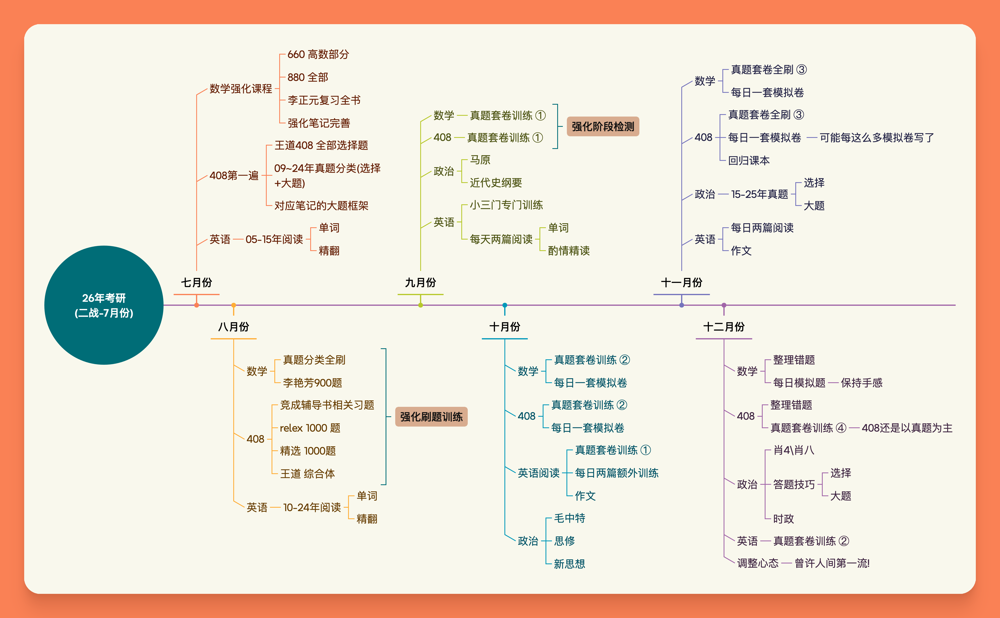
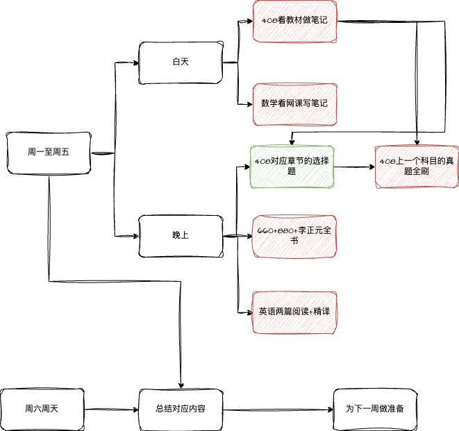

<!-- # Tags -->
# Tags
纤云弄巧，飞星传恨，银汉迢迢暗度。金风玉露一相逢，便胜却人间无数。

柔情似水，佳期如梦，忍顾鹊桥归路。两情若是久长时，又岂在朝朝暮暮。

笔记参考书

{++数据结构++}

- {==俞勇-数据结构==} 
- CLRS - Introduction to Algorithm 
- {==李冬梅,严蔚敏 - 数据结构==}

{++计算机网络++}

- {==胡亮-计算机网络==}
- {==高军-深入浅出计算机网络==} 
- {==J.F.K & K.W.R - Computer Networking A Top-down Approach==} 

{++计算机组成原理++} 

- {==谭志虎-计算机组成原理==}
- {==袁春风-计算机系统==} 
- {==Computer System A Programmer's Perspective==} 

{++操作系统++} 

- {==汤小丹等 - 计算机操作系统==} 
- W.S - 操作系统-精髓与实现 
- {==Operating Systems: Three Easy Pieces==}

{++七月份每周安排++}

<!-- material/tags -->

