!!! note "强化课程安排"
    - [ ] 导学介绍
    - [ ] 作文备考的常见误区
    - [ ] 小作文"三分归元法"
    - [x] 图画图大作文万能模版
    - [ ] 图表大作文万能模版
    - [ ] 材料大作文万能模版
    - [ ] 进阶突破(日常积累)

# 图画类大作文

## 中文理解模版框架

第一段

- 如图所示, {++描图句++}. 图片的象征意义是非常明确的: xx{==品质/意识/问题==} 值得我们给予适当的关注

第二段

- 为了分析 {++xxx++}的重要性, 我想强调如下几点.
- 首先, 很多人都认同, 在其他条件一致的前提下, {++xx++}是决定{==学术/职业/社会==}成功与否的关键.
- 其次, 
    - (个人) 年轻人一直是社会进步的先锋力量, 而{++xx++}对其品格和能力的发展有显著的影响, 后者将不可避免的在不远的将来影响中国的方方面面.
    - (社会) 我们生活在同一个世界里,有着共同的利益, 而{++xx++}对我们共同的环境社群社会世界有着显著的影响,这将不可避免的触及我们每个人.
- 因此, {==缺乏/没有==}会让我们社会无法进步,并终将为此付出不菲的代价

第三段

- 简而言之, {++xx++}真的很重要,我们应该迅速采取相关的措施, 
- 具体来说, 
    - 政府应该采取合适的政策发动媒体宣传.
    - 教育机构应该开展公开课并给予引导,
- 已将这样一种不可或缺的 {==品质/意识==}注入每个人心中,
- 正如习大大所说, "空谈误国,实干兴邦." 我们越快采取具体行动,未来即越能从中收益.

## 英文模版

第一段

As is {==vividly/ironically==} depicted in the cartoon, {++doing/done sth(次要动作, 可不写), A is doing/done/adj....(写主要动作), while B is doing/done/adj ... (对比图写).++} The symbolic meaning behind the picture is rather explicit: the {==virtue/awareness/issue==} of {++xx++} deserves our due attention.

第二段

To examine the significance of {++xx++}, certain factors should be specifically pointed out here. First and foremost, it is a truth widely acknowledged that all other factors being equal, {++xx++} could be the decisive difference between {==academic/professional/social==} success or not. In addition, (个人类) since young people always play a vanguard role in promoting social progress, and {++xx++} exerts remarkable influence on the development of their characters, it will inevitably shape every aspect of China in the foreseeable future. (社会类) We are living in a world with common interest, and since {++xx++} exerts remarkable influence on our shared community, its impact will inevitably extend to each and every single one of us. Consequently, the {++lack of xxx++} will hinder us from making substantial progress and eventually cost us dearly.

第三段

In brief, {++xx++} is of true significance and relevant measures must be taken promptly. To be specific, (政府可以管的) governments should implement proper policies and launch mass media campaigns. (政府管不了的) education institutions indispensable {++virtue/awareness++} into everyone. As President Xi once put it, "empty talk would lead a country astray, and hard work can revitalize a nation". The more rapidly concrete efforts are made, the more effectively this {++virtue/awareness++} will benefit us in the upcoming future.

## 主旨词与描图句

{++主旨词写不对作文最多拿5分++}

最好的情况肯定是会写主旨词,但如果不会写,考虑如下几个替代方案.

- 知道其他词性, 动词->动名词, 形容词 being + adj. 
- 知道类似意思的短句, protect the environment -> protecting the environment
- 不知道短句,但知道反义词. 勤奋-> not being lazy
- 最次写成 the awareness that we should protect the environment
- 特殊的,对于平衡选择类有
    - 选择 the ability to make a wise choice + 限定条件
    - 平衡 the ability to strike a subtle balance between A and B

{++描图句++}

- 不需要扣细节,仅描述和主旨有关的内容即可
- 次要信息: 图中主人公所处的环境(若有必要)
- 主要信息: 图中何人(几个人)做了何事(好事?坏事?)

## 真题训练

### 2011年

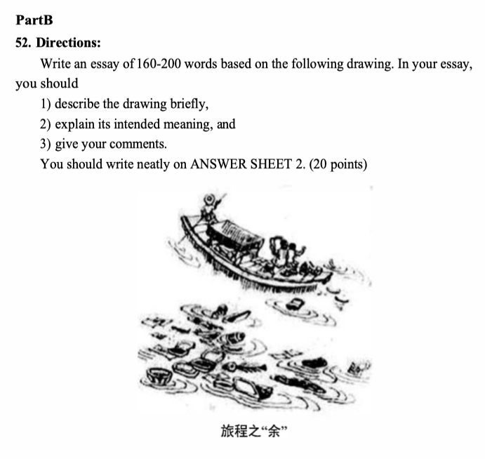

### 2012年

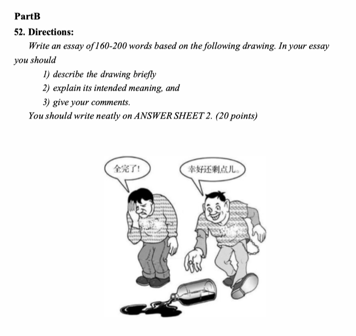

### 2013年
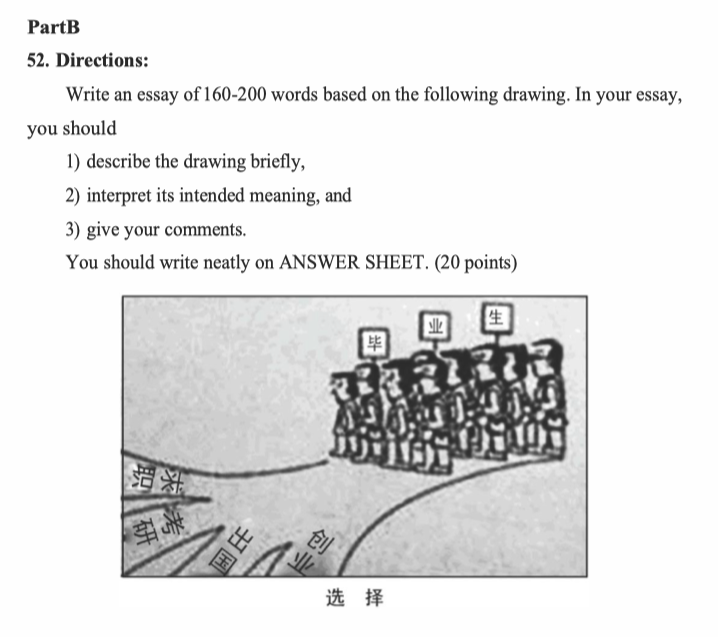

### 2014年

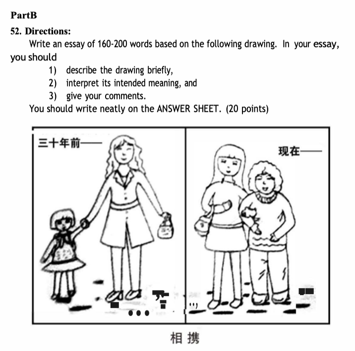

### 2015年

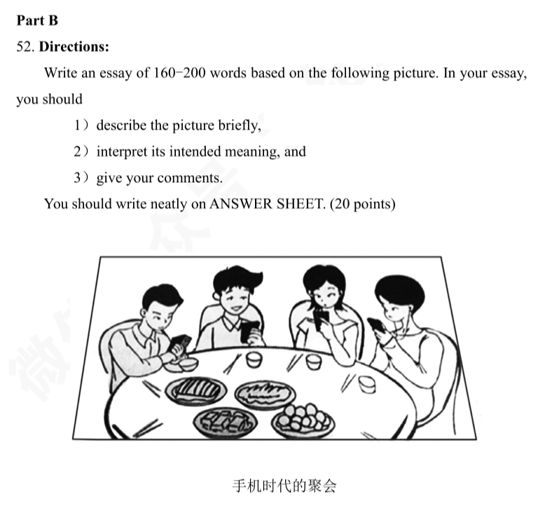

### 2016年

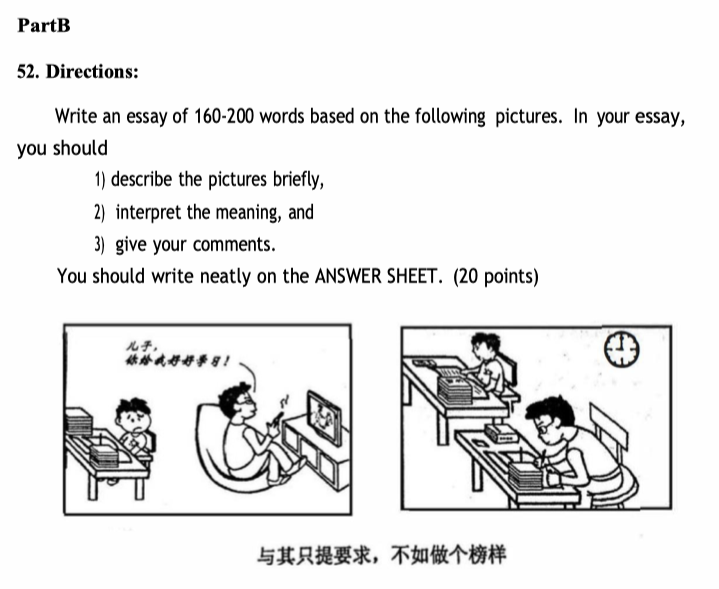

### 2017年

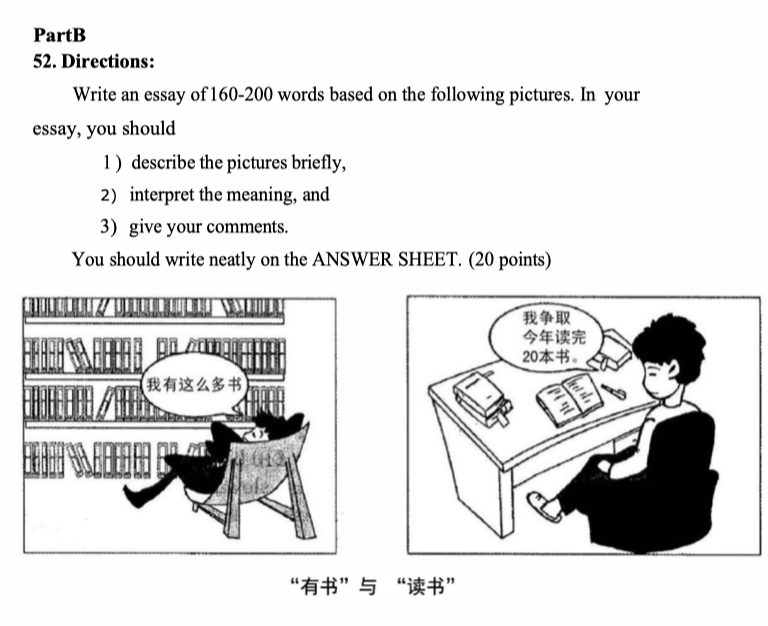

### 2018年

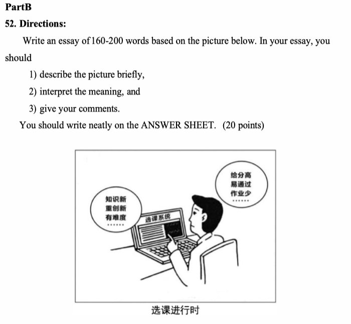

### 2019年

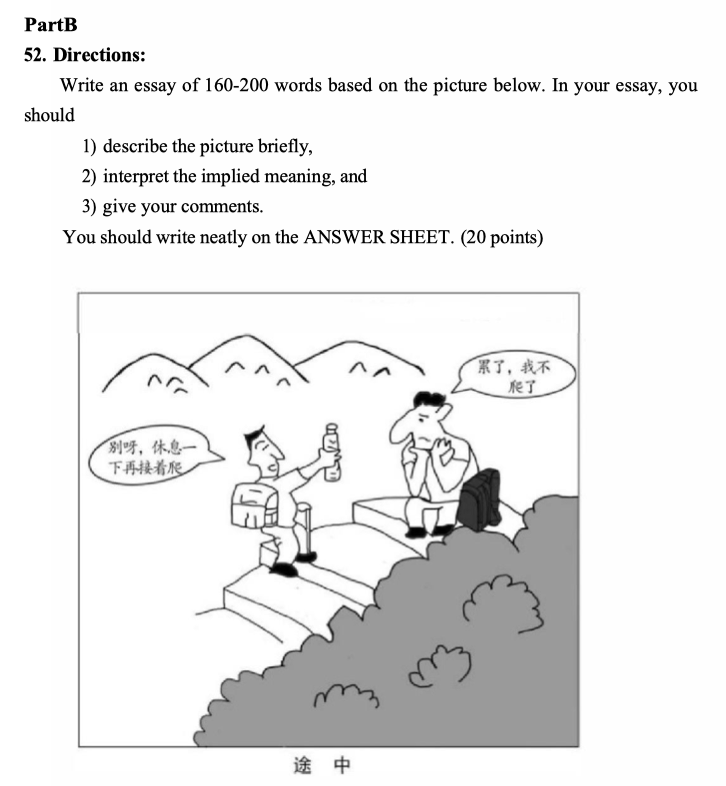

### 2020年

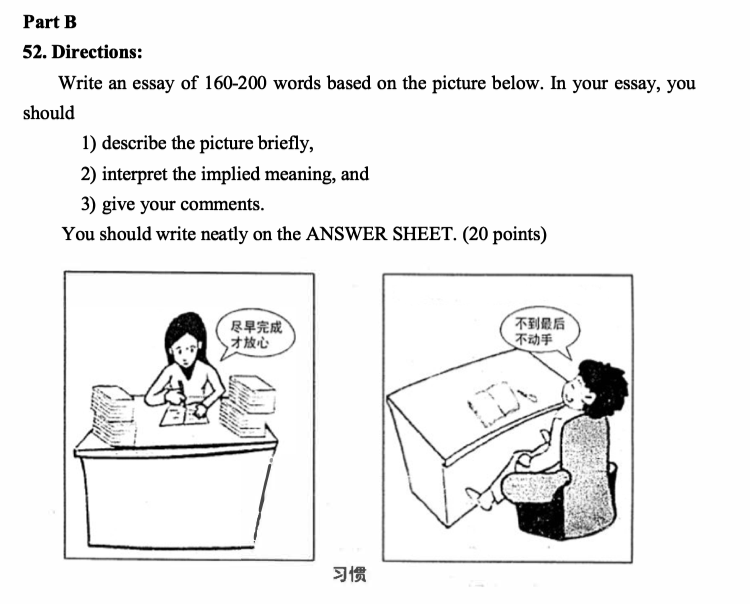

### 2021年

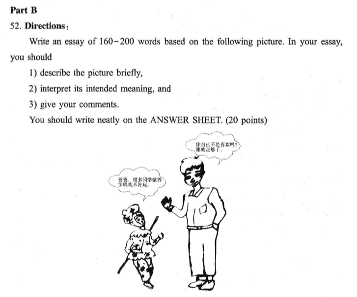

### 2022年

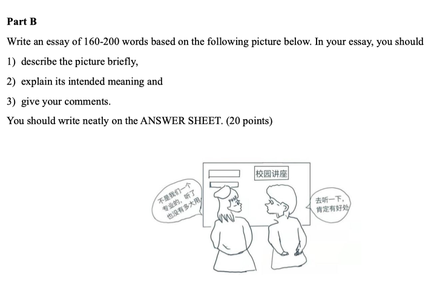

### 2023年

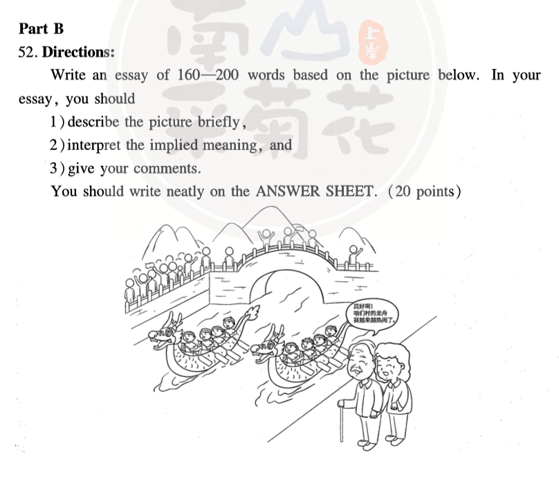