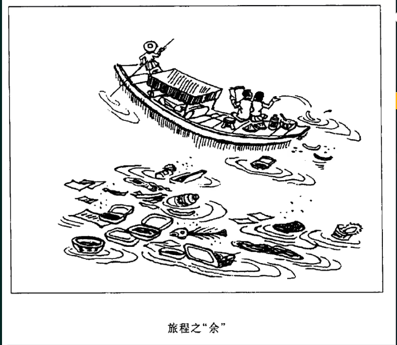
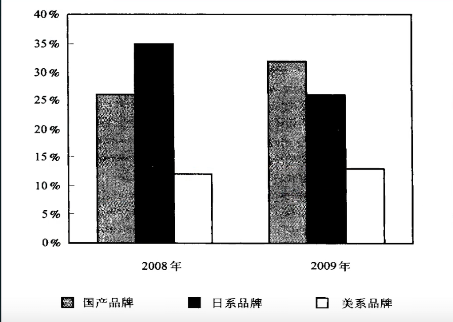

!!! note "强化课程安排"
    - [x] 导学介绍
    - [ ] 作文备考的常见误区
    - [ ] 小作文"三分归元法"
    - [ ] 图画图大作文万能模版
    - [ ] 图表大作文万能模版
    - [ ] 材料大作文万能模版
    - [ ] 进阶突破(日常积累)

# 强化-导读 

9 - 10月 : 精读并抄写历年真题范围, {++背高中基础题的拼写++}

11月: 整理15-23年作文思路,练习套用模版的方法

12月: 再次总结并串讲大小万能模版, 并强化背诵与应用!

## 题目类型与考点
英语一：

该部分由 A、B 两节组成，考察考生的书面表达能力，共 2 小题，共 30 分。

A节(小作文)：要求考生根据规定情景写出约 90 ~ 120词（标点符号不计算在内）的应用性短文，
类型包括{++书信、通知、告示、纪要++}等。共 10 分。

B节(大作文)：要求考生根据提示信息写出一篇 160～200 词的短文（标点符号不计算在内）。
提示信息的形式为{++文字、图画、图++}表等。共 20 分。

小作文(书信类)
Directions:

Write a {++letter++} of about 100 words to the president of your university, suggesting how to improve students' physical condition.

You should include the details you think necessary.

You should write neatly on the ANSWER SHEET.

Do not sign your own name at the end of the letter. Use "Li Ming" instead.

Do not write the address. (10 points)

小作文(通知类)
Directions:

You are supposed to write for the Postgraduates' Association a {++notice++} to recruit volunteers for an international conference on globalization. The notice should include the basic qualifications for applicants and other information which you think is relevant.

Do not sign your own name at the end of the notice. Use "Postgraduates' Association" instead. (10 points)

{==小作文(新例题)==}
Read the following post from a message board and write a note in reply.

图画大作文

Write an essay of {++160–200++} words based on the following drawing. In your essay, you should

1) describe the drawing {==briefly==},  
2) explain its intended meaning, and  
3) give your comments.(主体)  

You should write neatly on ANSWER SHEET 2. (20 points)

图表类大作文(单图表,双图表)

Write an essay based on the following {++chart++}. In your writing you should

1) interpret the chart, and  
2) give your comments.  

You should write at least 160-200 words.

Write your essay on ANSWER SHEET 2. (20 points)

{==材料作文(大纲新例题)==}

Directions:

Read the following excerpt from an {++article (文章节选)++} and write an essay. In your essay, you should explain whether or to what extent you agree with the author. Support your argument with reasons and relevant examples.

Write your answer in 160–200 words on the ANSWER SHEET. (20 points)

Many of us, whatever our field of work, fear that showing uncertainty can damage our image—and we may compensate by expressing overconfidence in an attempt to win trust. But in many situations people are willing to trust those who can admit they don’t have a definitive answer. Recent studies found that communicating uncertainty and even admitting our mistakes is not harmful and can even be beneficial to trustworthiness. So, failure in “expertise” can be compensated by higher integrity and benevolence. When communicating uncertainty in a transparent way, we are perceived as less biased and willing to tell the truth.

## 作文课的目标

- 考场上能在作文命题方向存在多种可能性的情况下（抗压，应变）

- 在{++45++}分钟内完整地写出两篇（速度稳定，结构完整）

- 符合自己目标分数水平的大小作文。（质量合格 $\geq 22$ ）

{++大作文是进阶的突破点++}
