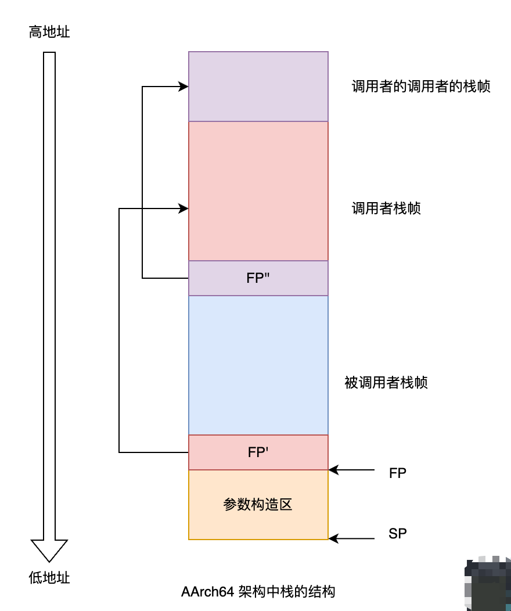
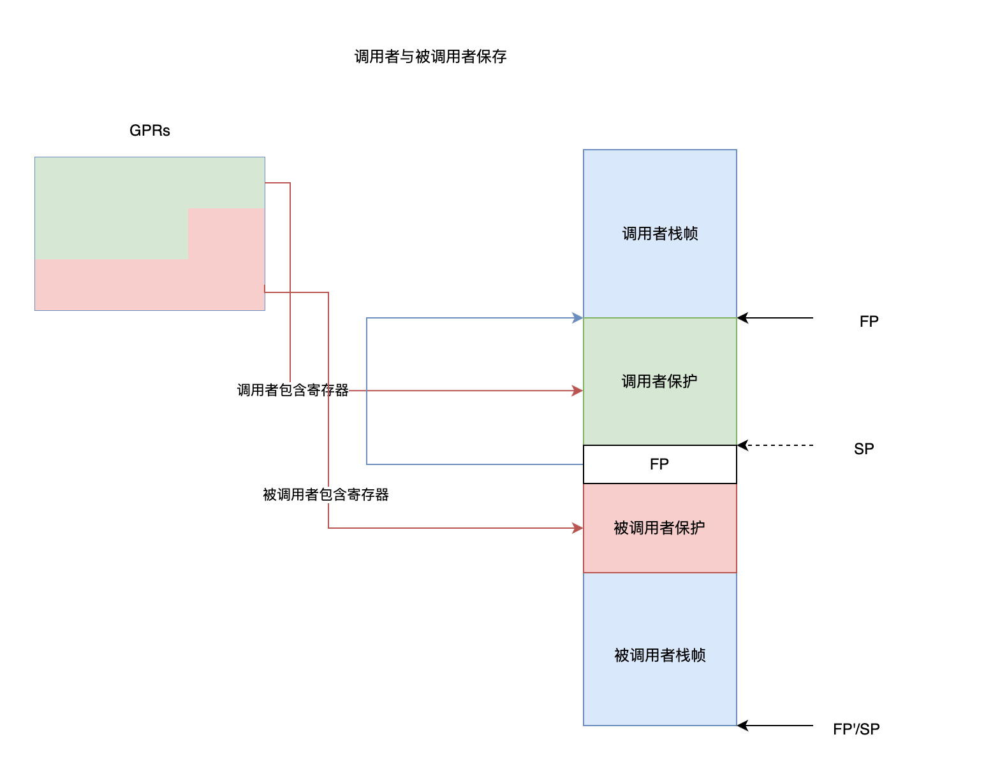
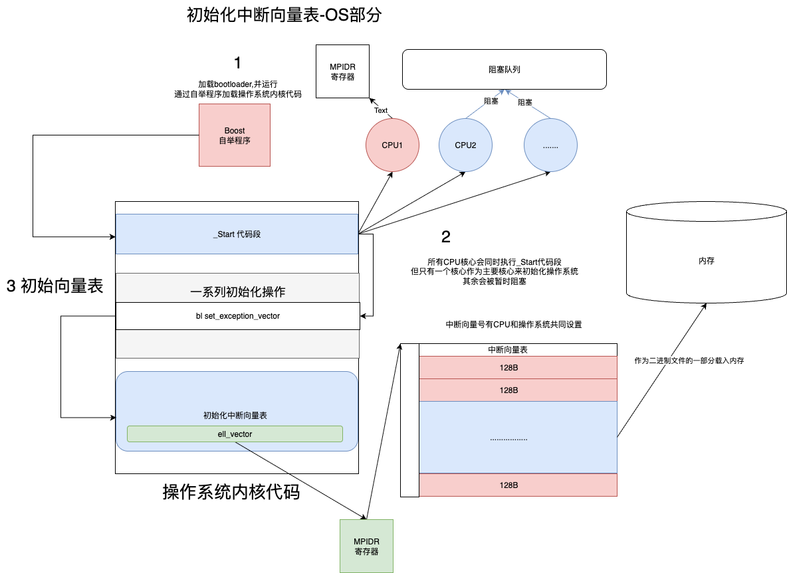
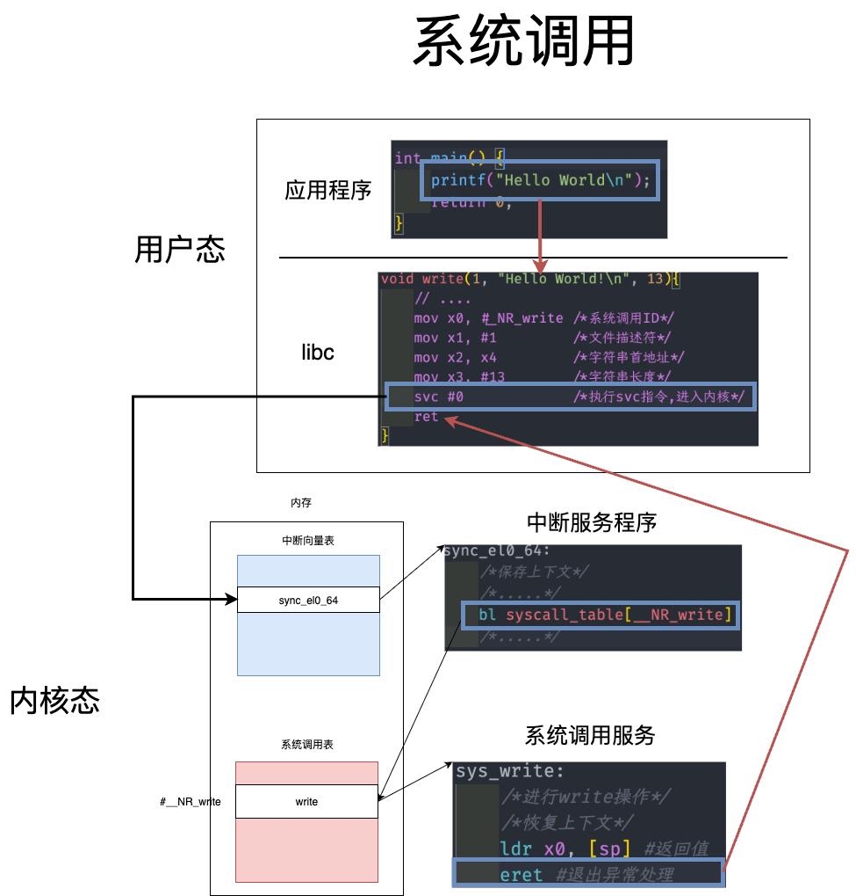

# 函数调用 中断 系统调用 

## 函数调用 

{++AArch64架构中的栈帧结构++} 



- 栈(stack)是内存中一块动态变化的区域
- 通过两个寄存器(FP和SP)指明一块函数调用的栈帧
    - FP(Frame Pointer) 帧指针,指明当前函数的栈在内存中的起始位置 
    - SP(Stack Pointer) 栈指针,指向栈顶,表面当前运行栈的大小


```cpp
int square(int n) {
    return n * n;
}

int cube(int n) {
    return n * square(n);
}
```

- PC 程序计数器,保存下一条指令的地址 
    - 在函数调用过程中,PC通常由调用指令(AArch中为 `bl`)和返回指令`ret`设定 
- 通用寄存器组(GPRs) AArch 中有31个64位通用寄存器 
    - `w`表示使用某一寄存器的低32位, `x`表示使用全部64位 



{++调用者保存于被调用者保存++} 注意这条规则是由软件实现而非由硬件的ISA(指令集架构)所规定的

- 调用者保存: 调用者需要再函数调用之前,将需要保存的寄存器保存在其栈帧中,然后调用其他函数;被调用者可以随意使用这些由调用者保存的寄存器 
- 被调用者保存: 被调用者在修改被调者保存的寄存器前{++需要将对应寄存器内容压入自己的栈帧,并在退出调用前依次恢复这些寄存器的值++}

!!! note "生命周期不同的变量如何保存"
    被调用者保存适合生命周期较长的变量,而调用者保存适合保存生命周期较短的临时变量. 

{++参数传递++}

- AArch中支持最多8个(X0-X7)参数通过寄存器传递,多出来的参数需要保存在栈上(在上图参数的构造区中)
- 返回值保存在寄存器(X0)中 
- 在低优化的情况下,编译器会在每个函数开始的时候将每个{++实际参数++}保存在栈帧中的参数保护区
- 在高优先级的情况下,通常会倾向于使用{++被调用者保存寄存器++}来保存参数

## 中断

初始中断向量表(OS)



- OS负责初始化向量表,并将CPU要求初始化的中断序号写入中断向量表
- OS可以自己分配一些中断编号

中断处理流程见 计算机组成原理-输入输出管理
## 系统调用(特殊异常-陷入)



- 在X86中`svc`其实是`INT\Syscell` 
- 系统调用和函数调用的区别
    - 系统调用使用两套不同的系统栈空间(内核态和用户态),而函数调用只使用用户态系统栈
    - 系统调用通常涉及异常处理,上下文切换等开销较大
    - 函数调用并不维护所有硬件现场(如PSW,段寄存器内内容)而系统调用必须维持这些系统状态
        - 但均需保存寄存器组(调用者保护)和PC