!!! tip
    {++不像其他科目,OS的绪论部分可考察的点比较多,多为选择题++}

# 绪论

{++操作系统(Operating System, OS)++} 是配置在计算机硬件上的第一层{++软件++},是对硬件系统的首次拓充; 是一组能够有效的组织和管理计算机硬件和软件资源,合理地对各类作业进行调度,以及方便用户使用的程序集合.

- OS作为用户和计算机硬件系统之间的接口
- OS作为计算机中资源的管理者
    - 处理器,存储器,I/O设备以及信息
    - 分别对应了本科的后面四大章节
- OS实现了对计算机资源的抽象

## 操作系统的发展流程

^^人工操作方式^^ 打孔

- 用户独占全机
- CPU等待人工操作

^^假脱机I/O方式^^ 实现将装有用户程序和数据的纸带装入输入机,在一台{++外围机++}的控制下,把纸带上的程序和数据输入磁带.

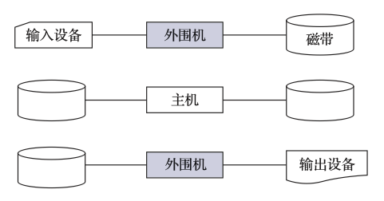

- 减少了CPU空闲时间
- 提高了I/O速度

{++单道批处理程序++}

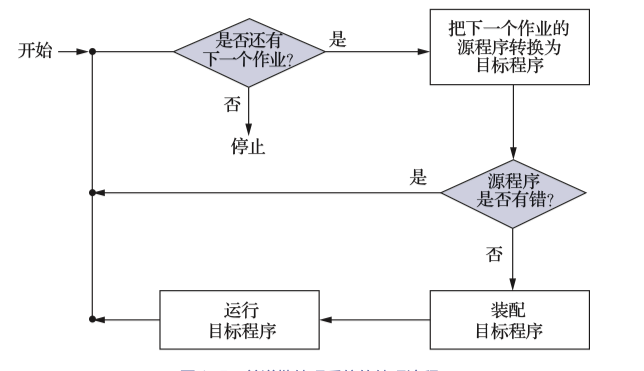

- 通过监督程序控制一批作业一个接一个被处理
- 在内存中{++仅仅有一道程序++}
- 不支持I/O中断,每遇I/O请求后,cpu就会进入等待状态,等待I/O完成后才会继续执行

{++多道批处理程序++}

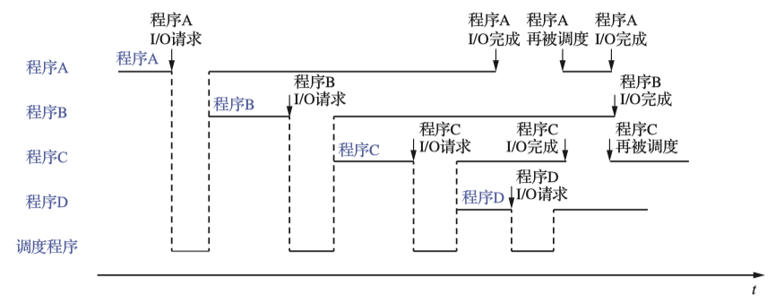

- 有调度程序,可以在I/O的时候调用其他程序上CPU执行 
    - 引入了 {++中断++} 机制
- 作业会被先保存在外存上
- 平均周转时间长
- 无交互能力

{++分时系统++}

- 将作业导入{++内存++}
- 为每一个作业设置{++时间片++},当时间片耗尽则需要放弃CPU

特点为 {++多路性++} {++独立性++} {++及时性++} {++交互性++}

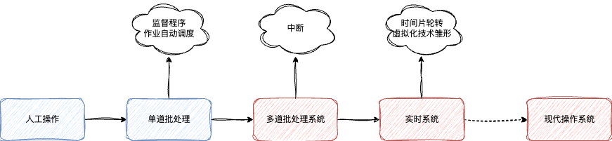

## 操作系统的基本特征

{++操作系统内核++}常驻在内存中

{++并发VS并行++}

- 并行 两个及以上的事件在{++同一时刻++}发生
- 并发 两个及以上时间在{++同一时间间隔++}发生
    - 并发是宏观上的同时发生,并行是实打实的同时发生

{++共享++} 系统中的资源可供内存中多个{++并发++}执行的程序共同使用.

- 互斥共享 对临接资源的(某一时间内只能由单一进程持有的资源, 如打印机等)共享 
- 同时共享 对允许一段时间内有多个进程"同时"(宏观)对其进行访问

{++并发和共享++} 是多用户(多任务)OS的两个最基本的特性. 并发与共享互为对方存在的条件

- 一方面, 资源共享是以进程的并发为前提的
- 另一方面,若没有资源共享,则必然会影响到进程并发执行

{++虚拟++} 通过某种技术将一个物理实体变成若干逻辑上的对应物的功能

- 时分复用技术
    - 虚拟CPU
    - 虚拟设备
- 空分复用技术
    - 虚拟存储

{++异步++} 对于内存中的每个进程,其在何时获得处理机并运行,何时又因提出某种资源请求而暂停.以及进程以何种速度向前推进,总共需要多少时间完成都是不可知的. 简单来说, {++进程以人们不可知的速度向前推进++}

{++原语++} 由若干条指令组成,其特点为"原子性",在执行过程中{++不可以被时钟中断++}

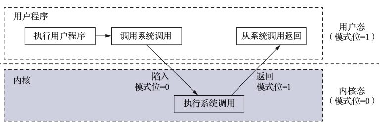

## 程序运行环境

{++用户接口++} 

- 联机用户接口 命令行(CLI)
- 脱机用户接口 批处理命令
- 图形用户接口

{++程序接口++} 由一系列 ^^系统调用^^ 组成.

{++内核模式与用户模式++} 用以保护系统的安全,用户在用户态无法执行可能损害系统执行的指令(特权指令)

- 内核态也称为管态\系统态
- 用户态也称目态

{++特权指令与非特权指令++} 

- 特权指令 例如启动外部设备,设置{++系统时钟时间++}, {++关中断++}, {++切换状态++}
    - 特别注意,切换状态是特权指令
- 特权指令与非特权指令由{++硬件++}实现.
- 若发现某进程违规使用特权指令(异常),则会触发异常处理程序
- 一般用户通过调用{++系统调用(system cell)++} {++陷入++} 内核态

{++系统调用++} 提供用户程序和OS内核之间的接口

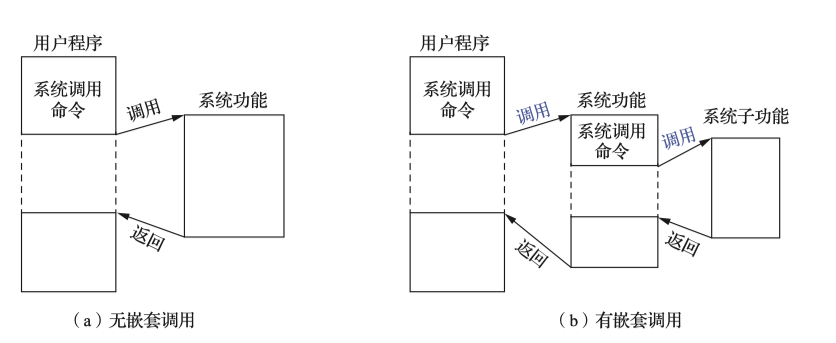

- 系统调用通过{++中断++}机制来实现
- 系统调用可能涉及用户态到内核态的转换
- 系统调用结束后也需要重新参与调度

{++程序的链接与装入++}

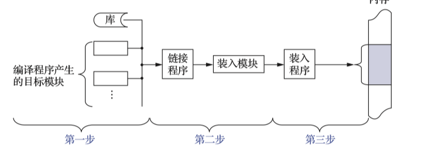

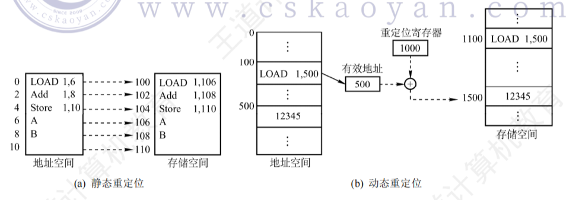

{++程序装入方式++} 绝对装入方式,可重定位装入方式,动态运行时候装入.

- 绝对装入, 直接给出要装入的绝对位置
- 可重定位装入 
    - 重定位 把在装入时对目标程序中的指令和数据的逻辑地址变换为物理地址的过程
    - 一次性装入后续不在更改称为 {++精态重定位++}

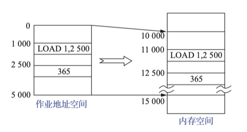

- 动态运行时装入 
    - 将地址变换推迟到程序运行时候才进行
    - 需要{++重定位寄存器++}的支持

{++程序的链接++} 静态链接,装入时动态链接,运行时动态链接.

- 静态链接 在程序运行前,将各目标模块及它们所需要的库函数链接成一个完整的装配模块,以后不在拆开
    - 需要修改不同模块之间的相对地址
    - 变换外部调用符号

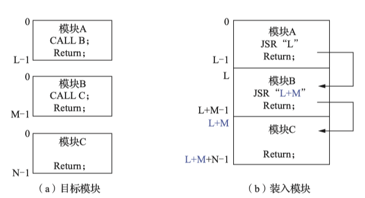

- 装入时动态链接 边装入边链接
    - 便于修改和更新
    - 便于实现对{++目标模块++}的共享

- 运行时候动态链接 将某些模块的连接推迟到运行时在链接

## 操作系统结构

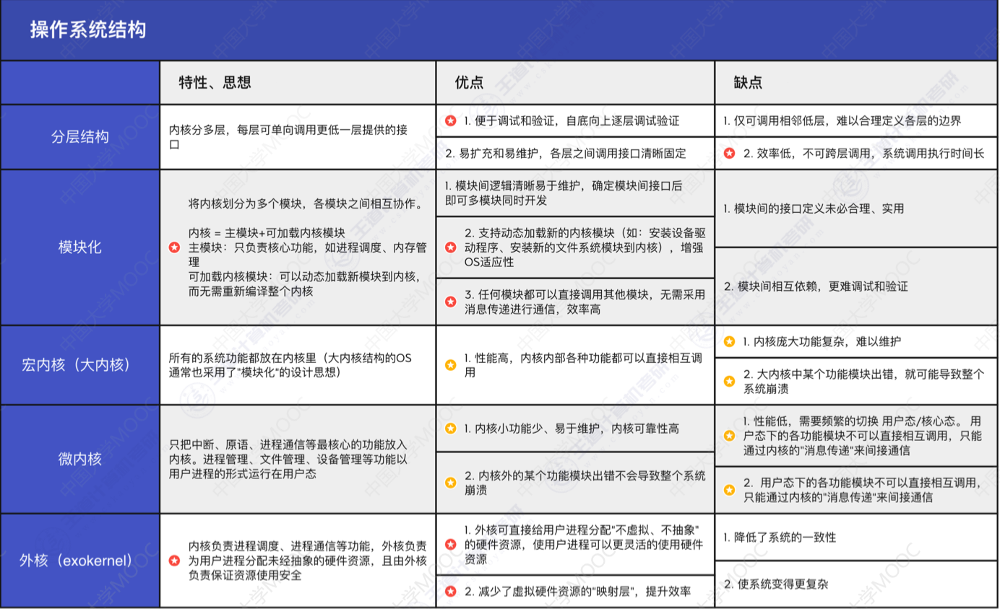

## 操作系统的引导
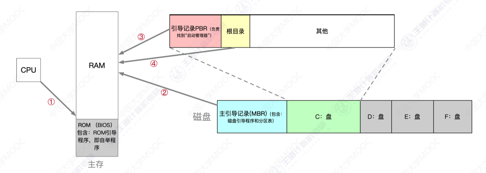

- CPU从一个特定的主存地址开始,取指令,执行ROM中的引导程序
    - 先进行{++硬件自检++},再开机
    - 即ROM的BIOS固件
        - 包含ROM引导程序,即自举程序
- 将磁盘的第一块 -- 主引导块(MBR)读入内存,执行磁盘引导程序,扫描分区表
    - MBR内包含磁盘引导程序和分区表
- 从活动分区(主分区,按照了操作系统的分区)读入分区引导记录,执行其中的程序
- 从根目录下找到完整的操作系统初始化程序并执行,完成"开机" 

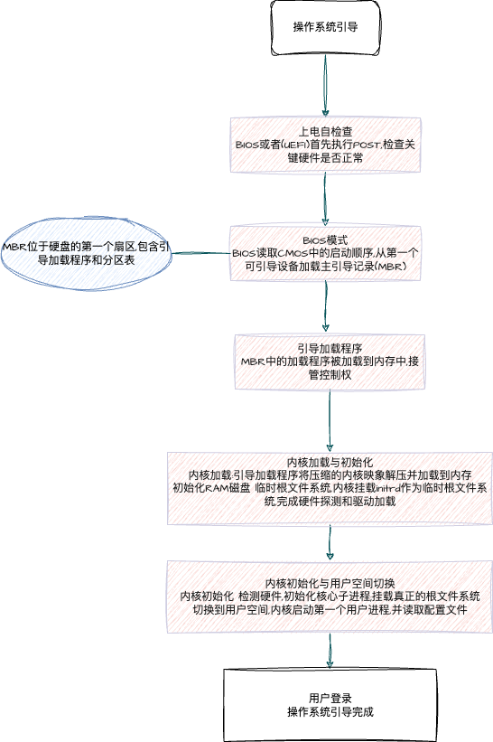

## 虚拟机

{++虚拟机++} 使用虚拟化计算,将一台物理机器虚拟化成多台虚拟机器(VM),每个虚拟机器都可以独立运行一个操作系统

{++第一类虚拟机器++} 直接运行在机器上

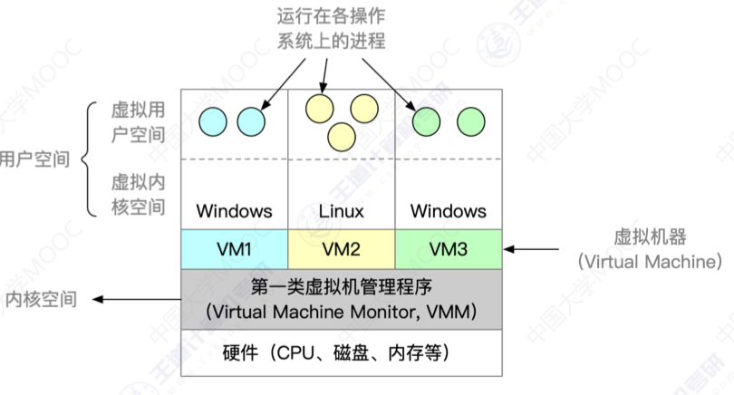

- 直接运行在硬件之上,能直接控制和分配物理资源
- 性能更好
- 迁移性更差
- 可以执行最高特权的指令

{++第二类虚拟机器++} 运行在宿主操作系统之上

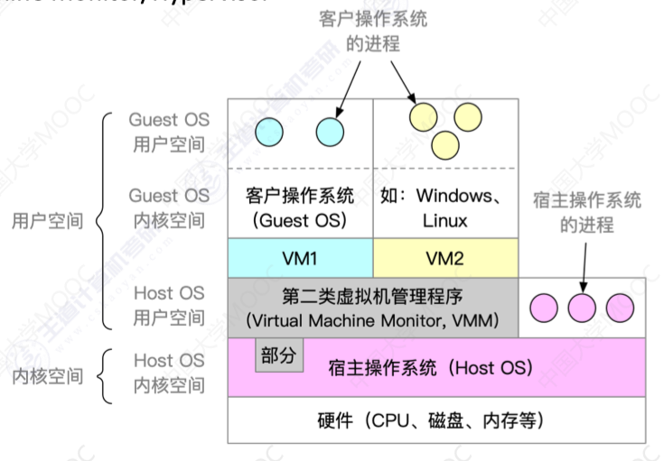

- 运行在宿主操作系统上,依赖于宿主系统为其分配的物理资源
- 性能更差
- 可迁移好
- 部分运行在用户态,部分运行在内核态. 虚拟操作系统的系统调用会被VMM截获,转换为VMM对宿主操作系统的系统调用.