# 进程和线程

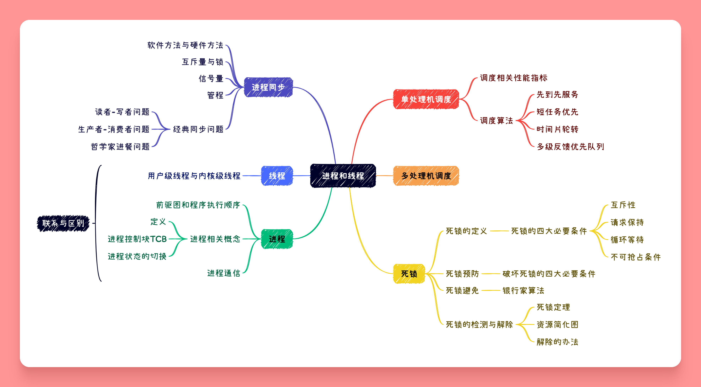

## 进程

### 前驱图与程序执行

{++前驱图++} 一个有向无环图(DAG), 用于描述进程间之间执行的先后顺序.

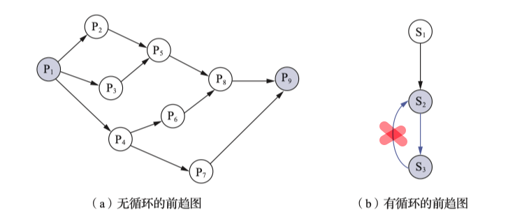

- 前驱图不允许有循环(无环)
- 上述前驱图,存在的前驱关系为 $P=\{(P_1,P_2),(P_1,P_2),(P_1,P_3),(P_2,P_5),(P_3,P_5),(P_4,P_6),(P_4,P_7),(P_5,P_8),(P_6,P_8),(P_7,P_9),(P_8,P_9)\}$

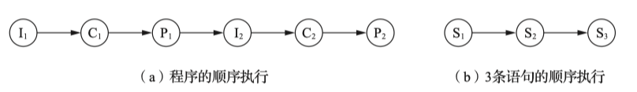

{++顺序执行++} 一个语句一个语句,按顺次执行.

- 顺序性 严格按照程序所规定的顺序执行
- 封闭性 程序运行{++独占++}全机资源,只有本程序才能改变资源的状态
- 可再现性 只要程序执行环境和初始条件相同,都可以获得相同的结果

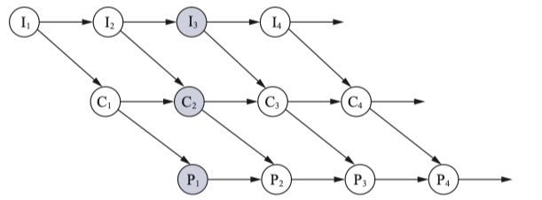

- 间断性
- 失去封闭性
- 不可再现性(异步)

### 进程的描述

通常{++程序++}是不能参与并发执行,于是在OS中引入了进程的概念.

^^进程(进程实体,进程映象)^^ 由程序段,相关的数据段和PCB(进程控制块)组成

{++进程的定义++} 进程是程序的执行过程,是系统进行资源分配和调度的独立单位.

- 动态性 进程的实质是程序的执行过程;进程有一定的生命周期,由创建而产生,由调度而执行,最后由撤销而消亡,而程序是一段代码并无生命周期.
- 并发性 
- 独立性 是一个独立运行,独立获取资源,独立接受调度的基本单位
    - 凡未建立PCB的程序都{--不可以--}作为独立的单位参与并发执行
- 异步性

{++进程的状态切换++} 基本状态(三个)就绪状态,执行状态和阻塞状态. 其余状态有创建状态,终止状态,挂起和激活

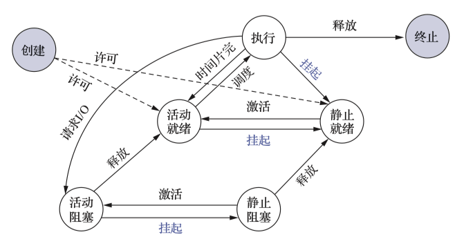

- {++就绪状态++} 进程已经获得了所有{++除CPU以外++}的全部资源,只需要获得CPU就可以立即执行.
    - 可以由创建态进入,阻塞状态结束,时间片用完导致执行态退出
- {++执行状态++} 进程获得调度,上CPU执行的状态
    - 进程由调度而执行
- {++阻塞状态++} 进程由于请求I/O或者其他资源从而退出执行状态,进入等待对应资源的状态
    - 阻塞状态结束后会{++进入就绪状态++}而非立即执行.
- 挂起和激活
    - 挂起:暂定当前进程的一切活动
        - 执行态时候挂起会直接进入静止就绪态,即使激活也需要重新调度
    - 激活: 让一个被挂起的程序重新启动

{++进程管理的数据结构++} OS为了方便管理系统的各种资源通常将这些资源抽象为各种数据结构,并提供了一组对应的资源访问指令 

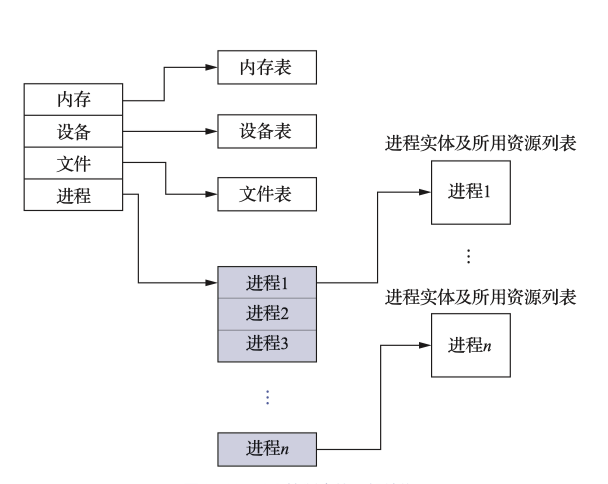

{++PCB(进程控制块)++}


{++PCB的组织方法++} 线性表示,链式队列,索引方式.


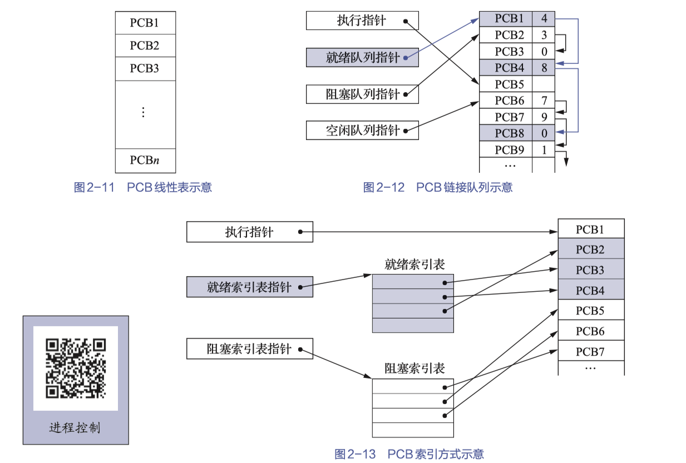

会引起进程创建的事件  用户登录;作业调度;提供服务;应用请求

{++进程创建的过程++}

- 申请空白的PCB
- 为新进程分配器运行所需要的资源
- 初始化PCB
- 如果进程就绪队列能接纳新的进程,则插入就绪队列

会引起进程终止的事件 正常结束;异常结束;外界干预

{++进程终止的过程++}

- 根据被终止进程的标识符,从PCB集合中检索出该PCB,并从该进程的PCB中读出进程的状态
- 若被终止的进程处于执行状态,则立刻终止执行,并置调度标志位真,指示该进程被终止后应重新调度
- 若该进程还有子孙进程,则应终止其所有子孙进程,防止它们称为不可控进程(僵尸进程)
- 将被终止的进程所拥有的所有资源或归还给其父进程或归还给OS
- 将被终止的进程的PCB从所在队列(或链表)中移除

### 进程通信

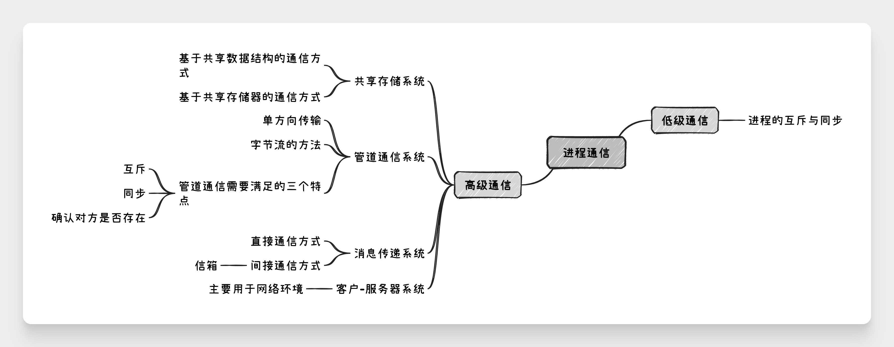

## 线程

引入线程的目的 {++减少程序在并发执行的时候所需要付出的时空开销++}

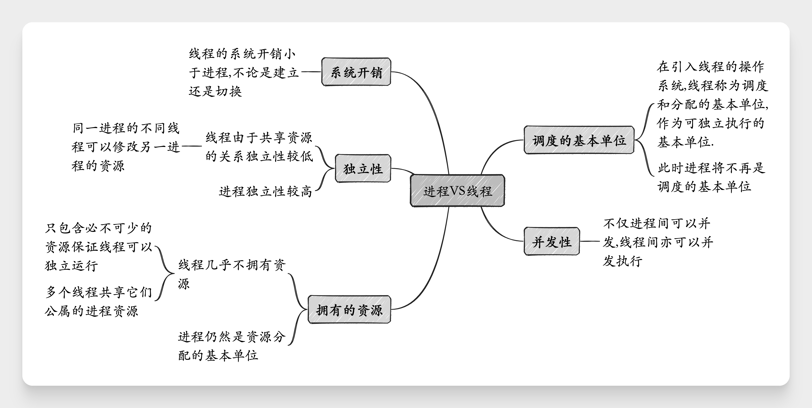

{++多线程支持多处理机系统++}而{--单进程不支持--}.

线程通信具有三种基本状态,由其专属的线程控制块(TCB).

### 线程的实现方式

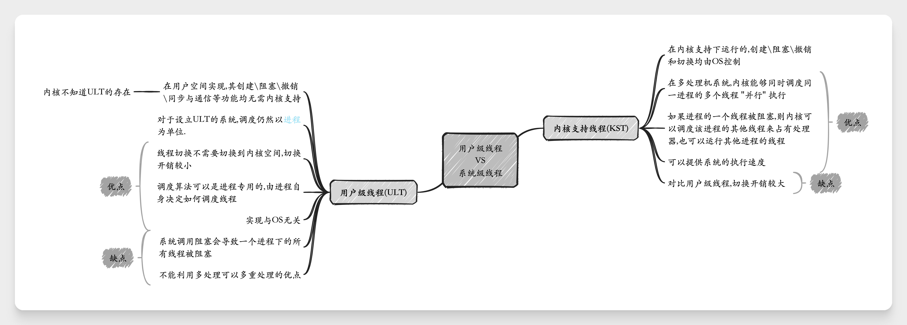

通常来说现代OS会将用户级线程和系统级线程组合在一起使用,由如下三种类型.

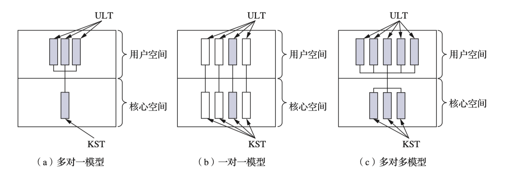


## 处理机调度
调度的本质是一种{++资源分配++}

处理机调度的三个层次 

- {++低级调度++} 即进程调度, 根据某种算法决定那个进程获取CPU资源
- {++中级调度++} 即内存调度, 存储器管理的对换功能
- {++高级调度++} 即作业调度, 根据某种算法将位于外存上处于后备队列中的那几个作业调入内存

### 进程调度
主要任务 {++保存CPU现场信息++} {++按照某种算法选取进程++} {++把CPU分配给进程++}


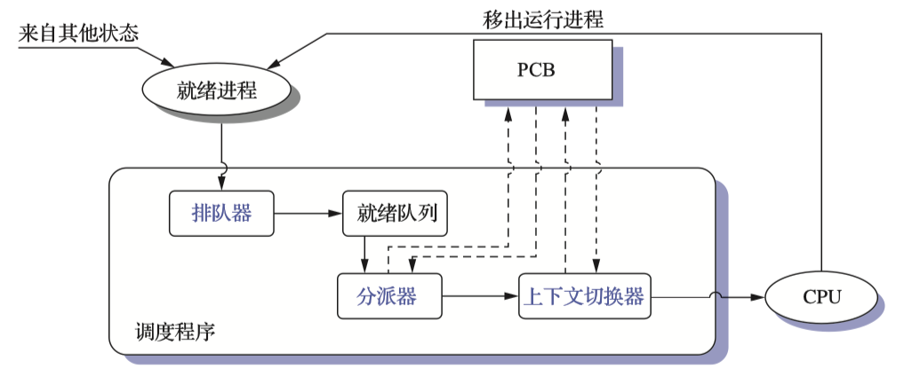

{++进程调度程序的组成++}

- 排队器 将就绪进程按照一定策略排列成一个或者多个队列,以便调度程序可以快速找到它们
- 分配器 将选定的进程从就绪队列中取出,然后进行分配器到新进程间的{++上下文切换++},将CPU分配给新的进程
- 上下文切换器 
    - 当前进程和分配器的切换
    - 分配程序和待调度进行的上下文切换

{++调度算法的共同目标++}

- 资源利用路 

$$
CPU利用率=\frac{CPU有效时间}{CPU有效时间+CPU空闲等待时间}
$$

- 公平性 各进程都可以合理的获取CPU资源
- 平衡性 尽可能保证系统资源的平衡性(合理分配资源给不同类型的作业,例如有的属于CPU繁忙作业,有的属于I/O繁忙作业)
- 策略强制执行 

{++周转时间++} 从作业被提交给系统开始,到作业完成为止的这段时间间隔.

$$
T_{周转时间} = T_{完成时间} - T_{到达时间}
$$

{++响应时间++} 从进程被创建(唤醒)到其首次获得CPU并开始执行的事件.

$$
T_{响应时间} = T_{首次执行时间} - T_{到达时间}
$$

### 调度算法

{++先来先服务调度算法(FCFS\FIFO)++} 不管作业的时间长度,按照作业到达的顺序依次执行.

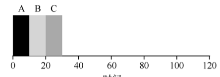

先来先服务会出现{++护航效应++} 一些耗时较少的潜在资源消费,被安排在重量级资源消费之后. 

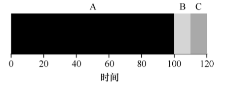

{++短作业优先(SJF)++} 作业\进程执行时间越短,优先级越高(默认非抢占式);在所有进程同步到达的情况下,该算法必定最优.

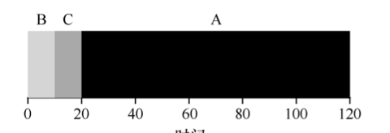

{++缺点++} 

- 可能导致长进程永远不执行
- 当作业先后到达的情况下,仍然存在护航效应的问题,

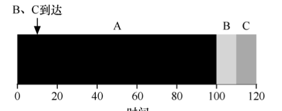

{++最短完成时间优先(STCF)++} 即抢占式SJF算法.

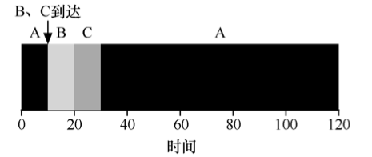 

{++轮转(RR)调度算法++} 时间片轮转算法,保证进程的响应时间.

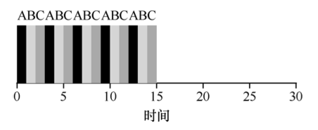

- RR算法的响应时间较好,周转时间较差
- 当上下文切换的开销较大
- 公平调度算法

{++考虑I/O++} 采用重叠机制,在进程A需要I/O的时候调度程序调用其他进程(如B)上CPU执行. 

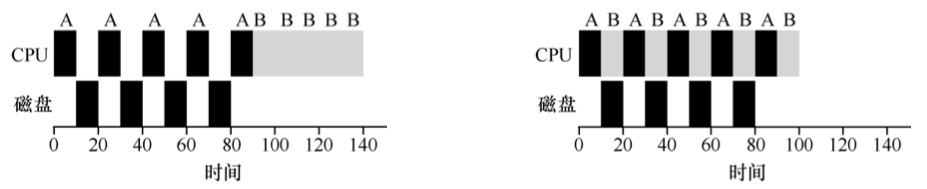

{++多级反馈队列(MLFQ)++} 

多级反馈队列中有许多独立的队列,每个队列{++具有不同的优先级++}. 任何时刻一个作业只能在一个队列内. MLFQ总是按照 {++优先级从高到低++} 执行工作. 

- 相同的队列内的作业,具有相同的优先级

{++MLFQ的基本规则++}

- 如果A的优先级 > B的优先级, 则运行A而不运行B
- 如果A的优先级 = B的优先级,则轮转运行A\B(也可以按照先来先服务运行A,B)

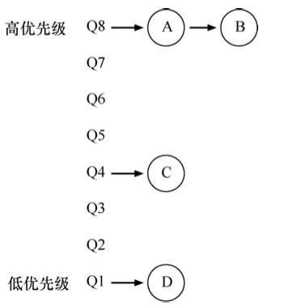

- 工作进入系统时, 默认放在最高优先级. 
- 一旦工作用完了在某一层的时间配额,则降低其优先级
    - 工作用完其时间片后,降低优先级
    - 如果工作在其时间片内{++主动++}释放CPU则优先级不变.
- 周期性提升(boost)所有工作的优先级
    - 每经过一段时间S,将所有工作重新加入最高优先级的队列
    - 避免饥饿问题

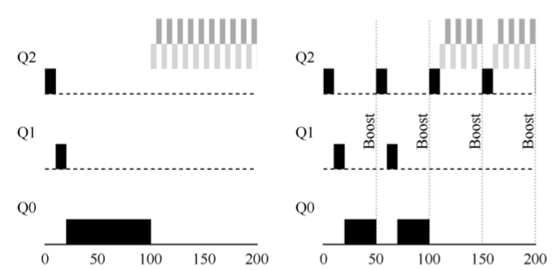

## 死锁

{++死锁++} 两个进程双方都希望对方能释放出自己所需要的资源,但它们都会因为不能获取自己所需要的资源去继续运行而无法释放自己当下的资源,并且一直处于这种僵持状态.

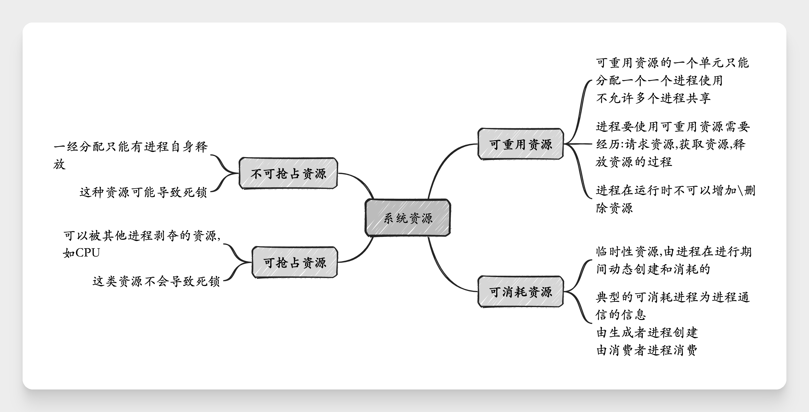

{++竞争不可抢占资源导致的死锁++} 

```c
P1                              P2
....                            ....

open(F1, w);                    open(F2,w);
open(F2, w);                    open(F1,w);
```
www
上述并不一定会导致死锁,例如P1率先打开F1,F2,此时P2就会因为无法打开F2而导致阻塞;此时等待P1释放资源即可. 

但上述也可能导致死锁,例如P1,P2先后执行一条open;此时P1打开F1,P2打开F2,此时P1希望P2释放F2,而P2希望P1释放F1,导致死锁. 可以用如下图所示的资源图描述.

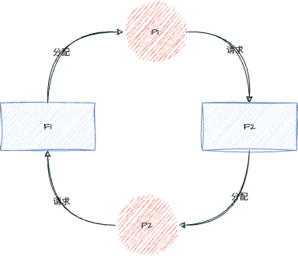

{++竞争可消耗资源导致死锁++}

考虑如下图所示的三个进程P1,P2,P3,采用消息通信机制进行通信.

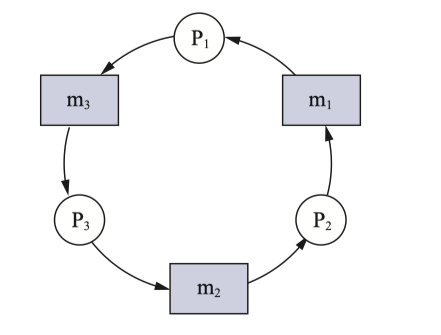

假设三个进程按照先发送再接受的顺序通信,则不会发生死锁

```c
P1: ...send(P2, m1); receive(P3, m3); ...
P2: ...send(P3, m2); receive(P1, m1); ...
P3: ...send(P1, m3); receive(P2, m2); ...
```

但如果先接受消息再发生消息;则所有进程都会阻塞在receive操作上等待一个永远不会发出的消息产生死锁.

```c
P1: ...receive(P3, m3);send(P2, m1); ...
P2: ...receive(P1, m1);send(P3, m2); ...
P3: ...receive(P2, m2);send(P1, m3); ...
```

{++进程推进顺序不当引起死锁++}

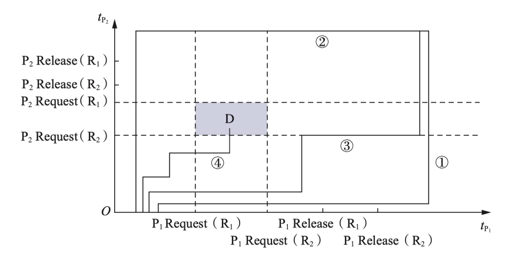

{++产生死锁的必要条件++}

- 互斥条件 在一段时间内,某资源只能被一个进程占有.
- 请求和保持条件 进程已经占有了一个条件,但又提出了新的资源请求,而被请求的资源已被其他资源所占有,同时对其自身占有的资源保持不放
- 不可抢占条件 进程获得的资源在使用完之前不可以被剥夺
- 循环等待条件 必然存在一个进程-资源循环链,如上面所示的两个死锁情况

{++死锁的处理++} 

- ^^预防死锁^^ 破坏死锁的四个必要条件
- ^^避免死锁^^ 在资源分配的过程中,用某种方法防止系统进入不安全状态,从而避免发生死锁
- ^^检测死锁\解除死锁^^ 运行进程在运行过程中产生死锁,但发生死锁的时候系统要能检测到死锁的发生并能采取相应措施把进程从死锁中解脱出来
    - 常用办法有 {==资源剥夺法,撤销进程法,进程回退法==}.


### 死锁预防

{++死锁预防++} 通过破防死锁的四个必要条件之一/几个来实现.(使用{++假脱机技术++}也可以预防死锁)

{++破坏请求和保持条件++} 请求资源的时候该进程不可以持有不可抢占资源

- 第一种协议 所有进程在开始的时候,一次性申请全部资源(破坏请求条件).若不满足则等待,直到所有资源都空闲(破坏保持条件)
    - 简单,易性,安全
    - 资源浪费严重,进程容易发生饥饿现象
- 第二种协议 允许一个进程只持有运行初期所需要的资源,在运行过程中逐步释放分配给自己的资源,当{++完全用完后++}再申请新的资源.(破坏保持条件)

{++破坏不可抢占条件++} 当一个进程已经保持了某些不可抢占资源而申请其他资源的时候,{++必须++}释放掉自己所持有的资源{++类似于被抢占++},待以后需要的时候在申请.

- 实现较为复杂,且代价较大.

{++破坏循环等待条件++} 对系统中所有资源类型进行线性排序,并赋予它们独一无二的序号.

- 每个进程必须按照{++序号递增++}的顺序请求资源
- 如果需要多个同类资源,必须同时申请
- 假设某进程以获得了序列较高的资源,但想要申请低序号资源;则{++必须放弃所有相同获得高于++}该序号的资源

### 死锁避免

{++系统安全状态++}系统能按照某种推荐顺序 $\{P_1,P_2,\ldots,P_n\}$ 为每个进程 $P_i$ 分配器所需要的资源,直至满足每个进程对资源的最大需求,进而使每个进程都可以顺利完成的一种系统资源. 

- 此时 $\{P_1,P_2,\ldots,P_n\}$ 称为安全序列
- 如果无法找到任意一个安全序列,则此时状态为不安全状态
- 系统处于安全状态一定不会导致死锁;处于不安全状态{++可能++}导致死锁

!!! example "安全状态举例"
    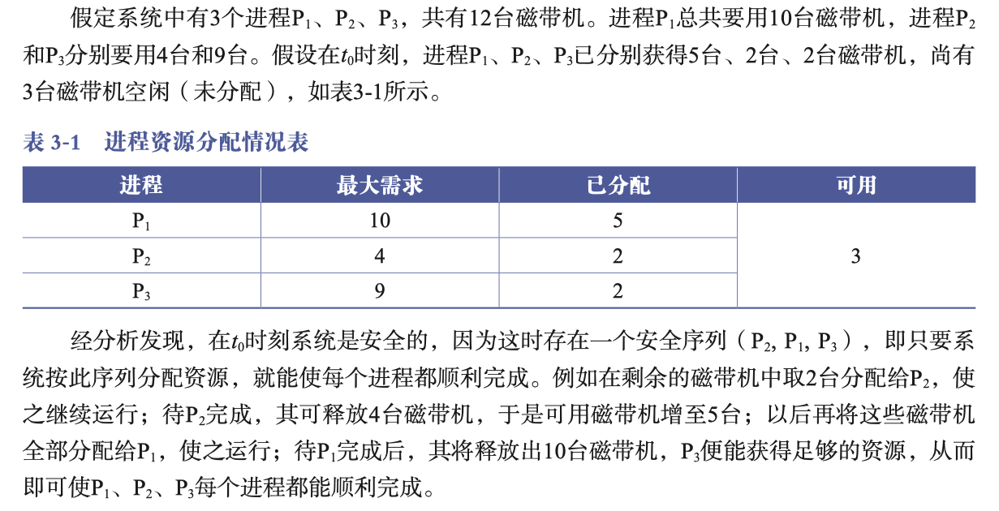

{++死锁避免++} 在分配资源前,OS判断将资源分配给进程后系统是否仍然处于安全状态,若处于则分配;否则不分配.

{++银行家算法++} Dijkstra设计

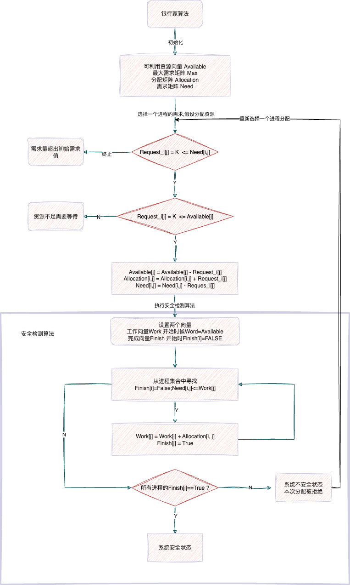

### 死锁的检测与解除
{++资源图的简化流程++}

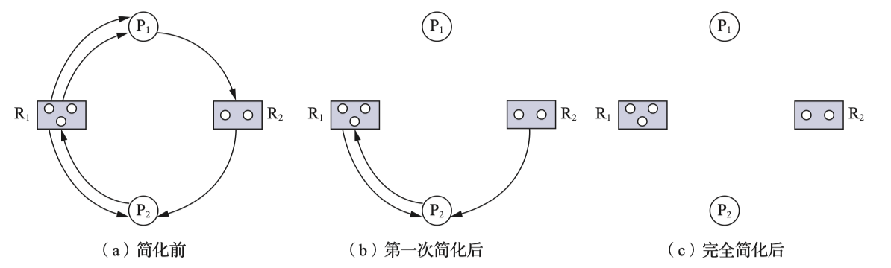

- 在资源图中找到一个{++即不阻塞也不孤立++}的进程 $P_i$
- 消去 $P_i$ 的请求边和分配边,使之成为孤立点
    - 例如上述中P1进程,其持有2个R1资源请求1个R2资源
    - 而系统一共有3个R1资源,1个R2资源(被P2持有了一个).均大于等于P1的请求\持有量
    - 则P1必然可以完成执行并释放其占有的资源,故可以移去其的所有入边和出边
- 重复这个过程
    - 若所有结点最终都是孤立点,则该资源图式可完全简化
    - 否则为不可完全简化图

{++死锁定理++} 所有的简化顺序,都将得到相同的不可完全简化图.当且仅当S状态的资源分配图是不可完全简化的,此时状态S为必然发生了死锁.


{++死锁的解除++} {==资源剥夺法,撤销进程法,进程回退法==}.
## 进程同步

{++进程同步++} 在异步环境下的一组因直接制约而相互发送消息,互相合作,互相等待,使得个进程按一定速度执行的过程.

具有同步关系的一组进程被称为 {++协作进程++}

{++互斥关系++} 对于不可抢占资源(即临界区)的共享,会导致进程和进程之间产生互斥关系,是一种间接制约关系.

{++同步关系++} 多个进程（或线程）为了完成某个共同任务，需要按照一定的顺序或时序执行，即一个进程的执行依赖于另一个进程的某个事件或状态, 是一种直接制约关系.

{++临界资源(临界区)++} 每个进程访问临界资源的那段代码称为临界区.

```c
while(TRUE) {
    \\ 进入区代码
    ....
    \\ 临界区代码
    ....
    \\ 退出去代码
    ....
}
```

### 软件同步机制

解决临界区问题的四大准则

- 空闲让进 当无进程访问临界区的时候,应该允许一个进程访问临界资源
- 忙则等待 当已有进程访问临界区的时候,应阻止其他进程访问临界资源
- 有限等待 对于要求访问临界区的进程,其等待时间应该是有限度的
- 让权等待 当进程不能进入自己的临界区的时候,应该立即释放处理机.(原则上应该遵循)

{++Peterson解决方案++}

问题描述: 有两个交替运行的进程Pi和Pj,要求两个进程共享两个变量 `int turn` 和 `boolean flag[2]`, 变量`turn` 表示那个进程可以进入临界区, 数组flag表示那个进程准备进入临界区.

进程Pi的结构

```cpp
do {
    flag[i] = true;
    turn = j;
    while (flag[j] && turn == j);
    // 临界区
    flag[i] = false;
    // ....
} while(true);
```

Pj的结构也是类似的, 可以发现Peterson解决办法的本质是一种谦让算法. 在Pi进程中设置 `turn=j`把临界区让给Pj进程,而让自己进入忙等状态;最终谁可以获取临界区完全由`turn=?`来决定.

### 硬件同步机制

{++关中断++} 在进入锁检测的时候关闭时钟中断,检测完成后并上锁后再重启中断. 

但关中断的坏处也是很多的,一般不采用.

{++利用Test-and-Set++} 用于检测进程是否持有锁

```cpp
boolean TS(boolean *lock) {
    boolean old;
    old = *lock;
    *lock = TRUE;
    return old;
}
```

主要硬件实现的TS是一个原语(原子操作)不可分割,不会被中断,功能类似于上述的函数.

此时进程的结构类似于

```cpp
do {
    \\ ....
    while TS(&lock); // do skip
    critical section ; // 临界区
    lock = false;
    remainder section;
} while(true);
```

{++利用swap++} 原子的用于交换两个区域的内容

```cpp
void swap(boolean *a, boolean *b) {
    boolean temp;
    temp = *a;
    *a = *b;
    *b = temp;
}
```

采用swap的进程描述如下 

```cpp
do {
    key = true;
    do {
        swap(&lock, &key);
    } while(key != false);
    // 临界区
    lock = false;
    // ....
} while(true);
```

需要注意的是上述的软件实现和硬件实现{--均无法实现让权等待--},在无法获得锁的情况下,均会进入忙等.

### 信号量机制

{++整型信号量++} 定义为表示资源数目的类型量S,除初始化外{++仅能++}通过两个标准的原子操作 {++wait(S)和signal(S)++}来访问.

其操作可以描述为如下,但要注意它们都是原子操作.
```cpp
wait(S) {
    while (S <= 0); // do no-op
    S--;
}

signal(S) {
    S++;
}
```
需要注意采用整型信号量,仍然无法满足让权等待的要求. 当S不足的时候, wait操作会自旋等待而非交去处理机.

{++记录型信号量++} 通过增加一个进程链表指针list来链接所有因为wait操作被阻塞的进程. 从而可以通过signal操作唤醒那些进程.

```cpp
typedef struct {
    int value; // 系统中的资源数目
    struct process_control_block *list;  // 进程链表
}semaphore;

wait(semaphore *S) {
    S->value--;
    if (S->value < 0) block(S->list);
}

signal(semaphore *S) {
    S->value++;
    if(S->value <= 0) wakeup(S->list);
}
```

{++AND型信号量++} 针对一个进程需要共享两个或更多共享资源的解决方案;将进程在整个运行过程中所需要的资源{++一次性++}全部分配给进程,待进程用完后再{++一次性释放++}

```cpp
S_wait(S1, S2, ..., Sn) {
    while (true) {
        if (S1 >= 1 && S2 >= 1 .... && Sn >= 1) {
            for (i = 1; i <= n; i++) Si--;
            break;
        }
        else {
            // 将进程放入与第一个Si < 1的Si相关联的等待队列中，并将该进程的程序计数器设置为S_wait操作的起始位置。
        }
    }
}

S_signal(S1,S2,...,Sn) {
    while (true) {
        for (i = 1; i<= n; i++) {
            Si++;
            // 移除所有和Si的等待队列中的进程,将这些进程加入就绪队列
        }
    }
}
```

{++信号量集++} 运行一次wait操作或者signal 获取/释放 多个临界区资源,采用的是AND信号量

```cpp
S_wait(S1,t1,d1;S2,t2,d2;...;Sn,tn,dn);
S_signal(S1,t1,d1;S2,t2,d2;...;Sn,tn,dn);
```

- `S_wait(S,t,d)` 系统运行分配的下限为t,需求值d;若需求值小于下限不予分配,资源不足d时也不予分配
- `S_wait(S,1,1)` 退化为互斥信号量(S=1)或者一般记录信号量(S>1)
- `S_wait(S, 1, 0)` 当S>=1的时候表明运行多个进程进入特定的临界区,而S=0,则阻止任何进程进入临界区.

{++信号量的应用++}

实现互斥操作, 设置信号量`mutex`其取值范围为 $(-1,0,1)$

- `mutex = 1` 两进程均为进入临界区,任意一个进程均可以获取锁并进入临界区
- `mutex = 0` 表示另外进程已经持有了互斥锁,此时申请进入临界区的进程必须阻塞自我等待
- `mutex = -1` 表示有一个进程在临界区内执行,且另一个进程在阻塞队列等待唤醒

```cpp
semaphore mutex = 1;
PA() {
    while(1) {
        wait(mutex);
        // 临界区;
        signal(mutex);
        // 剩余内容
    }
}

PB() {
    while(1) {
        wait(mutex);
        // 临界区
        signal(mutex);
        // 剩余内容
    }
}
```
互斥的实现比较简单,需要注意wait()操作和signal()操作必须{++成对出现++}

{++利用信号量实现同步操作++}

假设进程P1和P2中有两段代码C1和C2,现要求C1必须在C2之前执行. 设一个同步型信号量S,设置其{++初始值为0++},区别于互斥型型号量.其取值范围也为 $(-1,0,1)$

- `S=0` 表示C1尚未执行,C2也不允许执行
- `S=1` 表示C1已经执行,此时C2运行执行
- `S=-1` 表示C2想执行,但C1尚未执行,不允许C2执行.

```cpp
semaphore S=0;

P1() {
    while(1) {
        \\ C1代码段
        signal(S);
    }
}

P2() {
    while(1) {
        wait(S);
        \\ C2代码段
    }
}
```

通过在{++不同++}进程内设置一对同步信号量来达成同步的要求.

### 管程机制

{++管程++} 一个数据结构能被并发进程(在该数据结构上)所执行的一组操作,这组操作能同步进程和改变管程中的数据.

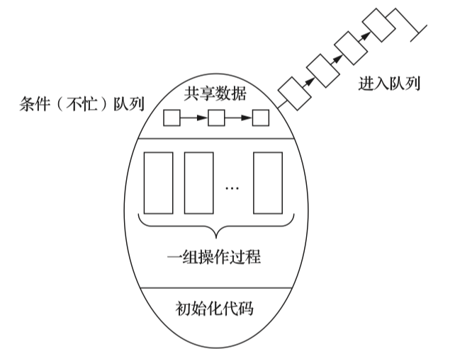

- 管程的名字
- {++局限于++}管程内的共享数据结构
- 对该数据结构的一组操作过程
- {++局限于++}管程内的共享数据初值的语句


```cpp
monitor monitor_name {  // 管程名
    share variable declarations; // 共享变量的说明
    cond declarations; // 条件变量的说明
    public: // 能被进程调用的过程
    void P1(......) {....} 
    void P2(......) {....}
    .....

    { // 管程主体
    initialization code; // 初始化代码
    .....
    }
}
```

{++条件变量++} 多个进程访问管程可以由于不同的原因导致阻塞\挂起,若不释放管程则会导致其他想要进入管程的进程被阻塞,通过设置条件变量来控制. 条件变量仅有两种操作 {wait和signal}. 其含义如下

- x.wait 当前调用管程的进程因为条件x而进入阻塞,将自己挂载x的条件队列内
- x.signal 调用管程的进程发现x条件发生了改变,唤醒因x而被挂起的进程
    - 若没有因x而挂起的进程,则接着执行当前进程
    - 若有多个,则选择某一个
        - 此时是执行选择的这一个还是原进程目前并不定论

### 经典同步问题

#### 生产者-消费者问题

^^问题描述^^ 假设有1个或多个生产者线程和一个或多个消费者线程.生产者将生成的数据项加入缓冲区;消费者从缓冲区取走数据.要求生产者不能往满的缓冲区内加入数据,消费者不能从空的缓冲区内取走数据.

{++利用记录型信号量++} 假设所有生产者\消费者等价,即任何消费者可以去任何生产者生产的数据,只要缓冲区非空.

- `mutex` 互斥型信号量 限制进制互斥访问缓冲区
- `full\empty` 记录型信号量 表面缓冲区内的元素数量

则此时解决方案如下所示

```cpp
int in = 0, out = 0;
item buffer[n];

semaphore mutex = 1, empty = n, full = 0;

// 生产者线程
void producer() {
    do {
         // produce an item next_p;
        wait(empty);
        wait(mutex);
        buffer[in] = next_p;
        in = (in + 1) %n;
        signal(mutex); // 互斥夹紧
        signal(full); 
    }
}

// 消费者进程
void consumer() {
    do {
        wait(full);
        wait(mutex);
        next_c = buffer[out];
        out = (out + 1) % n;
        signal(mutex); // 互斥夹紧
        signal(empty);
        // consume the item in next_c;
    }
}
```

- 注意wait操作不可以颠倒,否则会死锁
    - 必须先获得了资源在申请进入临界区
- 互斥变量的wait和signal必须成对出现且相邻(互斥夹紧)
- 信号量full和empty也必须成对出现,但出现在不同线程中

{++利用AND信号量++} 使用S_wait和S_signal来替代连续的多个wait和signal操作

```cpp
int in = 0, out = 0;
item buffer[n];
semaphore mutex = 1, empty = n, full = 0;

// 生产者线程
void producer() {
    do {
         // produce an item next_p;
        S_wait(empty, mutex)
        buffer[in] = next_p;
        in = (in + 1) %n;
        S_signal(mutex, full);
    }
}

// 消费者进程
void consumer() {
    do {
        S_wait(full, mutex);
        next_c = buffer[out];
        out = (out + 1) % n;
        S_signal(mutex, empty);
        // consume the item in next_c;
    }
}
```

{++利用管程++}

```cpp
// 管程
monitor producer_consumer() {
    item buffer[N];
    int in, out;
    condition not_full, not_empty;
    int count;
    public:
        void put(item x) {
            if (count >= N) c_wait(not_full); // 将该线程挂在not_full条件对应的队列上
            buffer[in] = x;
            in = (in + 1) % N;
            count++;
            c_signal(not_empty);
        }

        void get(item y) {
            if (count <= 0) c_wait(not_empty); // 将该线程挂载not_empty条件对应的队列上
            x = buffer[out];
            out = (out + 1) % N;
            count--;
            c_signal(not_full);
        }

        {
            in = 0; out = 0; count = 0;
        }
} PC;

// 生产者 && 消费者线程

void producer() {
    item x;
    while (1) {
        ....
        // produce an item in next_p
        PC.put(x);
    }
}

void consumer() {
    item x;
    while (1) {
        PC.get(x);
        // consumer the item in next_p
        ....
    }
}
```

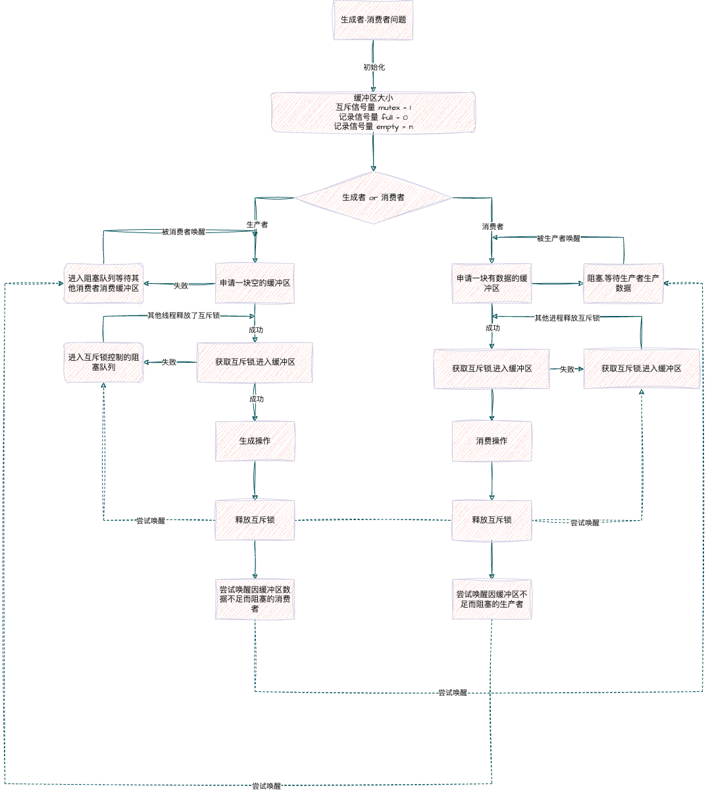

#### 读者-写者问题
^^问题描述^^ 一个数据文件或者记录可以被多个进程共享,其中某些线程仅仅是读取其中的内容而不做更改,称为读者线程;另一些不仅要求读还要求更改数据中的内容,称为写者线程. 允许多个读者同时访问数据,但不允许写者和读者\写者共同访问数据.

通常有三类读者-写者问题

- {++读写公平++} 读写进程一起排队,谁先到写执行谁
- {++写者优先++} 如果有写者在等待访问对象,则不允许有新的读者开始读操作
- {++读者优先++} 如果有读者在访问读者,则不管有没有写者,后续读者都可以进行读操作

^^关于读写公平问题的解法^^

```cpp
int count = 0;
semaphore c_mutex = 1, mutex = 1, queue = 1;
// 读进程
void reader() {
    wait(queue);
    wait(c_mutex);
    count++;
    if (count == 1) wait(mutex);
    signal(c_mutex);
    signal(queue);

    // 读文件

    wait(c_mutex);
    count--;
    if (count == 0); signal(mutex);
    signal(c_mutex);
}

// 写进程
void writer() {
    wait(queue);
    wait(mutex);
    
    // 写操作

    signal(mutex);
    signal(queue);
}
```

^^关于读者优先问题的解法^^

- 设置互斥型信号量`w_mutex`来控制读\写互斥;设置`reader_number`来记录当前有多少个读者在读数据;设置互斥变量`r_mutex`来控制多个读者互斥访问`reader_number`
- 写者只有在没有读者要读数据的时候才能写数据

```cpp
semaphore r_mutex = 1, w_mutex = 1;
int reader_number = 0;

// 读线程

void reader() {
    do {
        wait(r_mutex);
        if (reader_number == 0) wait(w_mutex); // 等待写进程完成
        reader_number++;
        signal(r_mutex); // 互斥夹紧
        ....
        perform read operation ;
        ....
        wait(r_mutex);
        reader_number--;
        if (reader_number == 0) signal(w_mutex); // 尝试唤醒写进程
        signal(r_mutex); // 互斥夹紧
    } while(true);
}

// 写线程
void writer() {
    do {
        wait(w_mutex);
        perform write operation;
        signal(w_mutex); // 互斥夹紧
    }while(1);
}
```

^^关于写者优先问题的解法^^

```cpp
semaphore r_mutex = 1, w_mutex = 1, read_try = 1;  // 新增 read_try 信号量
int reader_number = 0;
int writer_waiting = 0;  // 记录是否有写者在等待

// 读线程
void reader() {
    do {
        wait(read_try);           // 尝试进入读区域，如果写者在等待则阻塞
        wait(r_mutex);            // 保护 reader_number 的访问
        if (reader_number == 0) wait(w_mutex);  // 如果是第一个读者，等待写者完成
        reader_number++;
        signal(r_mutex);          // 释放对 reader_number 的互斥访问
        signal(read_try);         // 允许其他读者尝试进入

        // ....
        perform read operation;   // 执行读操作
        // ....

        wait(r_mutex);            // 再次进入临界区，准备减少读者数
        reader_number--;
        if (reader_number == 0) signal(w_mutex);  // 如果是最后一个读者，释放 w_mutex
        signal(r_mutex);          // 释放互斥锁
    } while(true);
}

// 写线程
void writer() {
    do {
        wait(w_mutex);            // 确保写操作的互斥
        writer_waiting++;         // 标记有写者在等待

        wait(r_mutex);            // 保护 reader_number 的访问
        if (reader_number > 0) wait(read_try);  // 如果有读者正在读，阻止新读者进入
        signal(r_mutex);          // 释放对 reader_number 的访问

        // ....
        perform write operation;  // 执行写操作
        // ....

        wait(r_mutex);            // 再次进入临界区
        if (reader_number > 0) signal(read_try);  // 允许新读者进入（如果之前阻止了）
        signal(r_mutex);          // 释放互斥锁

        writer_waiting--;         // 标记写者已完成等待
        signal(w_mutex);          // 释放写互斥锁
    } while(1);
}
```

#### 哲学家进餐问题

^^问题描述^^ 有5个哲学家共用1张圆桌,它们分别坐在圆桌周围的5把椅子上,在圆桌上有5个碗和5根筷子,它们的生活方式是交替思考和吃法;平时,一个哲学家进行思考,在饥饿的时候便会试图取用左/右边最靠近自己的筷子来进餐,只有在持有两个筷子的时候才会进餐;进餐完毕,放下筷子思考.

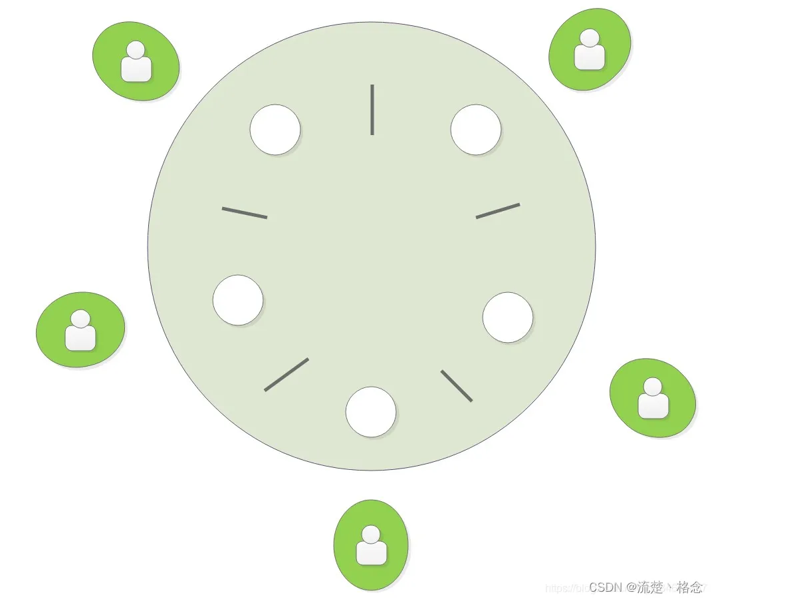

简单思考,如果所有哲学家都先拿左边筷子再拿右边筷子;当所有哲学家一起想吃饭的时候就或导致死锁.

```python
mutex = Mutex()  # 用于保护共享资源（筷子）
chopsticks = [Mutex() for _ in range(5)]  # 5 根筷子，每根一个互斥锁

def philosopher(id):
    while True:
        think()  # 思考
        # 拿筷子
        chopsticks[id].lock()      # 拿左边的筷子
        chopsticks[(id + 1) % 5].lock()  # 拿右边的筷子
        eat()  # 进餐
        # 放筷子
        chopsticks[id].unlock()         # 放左边的筷子
        chopsticks[(id + 1) % 5].unlock()  # 放右边的筷子
```

解决办法有三种

- 只有当哲学家左右两边都有筷子的时候才拿起左边的筷子

```cpp
semaphore chopstick[5] = {1, 1, , 1, 1, 1};
semaphore mutex = 1;

Pi() {
    do {
        wait(mutex);
        signal(chopstick[i]);
        signal(chopstick[(i + 1) % 5]);
        signal(mutex);

        eat();

        signal(chopstick[i]);
        signal(chopstick[(i + 1) % 5]);

        think();
    } while(1);
}
```

- 奇数序号的哲学家先拿左边,偶数序号的哲学家先拿右边

```cpp
// 定义5根筷子的互斥锁
semaphore chopstick[5] = {1, 1, 1, 1, 1};

// 哲学家线程
void philosopher(int id) {
    do {
        think();  // 思考
        
        if (id % 2 == 1) {  // 奇数编号哲学家
            wait(chopstick[id]);      // 先拿左边的筷子
            wait(chopstick[(id + 1) % 5]);  // 再拿右边的筷子
        } else {  // 偶数编号哲学家
            wait(chopstick[(id + 1) % 5]);  // 先拿右边的筷子
            wait(chopstick[id]);      // 再拿左边的筷子
        }
        
        eat();  // 进餐
        
        signal(chopstick[id]);      // 放左边的筷子
        signal(chopstick[(id + 1) % 5]);  // 放右边的筷子
    } while(true);
}
```

- 至多允许4名哲学家同时取拿其左边的筷子

```cpp
// 定义5根筷子的互斥锁
semaphore chopstick[5] = {1, 1, 1, 1, 1};
// 限制同时拿筷子的哲学家数量
semaphore limit = 4;

// 哲学家线程
void philosopher(int id) {
    do {
        think();  // 思考
        
        wait(limit);  // 限制同时拿筷子的哲学家数量
        wait(chopstick[id]);      // 拿左边的筷子
        wait(chopstick[(id + 1) % 5]);  // 拿右边的筷子
        
        eat();  // 进餐
        
        signal(chopstick[id]);      // 放左边的筷子
        signal(chopstick[(id + 1) % 5]);  // 放右边的筷子
        signal(limit);  // 释放限制
    } while(true);
}
```

## (new) 多处理机调度 

^^非对称多处理机(AMP)^^ 

^^对称多处理机(SMP)^^ 所有处理机都是相同的,有调度程序将任何一个进程分配给任何一个CPU. 

^^处理器的亲和性^^ 应该让同一进程运行在同一处理器上,而非运行在不同处理器

^^负载均衡^^ 保证所有CPU上的进程\吞吐量应该均衡

### 多处理器调度方案

{++公共就绪队列++} 所有CPU共享一个公共就绪队列.

- 优点是很好的实现了复杂均衡,只要CPU一有空闲就可以去就绪队列上找进程执行
- 缺点是处理器亲和性较差, 同一进程可能被频繁调度到不同CPU上执行

{++私有就绪队列++} 为每个CPU设定一个专属于自己的私有就绪队列

- 这种实现的负载均衡能力较差,提高负载均的方法有
    - 推迁移\拉迁移 一个特定的系统程序周期性的检测每个CPU的负载,若发现不平衡则从超载的CPU中推一些进程到空闲CPU的就绪队列中;若一个CPU负载很低,则从其他CPU的就绪队列中拉一些进程.