# 内存管理

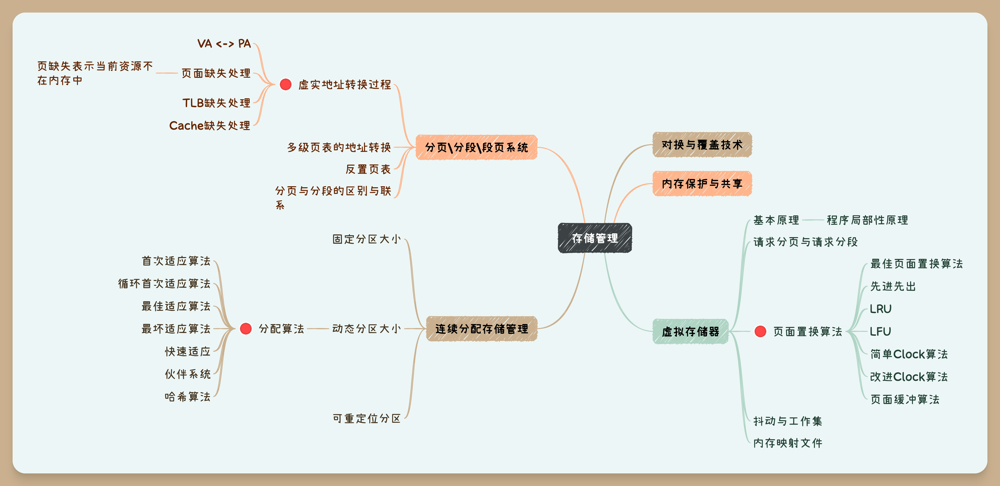

{++逻辑地址和物理地址++}  CPU生成的地址通常称为逻辑地址,而在内存单元中看到的地址通常称为物理地址. 内存管理的一大内容就是 {++逻辑地址(VA)到物理地址(PA)的转换过程++}

## 存储器管理

### 对换与覆盖技术

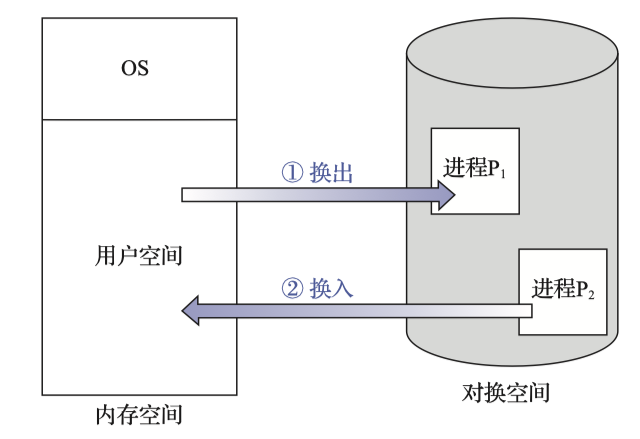

{++对换(swap)技术++} 把内存中暂时不能运行的进程或者暂时不用的程序和数据转移到 {++外存++} 上,以便满足足够的内存空间, 再把具备运行条件的进程或进程所需要的程序和数据存入{++内存++}. 

- 整体对换 以整个进程作为对换单位,处理机的中级(作业)调度就是整体调换
- 页面(分段)对换 以进程的一个页面\段作为对换单位,是实现请求分页\分段--虚拟存储系统的基础
- 对对换区的管理通常采用{++连续分配++}存储管理方式

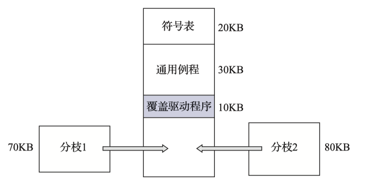

{++覆盖技术++} 在任何时候只在内存中保留所需的指令和数据;当需要其他数据和指令的时候,它们会被装入刚刚不需要的指令和数据所占用的空间.

- 由程序员来制定程序各模块间的调用关系
- 不需要OS的特别支持,用户通过简单的文件结构将文件读入内存,并执行所读指令,即可实现覆盖
- 覆盖结构的程序设计较为复杂.通常局限于微处理机和只有有限物理内存且缺乏先进硬件支持的其他系统

### 内存保护与共享

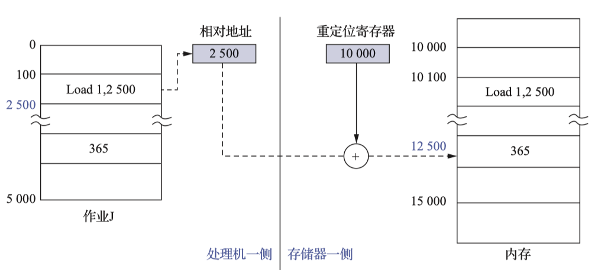

{++内存保护++} 由于每个进程都拥有自己独立的地址空间,要防止进程非法修改其他进程的地址空间,OS需要采用一定的策略来进行内存保护

- CPU设置一对上\下限寄存器,存放用户进程的上\下限地址
- 采用重定位寄存器(基址寄存器)和界地址寄存器进行越界检查
    - 修改这两个寄存器是特权指令

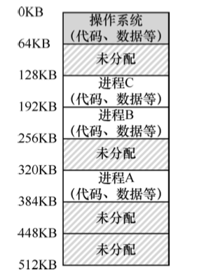

{++内存共享++} 只有那可{++只读++}的区域才可共享,被称为可重入代码(纯代码).

### 连续分配存储管理技术

{++连续分配++} 将用户程序装入内存,为其分配一定大小的连续内存空间.

{++单一连续分配++} 将内存分为系统区和用户区两部分,系统区仅供{++OS++}使用.用户区中{++仅有一道用户程序++},整个用户区被其独享.

{++固定分区分配++} 将用户空间划分为若干个{++固定大小++}的区域,每个区域可以放入{++一道++}作业.

- 分区大小相等 缺乏灵活性,可能导致内存空间的浪费
- 分区大小不等 通常按照{++分区大小++}对分区进行排序,并为之建立一张固定分区使用表.

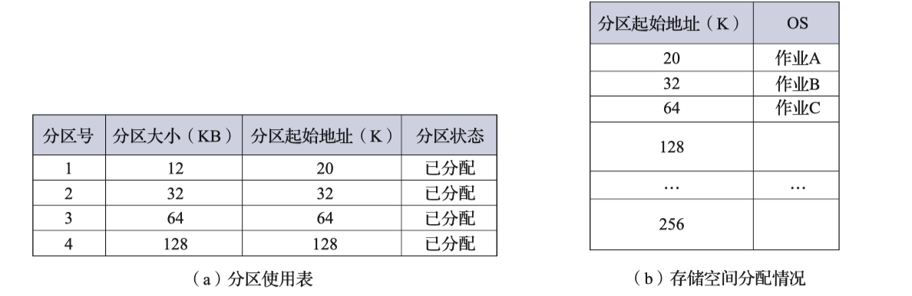

{++动态分区分配++} 根据进程的实际需求,动态地为进程分配内存空间.

^^动态分区的数据结构^^ 空闲分区表与空闲分区链

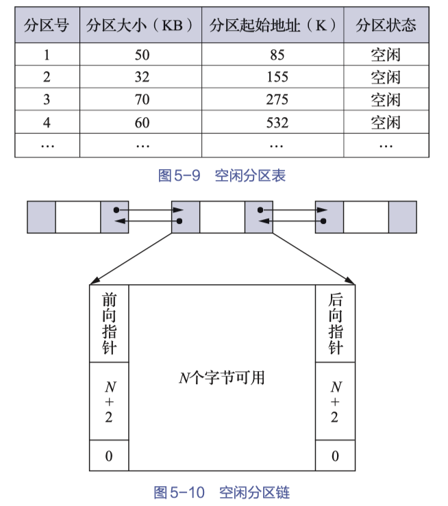

^^动态分区的分配算法^^ 

^^动态分区的分配^^ 通常系统会设置一个限制,若空余分区的大小与要求的分区大小差小于这限制也不允许分配.(避免产生过多碎片)

^^动态分区的回收^^  

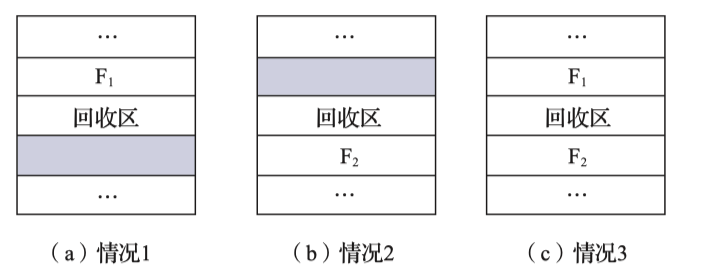

- ( a ) 此时将回收区并入F1,修改F1的大小即可
- ( b ) 此时将F2并入回收区形成新的空闲分区,以回收区的首地址作为新分区的地址
- ( c ) 此时将F1,F2和空闲区合并,并移除F2的表项,修改F1的大小

{++紧凑++} 移动系统中内存的位置,将由于分配导致的小的离散的无法使用的内存空间重组成大的连续内存空间的过程. 紧凑操作需要的系统资源较大.

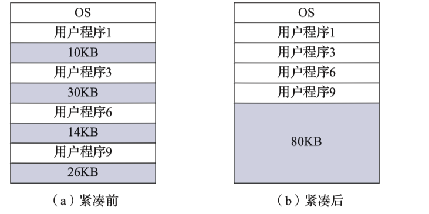

{++动态重定位分配++} 与动态分区基本一致,仅仅是引入了紧凑操作在分配的时候.

### 分页存储管理方式

{++分页++} 用户进程将地址空间分为若干个固定大小的区域. 称为页\页面 典型大小为1KB,2KB等等. 相应的也将内存空间划分为若干个物理块或页框,{++页和块的大小相同++}.

- 将进程的若干个页分配进不相邻的页框中
- 内部碎片 由于进程并不一定都是页大小的整数被,最后一个页框往往是不满的,多余无法使用的空间就被称为内部碎片

{++分页存储的地址结构++} 

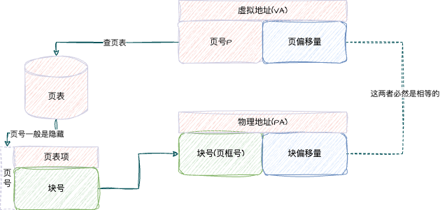

- 页号决定页表的页表项的个数
- 页偏移量\块偏移量 决定页\页框的大小
- 由于页和块大小是一致的,所以页偏移量和块偏移量相同
- 通常单处理机系统中只有 {++一个++} 页表寄存器
    - 用于记录当前在CPU上的进程的页表的{++起始地址和表长++}
    - 当进程未上CPU的时候,这些数据存在其PCB中
- 进程在运行的时候,其页表通常{++驻留内存++} 

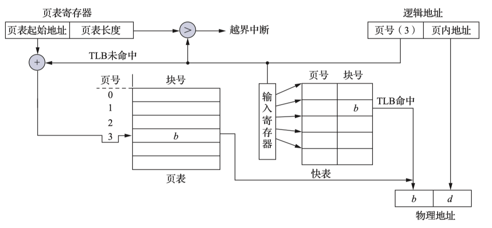

- TLB本质是对页表的高速缓存
- 通常采用全相联映射, 按{++内容访问++}
- TLB通常很小

{++多级页表与请求调页++} 解决页表需要较大的连续内存空间

以二级页表举例

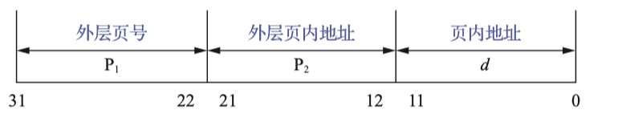
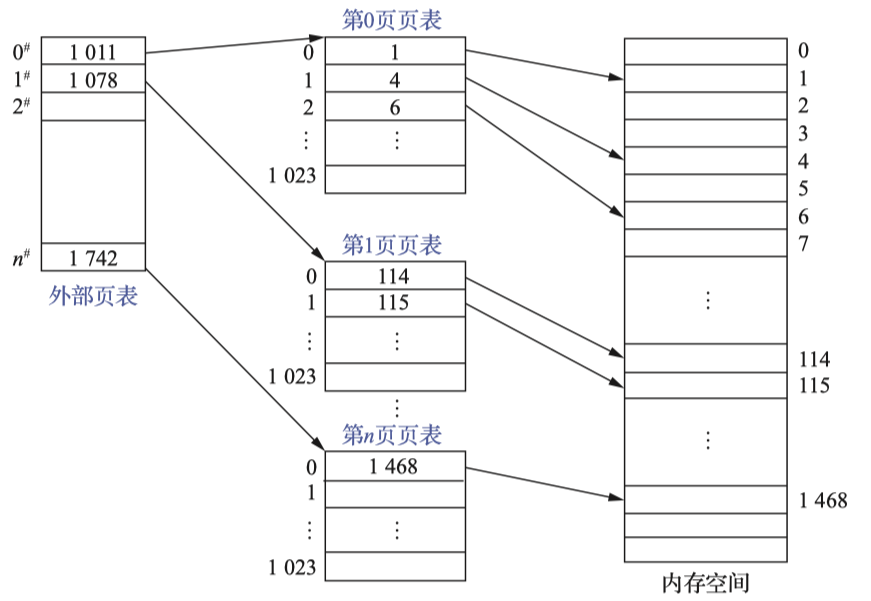

- 通常只需要把外层页表调入内存,等需要用的时候在吧内层页表调入(请求掉页机制)
- 需要增设一个外层页表寄存器,用于存放外存页表的首地址与长度

{++反置页表++} 减少页表所占的内存空间;为每一个{++物理块++}设置一个页表项,并按照其物理块的编号进行排序,页表项的内容则是页号和所属的进程标识符.

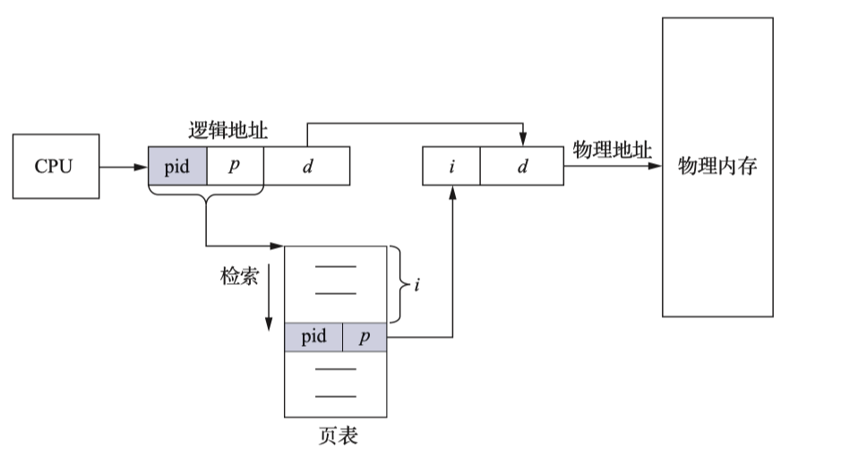

### 分段存储管理方式

{++分段++} 以用户目标为导向的存储管理方式.

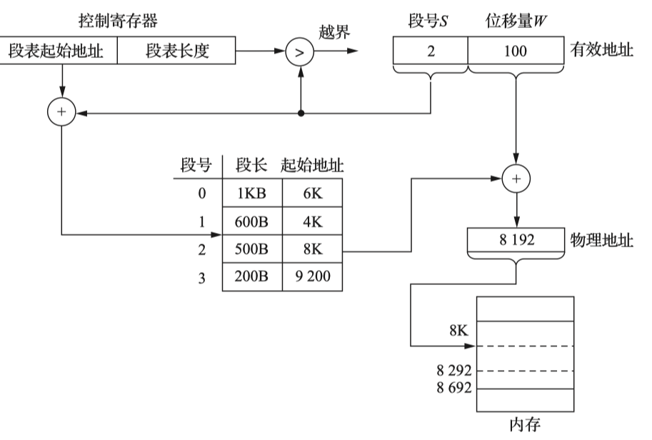

- 段表 类似于页表
    - 通常也驻留在内存中
    - 段号通常也是隐藏的,只有段长和起始地址两部分

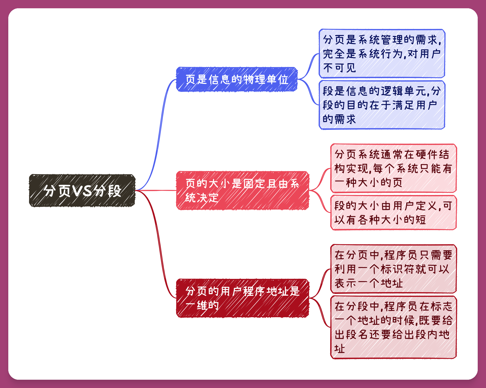

- 分段系统的共享也优于分页系统的共享

### 段页式存储管理方式

结合分段系统和分页系统的特点与优点

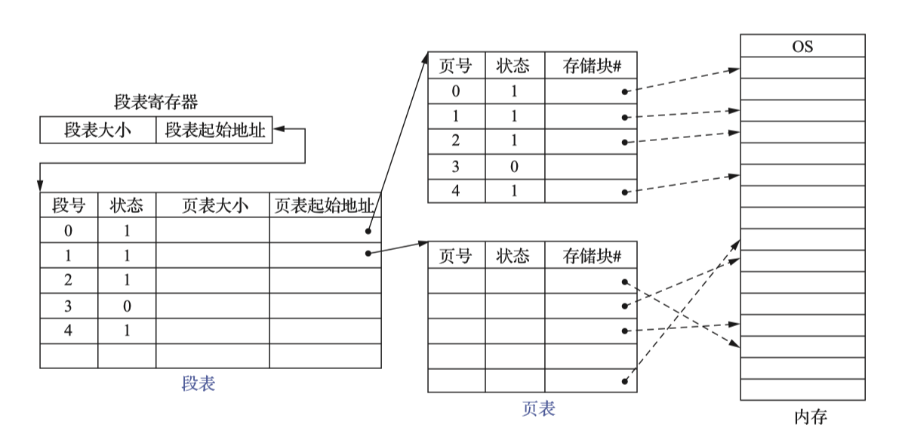

其地址转换过程如下所示

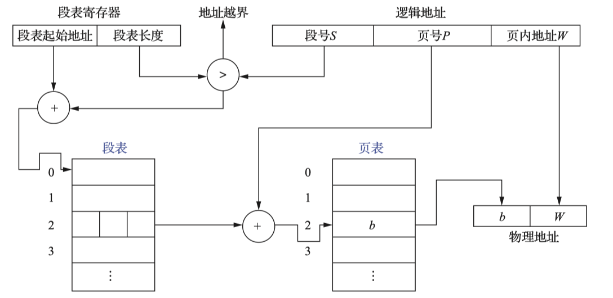

- 采用段页式系统,且不采用TLB的情况下,获取一条指令\数据需要访问 {++三次内存++}
    - 第一次通过段表取得页表初始地址
    - 第二次通过页表取得存储块号
    - 第三次通过物理地址取得所需要的内容

## 虚拟存储器

虚拟存储器的基本原理 {++程序局部性原理++}

虚拟存储器 其逻辑容量由内存和外存容量之和决定,其运行速度接近内存而每位的成本有接近外存.

{++基本特征为++} 多次性;对换性;虚拟性

现代操作系统均采取了虚拟存储期的技术,对程序员而言能够操作一切地址均是被OS用虚拟技术所得到的逻辑地址.

{++最小物理块++} 能够保证进程正常运行所需要的最小物理块数

{++内存分配策略++}

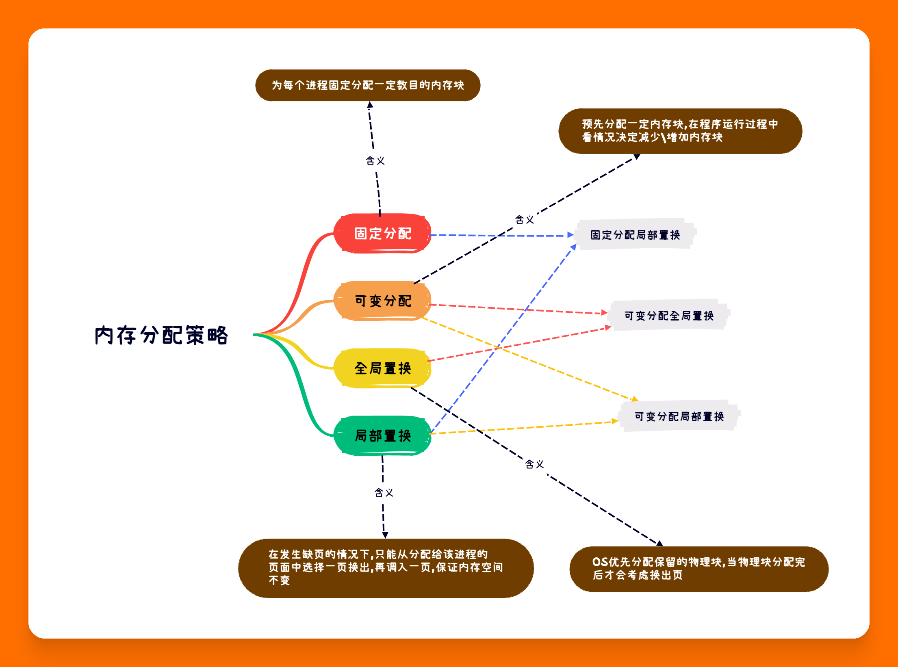

### 页面置换算法

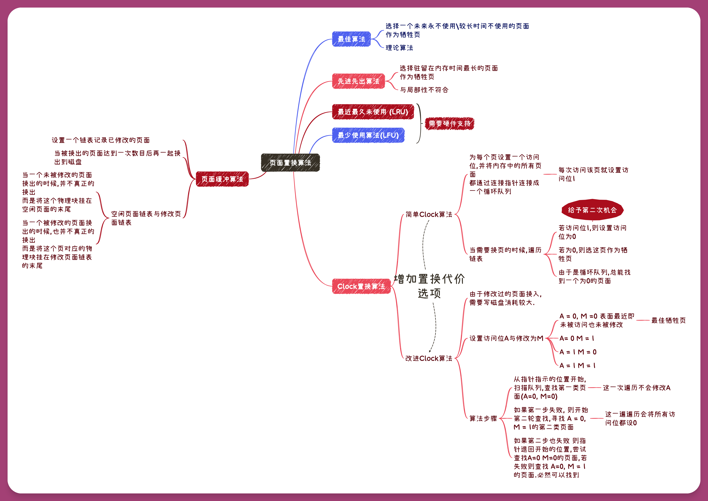

{++Belady现象++} FIFO特有的一种现象,随着分配的物理内存的增大反而导致缺页现象发生的越来越频繁.

### 抖动与工作集

{++抖动++} 刚被换出的页,很快又被调入回内存中

- 根本原因 同时再系统中运行的进程太多,分配给每个进程的物理块太小,导致不能满足进程运行的基本要求,从而导致每个进程频繁的{++缺页++} 
  
{++工作集++} 某段时间间隔内进程实际要访问页面的集合

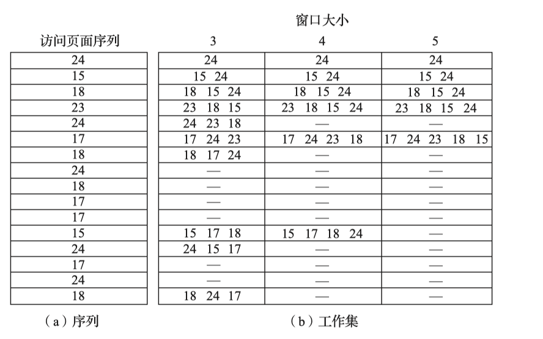

{++解决抖动的办法++}

- 采用局部置换侧率
- 把工作算法融合处理机调度
- 利用 $L=S$ 准则调节缺页率
- 选择暂停的进程

### 内存映射文件(Memory-Mapped Files)

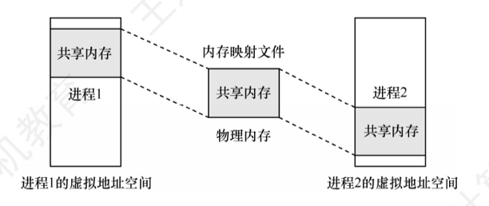

{++内存映射文件++} 操作系统相应用程序提供的一个{++系统调用++},在磁盘文件与进程的虚拟空间之间建立映射关系.

- 将一个文件当做内存中的大数组使用,而不通过文件 I\O 操作来实现
- 使程序员编程更简单
- 方便多个进程共享同一个磁盘文件

## 存储系统一图流

{++不含具体地址转换的一图流++} 

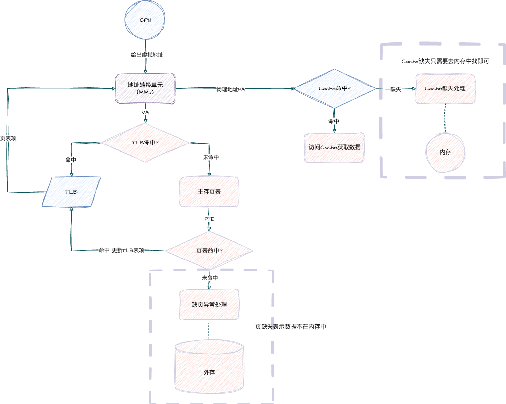
