# 文件系统

## 文件管理

{++数据项,记录,文件++}文件系统的三级结构

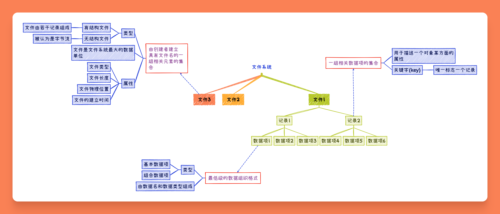

^^文件名与文件类型^^

- 文件名 与 拓展名
- 常见的无结构文件有 {++源程序,可执行文件,库函数++}

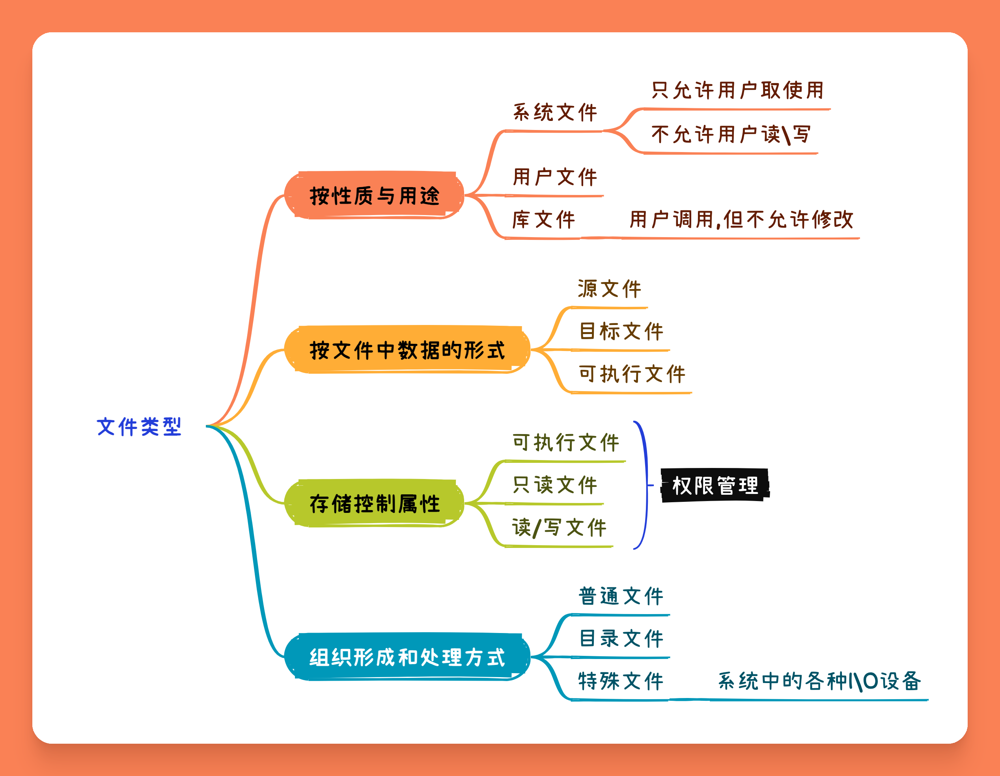

^^文件系统的层次结构^^

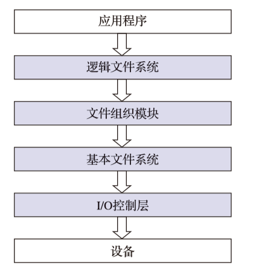

- I\O 控制层 由磁盘驱动程序等组成
- 基本文件系统 用于实现内存和磁盘之间的数据块交换
- 文件组织模块(基本I/O管理程序) 
- 逻辑文件系统 用于记录与处理同文件相关的操作

{++文件的操作++} 重点是 {++打开\关闭++} 操作

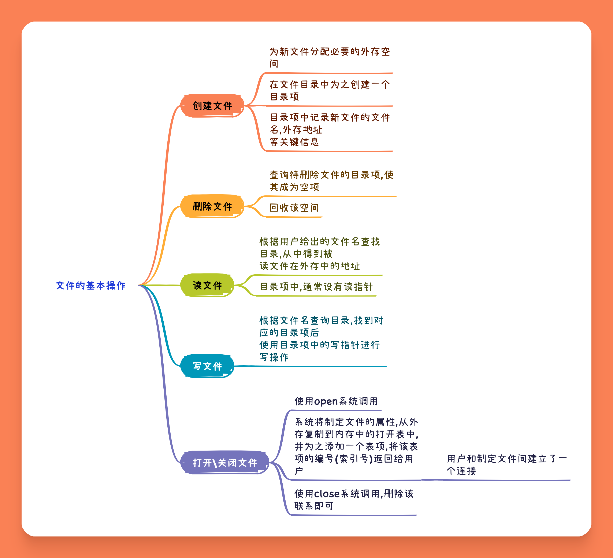

### 文件的逻辑结构

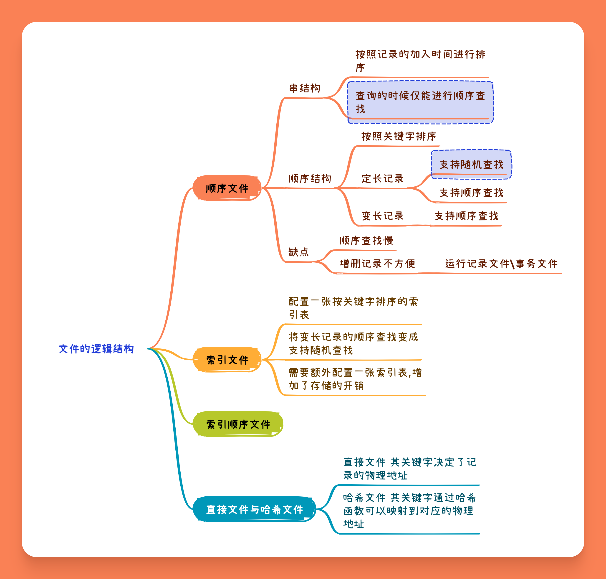

^^ 顺序文件 ^^ 

- 隐式寻址方式 通过读\写指针查询对应的记录

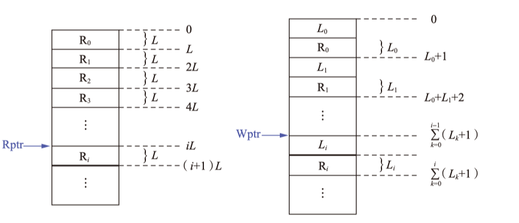

- 显示寻址方式 定长记录可以通过记录的下标直接计算出起始地址(类比于数组的随机访问);但变长记录则无法做到

^^ 索引文件 ^^

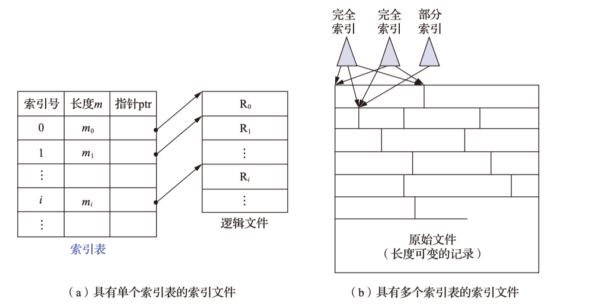

- 为 {++所有关键字++} 建立一张索引表(这张表本身是定长记录的顺序文件),此时可以通过定长记录的随机查找快速查找对应记录的首地址

{++索引顺序文件++} 索引文件+顺序文件

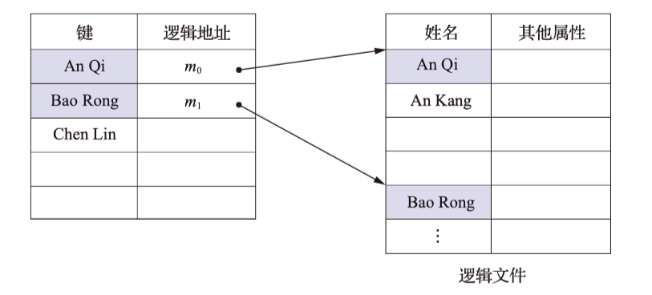

- 将边长记录顺序文件的所有记录分为若干组,为文件建立一张索引表,为每组的第一个记录建立一个索引项,包含指向该记录的指针.
- 平均查找次数为 $\sqrt{n}$ 
- 具体理论见DS-分块查找
- 可以建立多级索引来降低查找次数(类比于多级页表)

### 文件物理结构

### 文件目录

{++文件控制块(FCB)++} 为文件设置用于描述和控制文件的{++数据结构++},文件与FCB {++一一对应++}. FCB的有序集合被称为 ^^文件目录^^, 一个FCB即是一个文件目录项.一个文件目录也是一个文件即 ^^目录文件^^.

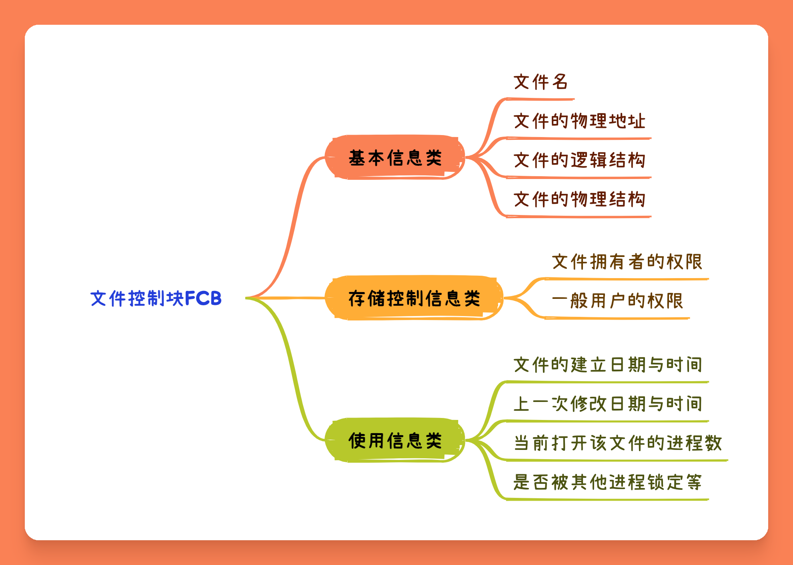

{++索引节点(iNode)++} 对文件目录的一种简化

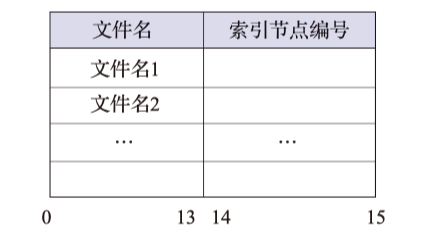

- 文件目录项仅包含文件名与指向索引结点的编号
- 查询的时候仅需将由iNode组成的文件目录载入内存即可

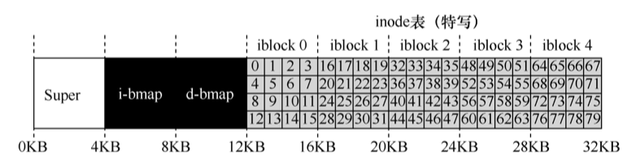

### 文件共享与保护
## 磁盘存储管理