# 文件系统

## 文件管理

{++数据项,记录,文件++}文件系统的三级结构

^^文件名与文件类型^^

- 文件名 与 拓展名
- 常见的无结构文件有 {++源程序,可执行文件,库函数++}

^^文件系统的层次结构^^

- I\O 控制层 由磁盘驱动程序等组成
- 基本文件系统 用于实现内存和磁盘之间的数据块交换
- 文件组织模块(基本I/O管理程序) 
- 逻辑文件系统 用于记录与处理同文件相关的操作

{++文件的操作++} 重点是 {++打开\关闭++} 操作

### 文件的逻辑结构

^^顺序文件^^ 

- 隐式寻址方式 通过读\写指针查询对应的记录

- 显示寻址方式 定长记录可以通过记录的下标直接计算出起始地址(类比于数组的随机访问);但变长记录则无法做到

^^索引文件^^

- 为 {++所有关键字++} 建立一张索引表(这张表本身是定长记录的顺序文件),此时可以通过定长记录的随机查找快速查找对应记录的首地址

{++索引顺序文件++} 索引文件+顺序文件

- 将边长记录顺序文件的所有记录分为若干组,为文件建立一张索引表,为每组的第一个记录建立一个索引项,包含指向该记录的指针.
- 平均查找次数为 $\sqrt{n}$ 
- 具体理论见DS-分块查找
- 可以建立多级索引来降低查找次数(类比于多级页表)

### 文件物理结构

文件物理结构是对磁盘空间的组织方式

{++连续组织方式++}

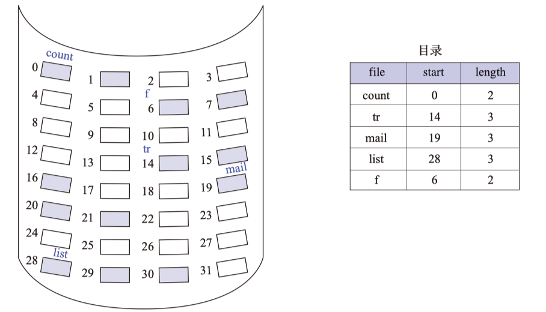

- 在连续组织方式的文件目录项中,应该设置物理起始地址域总长度
- 需要为每一个文件分配{++连续++}空间的磁盘,此容量有时候并非总能得到满足;且不适合动态增长(需要整体移动)
- 会产生 ^^外部碎片^^ 

{++隐式链接组织方式++}

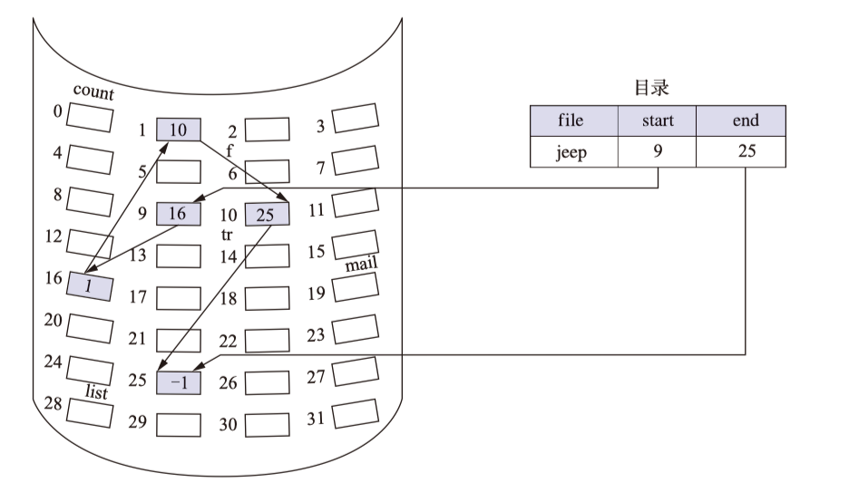

- 在文件目录中应该设置物理块的起始地址和终止地址,每个块中包含指向下一个块的指针
- 可以分配多个不连续的盘块,消除了外部碎片
- 只能顺序访问 

{++簇++} 一组磁盘盘块

{++显示链接组织方式++} 引入FAT(文件分配表)来保持盘块间的指针

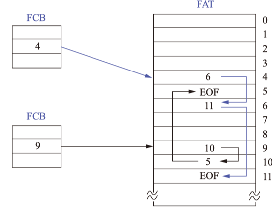

- 在以簇为单位的FAT文件系统中, 簇成为了分配单位

{++索引组织方法++}

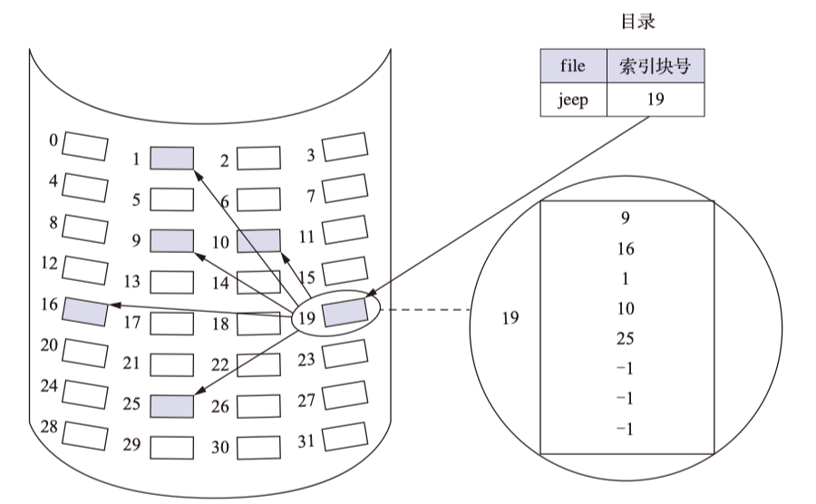

- 在文件目录中,仅记录索引块号,索引块中存放对应盘块的盘块号
- 支持直接存却
- 相较于FAT系统, 无须将大FAT表调入内存, 只需要将索引块加入内存即可
- 不会产生外部碎片

{++多级索引组织方式++}

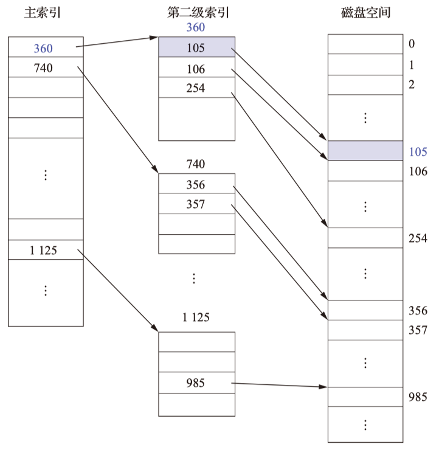

{++Unix 混合索引方式++}

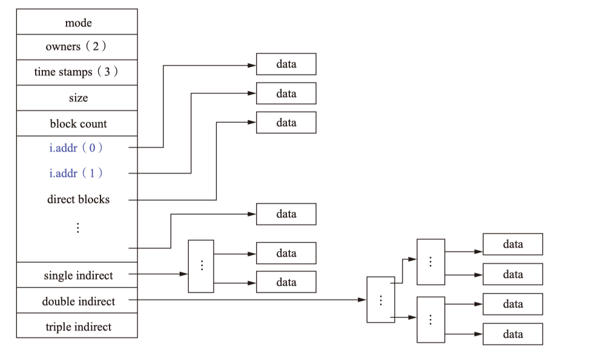

- 将索引区划分为直接索引\一级间接索引\二级间接索引等等 
- 可以很好的配合不同大小的作业要求

{++空闲区表示法和空闲链表++}

- 空闲区表示法,将连续空闲的空闲盘块分配一个表项,其中记录第一个空闲盘块号和空闲盘块数目
- 起始盘号按递增的次序排列
- 其分配和回收操作与动态分区基本一致
- 通常{++对换空间++}采取连续组织方式

{++位示图表示法++}

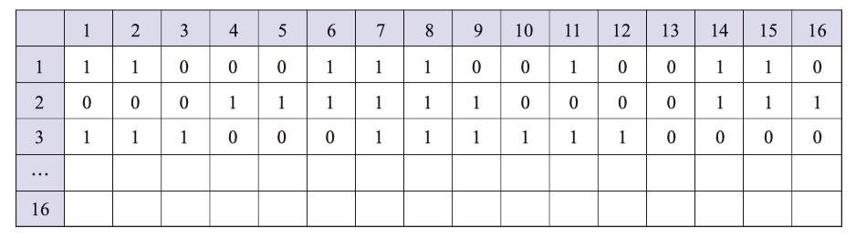

- 通过将某一个盘块的没一个比特位作为某一个盘块是否使用的标志
- 例如 [2, 3] 位置的 1 表示序号为16 * 2 + 3 = 35的盘块已被使用
    - 将二维矩阵映射为一维数据 $b = n \times (i - 1) + j$

!!! note "磁盘物理地址(盘块号)与逻辑地址的转换(三维地址)"

{++成组链接法++}

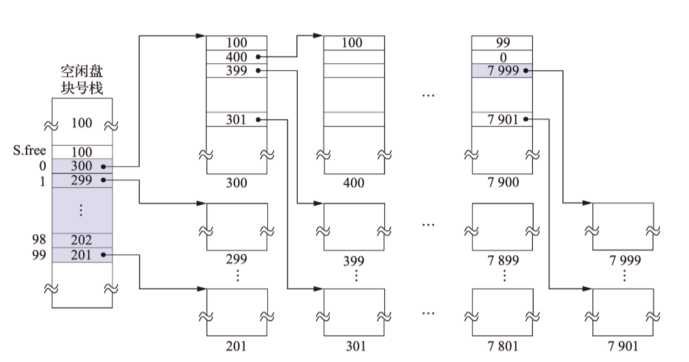

- 栈指针S.free()执向存有当前空白盘块栈含有的空闲盘块的总数
    - 除最后一个空闲盘块栈,{++其包含的空闲盘块要减1++},用0表示结束不是真实的空闲盘块
- S.free() - 1 指向下一个空闲盘块号栈的首盘块号
    - 若为0则表示这是最后一个空闲盘块栈
### 文件目录

{++文件控制块(FCB)++} 为文件设置用于描述和控制文件的{++数据结构++},文件与FCB {++一一对应++}. FCB的有序集合被称为 ^^文件目录^^, 一个FCB即是一个文件目录项.一个文件目录也是一个文件即 ^^目录文件^^.

{++索引节点(iNode)++} 对文件目录的一种简化

- 文件目录项仅包含文件名与指向索引结点的编号
- 查询的时候仅需将由iNode组成的文件目录载入内存即可

^^单级文件目录和两级文件目录^^

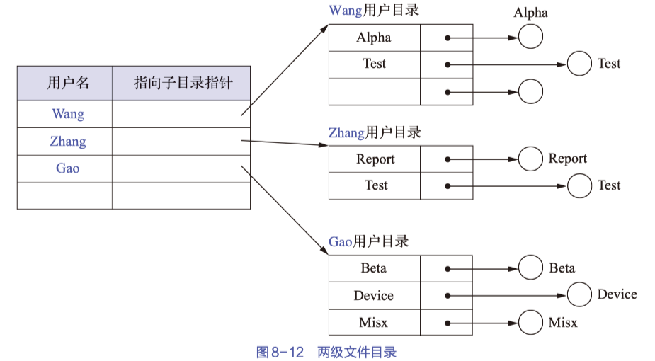

- 单级目录的缺点在于文件名不允许重复,且查找速度较慢,不便于实现用户文件的共享
- 二级目录能在一定程度上改善单级目录的缺陷,但同样不便于实现用户文件的共享

{++树形目录++} 

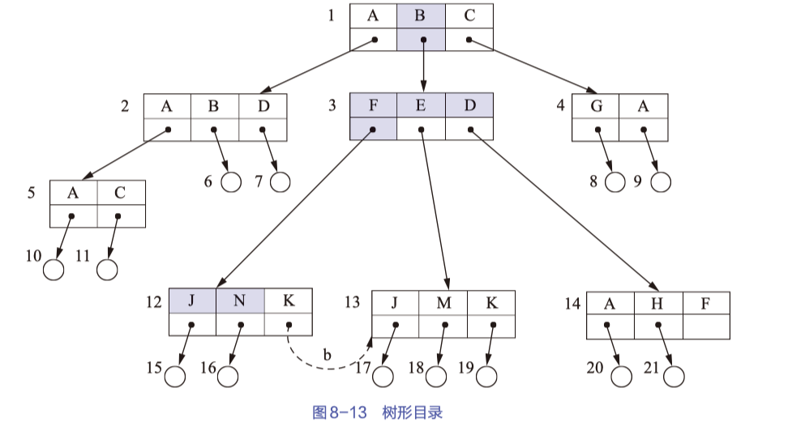

- 从根目录到目的文件的FCB的路径称为绝对路径
- 从当前目录到目的文件的FCB的路径称为相对路径
- 树形目录删除一个目录需要注意
    - 若目录下的不含其他目录和文件,则直接删除
    - 否则, 要么{++递归++}的删除其下的所有文件与目录;要么 {++同时++} 删除所有子目录与文件.

{++无环有向图目录++} 对树形目录的自然拓展,便于文件共享.

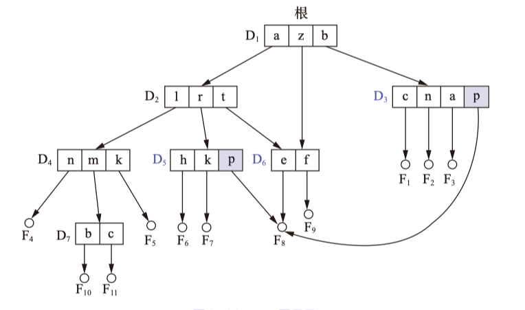

### 文件共享与保护

{++硬链接++} 利用索引节点解决共享问题

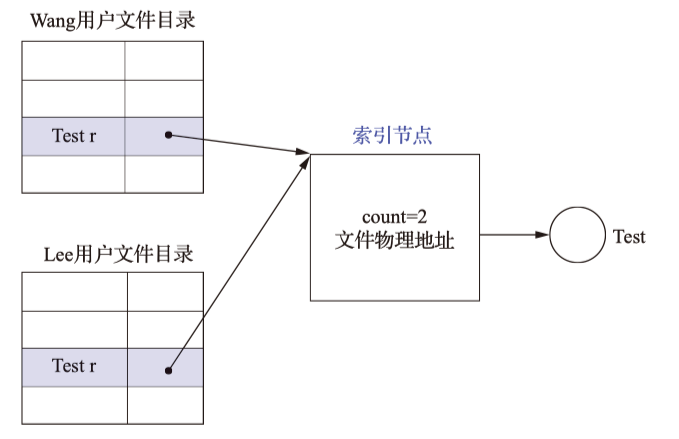

- count 表示当前有多少个目录共享该文件
- 当count != 0 的时候不可以对共享文件进行删除,会导致空指针问题,必须等待所有共享该文件的目录释放了这个链接才可以.

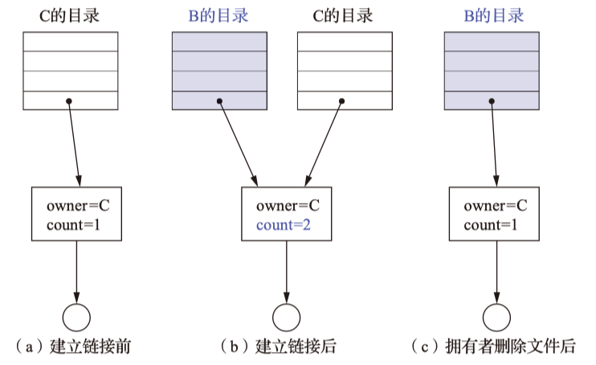

{++符号连接(软连接)++} 本质是从当前目录出发到目的地址路径的别名

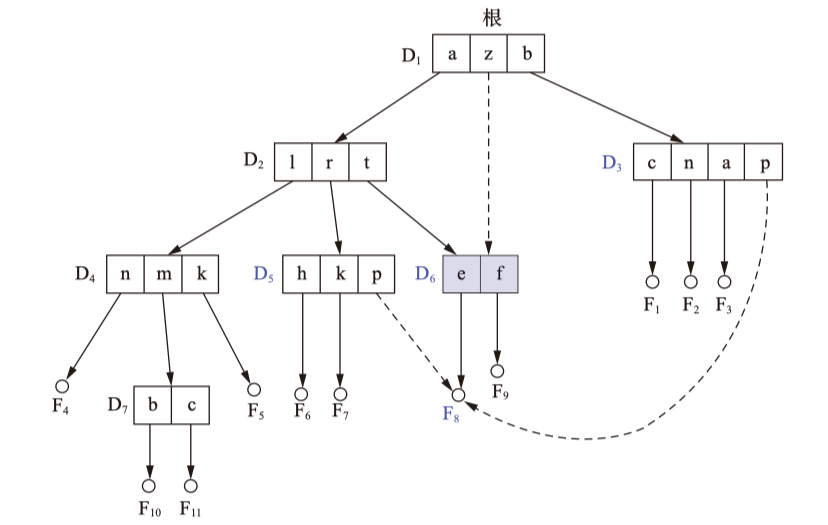

- 只有文件的拥有者才拥有为指向其索引节点的指针
- 其他共享该文件的目录,都是通过OS查询相对路径后对该文件间接操作的
- 系统会为软连接创建 {++LINK类型文件++}, 该文件也需要配置索引节点

{++访问权++} 进程对某对象的进行操作,通常包括读\写\打开\删除等等

{++保护域(域)++} 进程对一组对象的访问权的集合

- 进程保护域可以使静态的,在运行区间都不能发现改变
- 也可以是动态的,在运行直接能在不同域间进行切换 

## 虚拟文件系统与文件系统挂载

{++虚拟文件系统++} 屏蔽不同文件系统的差异与操作细节,向上为用户提供了文件操作的统一接口,当用户访问文件的时候,通过VFS提供的统一调用函数来操作不同文件系统的文件.

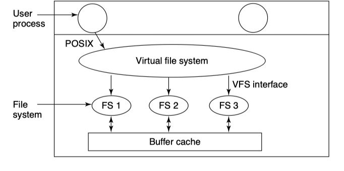

{++文件系统的挂在(mounting)++} 文件系统在使用前都{++需要先进行挂载++},将设备的文件系统挂载到某个目录后,就可以通过这个目录来访问设备(逻辑设备)上的文件.

## Linux文件系统举例

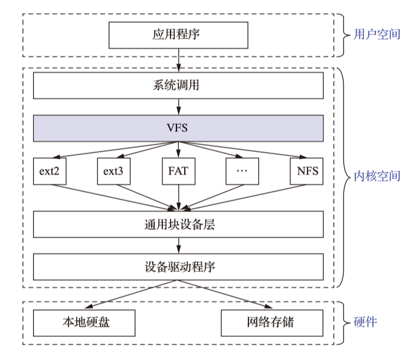

Linux默认支持虚拟文件系统,通过{++系统调用++}实现应用程序与内核中不同文件系统的交互

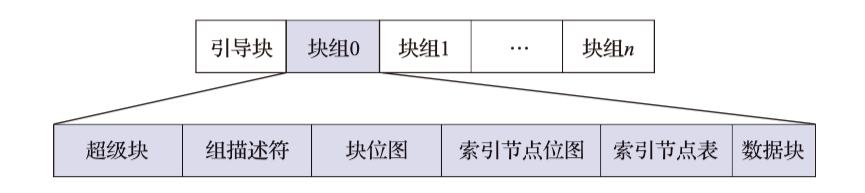

- 文件系统最前面有一个{++启动扇区++},这个启动扇区安装引导装载程序
    - 便于挂载
    - 不用去覆盖硬盘的主引导记录(MBR)扇区
- 超级块 记录整个文件系统的信息
- 组描述符 描述每个组块的开始和结束的数据块号
- 块位图 数据位示图
- 索引节点位图(iNode bitmap) 表示索引节点是否被使用
- 索引节点表(iNode table) 内个文件仅占用一个索引节点,文件系统能创建的文件数量与索引节点有关
- 数据块 ext2仅支持 1KB, 2KB, 4KB三种,每个数据块中{++仅能放一个文件的数据++}