# 输入输出管理

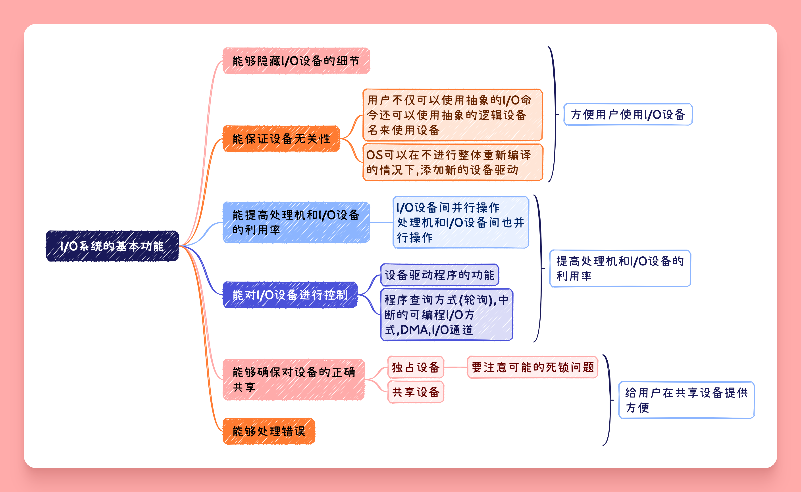

## I/O系统的层次结构

I/O系统通常分成两步 I/O软件与I/O设备(硬件),通常将I/O{++软件++}分成如下四个部分

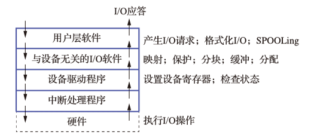

- 用户层软件 用于提供与用户的接口,用户可以直接调用该层提供的与I/O有关的库函数直接对设备进行操作
- 与设计无关的I/O软件  用于实现用户程序与设备驱动程序的{++统一接口++},{++设备命名++},{++设备保护++}以及{++设备的分配与释放++}.同时为设备的管理与数据的传输提供必要的存储空间
- 设备驱动程序 与{++硬件直接相关++}直接执行系统对I/O设备发出的操作指令
- 中断处理程序 与中断相关的部分

{++I/O系统的模型++}

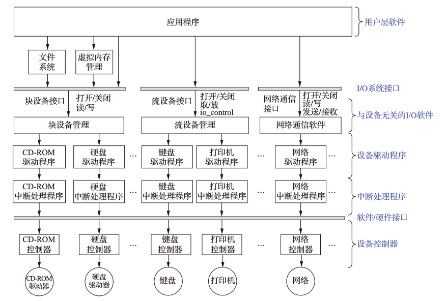

{++I/O系统的上/下接口++}

- {++上接口++} I/O系统接口, 是I/O系统与上层系统之间的接口,向上层系统提供对设备进行操作的I/O命令
    - 块设备结口 
        - 块设备 数据的存储和传输都是以数据块为单位的设备,可以寻址
        - 隐藏磁盘的二维结构
        - 将抽象命令映射为低层操作
    - 流设备结口(字符设备接口)
        - 字符设备 数据的存储和传输以字符(字节)为单位的设备,不可寻址
        - get操作和put操作 
    - 网络通信接口 

## 设备驱动程序

{++设备驱动程序++} 设备处理程序,是I/O系统的上层与设备控制器之间的通信程序,主要任务为{++接受上层软件发来的抽象I/O要求,并转换为具体要求后转发给设备控制器++}

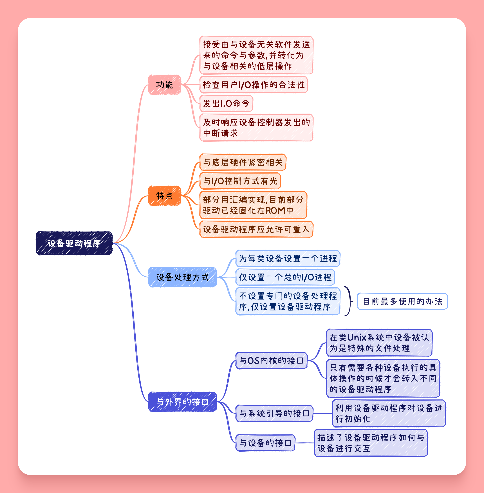

## 设备独立软件(与设备无关软件)

### 设备的分配与回收

系统为每个设备配置一张{++设备控制表(DCT)++} 用于记录设备的情况

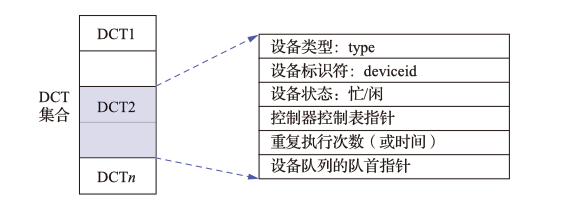

- 设备队列的对首指针 凡因请求该设备而未得到满足的{++进程++}都应将其PCB按照一定的策略排成一个设备请求队列
    - 仅有当前设备状态为空闲,且该请求队列为空的时候可以进行设备回收
- 重复执行次数 当设备输出传输发生错误的时候,应重复执行的最大次数,若在该次数能能恢复则认为传送成功否则认为失败

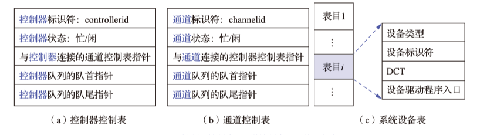

- {++控制器控制表 COCT++} 为每个控制配置的用于记录控制器情况
- {++通道控制表 CHCT++} 为每个I/O通道设置的通道控制表
- {++系统设备表 SDT++} 记录了全部设备的情况,每个设备占有一个表项,其中包括设备类型,设备标识符,DCT以及{++设备驱动程序入口++}等内容

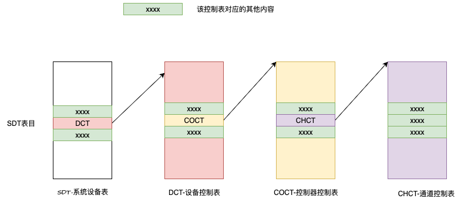

^^设备分配的影响因素^^

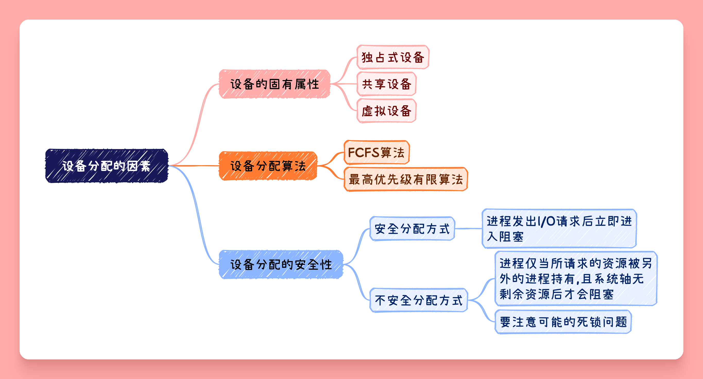

^^独占设备的分配流程^^

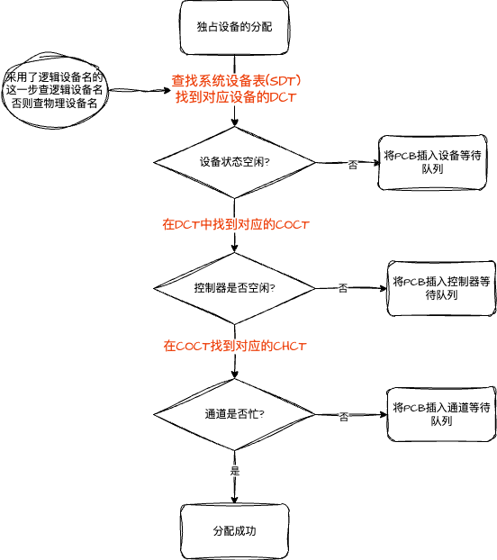

### 假脱机技术(SPOOLing技术)

{++假脱机技术++} 将一台物理I/O设备虚拟成多台逻辑I/O设备,允许多个用户共享一台物理设备.

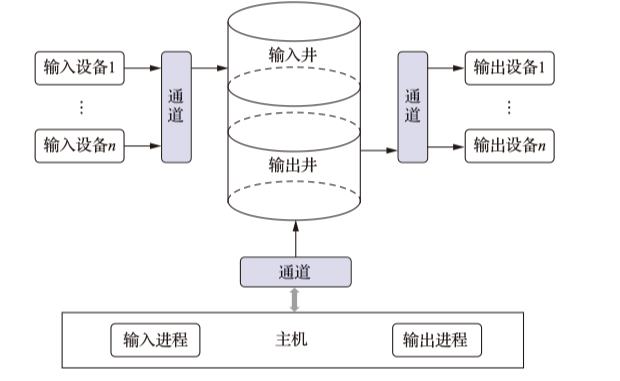

- 输入/输出井 在{++磁盘上++}开辟出的两个存储区域
    - 输入井模拟脱机输入时的磁盘,用于收容I/O设备的输入数据
    - 输出井模拟脱机输入时候的磁盘,用于收容用于程序的输出
    - 其中的数据通常以{++文件++}的形式组织管理,被称为井文件
- 输入/输出缓冲区 在{++内存++}开辟的两个缓冲区
    - 用于缓和{++CPU++}和{++磁盘++}间的速度不匹配问题
    - 输入缓冲区,暂存从输入设备传送而来的数据,之后再将其传入输入井
    - 输出缓冲区,暂存从输出井而来的数据,之后再将其送入输出设备
- 输入\输出进程 
- 井管理程序

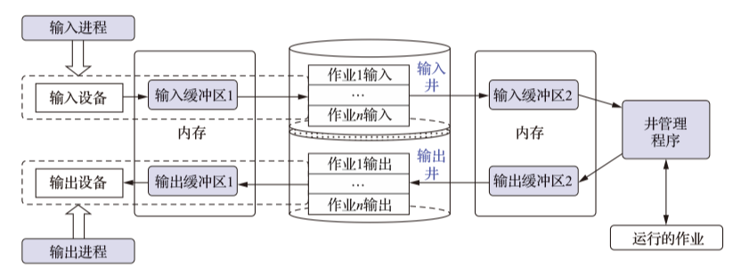

^^SPOOLing的特点^^ 

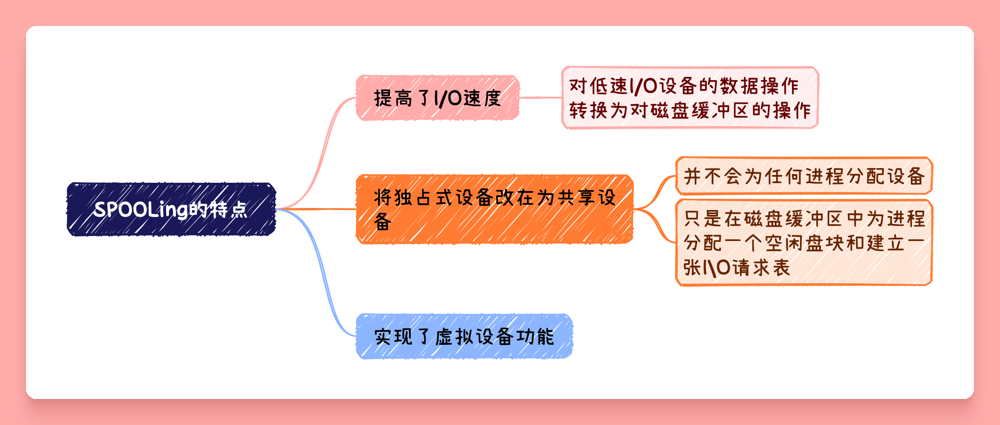

{++假脱机打印机系统++} 

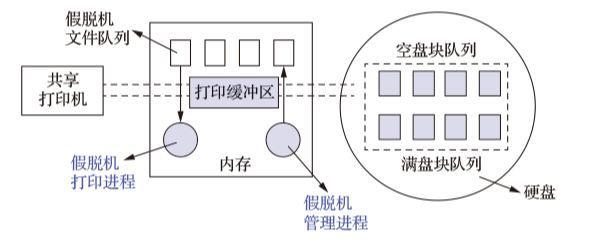

{++打印流程++}

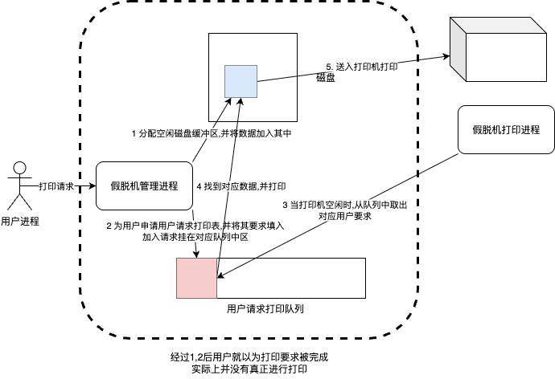

{++守护进程++} 将原本的假脱机管理进程的部分功能交给一个守护进程,其余部分由用户程序自己实现. {++守护进程++}是唯一运行使用打印机的进程,其余用户进程必须通过将打印一份打印要求的文件放在假脱机文件队列后,尝试唤醒守护进程,由守护进程代替用户进程执行打印过程.

### (内存)缓冲区管理

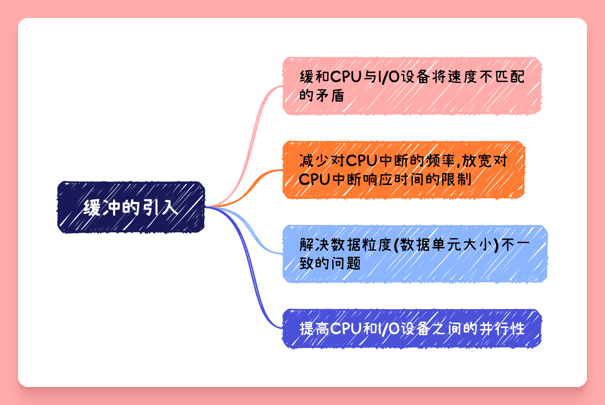

{++单缓冲区++} 用户进程发出I/O请求时就会在内存中为其申请一份缓冲区

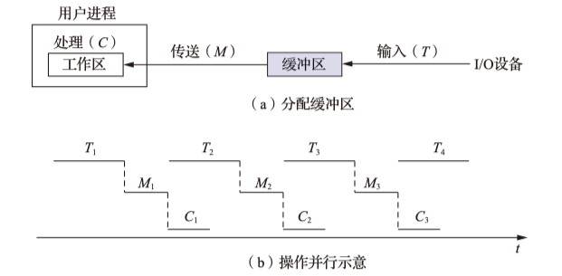

- 由于计算操作(C)和输入操作(T)可以并行,系统对于每块数据的处理时间为 $\max{\{C,T\}}+M$

{++双缓冲区(缓冲对换)++} 

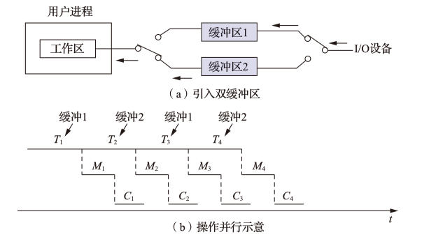

- 若不作为双机通信缓冲区使用,这设备输入数据时候优先填满某一缓冲区,OS也优先从该缓冲区内取数据;当该缓冲区被填满后才往第二个缓冲区内填充数据
- 缓冲区2相当于缓冲区1的缓冲区
- 作为双机通信的时候,两个缓冲区分别作为对话主机的输入\输出缓冲区使用

{++环形缓冲区++}

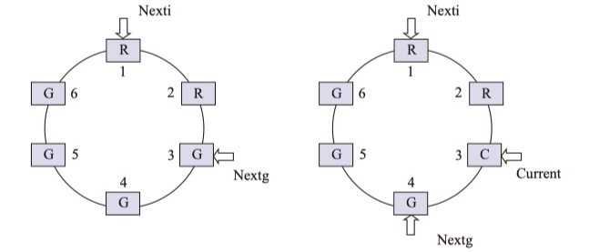

- 具有多个缓冲区
- 具有三个指针
    - Next_g 指向计算进程下次可以使用的缓冲区
    - Next_i 指向输入进程下次可以使用空白缓冲区
    - Current 执行当前计算机进程正在使用的缓冲区
- 可能的同步问题
    - 系统受计算限制 Next_i指针赶上Next_g指针,表明计算进程速度太慢
    - 系统受I/O限制 Next_g指针赶上Next_i指针,表明系统输入太慢

{++缓冲池++} 包含一个用于管理自身的数据结构和一组操作函数的{++管理机制++},用于管理多个缓冲区

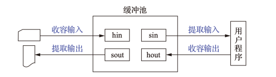

- 组成 {++空白缓冲队列++} {++输入队列++} {++输出队列++}
- Getbuf过程和Putbuf过程
    - 普通的队列操作不能满足缓冲池的要求
    - 必须满足同步与互斥的要求
    - 通过信号量机制来实现
- 工作方式
    - 收容输入
    - 提取输入
    - 收容输出
    - 提取输出

## 外存管理

### 磁盘

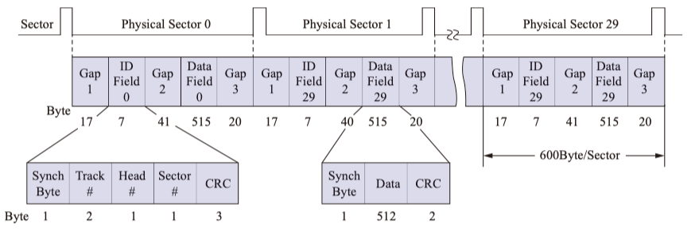

{++低级格式化++} 为了让磁盘能存储数据,必须对磁盘进行低级格式化

{++分区++} 格式化完成后一般还要对磁盘进行分区,在逻辑上每个分区就是一个独立的逻辑磁盘.每个分区的大小和起始扇区都放在{++磁盘0号扇区++}的主引导记录所包含的分区表中.

{++高级格式化++} 设置一个引导块,空闲存储管理,根目录和一个空文件系统,同时在分区表中标记该分区所使用的文件系统

- 由于格式化的存在磁盘的实际容量通常小于理论计算的容量

{++磁盘调度算法++}

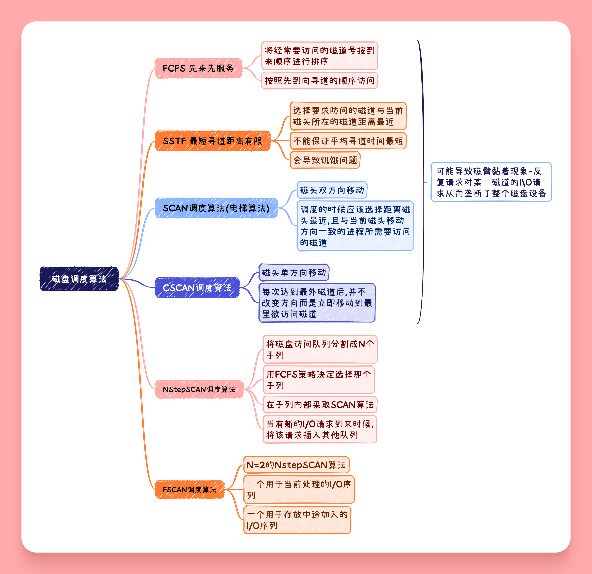

