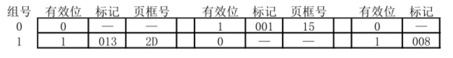

# 操作系统
## 2009年统考真题
请求分页管理系统中，假设某进程的页表内容如下表所示。

| 页号 | 页框 (Page Frame) 号 | 有效位 (存在位) |
|------|----------------------|------------------|
| 0    | 101H                 | 1                |
| 1    | —                    | 0                |
| 2    | 254H                 | 1                |

页面大小为 4 KB，一次内存的访问时间是 100 ns，一次快表(TLB)的访问时间是 10 ns，处理一次缺页的平均时间为 10⁸ ns（已含更新 TLB 和页表的时间）。进程的驻留集大小固定为 2，采用最近最少使用（LRU）置换算法和局部淘汰策略。假设：  
1. TLB 初始为空；  
2. 地址转换时先访问 TLB，若 TLB 未命中，再访问页表（忽略访问页表后的 TLB 更新时间）；  
3. 有效位为 0 表示页面不在内存，产生缺页中断，缺页中断处理后，返回到产生缺页中断的指令处重新执行。  

设有虚地址访问序列 2362H、1565H、25A5H，请问：

1）依次访问上述三个虚拟地址，各需多少时间？给出计算过程。

2）基于上述访问序列，虚地址 1565H 的物理地址是多少？请说明理由。

------------
三个进程 P1、P2、P3 互斥使用一个包含 N（N>0）个单元的缓冲区。

P1 每次用 produce() 生成一个正整数并用 put() 送入缓冲区某一空单元；

P2 用 getodd() 从该缓冲区中取出一个奇数并用 countodd() 统计奇数个数；

P3 每次用 geteven() 从该缓冲区中取出一个偶数并用 counteven() 统计偶数个数。

请用信号量机制实现这三个进程的同步与互斥活动，并说明所定义的信号量的含义（要求用伪代码描述）。
## 2010年统考真题
计算机系统采用 C-SCAN（循环扫描）磁盘调度策略，使用 2 KB 内存空间记录 16 384 个磁盘块的空闲状态。

1) 请说明在上述条件下如何进行磁盘块空闲状态的管理。

2) 某单面磁盘旋转速度 6 000 r/min，每磁道 100 扇区，相邻磁道平均移动时间 1 ms。磁头初始位于 100 号磁道，方向增大，磁道请求队列：50，90，30，120；每个磁道读 1 个随机扇区。求读完 4 个扇区所需总时间（给出计算过程）。

3) 若将磁盘替换为随机访问 Flash（SSD/U 盘），是否存在比 C-SCAN 更高效的磁盘调度策略？若有，给出策略名称并说明理由；若无，说明理由。


------
逻辑地址空间与物理地址空间均为 64 KB，按字节编址。某进程最多需要 6 页（Page）数据存储空间，页大小 1 KB，系统采用固定分配局部置换，已分配 4 个页框（PageFrame）。装入时刻 260 前的访问情况如下表：

| 页号 | 页框 (Page Frame) 号 | 装入时刻 | 访问位|
|------|----------------------|------------------|-------|
| 0    | 7                    | 130                |1      |
| 1    | 4                    | 230                |1      |
| 2    | 2                    | 200                |1      |
| 3    |9                     | 160                |1      |

当进程执行到时刻 260 时，访问逻辑地址 17CAH 的数据。

1) 求该逻辑地址对应的页号。

2) 若采用先进先出（FIFO）置换算法，求该逻辑地址对应的物理地址（给出计算过程）。

3) 若采用时钟（Clock）置换算法，且当前指针顺时针指向 2 号页框，求该逻辑地址对应的物理地址（给出计算过程）。


## 2011年统考真题
某计算机存储器按字节编址，虚拟地址空间大小为 16 MB，主存地址空间大小为 1 MB，页面大小为 4 KB；Cache 采用直接映射方式，共 8 行；主存与 Cache 之间交换的块大小为 32 B。系统运行到某一时刻，页表部分内容和 Cache 部分内容分别为十六进制形式。请回答：

1) 虚拟地址共几位，哪几位表示虚页号？物理地址共几位，哪几位表示页框号？

2) 使用物理地址访问 Cache 时，物理地址应划分成哪几个字段？说明每位数及位置。


3) 虚拟地址 001C60H 所在页面是否在主存？若在，给出对应的物理地址，并判断是否 Cache 命中，说明理由。

4) 若配置四路组相联 TLB，共 8 项，当前内容如下所示，则虚拟地址 024BACH 所在页面是否在主存？说明理由。



-----
某银行提供 1 个服务窗口和 10 个等待座位。顾客到达时若有空座位则到取号机取号并等待；取号机一次只允许一人使用。营业员空闲时叫号服务。请添加必要的信号量及 P、V（或 wait、signal）操作，实现上述互斥与同步，说明信号量含义并赋初值。

```cpp
{
    process 顾客 i
    {
        从取号机获取一个号码;
        等待叫号;
        获取服务;
    }
    process 营业员
    {
        while(TRUE)
        {
            叫号;
            为客户服务;
        }
    }
}
```
## 2012年统考真题
某请求分页系统页面置换策略：从 0 时刻开始，每 5 个时间单位扫描一次驻留集，未被访问的页框回收并放入空闲链尾，内容不清空。缺页时若该页曾在空闲链中则直接放回驻留集，否则从空闲链头取框。初始空闲页框号依次为 32、15、21、41。进程 P 的访问序列为：<1,1>，<3,2>，<0,4>，<0,6>，<1,11>，<0,13>，<2,14>。请回答：
1) 访问 <0,4> 时的页框号？

2) 访问 <1,11> 时的页框号？说明理由。

3) 访问 <2,14> 时的页框号？说明理由。

4) 该方法是否适合时间局部性好的程序？说明理由。

------
某文件系统最大容量 4 TB，以 1 KB 磁盘块为单位。文件控制块 FCB 含 512 B 索引表区。请回答：
1) 若索引表区仅用直接索引，索引项最少占多少字节？可支持的单个文件最大长度是多少字节？

2) 若索引表区结构：第 0~7 字节为 <起始块号 6 B，块数 2 B> 表示预分配连续空间，其余 504 B 为直接索引，每项 6 B，则单个文件最大长度是多少？为使长度最大，起始块号和块数字节数应如何调整并说明理由。

## 2013年统考真题
某博物馆最多容纳 500 人同时参观，出入口一次仅允许一人通过。请添加信号量及 P、V（或 wait、signal）操作实现互斥与同步，说明信号量含义并赋初值。

```cpp
参观者进程 i:
{
    ...
    进门;
    ...
    参观;
    ...
    出门;
    ...
}
```

----
某计算机主存按字节编址，逻辑地址和物理地址均为 32 位，页表项 4 B。请回答：
1) 若使用一级页表，逻辑地址结构为


页号 20 位、页内偏移 12 位，则页大小是多少？页表最大占多少字节？

2) 若使用二级页表，逻辑地址结构为：

页目录号 10 位、页表索引 10 位、页内偏移 12 位，给出逻辑地址 LA 对应的页目录号和页表索引表达式。

3) 采用 (1) 的分页方式，某代码段起始逻辑地址 00008000H，长度 8 KB，装入物理地址 00900000H 起连续空间，页表连续存放在 00200000H 起，求代码段对应两页表项的物理地址、页框号及代码页面 2 的起始物理地址。


## 2014年统考真题
文件 F 由 200 条记录组成，编号从 1 开始。用户欲将内存中一条记录插入为第 30 条记录。请回答：

1) 若文件系统为连续分配，每块存 1 条记录，文件前后均有足够空闲空间，完成插入最少需访问多少磁盘块？FCB 内容如何变化？
2) 
3) 若文件系统为链接分配，每块存 1 条记录和 1 个链接指针，完成插入需访问多少磁盘块？若每块 1 KB，其中 4 B 存指针，则文件系统支持的文件最大长度是多少？

----
系统中有多个生产者、多个消费者共享容量 1000 的环形缓冲区（初始为空）。缓冲区未满时生产者放入产品，否则等待；未空时消费者取产品，否则等待。要求任一消费者一次连续取 10 件后其他消费者才可取。请用信号量 P、V（或 wait、signal）操作实现同步，说明信号量含义及初值。
## 2015年统考真题
有 A、B 两人通过信箱进行辩论，每个人都从自己的信箱中取得对方的问题，将答案和向对方提出的新问题组成一个邮件放入对方的邮箱中。

假设 A 的信箱最多放 M 个邮件，B 的信箱最多放 N 个邮件。初始时 A 的信箱中有 x 个邮件 (0 < x < M)，B 的信箱中有 y 个邮件 (0 < y < N)。辩论者每取出一个邮件，邮件数减 1。
A 和 B 两人的操作过程描述如下：

```cpp
A{
    while(TRUE) {
        从A的信箱中取出一个邮件;
        回答问题并提出一个新问题;
        将新邮件放入B的信箱;
    }
}

B{
    while(TRUE) {
        从B的信箱中取出一个邮件;
        回答问题并提出一个新问题;
        将新邮件放入A的信箱;
    }
}
```

当信箱不为空时，辩论者才能从信箱中取邮件，否则等待；当信箱不满时，辩论者才能将新邮件放入信箱，否则等待。
请添加必要的信号量和 P、V（或 wait、signal）操作，以实现上述过程的同步。要求写出完整的过程，并说明信号量的含义和初值。


----
某计算机按字节编址，采用二级页表，虚拟地址格式:


请回答：

1) 页及页框大小各多少字节？进程虚拟地址空间共多少页？

2) 页目录项和页表项均占 4 B，则页目录和页表共占多少页？给出计算过程。

3) 若某指令周期访问虚拟地址 01000000H 和 01112048H，地址转换时共访问多少个二级页表？说明理由。
## 2016年统考真题
某计算机采用页式虚拟存储管理方式，按字节编址，虚拟地址为32位，物理地址为24位，页大小为8KB；TLB采用全相联映射；Cache数据区大小为64KB，按2路组相联方式组织，主存块大小为64B。存储访问过程的示意图如下。


1) 图中字段A~G的位数各是多少？TLB标记字段B中存放的是什么信息？

2) 将块号为4099的主存块装入到Cache中时，所映射的Cache组号是多少？对应的H字段内容是什么？

3) Cache缺失处理的时间开销大还是缺页处理的时间开销大？为什么？

4) 为什么Cache可以采用直写(WriteThrough)策略，而修改页面内容时总是采用回写(WriteBack)策略？

-----
某进程调度程序采用基于优先数(priority)的调度策略，即选择优先数最小的进程运行，进程创建时由用户指定一个nice作为静态优先数。为了动态调整优先数，引入运行时间cpuTime和等待时间waitTime，初值均为0。进程处于执行态时，cpuTime定时加1，且waitTime置0；进程处于就绪态时，cpuTime置0，waitTime定时加1。

1) 若调度程序只将nice的值作为进程的优先数，即priority=nice，则可能会出现饥饿现象，为什么？

2) 使用nice、cpuTime和waitTime设计一种动态优先数计算方法，以避免产生饥饿现象，并说明waitTime的作用。

## 2017年统考真题
Q1 已知 $f(n)=\sum_{i=0}^{n}2^{i}=2^{n+1}-1=11\cdots\cdots1B$，计算 $f(n)$ 的 C 语言函数 $f1$ 如下:

```c
int fl(unsigned n) {
    int sum = 1, power = 1;
    for (unsigned i = 0; i <= n - 1; i++)
        power *= 2;
    sum += power;
    return sum;
}
```

将 $fl$ 中的 $int$ 都改为 $float$，可得到计算 $f(n)$ 的另一个函数 $f2$。假设 $unsigned$ 和 $int$ 型数据都占 32 位，$float$ 采用 IEEE 754 单精度标准。回答下列问题。

1) 当 $n = 0$ 时，$fl$ 会出现死循环，为什么? 若将 $fl$ 中的变量 $i$ 和 $n$ 都定义为 $int$ 型，则 $fl$ 是否还会出现死循环? 为什么?

2) $fl(23)$ 和 $f2(23)$ 的返回值是否相等? 机器数各是什么(用十六进制表示)?

3) $fl(24)$ 和 $f2(24)$ 的返回值分别为 33554431 和 33554432.0，为什么不相等?

4) $f(31)=2^{32}-1$ 而 $fl(31)$ 的返回值却为 -1，为什么? 若使 $fl(n)$ 的返回值与 $f(n)$ 相等，则最大的 $n$ 是多少?

5) $f2(127)$ 的机器数为 7F800000H，对应的值是什么? 若使 $f2(n)$ 的结果不溢出，则最大的 $n$ 是多少? 若使 $f2(n)$ 的结果精确(无舍入)，则最大的 $n$ 是多少?

-----
Q2 在按字节编址的计算机 $M$ 上，题 43 中 $f1$ 的部分源程序(阴影部分)与对应的机器级代码(包括指令的虚拟地址)如下图所示。

其中，机器级代码行包括行号、虚拟地址、机器指令和汇编指令。请回答下列问题。

1) 计算机 $M$ 是 RISC 还是 CISC? 为什么?

2) $f1$ 的机器指令代码共占多少字节? 要求给出计算过程。

3) 第 20 条指令 $cmp$ 通过 $i$ 减 $n - 1$ 实现对 $i$ 和 $n - 1$ 的比较。执行 $f1(0)$ 过程中，当 $i = 0$ 时，$cmp$ 指令执行后，进/借位标志 $CF$ 的内容是什么? 要求给出计算过程。

4) 第 23 条指令 $shl$ 通过左移操作实现了 $power * 2$ 运算，在 $f2$ 中能否也用 $shl$ 指令实现 $power * 2$? 为什么?

----
某计算机采用二级分页虚拟存储管理方式，虚拟地址格式如下：


针对第一题中的函数f1和第二题中的机器指令代码,回答如下问题

1) 函数f1的机器指令代码占多少页？

2) 取第1条指令(push ebp)时，若进行地址变换过程中需要访问内存中的页目录和页表，则会分别访问它们各自的第几个表项？

3) 该机的I/O采用中断控制方式。若进程P在调用f1之前通过scanf()获取n的值，则在执行scanf()的过程中，进程P的状态会如何变化？CPU是否会进入内核态

----
某进程中有3个并发执行的线程thread1、thread2和thread3，其伪代码如下所示。请添加必要的信号量和P、V（或wait、signal）操作，确保线程互斥访问临界资源，并且最大限度地并发执行。


## 2018年统考真题
某计算机采用页式虚拟存储管理方式，按字节编址。CPU 进行存储访问的过程如题 44 图所示。根据下图回答下列问题。

1) 主存物理地址占多少位?

2) TLB 采用什么映射方式?TLB 是用 SRAM 还是用 DRAM 实现

3) Cache 采用什么映射方式?若 Cache 采用 LRU 替换算法和回写(Write Back)策略，则 Cache 每行中除数据(Data)、Tag 和有效位外，还应有哪些附加位? Cache 的总容量是多少? Cache 中有效位的作用是什么?

4) 若 CPU 给出的虚拟地址为 0008C040H，则对应的物理地址是多少?是否在 Cache 中命中?说明理由。若 CPU 给出的虚拟地址为 0007C260H，则该地址所在主存块映射到的 Cache 组号是多少?请结合图片内容


----

根据上题给出的虚拟存储管理方式,回答下列问题

1) 某虚拟地址对应的页目录号为6，在相应页表中页号为6，页内偏移量为8，该虚拟地址的十六进制表示是什么？

2) 寄存器PDBR用于保存当前进程的页目录起始地址，该地址是物理地址还是虚拟地址？进程切换时，PDBR的内容是否会变化？说明理由。同一进程的线程切换时，PDBR的内容是否会变化？说明理由。

3) 为支持改进型CLOCK置换算法，页表项中需设置哪些字段？

-----
某文件系统采用索引节点存放文件属性和地址信息，簇大小为4KB。每个文件索引节点占64B，有11个地址项，其中直接地址项8个，一级、二级和三级间接地址项各1个，每个地址项长度为4B。

1) 该文件系统能支持的最大文件长度是多少？（给出计算表达式即可）

2) 文件系统用1 M(=2^20)个簇存放文件索引节点，用512 M个簇存放文件数据。若一个图像文件大小为5600 B，则该文件系统最多能存放多少个图像文件？

3) 若文件F1大小为6 KB，文件F2大小为40 KB，则获取F1和F2最后一个簇的簇号所需时间是否相同？为什么？
## 2019年统考真题
有n(n≥3)位哲学家围坐在圆桌边，每位哲学家交替就餐和思考。圆桌中心有m(m≥1)个碗，每两位哲学家之间有一根筷子。每位哲学家必须取到一个碗和左右两侧筷子后才能就餐，进餐完毕将碗和筷子放回原位并继续思考。为使尽可能多的哲学家同时就餐且防止死锁，请使用信号量的P、V操作描述互斥与同步，并说明所用信号量及初值含义

-----
某计算机系统磁盘有300个柱面，每柱面10个磁道，每磁道200个扇区，扇区大小512 B。文件系统每簇含2个扇区。

1) 磁盘容量是多少？

2) 磁头当前位于85号柱面，收到4个访问请求，簇号分别为100260、60005、101660、110560。若采用最短寻道时间优先(SSTF)算法，访问簇的先后次序是什么？

3) 第100530簇在磁盘上的物理地址是什么？将簇号转换成物理地址的过程由I/O系统的什么程序完成？

## 2020年统考真题
现有5个操作A、B、C、D和E，操作C必须在A和B完成后执行，操作E必须在C和D完成后执行。请使用信号量的wait、signal操作描述上述操作之间同步关系，并说明所用信号量及其初值

---

某32位系统采用基于二级页表的请求分页存储管理方式，按字节编址，页目录项和页表项长度均为4字节，虚拟地址结构如下：


某C程序中数组 $A[1024][1024]$ 的起始虚拟地址为10800000H，元素占4字节，运行时进程页目录起始物理地址为00201000H。

1) 数组元素a1的虚拟地址是什么？对应的页目录号和页号分别是什么？对应的页目录项物理地址是什么？若该目录项页框号为00301H，则a1所在页对应的页表项物理地址是什么？

2) 数组a在虚拟地址空间中所占区域是否必须连续？在物理地址空间中所占区域是否必须连续？

3) 已知数组a按行优先存放，若对数组a分别按行遍历和按列遍历，哪一种遍历方式的局部性更好
## 2021年统考真题
下表给出了整型信号量S的wait()和signal()操作的功能描述，以及采用开/关中断指令实现信号量操作互斥的两种方法。


请回答下列问题：

1) 为什么在wait()和signal()操作中对信号量S的访问必须互斥执行？

2) 分别说明方法1和方法2是否正确。若不正确，请说明理由。

3) 用户程序能否使用开/关中断指令实现临界区互斥？为什么？

-----
某计算机用硬盘作为启动盘，硬盘第一个扇区存放主引导记录，其中包含磁盘引导程序和分区表。磁盘引导程序用于选择要引导哪个分区的操作系统，分区表记录硬盘上各分区的位置等描述信息。硬盘被划分成若干个分区，每个分区的第一个扇区存放分区引导程序，用于引导该分区中的操作系统。系统采用多阶段引导方式，除了执行磁盘引导程序和分区引导程序外，还需要执行ROM中的引导程序。请回答下列问题：

1) 系统启动过程中操作系统的初始化程序、分区引导程序、ROM中的引导程序、磁盘引导程序的执行顺序是什么？

2) 把硬盘制作为启动盘时，需要完成操作系统的安装、磁盘的物理格式化、逻辑格式化、对磁盘进行分区，执行这4个操作的正确顺序是什么？

3) 磁盘扇区的划分和文件系统根目录的建立分别是在第(2)问的哪个操作中完成的？

## 2022年统考真题
某文件系统的磁盘块大小为4KB，目录项由文件名和索引结点号构成，每个索引结点占256字节，其中包含直接地址项10个，一级、二级和三级间接地址项各1个，每个地址项占4字节。该文件系统中子目录stu的结构如题图所示，stu包含子目录course和文件doc，course子目录包含文件course1和course2。各文件的文件名、索引结点号、占用磁盘块的块号如题图所示。请回答下列问题：


1) 目录文件stu中每个目录项的内容是什么？

2) 文件doc占用的磁盘块的块号x的值是多少？

3) 若目录文件course的内容已在内存，则打开文件course1并将其读入内存，需要读几个磁盘块？说明理由。

4) 若文件course2的大小增长到6MB，则为了存取course2需要使用该文件索引结点的哪几级间接地址项？说明理由。

----

某进程的两个线程T1和T2并发执行A、B、C、D、E和F共6个操作，其中T1执行A、E和F，T2执行B、C和D。题图表示上述6个操作的执行顺序所必须满足的约束：C在A和B完成后执行，D和E在C完成后执行，F在E完成后执行。请使用信号量的wait()、signal()操作描述T1和T2之间的同步关系，并说明所用信号量的作用及其初值。


## 2023年统考真题
现要求学生使用swap指令和布尔型变量lock实现临界区互斥。lock为线程间共享的变量，lock的值为TRUE时，线程不能进入临界区；为FALSE时，线程能进入临界区。某同学编写的实现临界区互斥的伪代码如下图所示：

```cpp
// 某同学写的伪代码
bool lock = FALSE; //共享变量
...
// 进入区
bool key = TRUE;
if (key == TRUE)
    swap key,lock; //交换key和lock的值
// 临界区
lock = TRUE; //退出区

// newSwap()的代码
void newSwap(bool *a, bool *b)
{
    bool temp = *a;
    *a = *b;
    *b = temp;
}
```

1) 某同学编写的伪代码中哪些语句存在错误？在不增加语句条数的情况下，将其改为正确的语句。

2) 是否可以用函数调用语句“newSwap(&key,&lock)”代替指令“swap(key,lock)”，以实现临界区的互斥？为什么？

-----
进程P通过执行系统调用从键盘接收一个字符的输入，已知此过程中与进程P相关的操作包括：①将进程P插入就绪队列；②将进程P插入阻塞队列；③将字符从键盘控制器读入系统缓冲区；④启动键盘中断处理程序；⑤进程P从系统调用返回；⑥用户在键盘上输入字符。以上编号①~⑥仅用于标记操作，与操作的先后顺序无关。请回答下列问题：

1) 按照正确的操作顺序，操作①的前一个和后一个操作分别是上述操作中的哪一个？操作③的后一个操作是上述操作中的哪一个？

2) 在上述哪个操作之后CPU一定从进程P切换到其他进程？在上述哪个操作之后CPU调度程序才能选中进程P执行？

3) 完成上述哪个操作的代码属于键盘驱动程序？

4) 键盘中断处理程序执行时，进程P处于什么状态？CPU是处于内核态还是处于用户态？
## 2024年统考真题
某计算机按字节编址，采用页式虚拟存储管理方式，虚拟地址和物理地址的长度均为32位，页表项的大小为4字节，页大小为4MB，虚拟地址结构如下。


进程P的页表起始虚拟地址为B8C00000H，被装载到从物理地址65400000H开始的连续主存空间中。请回答下列问题，要求答案用十六进制表示。

1) 若CPU在执行进程P的过程中，访问虚拟地址12345678H时发生了缺页异常，经过缺页异常处理和MMU地址转换后得到的物理地址是BAB45678H，在此次缺页异常处理过程中，需要为所缺页分配页框并更新相应的页表项，则该页表项的虚拟地址和物理地址分别是什么？该页表项中的页框号更新后的值是什么？

2) 进程P的页表所在页的页号是什么？该页对应的页表项的虚拟地址是什么？该页表项中的页框号是什么？

-----
计算机系统中的进程之间往往需要相互协作以完成一个任务。在某网络系统中，缓冲区B用于存放一个数据分组，对B的操作有C1、C2和C3，C1将一个数据分组写入B中，C2从B中读出一个数据分组，C3对B中的数据分组进行修改。要求B为空时才能执行C1，B非空时才能执行C2和C3。请回答下列问题：

1) 假设进程P1和P2均需要执行C1，实现C1的代码是否为临界区？为什么？

2) 假设B初始为空，进程P1执行一次C1，进程P2执行一次C2。请定义尽可能少的信号量，并用wait()、signal()操作描述进程P1和P2之间的同步或互斥关系，说明所用信号量的作用及其初值。

3) 假设B初始不为空，进程P1和P2各自执行一次C3。请定义尽可能少的信号量，并用wait()、signal()操作描述进程P1和P2之间的同步或互斥关系，说明所用信号量的作用及其初值。

## 2025年统考真题