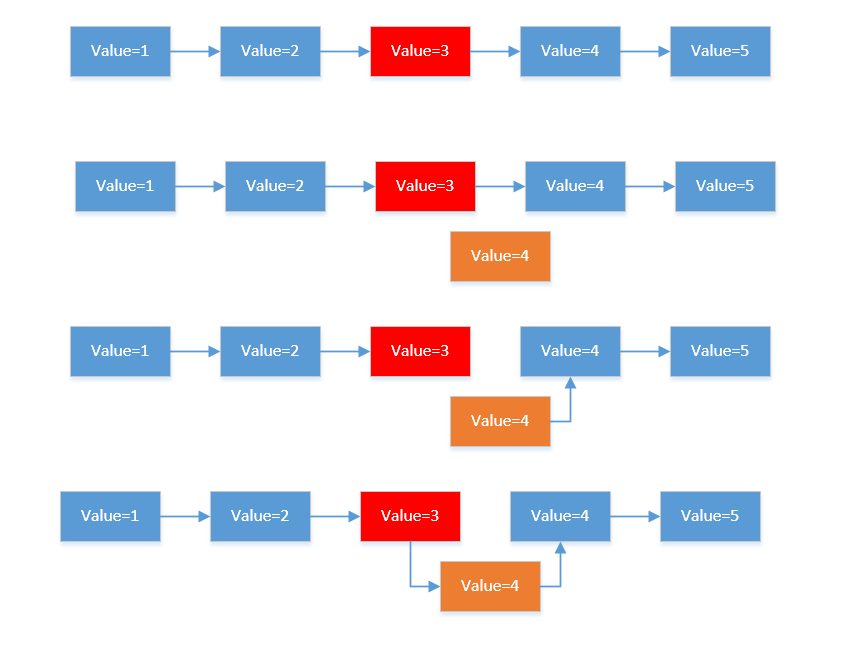
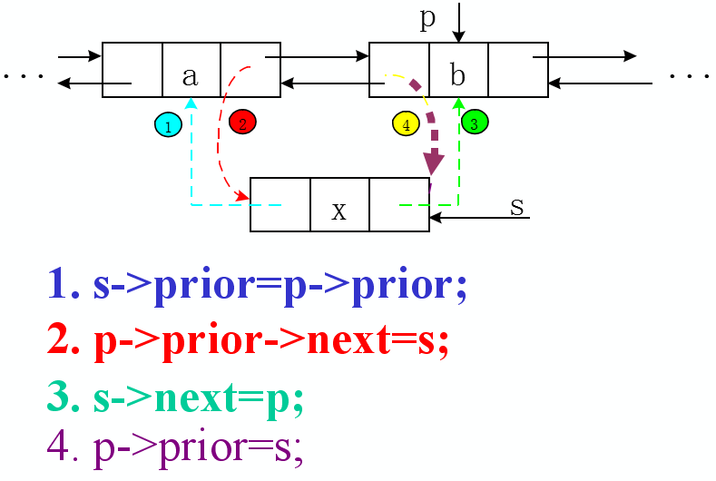
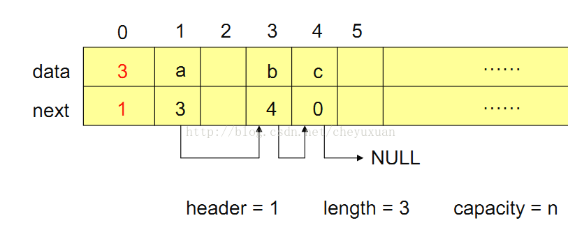

# 线性表
!!! abstract "主要内容"
    线性表的定义,逻辑结构与物理结构
    (循环)单链表(双链表)的插入删除操作
    静态链表

^^线性表^^ 由同一类的数据元素构成的有序序列,这种线性序列反映的是线性表的逻辑结构.

线性表的存储结构主要由两种{++顺序(结构)表与链式(结构)表++}

!!! note "顺序表操作的时间复杂度"
    - 表尾插入操作 $O(1)$
    - 其余部分插入 $O(n)$
    - 查询某个下标为$i$的元素, $O(1)$ ----> 具有按址随机存取的特性
    - 查询某个值为$x$的元素, $O(1)$ 
    - 删除操作$O(n)$ 

```cpp
// 链式存储的线性表的结构体定义
struct node {
    int val;
    node *next;
    node() : val(0), next(nullptr) {}
};
```
!!! note "单链表操作的事件复杂度"
    - 求表长 $O(n)$
    - 查找 $O(n)$
    - 插入 $O(n)$
    - 删除 $O(n)$

^^单链表的插入操作^^

^^双链表的插入操作^^


注意双链表的插入操作并非只有这一个顺序,只要能保证更改指针的过程中不丢失节点即可.

{++链表题在选择题中一般只需要模拟就可以,安安静静的模拟一遍就好++}

!!! example "拓展-静态链表"
    所谓静态链表即使用数组模拟链表,通过预先给定链表的最大可能长度,结合数组随机存取的特性来优化某些操作(比如删除操作)
    ```cpp
    std::array(int, N) data, next; // 通过data数组存储val值,通过next存储i位置的next指针在next数组中的位置
    ```

