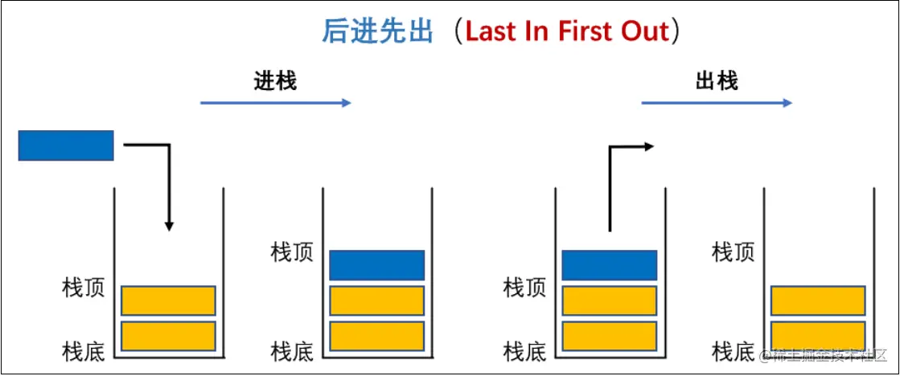
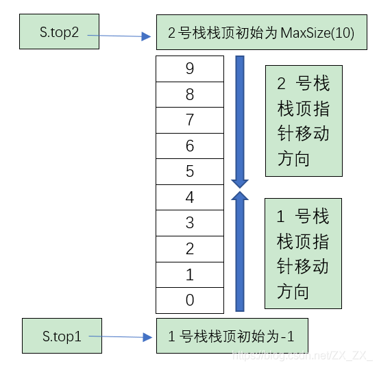
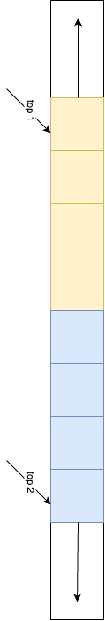
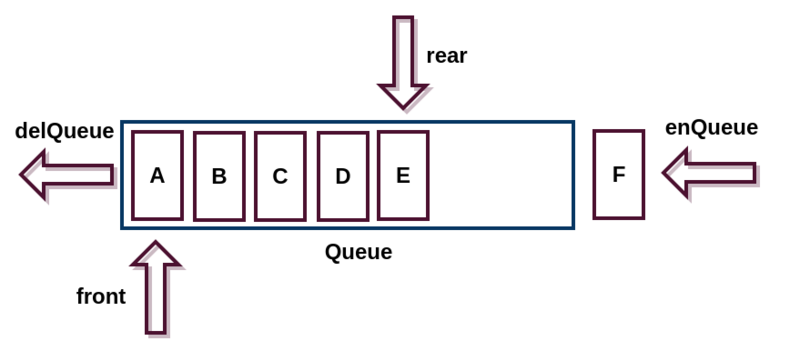
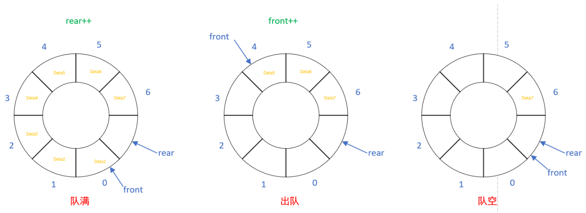
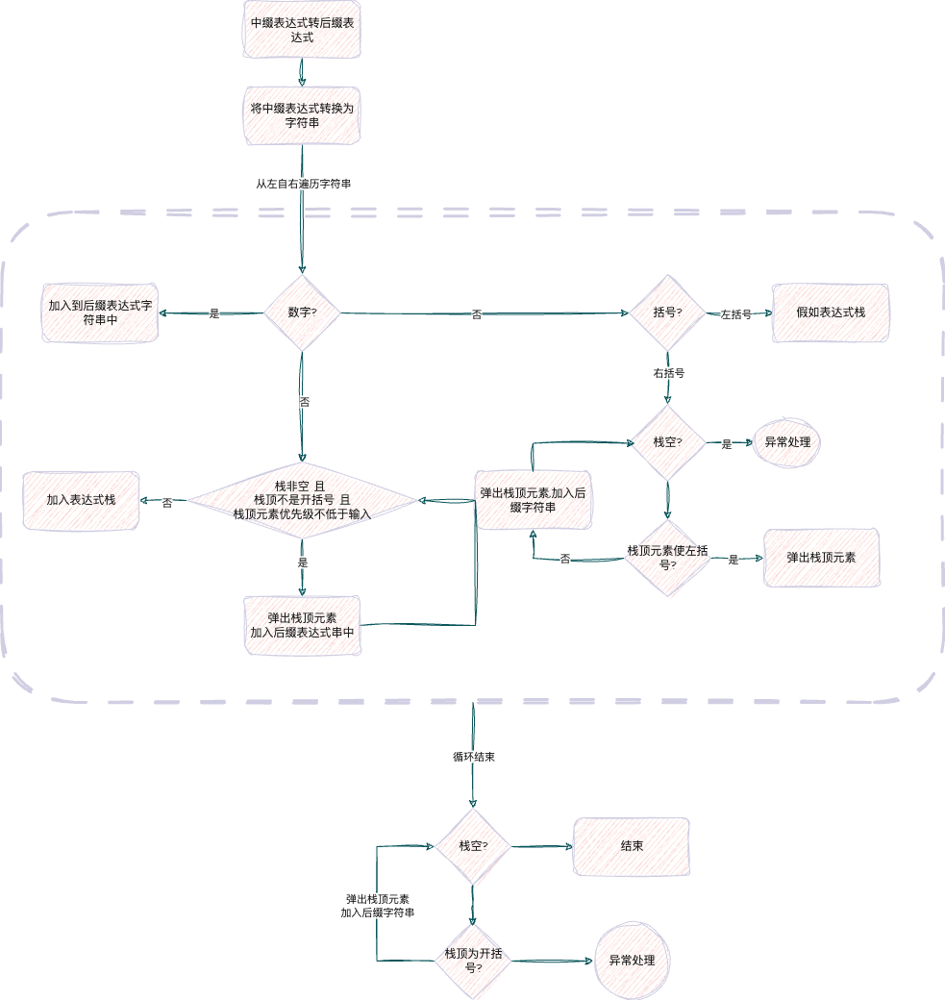
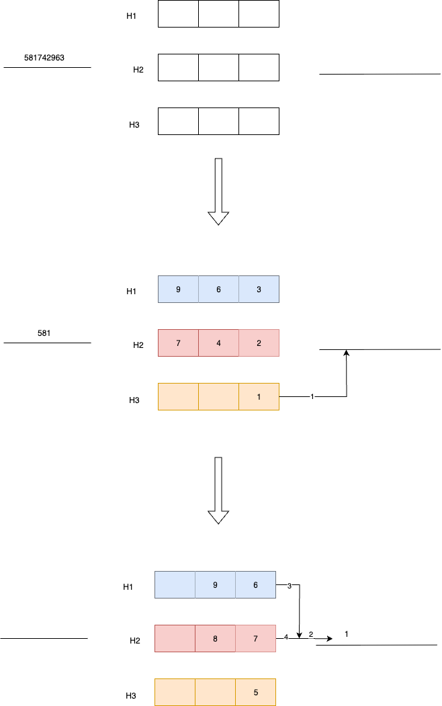
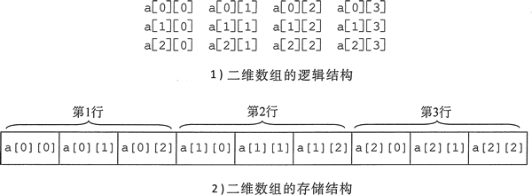
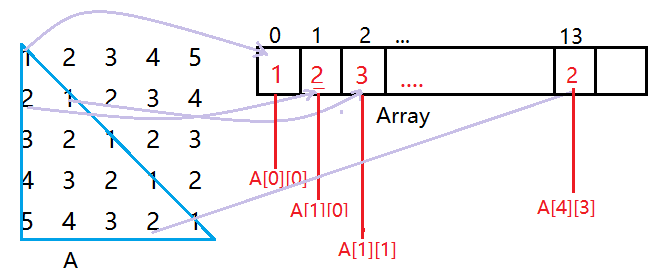

# 栈,队列与数组

## 栈(stack) 后进先出结构
^^栈^^ 栈是一种受限的{++线性表++},只运行在栈顶加入元素与在栈顶删除元素

^^栈的存储结构-顺序存储^^ 使用数组模拟栈
```cpp
std::array<int, N> stack; // 用数组定义栈的最大容量
int top = -1; // 用top做栈顶指针

bool empty() return top == -1 ? true : false;

// push操作
void push(int x) {
    if (top != N - 1) stack[++top];
}

// pop操作
int pop() {
    if (!empty()) return stack[top--];
}
```
^^栈的上溢与下溢^^ 当栈满的时候执行push操作会导致上溢;当栈为空的时候执行pop操作为导致下溢

^^栈的存储结构-链表实现^^ 
```cpp
// 定义链表节点结构
struct Node {
    int data;      // 存储数据
    Node* next;    // 指向下一个节点

    // 构造函数
    Node(int val) : data(val), next(nullptr) {}
};

// 定义栈类
class Stack {
private:
    Node* topNode;  // 栈顶指针

public:
    // 构造函数
    Stack() : topNode(nullptr) {}

    // 判断栈是否为空
    bool isEmpty() const {
        return topNode == nullptr;
    }

    // 入栈操作
    void push(int val) {
        Node* newNode = new Node(val);  // 创建新节点
        newNode->next = topNode;        // 新节点指向当前栈顶
        topNode = newNode;              // 更新栈顶指针
    }

    // 出栈操作
    void pop() {
        if (isEmpty()) {
            cout << "栈为空，无法执行出栈操作！" << endl;
            return;
        }
        Node* temp = topNode;         // 临时保存当前栈顶
        topNode = topNode->next;      // 栈顶指针下移
        delete temp;                  // 释放原栈顶节点内存
    }

    // 获取栈顶元素（不删除）
    int top() const {
        if (isEmpty()) {
            cout << "栈为空，无栈顶元素！" << endl;
            return -1; // 可以根据需要返回一个特殊值或抛出异常
        }
        return topNode->data;
    }
};
```
两个特殊的栈结构

|^^共享栈结构^^ 两个栈向中间增长 |^^双栈^^ 底部重合的两个栈往外增长|
|--------------|--------|
|      |   |

## 队列(Queen) 先进先出结构
^^队列^^ 队列也是一种限制访问点的线性表,只能在队头删除元素,只能往队尾插入元素. 


队列一般考察顺序队列的判满条件,与循环队列操作的模拟.

循环队列(假溢出判定):rear = capacity - 1



## 栈与队列的应用

### 栈的应用 - 表达式求值(中缀-后缀表达式)

^^问题描述^^ 给定一个中缀表达式,给出其转换为后缀表达式的结果. 该中缀表达式可能包含 +-*\ () 以及 0 ~9 不含其他元素. 不保证中缀表达式合法.

{++中缀转后缀表达式的算法思路++} 



- 栈中元素为 {++暂时无法确定优先级++} 的运算符


### 队列的应用 - 火车重排问题

^^问题描述^^ 给定一个初始车厢序列（如 1, 2, 3, ..., n）和一个目标序列（如任意排列），火车站台有三个缓冲轨道，车厢只能按顺序从输入轨道进入缓冲轨道，或从缓冲轨道弹出到输出轨道,且缓冲轨上的火车数量有一定限制,要求最终以 $\{1,2,\ldots n\}$ 的顺序,应该如何设计算法完成该过程,判断对于某输入序列是否存在解.

这个问题可以抽象为排序问题,但这个排序是受限的,可以用队列实现.

{++算法思路++}

- 一个火车从入轨进入缓冲轨
- 若其编号恰好是下一个待输出的编号时,才能到输出轨
- 当且仅当当前待进入缓冲轨的编号{++大于已经进入缓冲轨++}的编号的时候才能加入
    - 缓冲轨内部从小到大排序
- 否则只能加入到为空的缓冲轨 
- 若{++不存在++}为空的缓冲轨,则无法完成重排



## 数组
数组最重要的特点就是可以{++随机存取++}

^^高维数组的存储结构^^
```cpp
std::array(std::array(int, N), N) matrix; // 写成int[N][N] matrix也可以啦
```
注意在计算机底层,并没有想象中的行*列结构,而是如下结构


### 特殊矩阵的压缩存储
^^对称矩阵^^, 下图为按行优先的方式存储的图示 


^^三对角矩阵^^

^^稀疏矩阵^^

