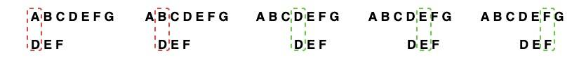
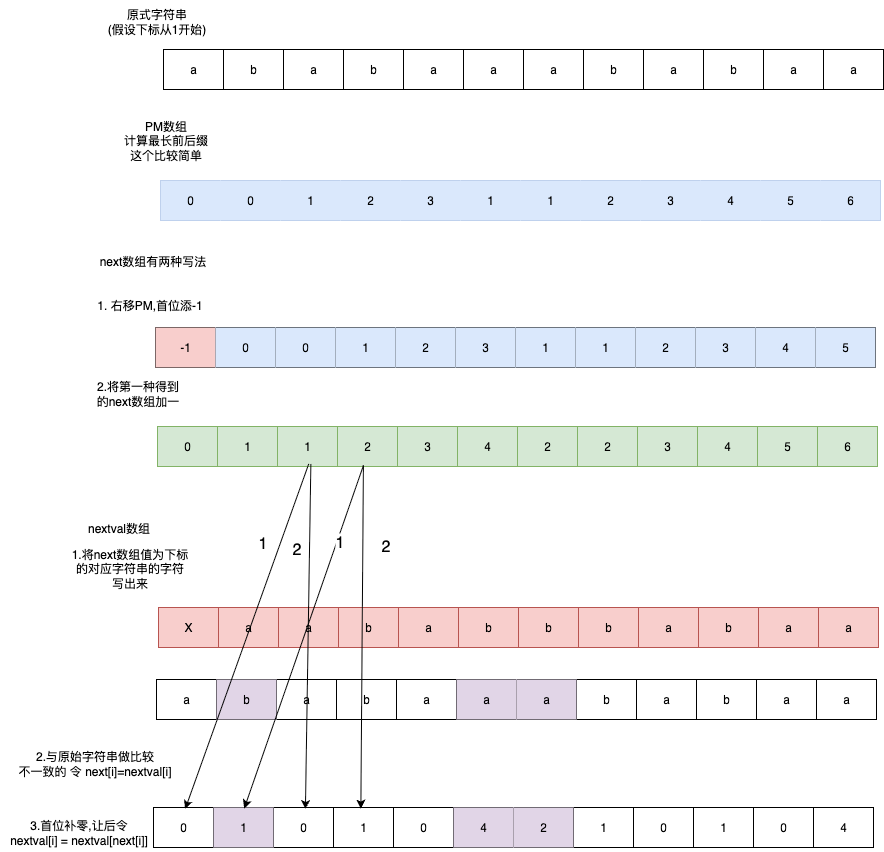
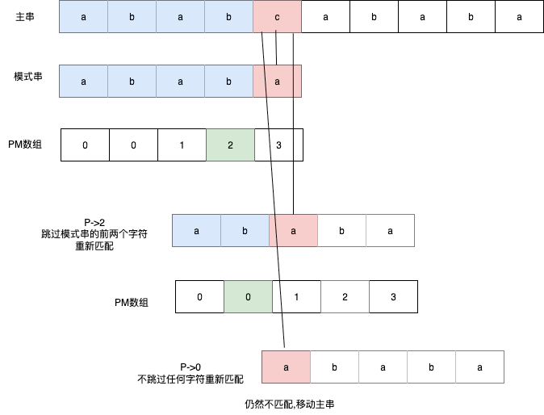

# 串(模式匹配)
^^模式匹配^^ 在字符串$s$中找出与字符串$t$相等的子串的操作.其中字符串$s$被称为主串或者目标串,$t$被称为模式串.
## 朴素匹配法(BF算法)
^^算法描述^^ 枚举目标串$s$中每一个与模式串$t$相等的子串,判断是否匹配;即首先将模式串$t$的第0位字符与目标串第0位字符对齐,然后依次对比每个字符,若都相等则匹配成功,否则将t整体后移动一位,然后重新开始匹配.

^^图示^^ 


```cpp
/**
 * BF（Brute Force）算法实现字符串模式匹配
 * 
 * @param S 主串
 * @param P 模式串
 * @return 如果找到匹配的子串，返回模式串在主串中的起始位置（从0开始）；
 *         如果未找到，返回 -1
 */
int PatternMathBF(const std::string& S, const std::string& P) {
    int m = S.length(); // 主串长度
    int n = P.length(); // 模式串长度

    if (n > m) {
        return -1;
    }

    // 遍历主串，从第0个字符开始，最多到 m - n 的位置
    for (int i = 0; i <= m - n; ++i) {
        int j;

        for (j = 0; j < n; ++j) {
            if (S[i + j] != P[j]) {
                break;
            }
        }

        if (j == n) {
            return i; // 返回匹配的起始位置
        }
    }
    
    return -1;
}
```
时间复杂度$O(nm)$,由于指针会后退所以最坏的情况要遍历主串(n-m)次,遍历模式串(m)次,最大次数为(nm-m^2),所以时间复杂度的上界为$O(nm)$

## KMP算法

先来个功利部分,不管这些有的没的,直接给出考研可能考的点.求 $PM,next,nextval$ 数组的办法. 

一图流如下 



- 考研408的这些数组也是够无语的,在算导上都找不到.非得看国产的那本书才有(烦人)
    -  PM数组即 $\pi$ 数组记录是{++最长前后缀的长度++}
    -  next数字即将PM数组的值,{++转换为下标++}
    -  nextval则是{++对next数组的进一步优化++}
- 计算PM是最简单也是最关键的一步,这步算错了一切都白弄 
- 计算 $next$ 数组, 不同书有不同的说法,但总共来说就两种.(方法如图) 
- 计算 $nextval$ 数组要注意对应关系 
    - 先根据 $next$ 数组查找和原字符串不一致的位,将 $next[i]$ 的值抄下来
    - 再把相同的位根据 $nextval[i] = nextval[next[i]]$ 的公式找出来

来点不功利的部分, KMP算法的代码实现与算法思路. 



```cpp
using namespace std;

int strStr(const string& txt, const string& pat) {
    int n = txt.size(), m = pat.size();
    if (m == 0) return 0;

    /* 1. 预处理 π 数组 */
    vector<int> pi(m);
    for (int i = 1, len = 0; i < m; ++i) {
        while (len > 0 && pat[i] != pat[len]) len = pi[len - 1];
        if (pat[i] == pat[len]) ++len;
        pi[i] = len;
    }

    /* 2. 匹配过程 */
    for (int i = 0, j = 0; i < n; ++i) {
        while (j > 0 && txt[i] != pat[j]) j = pi[j - 1];
        if (txt[i] == pat[j]) ++j;
        if (j == m) return i - m + 1;   // 找到
    }
    return -1;
}
```

KMP算法最精彩的地方在于通过预处理模式串,来避免主串的指针回退. 将原本 $O(nm)$ 时间复杂度的BF算法降低至 $O(n+m)$ 