# 树与二叉树

## 树的基本术语

- ^^结点的度^^ 其子结点或者子树的个数
- ^^树的度^^ 树中所有结点度的最大值
- ^^叶结点^^ 树中度为0的结点
- ^^结点的层次^^ 根结点在1层,从根往叶结点累加
- ^^结点的高度^^ 叶节点的高度为1,往根结点递增 
- ^^树的高度^^ 即根结点的高度,也称树的深度

## ADT(Binary Tree)
```cpp
struct TreeNode() {
    int val;
    TreeNode *left;
    TreeNode *right;
};
```
^^满二叉树^^ 树中没有度为`1`的结点,仅有度为`0`与`2`的`结点
!!! warning "版本差异"
    在老教材中的满二叉树实际上是新教材的完美二叉树.
^^完全二叉树^^  
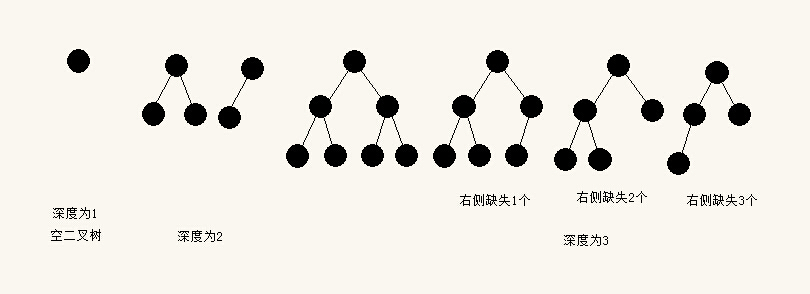

^^完美二叉树^^ 若一个完全二叉树$d-1$层所有结点的度都为$2$则该树是一颗完美二叉树

!!! note "基本性质"
    $n_0=n_2+1$ -- 度为0的结点等于度为2的结点数目+1 

    ^^满二叉树定理^^ 非空满二叉树中叶结点数等于中间结点树目+1

    二叉树的第$i$层最多有$2^{i-1}$个结点($i\geq 1$)

    深度为d的二叉树最多有$2^d-1$个结点($d\geq 1$)

    ^^完美二叉树定理^^ 深度为$d$的二叉树是完美二叉树的条件充要条件为:树中有$2^d-1$个结点

    ^^完全二叉树编号的性质^^ 完全二叉树有$n$个结点$n\geq 1$,从根开始从上往下,从左往右连续编号,根结点编号为1.树种任意一个结点满足如下性质:

    1. 如果$2k\leq n$,则结点k的左子结点是2k,否则k没有左子结点
    2. 如果$2k+1\leq n$,则结点k的右子结点为2k+1,否则k没有右子结点
    3. 如果$k>1$,则结点k的父结点为$\lfloor k/2 \rfloor$

    有n个结点的完全二叉树的深度为$\lceil \log_{2}{(n+1)}\rceil$

### 顺序存储
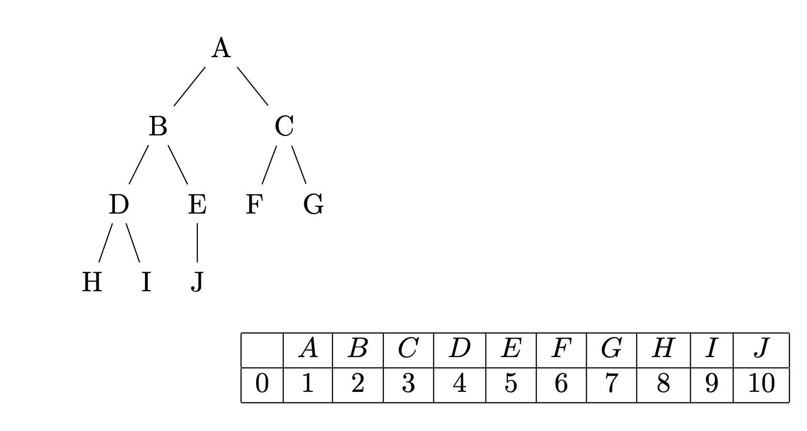!

### 二叉树的链式存储
```cpp
struct TreeNode() {
    int val;
    TreeNode *left;
    TreeNode *right;
};
```

## 二叉树的遍历(前\中\后序遍历与层序遍历)
简单来说所谓前\中\后序是dfs的特例,层序遍历即bfs.

- 前序遍历 root -> left -> right 
- 中序遍历 left -> root -> right 
- 后序遍历 left -> right -> root 

### 前\中\后序的递归实现
```cpp
struct TreeNode() {
    int val;
    TreeNode *left;
    TreeNode *right;
};
void pre_order(TreeNode *root) {
    if (!root) return ;
    printf(root->val);
    pre_order(root->left);
    pro_order(root->right);
}

void in_order(TreeNode *root) {
    if (!root) return ;
    in_order(root->left);
    printf(root->val);
    in_order(root->right);
}

void pos_order(TreeNode *root) {
    if (!root) return ;
    pos_order(root->left);
    pos_order(root->right);
    printf(root->val);
}
```
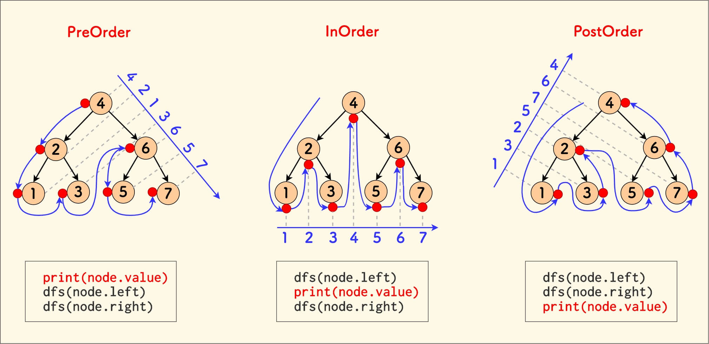
时间复杂度$O(N)$ 

空间复杂度$O(N)$
### 二叉树的非递归实现
```python
class TreeNode:
    def __init__(self, val=0, left=None, right=None):
        self.val = val
        self.left = left
        self.right = right

def pre_orderTraversal(root):
    if not root:
        return []
    
    stack = [root]  # 初始化栈，根节点入栈
    result = []     # 存储遍历结果
    
    while stack:
        node = stack.pop()  # 弹出栈顶节点
        result.append(node.val)  # 访问当前节点
        
        # 右子节点先入栈（保证左子节点先出栈）
        if node.right:
            stack.append(node.right)
        # 左子节点后入栈
        if node.left:
            stack.append(node.left)
    
    return result
```
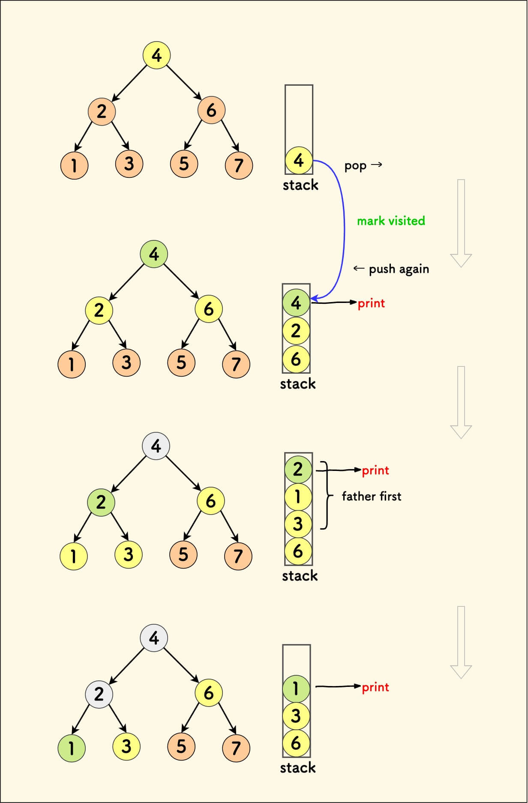
### 层序遍历(使用队列)
[leetcode测试连接](https://leetcode.cn/problems/binary-tree-level-order-traversal/description/)
```cpp
vector<int> levelOrder(TreeNode *root) {
    vector<int> result;
    if (!root) return result;

    TreeNode *q[N]; // N表示最大结点数
    int front = rear = -1;
    q[++rear] = root; 
    while (front < rear) {
        TreeNode *node = q[++front];
        result.push_back(node->val);

        if (node->left) q[++rear] = node->left;
        if (node->right) q[++rear] = node->right;
    }

    return result;
}
```
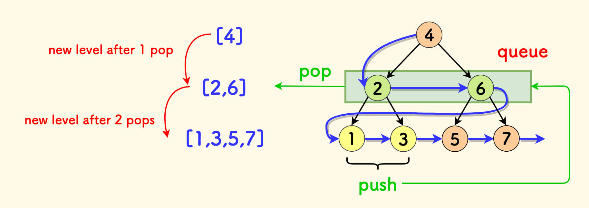
时间复杂度$O(N)$

空间复杂度$O(N)$

## Huffman编码与Huffman树(最优二叉树)
^^带权路径长度(WPL)^^ 二叉树的带权路径长度$WPL$是树中所有叶结点的带权路径长度之和

$$WPL=\sum_{i=1}^{n}w_il_i$$

^^Huffman树^^ 给定一组权值,由此构建的所有二叉树中$WPL$最小的二叉树即$huffman$树

!!! note "huffman树的性质"

    - Huffman树是满二叉树
    - Huffman树中,如果两个叶结点的权重值不同,则权重值较小的叶结点在树中的层数{==一定不小于==}权重大的叶结点
### 构建huffman树 --- huffman算法
Huffman算法是{==自底向上==}的建树过程
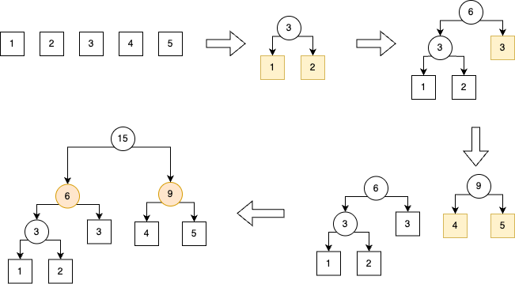

^^算法描述^^ 

1. 首先对于给定的一组(n个)权重,创建n个结点 
2. 创建一个新的结点,并从二叉树集T取出根结点权重最小和次小的两棵二叉树分别作为新结点的左右子树,并设置其权重为左右子树权重之和,并加入二叉树集
3. 重复操作2,直到T总仅剩一一棵二叉树

{++通过huffman算法构建的huffman树形式不唯一但权值唯一++}

伪代码如下
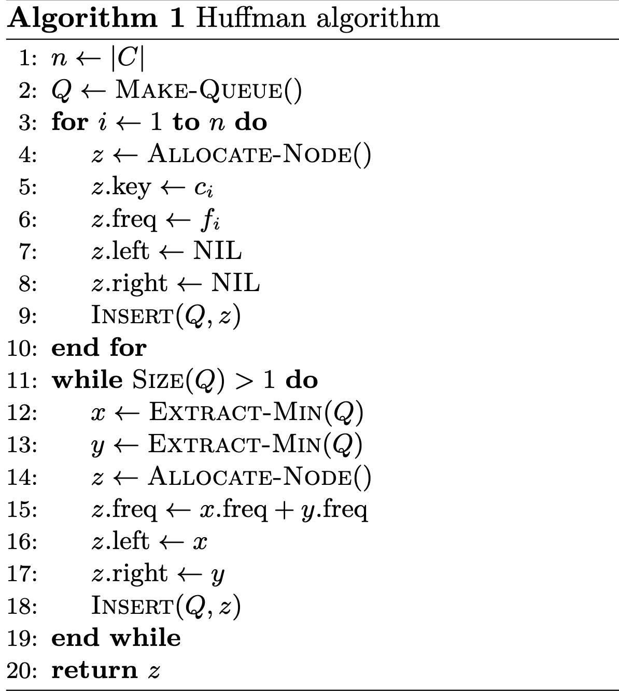
由于使用了最小堆故时间复杂度是$O(n\log{n})$

### Huffman 编码
Huffman编码基于**前缀码**,要求短的字符编码不能是长的字符的前缀(变长编码)

^^算法描述^^ 将字符出现的频率按从小到大排序,在采用huffman算法构建huffman树,假设左孩子路径为`0`,右孩子路径为`1`,则从根结点到叶结点的路径序列即为该叶子结点对应字符的huffman编码.

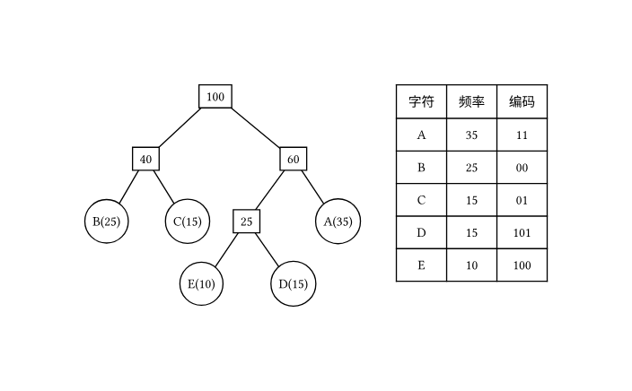

## 树与森林
### 双亲表示法 
对于顺序存储的树,采用双亲表示法比较容易,对所有结点从0开始编号,用一个长度为n的顺序表记录结点,其中编号$i$个结点的顺序表$array[i]$里面存起父结点的编号,具体如图所示
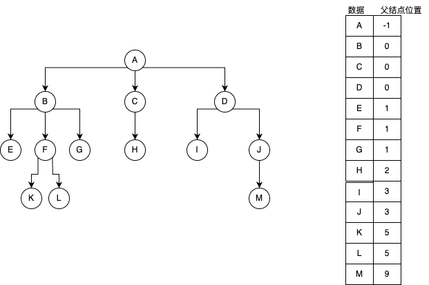

### 孩子表示法
孩子表示法一般为链式表示,对于单纯的双亲表示法加上一个域用于存放指向孩子节点的指针(从左到右存储). 如图所示

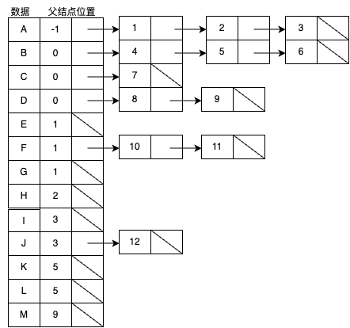
### 孩子兄弟表示法(左孩子右兄弟)
将原来二叉树的左指针改成指向孩子节点,右指针指向第一个兄弟节点,如图所示

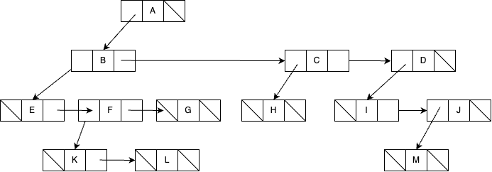

通过孩子兄弟表示法可以将森林转换为二叉树,也可以将二叉树转换为森林,大体如下所示

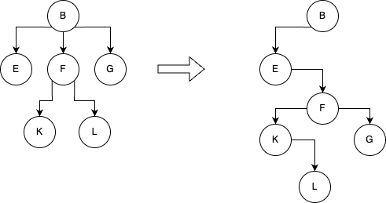

### 树与森林的遍历
通过将多叉树\森林转换为二叉树(孩子兄弟表示法),可以获得其的遍历结果,一般来说此时只有{==前序遍历/后序遍历==}两种结果,其中前序遍历结果和其转换后的二叉树前序遍历结果一致,但后序遍历结果与转化后的二叉树中序遍历结果一致.

例如对于上述三叉树,其前序遍历结果为{++B E F K L G++},后序遍历的结果为{++E K L F G B++}

## 线索二叉树
虽然概念一大堆,但这里其实就是问XX线索树就把XX遍历结果写出来,然后让空余的左右指针指向其直接前驱与直接后继(若有的话),比如说如下中序线索树

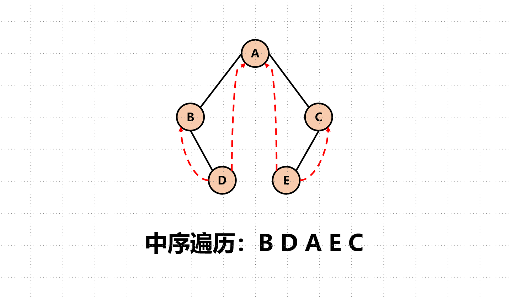

## 并查集

并查集支持在均摊复杂度 $O(1)$ 下进行合并和查询操作. 

{++按秩合并与路径压缩++}  并查集的优化

- 按秩合并 将简单的树往大的树上合并
    - 这个简单可以是树的结点个数也可以是树高
- 路径压缩 将结点直接指向要合并集合代表元素


```cpp

// find 操作
int find(int i) {
    int top = 0;
    // 用栈模拟递归
    while (i != father[i]) {
        stack[top++] = i;
        i = father[i];
    }

    // 将沿途节点全部指向根节点
    // 路径压缩
    while (top > 0) father[stack[--top]] = i;
    return i;
}
// 递归版本

void find(int x) {
    if (p[x] != x) p[x] = find(p[x]);
    return p[x];
}

// Union操作
void Union(int x, int y) {
    int fx = find(x);
    int fy = find(y);
    if (fx != fy) {
        // 按秩合并
        if (size[fx] >= size[fy]) {
            size[fx] += size[fy];
            father[fy] = fx;
        } else {
            size[fy] += size[fx];
            father[fx] = fy;
        }
    }
}

```


## 堆与堆排序

以最大堆为例,说明堆的特性与操作

{++小根堆的定义++} 最大堆是一棵{++完全二叉树++},对于堆中的任意结点,其值均不大于其左右子树结点的值.


在一般实现中,会用数组去保存一个堆,比如上面的小根堆用数组表示就是

[10, 20, 15, 25, 50, 30, 40, 35, 45] 

二叉堆的最重要的两个操作是 {++上浮++} 与 {++下沉++} 操作

- 上浮 当一个结点比其父节点小的时候, 可以逐步将该结点上传到合适的位置
- 下沉 当一个结点大于其左右孩子的时候, 可以将该结点逐步下传到合适的位置

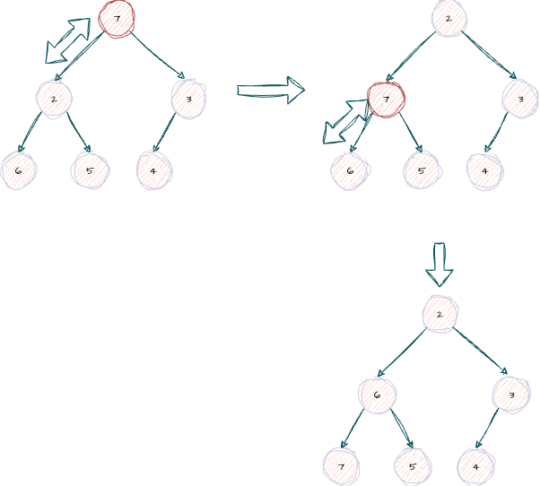

{++建立一个堆的过程++} 采用自底而上的建立堆 $O(nlogn)$;采用自顶向下建立堆 $O(n)$

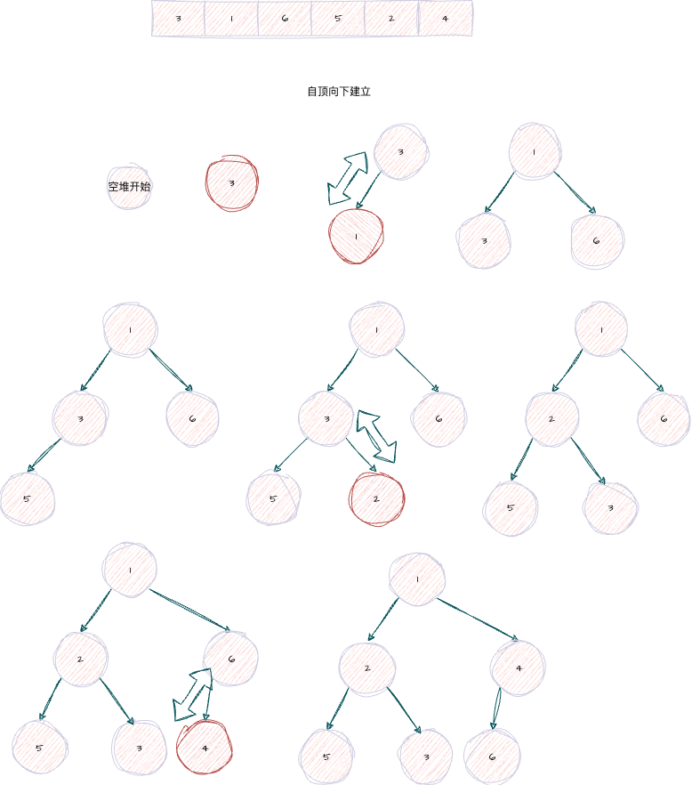

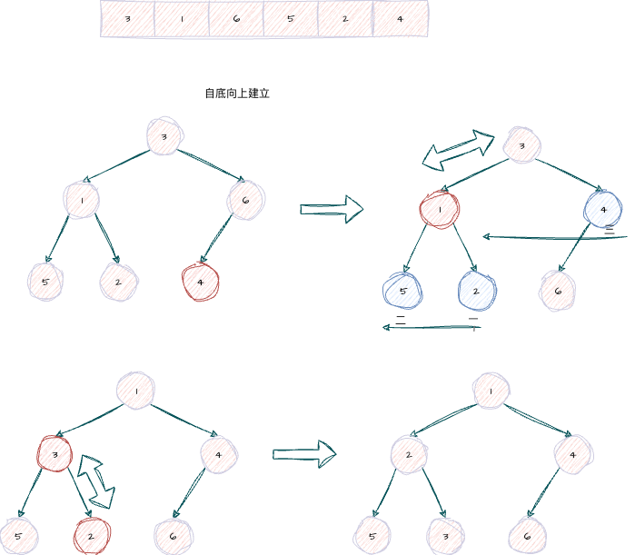

{++堆的插入操作++} 将待插入的点放到二叉堆的最后,在将其{++上浮++}到对应的位置

{++堆的删除操作++} 将待删除的结点与堆的最后的节点交换,并将根结点{++下沉++}到对应为止
ß
{++堆排序++} 

- 将待排序数组建立成一个大根堆
- 取出堆顶元素,并将其与堆的最后一个元素互换
- 调整堆,将其变回小根堆,将堆的size - 1
- 循环上述过程,直到堆的大小为0,此时原数组就成了有序数组

时间复杂度 $O(n\log n)$ 空间复杂度 $o(1)$ 不稳定排序