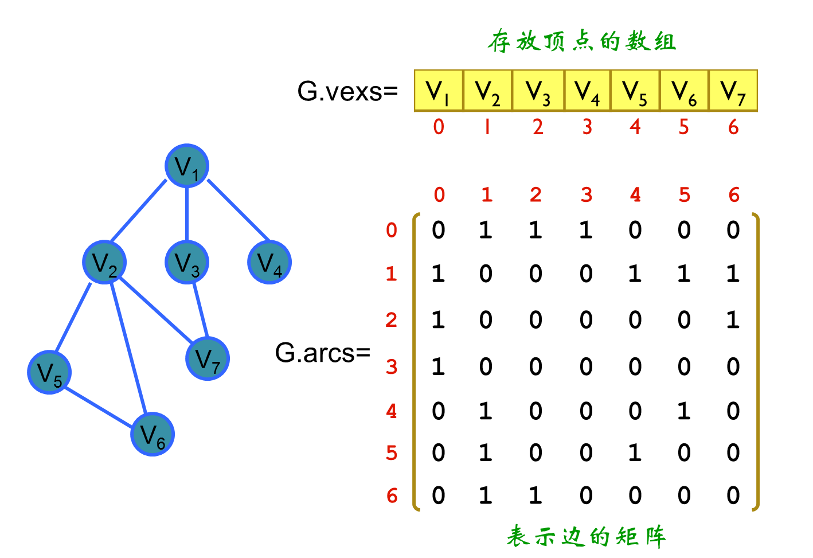
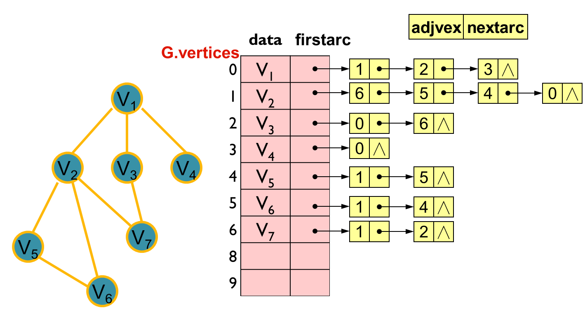
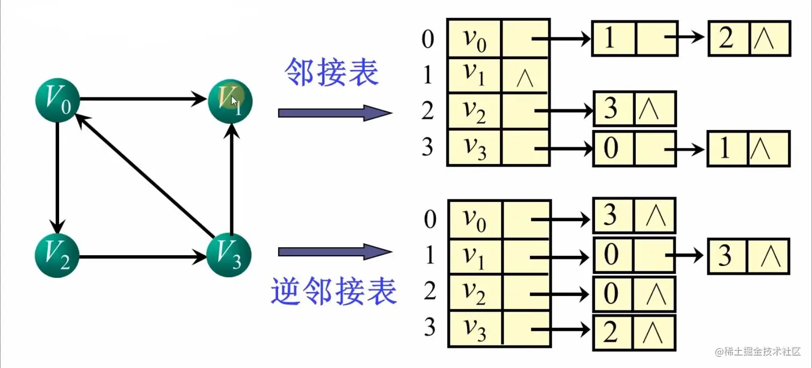
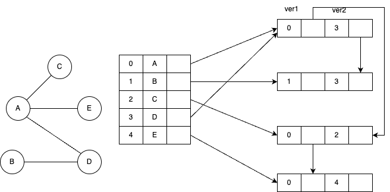
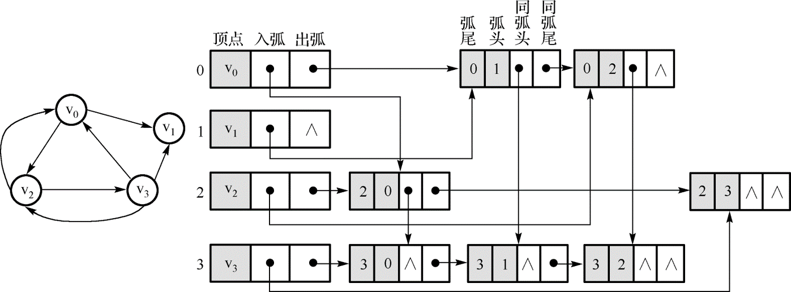
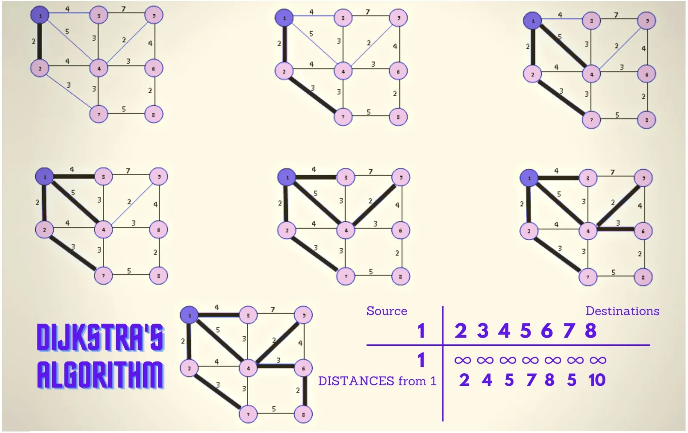
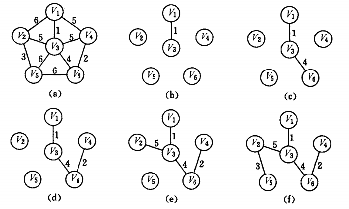
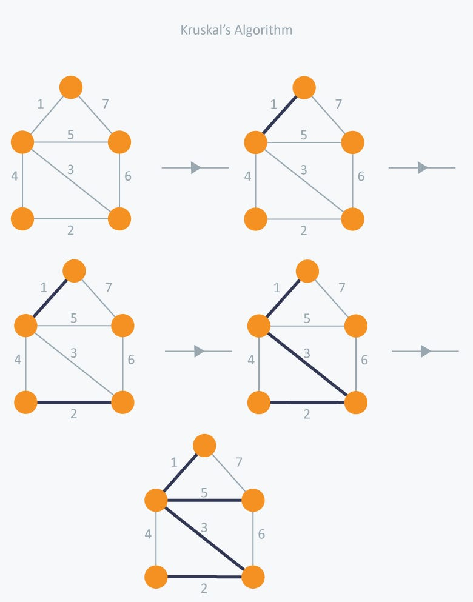
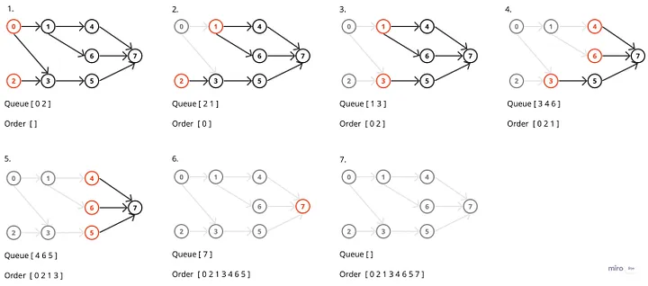
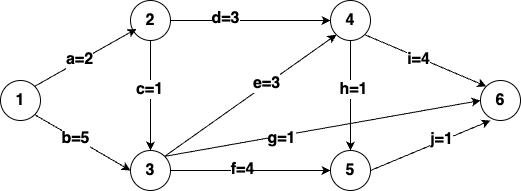

# 图与图算法

## 图的基本概念,存储与遍历
图是一个二元组$G=(V,E)$其中$V$为顶点的集合,$E$是两个顶点间边(弧)的集合
### 图的基本术语
^^有向图^^ 弧(边)具有方向性的图,用$<V_1,V_2>$表示一条由$A_1\rightarrow A_2$有向弧,其中$A_1$被称为弧尾,$A_2$被称为弧头.

^^无向图^^ 弧(边)不具有方向性的图,用$(V_1,V_2)$表示$V_1,V_2$之间具有一条无向边.

{++在使用中一般将无向图视为具有两条有向边的有向图处理++}

^^出度,入度,与度^^ 有向图的出度,是某一顶点射出的弧的个数;有向图的入度,是某一顶点射入弧的个数;无向图的度,是某一顶点连接弧的总数

^^简单图与多重图^^ 若一个图中不含重边也不包含自环则为简单图,否则为多重图.

^^完全图^^ 点与点之间有向边(无向边)都存在,其中无向图边数为$C_{n}^{2}=n(n-1)/2$,有向图为$P_{n}^{2}=n(n-1)$

^^子图^^ 假设有两个图$G=(V,E), G'=(V',E')$,若有$V'\subset V, E'\subset E$,则称$G'$为$G$的子图

^^连通图,连通分量与生成树^^ 

 {==连通图==}若一个无向图任意两点之间都存在路径则称该图为一个连通图,若一个有向图任意两个顶点之间也都存在一条路径则称该图为强连通图. 

{==连通分量==}在一个无向图中,若存在某一个子图是连通图,加上一个顶点后导致不连通,则称该子图为极大连通子图(连通分量);若是有向图则称为强连通分量. 

{==生成树==}连通图的生成树是指其的最小连通子图.该连通子图具有所有n个顶点,但只有n-1条边,如果去掉一条边则必定不连通;如果加上一条边则会产生回路.

!!! warning 
    生成树并不唯一
### 图的存储 (邻接矩阵+邻接表) 
^^邻接矩阵(顺序存储)^^ 

空间复杂度 $O(n^2)$ 适合存储稠密图($m\approx O(n^2)$)
对于无向图,连接矩阵一定是一个{++对称矩阵++},只需要存储$\frac{n(n-1)}{2}$个元素即可

^^邻接表(链式存储)^^

空间复杂度 $O(\max{(n,m)})$ 

^^逆邻接表^^ 记录指向顶点的边,而非从顶点指出的边,便于计算入度.


^^临接多重表^^ 



对于某个结点,其边结点更改为存储两个点的信息

比如说A与其相连的边有三条(A,C)(A,E)(A,D),随便选一条边作为其边结点,这里选择的是(0,3)->(A,D)

由于结点0的位于ver1字段中,遍历next1字段的下一个结点,发现0仍然在ver1字段,故(0,2)->(A,C)也存在边

接着遍历var1的next1结点,发现0还在,故(0,4)->(A,E)也有一条边,

此时var1的next1指向空,所以边就找完了.

{++邻接多重表式对无向图需要存储两次同一条边的优化++}

^^十字链表^^

{++十字链表是对有向图一次只能简单读出度\入度问题的优化++}
### 图的遍历 
主要有dfs和bfs两种,需要掌握手动模拟和代码.

简单来说深度优先遍历就是一路走到黑,不撞南墙不回头;而宽度优先遍历则是优先遍历最近的点.

在代码实现上dfs通常用递归实现,代码比较简单;bfs通过队列实现,代码比较长.
??? success "算法实现"
    ```cpp
    // dfs 模板
    int dfs(int u) {
        st[u] = true; // 标记该点被访问过了

        // 用的临接表
        for (int i = h[u]; i != -1; i = ne[i]) {
            int j = e[i];
            if (!st[j]) dfs(j);
        }
    }

    // bfs 模板
    std::queue<int> q; // 初始化一个队列
    st[1] = true; // 选择1号点为起始点 
    q.push(1); // 将1号点加入队列

    while (q.size()) {
        int t = q.front(); 
        q.pop(); // 取队头元素

        for (int i = h[t]; i != -1; i = ne[i]) {
            int j = e[i];
            if (!st[j]) {
                st[j] = true;
                q.push(j); // 插入队尾
            }
        }
    }
    ```
## 图算法 

### Dijkstra算法(单源无负权重最短路问题)

{++解决从一个顶点到其他顶点间的最短路问题++}

考研一般只需要掌握距离矩阵的如何更新,会手动模拟Dijkstra的过程即可.当然不排除考察代码实现

[测试连接](https://www.acwing.com/problem/content/851/)

^^算法描述^^ 

- 初始化​：
    - 设置源点s的距离为0（dist[s] = 0）
    - 其他所有顶点距离初始化为无穷大
    - 集合S初始为空
- ​主循环​：
    - 从未确定顶点中选择距离最小的顶点u
    - 将u加入集合S（表示已确定u的最短路径）
    - 对u的所有邻居v进行松弛操作：
    - 如果dist[u] + w(u,v) < dist[v]，则更新dist[v]
-​终止条件​：
    - 当所有顶点都加入S时，算法结束


??? success "算法实现"
    ```cpp
    // 未使用堆优化的版本

    int n, m;           // n 表示顶点数，m 表示边数
    int g[N][N];        // 邻接矩阵，用于存储图的边权
    int dist[N];        // dist[i] 表示从起点到顶点 i 的最短距离
    bool st[N];         // st[i] 表示顶点 i 的最短距离是否已经确定

    int dijkstra() {
        memset(dist, 0x3f, sizeof dist);  // 初始化所有顶点的距离为无穷大
        dist[1] = 0;                      // 起点到自身的距离为 0

        // 进行 n-1 次迭代，每次确定一个顶点的最短距离
        for (int i = 0; i < n - 1; i ++) {
            int t = -1;  // t 用于存储当前未确定最短距离的顶点中距离起点最近的顶点

            // 遍历所有顶点，找到未确定最短距离且距离起点最近的顶点 t
            for (int j = 1; j <= n; j ++) {
                if (!st[j] && (t == -1 || dist[t] > dist[j]))
                    t = j;
            }

            // 通过顶点 t 更新其他顶点的最短距离
            for (int j = 1; j <= n; j ++) {
                dist[j] = min(dist[j], dist[t] + g[t][j]);
            }

            st[t] = true;  // 标记顶点 t 的最短距离已经确定
        }

        // 如果终点的最短距离仍然是无穷大，说明不可达，返回 -1
        if (dist[n] == 0x3f3f3f3f) return -1;
        return dist[n];  // 返回起点到终点的最短距离
    }
    ```
### Floyd算法 (三重循环--DP)
{++解决所有顶点到其他顶点最短路问题++}

这个很少考察,本质是基于DP的但DP不属于考研内容.
??? success "算法实现"
    ```cpp
    // 只需要注意k在最外层即可
    for (int k = 0; k < n; i++)
        for (int i = 0; i < n; j++)
            for (int j = 0; j < n; k ++) 
                dist[i][j] = min(dist[i][k]+dist[k][j], dist[i][j]);
    ```
### Prim算法(选点)
^^算法描述^^ 

- 初始化一个空的最小生成树集合（通常记作 U）
- 任选一个起始顶点加入 U
- ​在连接 U 与 V-U（未选顶点集）的所有边中，选择权重最小的边及其对应的新顶点​
- 将该顶点加入 U
- 重复直到 U 包含所有顶点



[测试连接](https://www.acwing.com/problem/content/860/)
??? success "算法实现"
    ```cpp
    int prim() {
        // 初始化dist数组为INF，表示所有节点还没有被包含到MST中
        memset(dist, 0x3f, sizeof dist);

        int res = 0;  // res存储MST的总权重

        // 循环n次，依次选择每个节点加入MST
        for (int i = 0; i < n; i++) {
            int t = -1;  // t表示当前选择的最短边对应的节点
            // 遍历所有节点，选择距离已选节点集（MST）最近的节点t
            for (int j = 1; j <= n; j++) {
                if (!st[j] && (t == -1 || dist[t] > dist[j]))  // 如果节点j没有被包含在MST中，且dist[j]更小，则更新t
                    t = j;
            }

            // 如果dist[t]是INF，说明当前节点无法连接到MST（即图不是连通的），返回INF表示无法构成MST
            if (i && dist[t] == INF) return INF;

            // 第一次加入节点时不加权，之后每次都累加dist[t]（即选定节点t到MST的边的权重）
            if (i) res += dist[t];

            // 将节点t加入MST
            st[t] = true;

            // 更新dist数组，更新所有节点到MST的最短边权
            for (int j = 1; j <= n; j++) {
                dist[j] = min(dist[j], g[t][j]);  // 更新dist[j]为节点t到节点j的最小边权
            }
        }

        return res;  // 返回MST的总权重
    }

    ```

### Kruskal算法(选边)

^^算法描述^^ 

- 初始化 
    - 将图中所有的边权按从小到大排序
    - 创建一个空的边集
    - 初始化一个并查集,用于检测是否有环路
- 遍历所有边(按排序后的结果)
    - 对于当前边(u,v),检查(u,v)是否是一个集合
      - 如果不在,则将该边加入边集,并在并查集中合并u和v
      - 如果存在,则跳过这条边
- 当边集包含(n-1)条边的时候算法结束.



[测试连接](https://www.acwing.com/problem/content/861/)
??? success "算法实现"
    ```cpp
    int kruskal() {
        // 按照边的权重升序排序
        sort(edges, edges + m);

        // 初始化并查集，父节点指向自己
        for (int i = 1; i <= n; i++) p[i] = i;

        int res = 0, cnt = 0;  // res用于累加MST的权重，cnt用于统计加入MST的边数
        // 遍历所有边，按照权重从小到大
        for (int i = 0; i < m; i++) {
            int a = edges[i].a, b = edges[i].b, w = edges[i].w;

            a = find(a), b = find(b);  // 查找a和b的根节点
            if (a != b) {  // 如果a和b不在同一个集合中，说明这条边不会形成环
                p[a] = b;  // 将a的父节点指向b，合并两个集合
                res += w;  // 将边的权重加入到最小生成树的权重中
                cnt++;  // 增加加入的边数
            }
        }

        // 如果加入的边数少于n-1，说明图不是连通的，无法构成MST
        if (cnt < n - 1) return INF;
        return res;  // 返回最小生成树的权重
    }
    ```

### 拓扑排序与关键路径(AOE)
拓扑排序本质是描述一种前驱关系,只有有向无环图(DAG)才有拓扑序列.

[测试连接](https://www.acwing.com/problem/content/850/)

^^算法描述(基于入度的实现)^^

- 计算每个顶点的入度 
- 选择一个入度为0的点加入队列
- 当队列不为空的时候
    - 取出队首元素记作u,并输出
    - 对于u的所有邻接点v
        - 将v的入度减1
        - 如果v的入度减为0则加入队列
- 如果输出顶点树不等于图中顶点数则说明图存在环
- 若在算法过程中队列中最大元素大于1,则说明拓扑序列不唯一

??? success "算法实现"
    ```cpp
    bool topsort() {
        int hh = 0, tt = -1;
        // d[i] 存储顶点i的入度
        for (int i = 1; i <= n; i ++)
            if (!d[i]) q[++ tt] = i; // 将入度为0的点全部加入队列
        
        while (hh <= tt) {
            int t = q[hh++];

            for (int i = h[t]; i != -1; i= ne[i]) {
                int j = e[i];
                if (--d[j]) == 0
                    q[++ tt] = j; 
            }
        }

        return tt == n - 1;
    }
    ```

^^算法描述(基于DFS实现)^^
- 对图进行深度优先遍历
- 当一个顶点完成对其所有邻接顶点的访问后,将该顶点加入列表头
- 最终的结果即为拓扑排序

如果不加入头,而是加入列表尾则输出的是逆拓扑序列

^^AOE网相关内容^^

- 活动 (activity-> A) 弧(edge->E)表示活动,弧的权值表示活动时间
- 顶点表示事件,事件在指向其的弧全部完成后被触发
- 关键路径 权值之和最大的那一条路径

^^对于最迟开始时间和最早开始时间的计算^^

- 事件最早开始时间
    - 源点的最早开始时间为0,从源点按照拓扑序列计算
    - 对于顶点v,其最早开始时间等于其所有前驱结点的最早开始时间与对应活动时间之和的最大值
- 事件最迟开始时间
    - 汇点的最迟开始时间为关键路径权值之和,从汇点开始按照逆拓扑排序计算
    - 对于顶点v,其最迟开始的事件等于其所有后继结点的最迟开始时间与对应活动之差的最小值

对于活动 $E<i,j>$ 其最早开始时间为 $EST[i]$ ,最晚开始时间为 $LST[j]-duration(i,j)$ 其中duration表示活动$<i,j>$的持续时间

以下面这个例题说明具体计算过程



首先确定事件(顶点的)最早开始时间,从源点`1`开始,其最早开始时间为0

接着按照拓扑序,应该确定`2`和`3`的`最早开始时间,显然为2和5 

其他类似....,可以得到

| 1 | 2 | 3 | 4 | 5 | 6 |
|-----|-----|-----|-----|-----|-----|
| 0 | 2 | 5 | 8 | 9 | 12 |

再确定事件的最迟发生时间,从汇点`6`开始,其最迟发生事件为12

接着按照逆拓扑序确定,所谓逆拓扑序就是每次寻找出度为0的结点

例如再`6`确定后,只有`5`的出度为0故确定结点5的最迟发生事件,等于其所有后继结点与活动持续时间之差的最小值,由于`5`只有`6`一个后继结点,故其最晚发生时间为11

接着发现只有`4`的出度为0,而其后继结点为`5`和`6`分别减去其对应活动的持续时间为`10,8`取最小值,结果为`8`

其余结点类似,最终有

| 1 | 2 | 3 | 4 | 5 | 6 |
|-----|-----|-----|-----|-----|-----|
| 0 | 4 | 5 | 8 | 11 | 12 |

确定了事件后通过活动与时间的关系可以很容易的确定活动的最早开始时间和最晚开始时间.

例如活动`a`其最早开始时间与弧尾`1`的最早开始时间一致,而最迟开始时间为弧头`2`的最迟开始-活动`a`的持续时间=4-2=2,其余结点类似.