# 查找

## 查找的基本概念
^^静态查找和动态查找^^ 如果一个查找表中的记录并不会进行增删改则进行的查找为静态查找;否则为动态查找.

^^平均查找长度(ASL)^^ 对于具有n个记录的查找表,如果用$P_i$表示第i个元素的查找概率,$C_i$表示查找第i个元素所需要的比较次数,则平均查找长度的计算公式为:

$$ASL=P_1C_1+P_2C_2+\ldots+P_nC_n=\sum_{i=1}^{n}P_iC_i$$

查找也分为内部查找和外部查找,考研中只有$B/B^{+}$树是外部查找.对于内部查找一般以关键字的比较次数作为衡量标准,而外部查找一般以访问外存的次数作为衡量标准.

## 静态查找
### 顺序查找
^^顺序查找^^ 最朴素的遍历办法

若其能查找成功,则平均查找长度为:

$$ASL=\frac{1}{n}\sum_{i=1}^{n}(n-i+1)=\frac{n+1}{2}$$ 

若考虑查找失败,而失败的查找长度为n,故平均查找长度为:

$$ASL_S=\frac{n+\frac{n+1}{2}}{2}=\frac{3n+1}{4}$$

### 二分查找
^^二分查找^^  二分具有局限性,只适合对具有有序关系(或者部分有序)的内容进行查找

对于二分查找一般采取决策树的办法分析二分的复杂度,例如对于$[1.7,10,12,16,20,26,28,32,56,62]$的查找过程如图所示

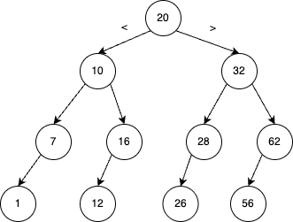

可以证明二分查找的平均查找长度为

$$ ASL=\frac{1}{n}(1+2^{0}+2^{1}+\ldots+2^{h-1}h)=\frac{n+1}{n}\log_{2}(n+1)-1\approx\log_{2}(n+1)-1$$

从感性上不难理解二分最多只会遍历树高,所以二分查找的时间复杂度为$O(\log{n})$

### 索引查找/分块查找
^^索引查找/分块查找^^ 一般来说索引间有序,而索引内(分块)无序;例如对于索引1对应的块1,其内的所有值必须大于(小于)索引2对应的块内的所有值;而块1内的元素是否有序就无所谓了.

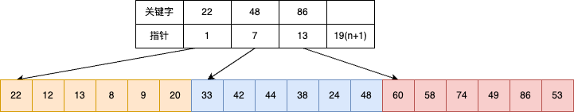

如图所示索引的关键字按照从小到大排序,则索引1对应的块内元素均应小于块2,块3内的元素.

对于索引查找其平均查找长度为项间$L_m$以及块内$L_w$平均查找长度的平均值

$$ASL=L_m+L_w=\frac{1}{m}\sum_{j=1}^{m}j+\frac{1}{l}\sum_{i=1}^{l}i=\frac{1}{2}(\frac{n}{l}+l)+1$$

其中n为表长,均匀分为m块,每块包含l个记录,容易证明当$l=\sqrt{n}$时候$ASL_{min}=\sqrt{n+1}$

## 动态查找表

### 二叉搜索树(BST)
二叉查找树最关键的性质为{++中序遍历有序++}

^^BST递归定义^^ 

- 若左子树不空,则左子树上所有节点的值均小于根结点的值;若右子树非空,则右子树上所有结点的值均大于根节点的值
- 左,右子树本身也是一棵BST

查找操作比较简单,只需要从根开始判断该值与根的大小关系,再遍历左右子树即可. 时间复杂度为$O(h)$ 

插入操作也比较简单,只需要从根结点开始遍历找到这个结点合适的位置即可.

删除操作比较困难,需要讨论.记待删除节点为 $p$ (p->TreeNode),父结点为 $f$ (f->TreeNode)

- 若p结点是叶子结点,则直接删除即

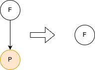

- 若p结点只有左子树,只需要把左子树挂在父结点下并删除该结点即可

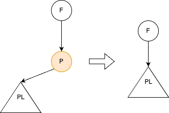

- 若p结点只有右子树,只需要把右子树挂在父结点下并删除该结点即可

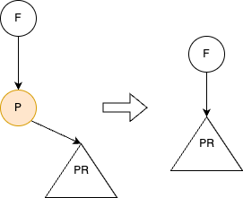

- 若p结点既有左子树又有右子树 

两个办法{++寻找P的前驱S或者后继N替换之++}.以找前驱S为例,由中序遍历的性质,可知P的前驱是其左子树的最右结点;然后用S替换P,并删除节点S,由于其是最右结点只看是情况1或者情况2都比较简单.

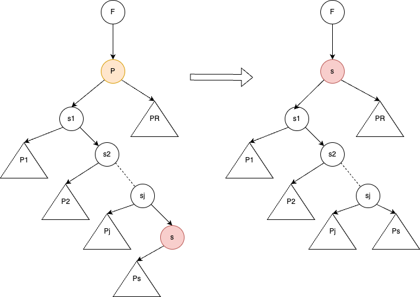

由于BST{++并不保证树的平衡性++},在最坏情况下BST会退化为单链表,此时查找的时间复杂度为$O(N)$.

### 平衡二叉树(AVL树)
{++需要掌握其插入和删除操作的旋转操作++}

^^平衡因子^^ 左右子树高度之差

^^平衡二叉树^^ 对于任意结点其平衡系数只能是$\{-1,0,1\}$三个值中的一个

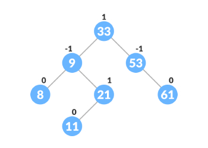

假设结点`a`是失去平衡的最小子树的根结点.
#### 失衡的四种类型(RR,LL,LR,RL)

^^RR型^^ 在该结点的右孩子的右子树上插入结点导致失衡,此时为RR型. --- 左单旋

简单来说调整策略为,抓a结点的右孩子往逆时针方向旋转(成为根结点),然后让右孩子的左子树挂在a的右子树上(a->right=a->right->left),其余不变即可.

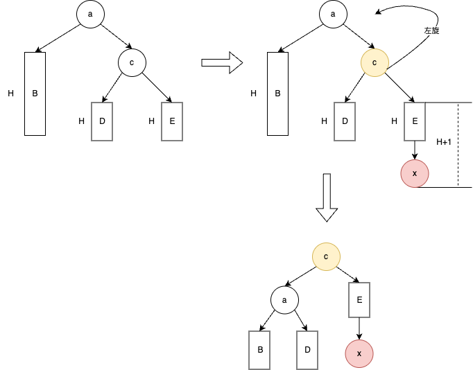

^^LL型^^ 在该结点的左孩子的左子树上插入结点导致失去平衡,此时为LL型 --- 右单旋

调整策略和RR是镜像的,抓a结点的左孩子顺时针旋转(成为根结点),然后让左孩子的右子树挂在a的左子树上(a->left=a->left->right),其余不变

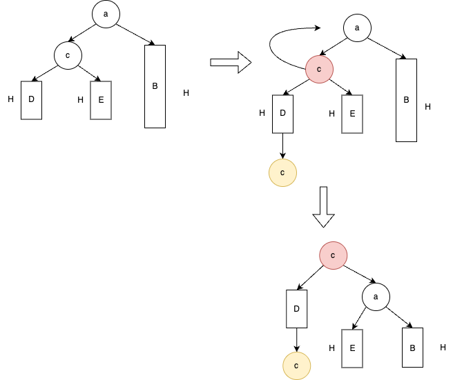

^^LR型^^ 在该结点的左孩子的右子树上插入结点导致失去平衡,此时为LR型 --- 左右双旋

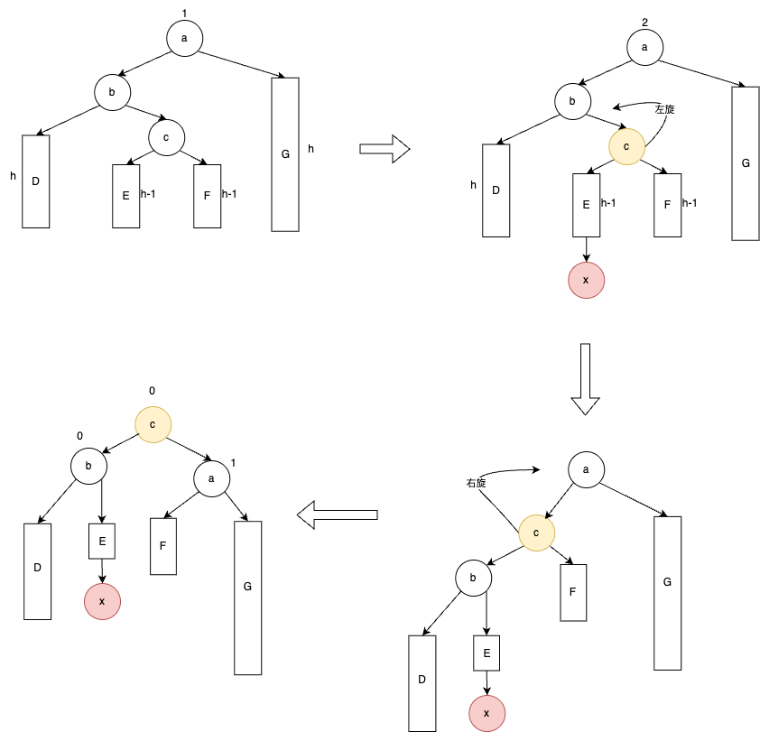

^^RL型^^ 在该结点的右孩子的左子树上插入结点导致失去平衡,此时为RL型 --- 右左双旋

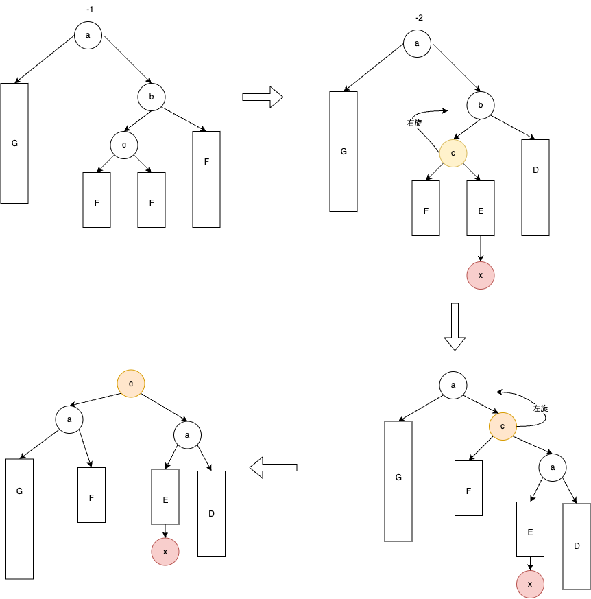

#### 插入操作
插入操作分为两步,第一步为确定插入的位置,第二步为恢复平衡.

^^算法描述^^ 

- 若AVL为空树,则插入一个数据元素为x的新结点作为AVL的根结点,树的高度加1
- 若x的关键字值和AVL的根结点关键字值相同,不执行插入操作
- 若小于根结点的关键字值,并且在AVL的左子树中不存在与x有相同关键字的结点,则将x插入AVL的左子树(递归);当插入后左子树的高度增加时,分别就下列情况进行处理
    - AVL树的根结点的平衡因子为-1,则将根的平衡因子改为0,高度不变
    - AVL树的根结点平衡影子为0,则将根的平衡因子改为1,高度加一
    - AVL树的根结点平衡影子为1,此时为`LL`型不平衡,进行右单旋;操作后将平衡因子改为0,高度不变
    - AVL树左子树根结点的平衡因子为-1,则此时为`LR`型不平衡,需要进行左右双旋操作,更改根,左右子树的平衡因子,树的高度不变.
- 大于根结点时候和小于一样需要分四种情况处理

#### 删除操作
和普通BST树的删除操作保持一致,但需要再删除完后判断是否平衡,若不平衡,判断是四种失衡的哪一种然后调用对应的旋转方法即可.

^^AVL树相关操作的时间复杂度总结^^

|查找|$O(\log{n})$|
|---|------|
|插入|$O(\log{n})$|
|删除|$O(\log{n})$|
|旋转操作|$O(1)$|

### 散列表(Hash表)
通过哈希函数将关键字集合映射到地址空间(哈希表)的办法

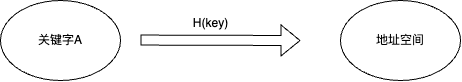

哈希的最关键问题为解决冲突,可以从两个方面着手处理.

- 构造足够优秀的哈希函数
- 解决冲突的办法

#### 哈希函数
这里考研一般不会考察如何设计哈希函数,哈希的重点在于冲突解决.

^^直接地址存储法^^ 取关键字本身或者关键字的线性组合作为哈希函数,即

$$H(key)=key\text{或者}H(key)=a\times key + b$$

^^除留取余法(比较常用)^^ 取关键字被某个不大于散列长度m的数k除后的余数作为散列地址 

$$H(key)=key\% k(k\leq m)$$

{++其中k通常取不大于m的最大质数++}

#### 冲突解决
^^开放定址法^^ 当冲突发生的时候按照一定关系寻找下一个空白位置

$$
h_i=(H(key)+d_i)\% table_size (i=1,2,\ldots,table\_size-1)
$$

其中$d_i$就是开放定址法的关键,通常有三种取法:

- $d_i=1,2,3,\ldots,table\_ size$ 此时称其为线性探测
- $d_i=1^2,-1^2,2^2,-2^2,\ldots,\pm k^2(k\leq table\_ size/2)$ 称为二次探测
- $d_i=\text{伪随机序列或者}d_i=i\times H_i(key)$ 称为伪随机探测

考研需要掌握开放定址法是如何工作的,会模拟即可. 其实很好理解,就是找坑位,没有就按照一定规律往下找,至于是啥规律,看题目要求.

^^再哈希^^ 发生冲突的使用用另外的哈希函数确定地址

^^链地址法(拉链法)^^ 空间换时间,在一个位置开一条链.发生冲突只需要将该元素插入链即可.

例如对于关键字 $\{19,14,23,1,68,20,84,27,55,11,10\}$ 其哈希函数为 $H(key)=key\%13$ ,则其采用拉链法构建的哈希表如图所示

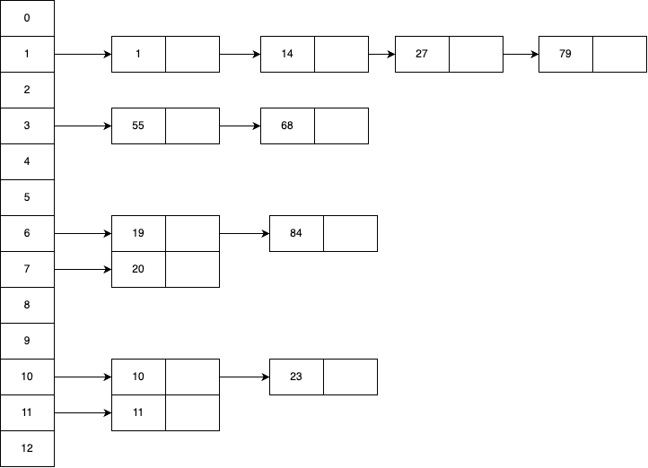

#### 性能分析
^^装填因子^^ 表中以装入的记录与哈希表总长度之比

$$\alpha=\frac{\text{装入记录总个数}}{\text{哈希表总长度}}$$

^^平均查找长度的计算举例^^

假设哈希表长度为7,哈希函数为$H(key)=key\%7$关键字集合为{8,15,22,23,24},按照拉链法处理冲突,最终的哈希表为

- 0: 无
- 1: 8 -> 15 -> 22
- 2: 23
- 3: 24
- 4-6: 无

对于每个关键字,计算查找成功时候的比较次数

- 8: 1次
- 15: 2次
- 22: 3次
- 23: 1次
- 24: 1次

故$ASL(\text{成功})=\frac{1+2+3+1+1}{5}=1.6$
比较失败则是看槽

- 0,4-6 : 1次 (因为已经是空的)
- 1 : 3次 (需要遍历3个元素才知道不存在)
- 2 : 1次 (需要遍历23)
- 3 : 1次 (需要遍历24)

故$ASL(\text{失败})=\frac{1+3+1+1+1+1+1}{7}=\frac{9}{7}$

### B树/B+树

### 红黑树(超难)

