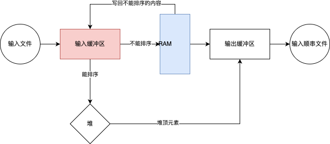

# 排序

几个没啥用的名词

^^排序算法的稳定性^^ 若一个排序算法对于相同关键字的元素排序过程中不改变其相对位置,则是稳定的否则不是.

^^内部排序与外部排序^^ 所有元素都在内存中进行的排序为内部排序;需要在外存中进行排序为外部排序

^^基于比较的排序具有公共下界^^ 可以证明基于比较的排序其算法下界为 $O(n\log(n))$,考研大部分都是基于比较的,只有基数排序(radix sort)是基于非比较的其时间复杂度为 $O(n)$.但基于非比较的排序都有比较严苛的条件.

## 内部排序
下面介绍几种常见内部排序,以升序序列举例

### 三傻排序
^^冒泡排序^^


基本思路每次检查相邻两个元素,如果前一个元素大于后一个元素,则交换,否则不变.当没有元素需要交换的时候,排序就结束了.

时间复杂度为$O(n^2)$, 是稳定排序.

```cpp
void bubble_sort(int *a, int n) {
    bool flag = true;
    while (flag) {
        for (int i = 0; i < n - 1; ++i) {
            if (a[i] > a[i+1]) {
                flag = true;
                std::swap(a[i],a[i+1]);
            }
        }
    }
}

```
^^选择排序^^


时间复杂度$O(n^2)$ 基于数组实现的选择排序是不稳定的(swap操作)

基本思路:每次选择右侧最小的元素与当前位置的元素交换
```cpp
void selection_sort(int *a, int n) {
    for (int i = 1; i < n; i ++) {
        int min = i; 
        
        for (int j = i + 1; j < n; j ++) {
            if (a[j] < a[min]) min = i;
        }

        std::swap(a[i], a[min]);
    }
}

```
^^插入排序^^


时间复杂度为$O(n^2)$,是一种稳定排序算法.


简单来说,插入排序维持遍历点左侧为已经排序好的数组. 

```cpp
void insert_sort(int *q, int n) {
    for (int i = 1; i < n; i++) {
        int key = q[i];
        int j = i - 1;
        
        // 将大于key的元素向后移动
        while (j >= 0 && q[j] > key) {
            q[j + 1] = q[j];
            j--;
        }
        q[j + 1] = key;
    }
}
```

由于插入排序保证遍历点左侧必然是有序的,在寻找插入的过程中可以采用二分优化,但只能优化常数时间

```cpp
// 折半插入排序
void binaryInsertionSort(vector<int>& arr) {
    int n = arr.size();
    for (int i = 1; i < n; i++) {
        int key = arr[i]; // 当前待插入元素
        int left = 0;     // 二分查找的左边界
        int right = i - 1; // 二分查找的右边界

        // 1. 二分查找插入位置
        while (left <= right) {
            int mid = left + (right - left) / 2;
            if (arr[mid] > key) {
                right = mid - 1; // 在左半部分继续查找
            } else {
                left = mid + 1; // 在右半部分继续查找
            }
        }

        // 2. 将大于key的元素向后移动
        for (int j = i - 1; j >= left; j--) {
            arr[j + 1] = arr[j];
        }

        // 3. 插入key到正确位置
        arr[left] = key;
    }
}
```

### 希尔排序
希尔排序是插入排序的优化版本

基本思路,通过分组排序将较小的元素尽快丢到前面,将较大的元素尽快丢到后面.

希尔排序的时间复杂度依赖于增量序列的选择,是一种不稳定算法.


```cpp
class Solution {
    public int[] sortArray(int[] nums){
    shellSort(nums);
    return nums;
  }

  public void shellSort(int[] nums){
        for(int step = nums.length >> 1; step >= 1; step = step >> 1){
            for(int start = step; start < nums.length; start++){
                for(int j = start - step; j >= 0 && nums[j + step] < nums[j]; j-=step){
                    swap(nums, j, j + step);
                }
            }
        }
    }

    public void swap(int[] arr, int i, int j){
        int temp = arr[i];
        arr[i] = arr[j];
        arr[j] = temp;
    }
}
```
### 快速排序
快速排序有两个版本 ^^Hoare分区版本^^ 和 ^^Lomuto分区版本^^


#### Lomuto分区版本(CLRS介绍的)

^^算法描述^^ 

1. ​选择主元(pivot)​​：通常选择最后一个元素作为分区点

​2. 初始化指针​：

   - i = l - 1（表示小于等于pivot的子数组的末尾） 
   - pivot = A[r]（假设选择最后一个元素）

​3. 遍历数组​：

   - 从j = l到r-1遍历
   - 如果A[j] <= pivot：
       - i = i + 1
       - - 交换A[i]和A[j]

​4. 放置主元​：

   - 最后交换A[i+1]和A[r]（将pivot放到正确位置）

​5. 递归处理​:

   - 递归处理(l, i)和(i+2, r)（因为i+1已经是pivot的最终位置）

#### Hoare分区版本


^^算法思路^^ 

1. 核心思想 通过双向扫描+交换数组分成两部分,保证左半部分$\leq$右半部分,递归处理.
2. 关键步骤
      1. 选择基准: 通常取中间元素避免最坏情况
      2. 左指针`i`, 从左到右寻找$\geq$基准的元素
      3. 右指针`j`,从右到左寻找$\leq$基准的元素 
      4. 交换逆序对
      5. 当`i`越过`j`的时候循环结束
      6. 递归处理左子数组和右子数组

平均时间复杂度为 $O(n\log(n))$,最坏为 $O(n^2)$ 空间复杂度为 $O(\log(n))$ -> 递归栈
!!! success "模板"
    ```cpp
    void quick_sort(int q[], int l, int r)
    {
        if (l >= r) return;

        int i = l - 1, j = r + 1, x = q[l + r >> 1];
        while (i < j)
        {
            do i ++ ; while (q[i] < x);
            do j -- ; while (q[j] > x);
            if (i < j) swap(q[i], q[j]);
        }
        quick_sort(q, l, j), quick_sort(q, j + 1, r);
    }
    ```

### 归并排序(二路归并排序)


因为是递归算法,还是比较难理解的. 思考一下基准条件,剩下一个元素时候天然有序,此时进入归并操作,其与令一个只有一个元素的结果归并,产生一个两个有序元素的结果,与另外的有两个元素的结果归并.....最终得到的数组就会是有序的

简单来说归并排序分为两步 `划分`->`归并`

其中`划分`对应代码中的 
```cpp
merge_sort(q, l, mid);
merge_sort(q, mid + 1, r);
```
不断的调用函数将区间不断减少,直到区间只剩一个元素,此时返回并执行归并步骤.

时间复杂度为$O(n\log(n))$ 空间复杂度为$O(n)$
```cpp
int temp[N]; // 临时数组
void merge_sort(int *q, int l, int r) {
    if (l >= r) return ;

    int mid = l + r >> 1;
    merge_sort(q, l, mid);
    merge_sort(q, mid + 1, r);

    // 归并过程
    int k = 0, i = l, j = mid + 1;
    while (i <= mid && j <= r) {
        if (q[i] <= q[j]) temp[k++] = q[i++];
        else temp[k++] = q[j++];
    }

    while (i <= mid) temp[k++] = q[i++];
    while (j <= r) temp[k++] = q[j++];

    for (int i = l, j = 0; i <= r; i++, j++) q[i] = temp[j];
}
```

### 堆排序
见chapter 4 - 堆与堆排序 

时间复杂度为$O(n\log(n))$ 空间复杂度为 $O(1)$ 不稳定排序
### 基数排序


基数排序是基于非比较的,时间复杂度为$O(d\cdot(n+k))$其中d为最大位数,n为元素数量,k为进制(例如十进制k=10,二进制k=2),基数排序是稳定的. 

^^算法思路^^

- 按照从最低位(LSD)或者最高位(MSD)开始,根据当前值将元素分配到对应的桶中(0-k) 
- 按照从(0-k)的顺序收集桶中元素
- 重复直到所有位都处理完毕

若位数不够则补充`0`

```cpp
void radixSort(std::vector<int>& nums) {
    if (nums.empty()) return;
    
    int max_val = *max_element(nums.begin(), nums.end());
    int exp = 1; // 当前位数（1表示个位，10表示十位...）
    const int radix = 10; // 基数（十进制）
    
    // 临时数组和计数数组
    std::vector<int> tmp(nums.size());
    std::vector<int> count(radix);
    
    while (max_val / exp > 0) {
        // 1. 清空计数
        fill(count.begin(), count.end(), 0);
        
        // 2. 统计当前位各数字出现次数
        for (int num : nums) 
            count[(num / exp) % radix]++;
        
        // 3. 计算累计位置（使排序稳定）
        for (int i = 1; i < radix; i++)
            count[i] += count[i - 1];
        
        // 4. 从后向前放置元素（保证稳定性）
        for (int i = nums.size() - 1; i >= 0; i--) {
            int digit = (nums[i] / exp) % radix;
            tmp[--count[digit]] = nums[i];
        }
        
        // 5. 将临时数组写回原数组
        copy(tmp.begin(), tmp.end(), nums.begin());
        
        exp *= radix; // 处理下一位
    }
}
```
### 内部排序的总结
| 排序算法       | 平均时间复杂度 | 最坏时间复杂度 | 空间复杂度 | 稳定性 | 备注                     |
|----------------|----------------|----------------|------------|--------|--------------------------|
| **冒泡排序**   | O(n²)          | O(n²)          | O(1)       | 稳定   | 适合小规模数据           |
| **选择排序**   | O(n²)          | O(n²)          | O(1)       | 不稳定 | 交换次数少               |
| **插入排序**   | O(n²)          | O(n²)          | O(1)       | 稳定   | 适合近乎有序数据         |
| **希尔排序**   | 基于递增序列     | O(n²)          | O(1)       | 不稳定 | 插入排序改进版           |
| **归并排序**   | O(n log n)     | O(n log n)     | O(n)       | 稳定   | 需额外空间               |
| **快速排序**   | O(n log n)     | O(n²)          | O(log n)   | 不稳定 | 实际应用中最快           |
| **堆排序**     | O(n log n)     | O(n log n)     | O(1)       | 不稳定 | 适合大规模数据           |
| **计数排序**   | O(n + k)       | O(n + k)       | O(n + k)   | 稳定   | k 为数据范围             |
| **桶排序**     | O(n + k)       | O(n²)          | O(n + k)   | 稳定   | k 为桶数量               |
| **基数排序**   | O(d(n + k))    | O(d(n + k))    | O(n + k)   | 稳定   | d 为位数，k 为基数（10） |


## 外部排序

### 二路归并外排序
与内排序的基本思想一致,举例说明二路归并外排序的基本步骤.
^^算法描述^^
​1. 分割阶段​

​分块读入​：将大文件划分为若干小块，每次读取内存能容纳的数据量（如1GB内存则分块≤1GB）。

​内部排序​：在内存中对每个小块使用快速排序等算法排序，完成后写回磁盘。此时磁盘上有多个有序的子文件​（称为“归并段”）。

​2. 归并阶段​

​二路归并​：每次从两个有序归并段中各取一部分数据到内存，按序合并成一个更大的有序段，写回磁盘。

​多轮归并​：重复上述过程，每轮将归并段数量减半，直到最终合并为一个全局有序文件。

!!! example "二路归并外排序"
    设有一个文件,内含4500条记录: ${A}_{1},{A}_{2},\cdots ,{A}_{4500}$ ,现在要对该文件进
    行排序,但可占用的内存空间至多只能对750条记录进行排序。输入文件(被排序的文件)放在磁盘上,页块长为 250 条记录。
    
    排序过程如下：

    1. 每次对三个页块( 750 条记录)进行内排序,整个文件得到 6 个顺串 ${R}_{1} - {R}_{2}$ ,这
    可用内排序算法来实现,把这6个顺串存放到磁盘上,
    
    2. 取三个内存页块,每块可以容纳250条记录,把其中两块作为输入缓冲区,另一块作为输出缓冲区.
    
    3. 进行多轮归并
    

### 多路归并外排序: 选择树

选择树是{++完全二叉树++}有两种类似:胜者树和败者树

#### 胜者树
如图所示,这是一个8路归并胜者树


叶结点存储待归并的顺串中的记录,用数组 $L[i]$ 表示.比如 $L[1]=10$ 表示顺串1要归并的下一个记录的关键字为10;非叶结点表示的是子节点比赛的胜者(具体规则看要求,比如说这里就是关键字小的为胜者),用数组 $B[i]$ 表示,例如 $L[2] = 9 < L[1] = 1-$ 故$B[4]=2$.

每次胜者树的全局胜者加入输出缓冲区,缓冲满后将缓冲区内容输入外存. 当一次胜者确定后,删除对应叶子结点记录,并加入对应顺串的下一条记录,并更新胜者树,如图所示.


#### 败者树


败者树非叶结点记录每次比赛的败者,但每次往上还是传递比赛的胜者信息,最终有一个特殊节点$B[0]$记录全局胜者

将全局胜者加入输出缓冲区,缓冲区满后将内容输出到外存.删除对应叶子结点的记录,并加入对应顺串的下一条记录,更新败者树.

只需要将新加入的结点与其父结点进行比较,而把胜者在与上一级的父节点比较,不断进行直到结点 $B[1]$ 并更新 $B[0]$,重复步骤即可.

{++时间复杂度为$O(k+n\log(k))$++}
### 最佳归并树
本质为{++k叉huffman树++}

假设有九个顺串,其在外存中所占的块数为{6,13,25,8,9,2,14,7,10}则其按照普通归并树的结果如图所示


采用3叉huffman形成的最佳归并树如下所示


建立最佳归并树的过程即huffman算法具体看chapter 4 - huffman算法

其中普通归并树需要的访外总次数(读/写块次数)为 $(6+13+25+8+9+2+14+7+10)\times 2\times 2=376$ 

而最佳归并树的次数为 $(2+6+7)\times 3\times 2 + (13+14)\times 2\times 2 + (8+9+10)\times 2\times 2 + 25\times 2 = 356$
### 置换选择外排序

是对外部排序的预处理->生成顺串,关键在于引入一个长度为`M`条记录的RAM(数组,支持随机存取),在输入缓冲区中维护一个堆




举例说明 假设RAM可以存储3条记录,输入数据为 {5, 11, 7, 2, 9, 8, 6} 要求按升序排列

第一步初始化堆 首先加入三条记录 {5, 11, 7}, 此时堆顶元素为5 

第二步输出堆顶元素 {5} -> 输出缓冲区 {5}

第三步加入第四条记录{2}, 此时 2 < 5, 不能加入堆,此时堆中元素为{7, 11},RAM中元素为{7,11,2}

第四步输出堆顶元素 {7} -> 输出缓冲区, 此时 {5, 7};堆中元素为{11}, RAM中元素为{11,2}

第五步加入第五条记录 {9} , 此时{9>7}可以加入堆,并重建堆,此时堆中元素为{9, 11}, RAM中元素为{9, 11, 2}

第六步输出堆顶元素 {9} -> 输出缓冲区, 此时 {5, 7, 9};堆中元素为{11}, RAM中元素为{11,2}

第七步加入第六条记录{8}, 此时8<9, 不能加入堆,此时RAM元素为{11, 2, 8} 

第八步输出堆顶元素 {11} -> 输出缓冲区, 此时 {5, 7, 9, 11}; 此时堆为空,RAM中元素为{2, 8}

第九步加入第七条记录{6}, 此时 6 < 11, 不能加入堆,此时RAM元素为{2, 8, 6},建立最小堆,并输出堆排序{2, 6, 8}

此过程生成两个顺串{5, 7, 9, 11} 和 {2, 6, 8} 