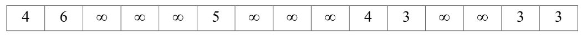
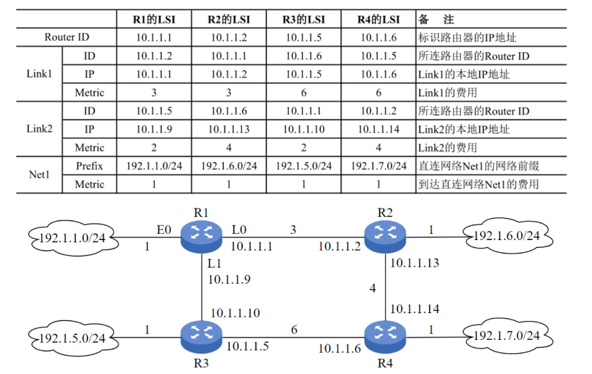

# 数据结构
## 代码题

### 2009统考真题
已知带头结点的单链表，节点结构为`data`和`link`，头指针为`list`。在不改变链表的前提下,设计高效算法查找倒数第k个节点（k为正整数），若成功则输出`data`并返回1，否则返回0。

**要求**：

1. 描述算法的基本设计思想。
2. 描述算法的详细实现步骤。
3. 用C/C++/Java实现算法（需注释关键部分）。


### 2010统考真题
设将 $n$（$n > 1$）个整数存放到一维数组 $R$ 中。设计一个在时间和空间两方面都尽可能高效的算法。将 $R$ 中保存的序列循环左移 $p$（$0 < p < n$）个位置，即将 $R$ 中的数据由 $(X_0, X_1, \cdots, X_{n - 1})$ 变换为 $(X_p, X_{p + 1}, \cdots, X_{n - 1}, X_0, X_1, \cdots, X_{p - 1})$。

要求:
1. 给出算法的基本设计思想。
2. 根据设计思想，采用 C 或 C++ 或 Java 语言描述算法，关键之处给出注释。
3. 说明你所设计算法的时间复杂度和空间复杂度。

### 2011统考真题

- 定义升序序列$S$的中位数：长度为$L(L \geq 1)$的升序序列$S$，第$\left\lfloor \frac{L}{2} \right\rfloor$个位置的数为中位数。  
  - 示例：$S_1 = (11,13,15,17,19)$的中位数为15；$S_2 = (2,4,6,8,20)$的中位数为8；$S_1$和$S_2$合并后的中位数为11。  
- **问题**：有两个等长升序序列$A$和$B$，设计高效算法找出它们的中位数。  

**要求**：  
1. 给出算法的基本设计思想。  
2. 用C/C++/Java描述算法，关键处加注释。  
3. 说明时间复杂度和空间复杂度。  

### 2012统考真题
**题目**：采用带头结点的单链表存储单词，共享相同后缀。如"loading"和"being"的存储映像如下图。设计高效算法找出`str1`和`str2`共同后缀的起始位置（如图中字符`i`所在节点）。

**要求**：
1. 给出算法的基本设计思想。
2. 用C/C++/Java实现算法（需注释关键部分）。
3. 说明算法时间复杂度。


### 2013统考真题

- 定义主元素：整数序列$A = (a_0, a_1, \dots, a_{n-1})$中，若存在$x$使得$a_{p1} = a_{p2} = \dots = a_{pm} = x$且$m > n/2$（$0 \leq p_k < n$），则$x$为主元素。  
  - 示例：  
    - $A = (0,5,5,3,5,7,5,5)$的主元素为5；  
    - $A = (0,5,5,3,5,1,5,7)$无主元素。  
- **问题**：设计高效算法找出主元素，存在则输出该元素，否则输出-1。  

**要求**：  
1. 给出算法基本设计思想。  
2. 用C/C++/Java描述算法，关键处加注释。  
3. 说明时间复杂度和空间复杂度。  
 


### 2014统考真题
**题目**：二叉树T（二叉链表存储），叶节点的`weight`为非负权值，求带权路径长度（WPL）之和。

**要求**：

1. 给出算法的基本设计思想。
2. 定义二叉树节点的数据类型（C/C++）。
3. 实现算法并注释关键部分。

### 2015统考真题
**题目**：单链表节点结构为`[data|link]`（`|data| ≤ n`），删除所有绝对值相等的节点，仅保留第一次出现的节点。

**示例**：

- 输入：`head → 21 → -15 → -15 → -7 → 15 → NULL`
- 输出：`head → 21 → -15 → -7 → NULL`

**要求**：

1. 给出算法的基本设计思想。
2. 定义单链表节点的数据类型（C/C++）。
3. 实现算法并注释关键部分。
4. 说明时间复杂度和空间复杂度。

### 2016统考真题
**题目** 已知由 $n(n\geq 2)$ 个整数构成的集合 $A=\{a_k\mid 0\leq k < n\}$, 将其划分为两个不相交的集合 $A_1,A_2$ 元素个数分别为 $n_1,n_2$, $A_1,A_2$ 中的元素之和分别是 $S_1, S_2$. 设计一个尽可能高效的划分算法,满足 $\left|n_1-n_2\right|$ 最小且 $\left|S_1-S_2\right|$ 最大. 

**要求** 

1. 给出算法基本思路
2. 根据设计思想,采用C/C++语言描述算法,关键之处给出注释.
3. 说明你所设计算法的平均时间复杂度和空间复杂度.


### 2017统考真题
**题目**：将表达式树（二叉树）转换为等价的中缀表达式（通过括号反映计算次序）。

**示例**：

- 输入树1 → 输出：`(a + b) * (c * (-d))`
- 输入树2 → 输出：`(a * b) + (-(c - d))`

**节点定义**：
```c
typedef struct node {
    char data[10];        // 操作数或操作符
    struct node *left, *right;
} BTree;
```

**要求**：

1. 给出算法的基本设计思想。
2. 实现算法并注释关键部分。

### 2018统考真题

- 问题：给定含$n$（$n \geq 1$）个整数的数组，设计高效算法找出未出现的最小正整数。  
  - 示例：  
    - $[-5,3,2,3]$的最小未出现正整数为1；  
    - $[1,2,3]$的最小未出现正整数为4。  

**要求**：  

1. 给出算法基本设计思想。  
2. 用C/C++描述算法，关键处加注释。  
3. 说明时间复杂度和空间复杂度。  


### 2019统考真题
**题目**：带头结点的单链表`L = (a1, a2, ..., an)`，重新排列为`L' = (a1, an, a2, an-1, a3, an-2, ...)`，空间复杂度要求O(1)。

**要求**：

1. 给出算法的基本设计思想。
2. 用C/C++实现算法（需注释关键部分）。
3. 说明时间复杂度。

### 2020统考真题

- 定义三元组距离：$D = |a-b| + |b-c| + |c-a|$，其中$a,b,c$为正数。  
- 给定三个升序数组$S_1, S_2, S_3$，计算所有可能的三元组$(a \in S_1, b \in S_2, c \in S_3)$的最小距离。  
  - 示例：  
    - $S_1 = \{-1,0,9\}$，$S_2 = \{-25,-10,10,11\}$，$S_3 = \{2,9,17,30,41\}$；  
    - 最小距离为2，对应三元组$(9,10,9)$。  

**要求**：  

1. 给出算法基本设计思想。  
2. 用C/C++描述算法，关键处加注释。  
3. 说明时间复杂度和空间复杂度。  


### 2021统考真题
**题目**：无向连通图G（邻接矩阵存储），当度为奇数的顶点数≤2时，存在包含所有边的EL路径（长度为|E|）。判断G是否存在EL路径。

```c
typedef struct {
    int numVertices, numEdges;      // 顶点数和边数
    char VerticesList[MAXV];        // 顶点表
    int Edge[MAXV][MAXV];           // 邻接矩阵
} MGraph;
```

**要求**:

1. 给出算法的基本设计思想。
2. 实现算法并注释关键部分。
3. 说明时间复杂度和空间复杂度。


### 2022统考真题
**题目**：非空二叉树T采用顺序存储（数组`SqBiTNode[MAX_SIZE]`，`ElemNum`为实际占用元素数），不存在的节点用`-1`表示。判断是否为二叉搜索树。

**示例**：

- T1: `[40, 25, 60, -1, 30, -1, 80, -1, -1, 27]`（ElemNum=10）
- T2: `[40, 50, 60, -1, 30, -1, -1, -1, -1, 35]`（ElemNum=11）

**要求**：

1. 给出算法的基本设计思想。
2. 实现算法并注释关键部分。


### 2023统考真题
**题目**：有向图G（邻接矩阵存储），出度>入度的顶点称为K顶点。输出所有K顶点并返回个数。

**数据结构**：
```c
typedef struct {
    int numvertices, numEdges;      // 顶点数和有向边数
    char verticesList[MAXV];        // 顶点表
    int Edge[MAXV][MAXV];           // 邻接矩阵
} MGraph;
```

**示例**：
- 顶点a和b为K顶点（出度>入度）。

**要求**：

1. 给出算法的基本设计思想。
2. 实现算法并注释关键部分。

### 2024年统考真题
某载人航天工程可抽象为有向图的拓扑序列问题。已知有向图 G 采用邻接矩阵存储，类型定义如下：

```cpp
typedef struct {  // 图的类型定义
    int numVertices, numEdges;  // 图的顶点数和边数
    char VerticesList[MAXV];    // 顶点表,MAXV为已定义两
    int Edge[MAXV][MAXV];       // 邻接矩阵
}MGraph;
```

请设计算法 int uniquely(MGraph G)，判定 G 是否存在唯一的拓扑序列，若是则返回 1，否则返回 0。要求：

1) 给出算法的基本设计思想。

2) 根据设计思想，采用 C 或 C++ 语言描述算法，关键之处给出注释
### 2025年统考真题

## 应用题

特点 {++不需要写代码++} 只需要写出算法思路/解法分析.

### 2009年统考真题
带权图(权值非负,表示边连接的两顶点间的距离)的最短路径问题是找出从初始顶点到目标顶点之间的一条最短路径。假设从初始顶点到目标顶点之间存在路径,现有一种解决该问题的方法：

①设最短路径初始时仅包含初始顶点,令当前顶点 $\mathrm{u}$ 为初始顶点；

②选择离 $\mathrm{u}$ 最近且尚未在最短路径中的一个顶点 $\mathrm{v}$ ,加入最短路径中,修改当前顶点 $\mathrm{u} = \mathrm{v}$ ；

③重复步骤②,直到 $\mathrm{u}$ 是目标顶点时为止。
请问上述方法能否求得最短路径？若该方法可行,请证明之；否则,请举例说明。

### 2010年统考真题

将关键字序列(7,8,30,11,18,9,14)散列存储到散列表中。散列表的存储空间是一个下标从 0 开始的一维数组,散列函数为 $\mathrm{H}\left( \mathrm{{key}}\right)  = \left( {\mathrm{{key}} \times  3}\right) {\;\operatorname{mod}\;7}$ 处理冲突采用线性探测再散列法,要求装填(载)因子为0.7.

1. 请画出所构造的散列表。
2. 分别计算等概率情况下查找成功和查找不成功的平均查找长度。

### 2011年统考真题
已知有6个定顶点(顶点编号0~5)的有向带权图G,其邻接矩阵A为上三角矩阵,按行为主序(行优先存储)在如下的一维数组中



1. 写出图G的邻接矩阵A
2. 画出有向带权图G
3. 求G的关键路径,并计算该关键路径的长度

### 2012年统考真题
 设有 6 个有序表 A、B、C、D、E、F,分别含有 10、35、40、50、60 和 200 个数据元素,各表中元素按
升序排列。要求通过 5 次两两合并,将 6 个表最终合并成 1 个升序表,并在最坏情况下比较的总次数达到
最小。请回答下列问题。

1. 给出完整的合并过程,并求出最坏情况下比较的总次数。
2. 根据你的合并过程,描述 $\mathrm{N}\left( {\mathrm{N} \geq  2}\right)$ 个不等长升序表的合并策略,并说明理由。
### 2013年统考真题

设包含 4 个数据元素的集合: $S = \left\{  {{}^{\prime }{do}{}^{\prime },{}^{\prime }{for}{}^{\prime },{}^{\prime }{repeat}{}^{\prime },{}^{\prime }}\right.$ while $\left. {}^{\prime }\right\}$ 各元素的查找概率依次为 ${p}_{1} = {0.35}$ ,
${p}_{2} = {0.15},{p}_{3} = {0.15},{p}_{4} = {0.35}$ 。将 $\mathrm{S}$ 保存在一个长度为 4 的顺序表中,采用折半查找法,查找成功时的平均查找长度为 2.2 。

1. 若采用顺序存储结构保存 $\mathrm{S}$ ,且要求平均查找长度更短,则元素应如何排列？应使用何种查找方法？查找成功时的平均查找长度是多少?
2. 若采用链式存储结构保存 $\mathrm{S}$ ,且要求平均查找长度更短,则元素应如何排列？应使用何种查找方法？查找成功时的平均查找长度是多少?

### 2014年统考真题
某网络的路由器运行OSPF协议,下表是路由器R1维护的主要链路状态信息LS1,R1构造的网络拓扑结构如图是根据题下表及R1的接口名构造出来的网络拓扑



1. 本题中的网络可抽象为数据结构中的那种逻辑结构?
2. 针对表中的内容,设计合理的链式存储结构,以保存表中的链路状态信息(LSI).要求给出链式存储结构的数据类型定义,并还出对应表的链式存储结构示意图(示意图中可仅以ID表示结点)
3. 按照Dijkstra算法的策略,依次给出R1到达子网192.1.x.x的最短路径及费用

### 2015年统考真题

已知包含5个结点的图G如下所示.

1. 写出G的邻接矩阵A(行,列下标从0开始)
2. 求 $A^2$, 矩阵 $A^2$ 中位于0行3列元素值的含义是啥?
3. 若已知具有n个顶点的图的邻接矩阵B,则 $B^m$ 中非零元素的含义是啥?
### 2016年统考真题

如果一颗非空k叉树T中每个非叶节点都有k个孩子,则称T为正则k叉树.回答下列问题并给出推导过程.

1. 若T有m个非叶结点,则T中的叶结点有多少个?
2. 若T的高度为h(单结点的树h=1),则T的结点数最多为多少?最少为多少?

### 2017年统考真题
使用Prim算法求带权连通图的最小代价生成树.回答下列问题.

1. 对于下图G,从A开始求G的MST,依次给出按算法选出的边
2. 图G的MST是唯一的吗?
3. 对应任意带权连通图,满足啥条件的时候,其MST是唯一的?
### 2018年统考真题

### 2019年统考真题

设计一个队列,要求满足

- 初始时队列为空
- 入队时,运行增加队列占用空间
- 出队后,出队元素所占的空间可以重复使用,即整个队列所占用的空间只增不减
- 入队操作和出队操作的时间复杂度均保持在 $O(1)$

回答下面问题

1. 该队列应该选择何种存储结构?
2. 画出队列的初始状态,并给出判断队空和队满的条件.
3. 画出第一个元素入队后的队列状态
4. 给出入队操作和出队操作的基本过程

### 2020年统考真题
若任一个字符的编码都不是其他字符编码的前缀, 则称这种编码具有前缀特性。现有某字符集(字符个数≥2)的不等长编码,每个字符的编码均为二进制的 0、1 序列,最长为 L 位,且具有前缀特性。请回答下列问题: 

1. 哪种数据结构适宜保存上述具有前缀特性的不等长编码？
2. 基于你所设计的数据结构,简述从 $0/1$ 串到字符串的译码过程。
3. 简述判定某字符集的不等长编码是否具有前缀特性的过程。

### 2021年统考真题
已知某排序算法如下
```cpp
void compCountSort(int a[], int b[], int n) {
    int i, j, *count;
    count = (int *)malloc(sizeof(int) *n);
    for (i = 0; i < n; ++i) count[i] = 0;
    for (i = 0; i < n; ++i)
        for (j = i + 1; j < n; ++j)
            if(a[i]<a[j]) count[j]++;
            else count[i]++;
    
    for (i = 0; i < n; ++i) b[count[i]] = a[i];
    free(count); 
}
```
回答下列问题:

1. 若 int a[] = {25,-10,25,10,11,19}, b[6]; 则调用上述函数后数组b中的内容是?
2. 若a中含有n个元素,则算法执行过程中,元素间的比较次数是多少?
3. 该算法稳定吗?若是,说明理由,否则修改为稳定排序算法.
### 2022年统考真题
现有n(n>1000000)个数保存在一维数组M中,需找M中最小的10个数,回答下列问题

1. 设计一个完成上述查找任务的算法,要求平均情况下比较次数尽可能少,简述算法思路(不需要算法实现)
2. 说明你所设计的算法平均情况下的时间复杂度和空间复杂度.

### 2023年统考真题
对含有n个记录的文件进行外部排序,采用置换-选择排序生成初始归并短时需要使用一个工作区,工作区中能保存m个记录.

1. 若文件中含有19个记录,其关键字分别为51,94,37,92,14,63,15,99,48,56,23,60,31,17,43,8,90,166,100,当m=4的时,可生成多少个归并端?各是啥?
2. 对于任意的m,生成的第一个初始归并短的长度最大值和最小值分别是多少?
### 2024年统考真题
将关键字序列 20, 3, 11, 18, 9, 14, 7 依次存储到初始为空、长度为 11 的散列表 HT 中, 散列函
数 $\mathrm{H}\left( \mathrm{{key}}\right)  = \left( {\mathrm{{key}} \times  3}\right) \% {11}$ 。 $\mathrm{H}\left( \mathrm{{key}}\right)$ 计算出的初始散列地址为 ${\mathrm{H}}_{0}$ ,发生冲突时探查地址序列是 ${\mathrm{H}}_{1},{\mathrm{H}}_{2},{\mathrm{H}}_{3},\cdots$ ,
其中, ${\mathrm{H}}_{\mathrm{k}} = \left( {{\mathrm{H}}_{0} + {\mathrm{k}}^{2}}\right) \% {11},\mathrm{k} = 1,2,3,\cdots$ 。

1. 画出所构造的 HT, 并计算 HT 的装填因子。
2. 给出在 HT 中查找关键字 14 的关键字比较序列。
3. 在 HT 中查找关键字 8 , 确认查找失败时的散列地址是多少? 
### 2025年统考真题