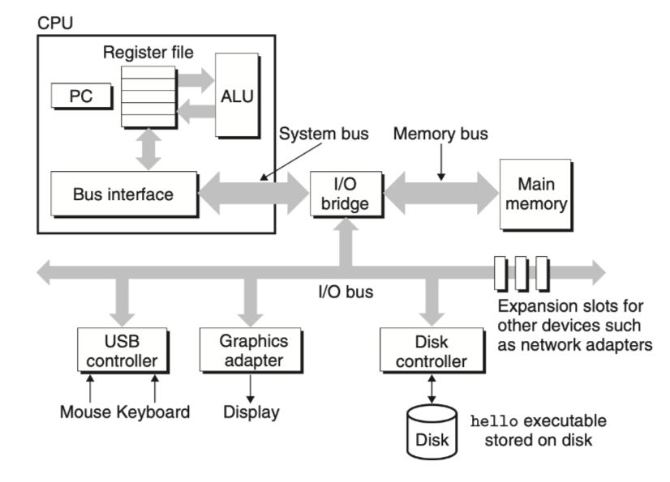
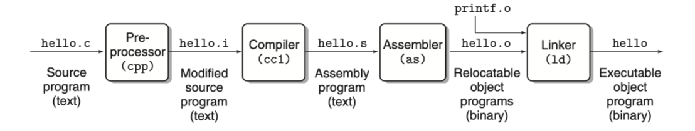
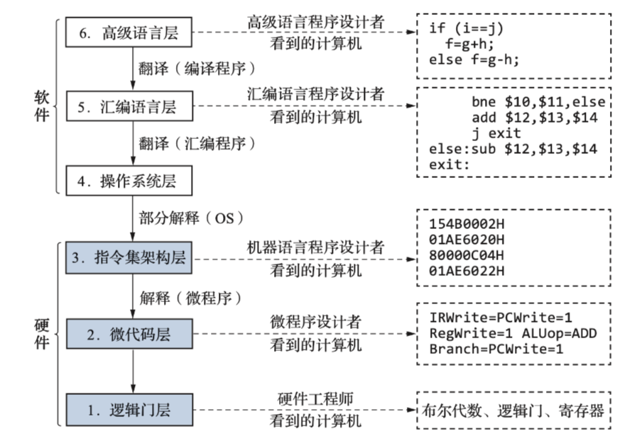

# 计算机系统概述

## 计算机系统的组成部分

一台完整的计算机由{++软件与硬件++}组成,有一部分固化的软件称为{++固件++}.

^^冯 诺依曼体系结构^^ 计算机的硬件系统包含 {++运算器,控制器,存储器,输入输出设备++}五部分. 其中运算器和控制器合称中央处理器(CPU),CPU和存储系统合称主机.

^^冯 诺依曼体系结构^^ 的核心思想 

- {++存储程序++} 将程序和运行程序所需要的数据以{++二进制++}的形式存放在存储器中

- {++程序控制++} 计算机中的控制器{++逐条++}取出存储器中的指令并按顺序执行

软件通常分为 {++系统软件++}和{++应用软件++}, 常见的系统软件有: {++操作系统++}, 程序设计语言及语言处理程序, 数据库管理系统.

## 程序的编译过程 

常见的高级语言有两种 {++编译型++}如CPP,C等, {++解释型++}如Python. 其中编译型需要通过如下编译步骤生成可执行文件(如.exe文件)才能执行;而解释型语言只需要通过解释器{++逐条++}翻译并执行而不需要生成可执行文件.

{++编译过程++}

- 预处理程序
    - 展开头文件(#include),宏定义(#define)等
- 编译程序
    - 将高级语言程序转换边汇编语言程序
- 汇编程序 
    - 将汇编语言程序转换会{++可重定位++}的二进制文件
- 链接器
    - 将多个.o文件链接在一起生成可执行的二进制文件

## 计算机系统的层次系统

{++ISA(系统指令集架构)++} 是计算机体系结构中与程序设计有关的部分，包含了处理器能够执行的所有指令的集合，以及这些指令的操作数类型、寻址方式等。

各层之间的关系 {++高层是低层功能的拓展,低层是高层的基础++}

^^软件和硬件逻辑功能的等价性^^ 在功能层面，硬件和软件可以实现相同或相似的计算或控制逻辑. 通常来说用硬件实现速度更快.

## 计算机性能指标和评价

{++字长++} 指CPU一次能处理的数据位数. {++字长一般和计算机内部存储器,运算器,数据总线++}的位宽相同.

- 字长越长计算精度越高,反之越低
- 字长越长定点数表示范围越大,浮点数表示范围越大,精度越高

{++主存容量++} 通常用 MxN表示,其中 M表示存储单元数,也称{++字容量++};N表示每个存储单元存储二进制数,也称{++位容量++}.

{++时钟周期++} 计算机中的最基本,最小的时间单位. 在一个时钟周期内,CPU仅完成一个最基本的动作.

- 时钟周期是时钟频率的倒数, 也称{++节拍周期(T周期)++}

{++CPI(Clock Cycles Per Instruction)++} 执行每条指令所需要的平均时钟周期数.

$$
CPI=\frac{m}{IC}
$$

- m 表示程序执行所有指令所需要的时钟周期数
- IC 表示总指令条数

{++CPU时间++} 又称CPU执行时间.

$$
T_{cpu}=m\times T = \frac{m}{f} = CPI\times IC\times T = \frac{CPI\times IC}{f}
$$

- T 机器时钟周期
- f 机器的时钟频率

{++IPC(Instruction Per Cycle)++} 每个时钟周期CPU能执行的指令条数. 是CPI的倒数.

{++MIPS(Million INstructions Per Second)++}  每秒百万条指令. 

$$
MIPS=\frac{IC}{T_{cpu}\times 10^6} = \frac{f}{CPI} = IPC\times f
$$

- f的单位为MHz

{++MFLOPS++} 计算机每秒执行浮点数的次数(以M为单位),更大的单位有 GFLOPS(10^9),TFLOPS(10^12),PFLOPS(10^15),EFLOPS(10^18),ZFLOPS(10^21).