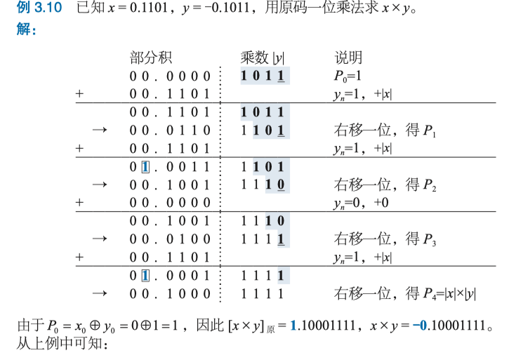

# 数据表示和运算

## 数的机器码表示
由符号和数值一起编码表示的二进制数,称为 ^^机器数^^ 或 ^^机器码^^

### 定点数的四种编码方式(原码,反码,补码与移码)
{++原码++} 正数符号位用0表示,负数符号位用1表示;数值位保持不变

- 有 `+0` 和 `-1`两个编码
    - `+0` 0000000.... `-0` 1000000...
    - 加减法实现不容易(符号位不能直接参加运算),目前只用在浮点数的{++尾数++}
        - 加法 "同号求和,异号求差"
        - 减法 "同号求差,异号求和"

{++反码++} 符号位规则和原码一致,当真值为正数的时候,反码与原码一致;当真值是负数的时候,反码{++数值位++}为真值数值位{++按位取反++}.

- $[x]_反$ + $\left|x\right|$ 的值为 `1111.....` 
- 有`+0`和`-0`
    - `+0` 00000...0, `-0` 1111...1
    - 加减法符号位可以直接参加运算
      - 加法为反码加法(循环进位-参考UDP校验和)
      - 减法运算转换为加法运算

{++补码++} 又称模2的补码 简单来说当真值大于等于0的时候,补码等于真值;若小于等于0,补码数据为等于{++真值数据为按位取反加一++}

- 只有唯一`0` 0000...0

{++移码++} 直接将真值x加一个常量偏移值(bias)

- 通常用在浮点数的阶码
- 移码可以{++直接参加比较++}
- 移码的{++符号位`0`表示负数,`1`表示正数++}
- 同一数值时,移码除符号位与补码相反外,其余完全一致
- 存在唯一`0` 1000...0

^^四种编码方式的总结^^

{++溢出++} 当数据超出机器所能表示的范围

- 当超出最大正数时,发生正上溢
- 小于最小负数,发生负下溢

### 浮点数表示方法 IEEE 754

{++IEEE 754单精度浮点数++}

- S 表示符号位 0表示正数,1表示负数
- E 表示阶码 采用移码其偏移量为 ($2^7 - 1 = 127$)
- M 表示尾数 
    - 采用隐藏`1`方式,即尾数的实际有效位数为24位 1.xxxxxx(尾数)
    - 可以看做原码,符号与S一致

- 规格数的计算公式为 $N=(-1)^s\times 2^{E-bias}\times 1.M$ 其中bias=127
- 非规格数的计算公式为 $N=(-1)^s\times 2^{-126}\times 0.M$

- 浮点数的分布是{++不均匀的++}
- 浮点数不满足{--交换律--} 小数可能会被大数吸收
    - (大数a+小数b)-大数a $\neq$ (大数a-大数a)+小数b

{++单精度浮点数与真值的转换++}

### 计算机中的数据表示

在64位机器和32位机器上,部分类型所占的字节并不相同.

- `short`是 2B
- `int` 是 4B 
- `char`是 1B
- `double`是 8B
- `float`是 4B

## 运算方法和运算器

### 常见运算符
{++位运算++}

- & 按位与 
- | 按位或
- ~ 按位取反
- ^ 按位异或

{++逻辑运算++}

- && 逻辑与
- || 逻辑或
-  ! 逻辑非

{++移位运算++}

- `>>` 右移操作 
    - 等价于除2
    - 有算术右移(高位补充符号位)和逻辑右移两种(高位补充0)
- `<<` 左移操
    - 等价于乘2

### 定点数的加减运算

{++补码加法++}

$$
[X]_{补}+[Y]_{补}=[X+Y]_{补}\ (mod\ M)
$$

{++补码减法++}

$$
[X-Y]_{补}=[X]_补+[-Y]_{补}=[X]_{补}-[Y]_{补}\ (mod\ M)
$$

- 其中M为 $2^{n+1}$, n不含符号位

{++溢出++} 由于机器字长是有限的,表示数据的范围是有限的,当两个大整数相加的时候结果得到一个负数或者一个正数减去一个负数结果得到负数.

{++溢出检测++}

- 根据操作数与运算结果的符号是否一致进行检测
    - 假设 $X_f, Y_f$ 为操作数的符号位, $S_f$ 为运算结果的符号位, $V$ 为溢出标志
    -  $V=X_fY_f\bar{S_f}+\bar{X_f}\bar{Y_f}S_f$
    -  V=1的时候表示发生了溢出
    -  加法出现{++正正得负,负负得正++}发生溢出
    -  减法可以转换为加法处理
-  根据运算过程中最高数据位的进位和符号位的进位是否一致进行检测
    - 设运算时最高有效位产生的进位信号为 $C_d$, 符号位产生的进位信息为 $C_f$, $V$ 为溢出标志
    -  $V=C_d\oplus C_f$  
    -  
          - 假设 $x=-111$ $y=110$ 计算 $[x-y]_{补}$
          - 如上图所示,结果 $C_f=1$ $C_d=0$ 故发生了溢出
    -  
          -  假设 $x=-011, y = 100$ 计算 $[x-y]_{补}$
          -  如上图所示,结果 $C_f=1$ $C_d=1$ 故没有发生溢出
 -  利用{++变形补码++}的符号位进行检测 
    -  使用双符号位 `00`表示正数 `11`表示负数. 若结果为 `10` 或者 `01` 表面发生溢出
    -  左边的符号为第一符号位,右边的符号为第二符号付
          - 第一符号位是正确符号位 例如 `01`表示发生正溢出 `10`表示发生负溢出

#### 加减电路 

{++全加器++}

- 具有三个输入 $X_i$ $Y_i$:输入的对应 $i$ 位; $C_{i}$ 低位的进位信号
- 输出有两个 $S_i$ 对应第 $i$ 位的运算结果; $C_{i+1}$ 给高位的进位信号
    - $C_{i+1} = X_iY_i + (X_i\oplus Y_i)C_i $ 或者  $C_{i+1} = X_iY_i + (X_i+Y_i)C_i $
    - $S_i=X_i\oplus Y_i\oplus C_i$

{++半加器++} 不包含进位信息

{++加法电路++} 将n个全加器串联在一起即可

- 对于无符号数, 溢出标志即 $C_n$
- 对于有符号数, 溢出标志即 $C_{n}\oplus C_{n-1}$

{++加减法电路++} 对于减法可以将其转换为加法,如下所示

- 增加一条 `Sub` 信号线,当计算为加法的时候置0;否则置1
- 将其与所有 $y_i$ 进行异或操作
- 连接到全加器的尾端 $FA_0$ 实现取反+1的效果
- 减法的溢出和加法一致
    - 无符号数检测 $\bar{C_n}$
    - 有符号检测 $C_{n}\oplus C_{n-1}$

### 定点数乘法运算

{++原码一位乘法++} 先考虑比较简单的原码乘法,其数值部分和真值一致.符号位可以最后加上

举例来说明上述流程图的具体操作步骤 

- 在中间过程可能发生溢出,但无须处理,直接右移动即可.

{++原码一位乘法的电路++}

- 注意这是一个时序控制电路 `CLK`为时钟信号
- 两个寄存器分别存放部分积 $P$ 和 乘数 $y$
- 多路选择器MUX,其控制信号为 $y_n$ 来决定是加 `0` 还是 加 `|x|`  

{++补码一位乘法(Booth算法)++} 

举个例子来解释Booth算法

- 在{++末尾++}引入额外位 $y_{n+1}=0$
- 按照 $y_{n}y_{n+1}$ 的结果判断P应该加啥
- 符号位参与计算,不需要单独计算

- 中间结果有{++n+2++}位

### 定点数的除法运算

{++原码一位除法++}

### 浮点数的加减运算

计算机要求浮点数{++以规格化++}参加运算,首先考虑{++补码形式++}的浮点数运算.

$$
X=2^m\times M, Y=2^n\times N
$$

1. {++对阶++} 将 {++阶码小++}的向{++阶码大++}的数对齐.
    1. 由于小阶码增大只是舍弃尾数的低位,对结果影响较小;而大阶码向小阶码移动则舍弃的是尾数的高位,对结果影响较大
    2. 分成两步 {++求阶差++} 和 {++阶码\尾数调整++}, 在尾数右移过程中,通常将最低位的移出位暂时保留,称为{++保留附加位++}, 参与中间结果,用于保持精度. IEEE 754通常会保留3个附件位 {++保护为,舍入位,粘位++}; 舍入位右测数据有非0则粘位为1,否则为0
          1. 移除尾数来调整数的大小
          2. 给阶码加上阶码差来保证对阶
2.  {++尾数运算++} 按照定点数的加减运算法则对尾数进行加减操作
3.  {++结果规格化++} 将结果转换为规格化浮点数
4.  {++舍入++} 
5.  {++溢出判断++} 只有阶码发生溢出的时候浮点数才会溢出

{++IEEE 754++} 浮点数的运算,和上述大体类似 

- 对阶和格式化过程中, 阶码运算采用{++移码++}运算规则,而非补码
- 尾数运算采用{++原码++}运算规格,且隐藏位要参与运算
- 尾数的规格化过程中,要求满足 1.xxxx 的格式
- 舍入处理 有四种舍入方式
    - 朝 $+\infty$ 舍入, 总是取右侧最近可表示的数
    - 朝 $-\infty$ 舍入, 总是取左侧最近的可表示数
    - 就近舍入 取最近可表示数,若处于中间则取{++偶数++}
    - 朝 $0$ 舍入, 直接丢弃多余位,即截断法.
### 算术逻辑部件 ALU

