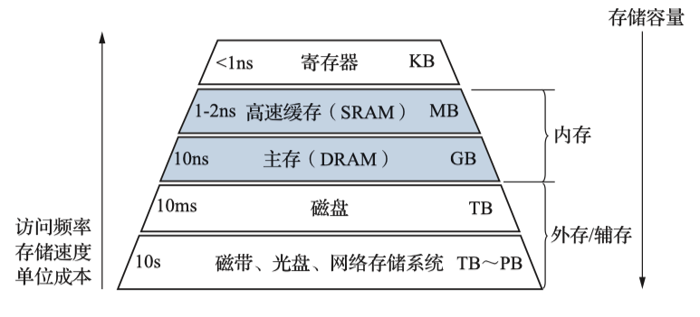

# 存储系统


{++存储器的分类++}


{++存储器的技术指标++}

^^存储容量^^ 存储器可以存储的二进制信息总量

- 位表示法 存储器中的存储单元的总数和存储字长的乘积表示 如 $1K\times 4$ 表示该芯片有 1K个单元,每个单元的长度为4bit
- 字节表示法 默认一个存储单元内有8bit的表示法,如128B

^^存取时间^^ 存储器访问时间,是指启动一次存储器操作(读\写)到该操作完成所需要经历的时间

^^存取周期^^ 连续启动两次存储器操作,所需要的最短时间间隔. 存储周期通常略大于存取时间,这是由于两次操作直接通常存储器需要有一个短暂的恢复时间.


^^存取带宽^^ 单位时间内存储器能传输的信息量,带宽是衡量数据传输速率的重要指标.一般而言,存取时间越短,数据位宽越大,存储带宽越高.

{++存储器的分层结构++} 由上置下,容量逐渐扩大,速度逐渐变慢. {++上层存储的是下层的某些数据的副本++}




## 半导体随机存取存储器

### DRAM 与 SRAM


{++DRAM的刷新机制++} 由于DRAM的存储单元仅仅有MOS管和一个电容. 电容C上的电荷会逐渐泄露,数据只能保存较短的时间, {++为了防止数据丢失++},必须定时采取类似于{++读操作++}的方式对存储单元补充电荷.


- DRAM的刷新按照{++行++}进行
    - 刷新地址有刷新地址计数器给出, 不由{--CPU--}发出.
- 最大刷新周期 信息存储到数据丢失之间的这段时间
    - 刷新周期 实际上DRAM连续两次刷新的时间间隔
- 刷新操作并不完全等同于读操作
    - 刷新操作不需要给出列地址


- 刷新时候, DRAM{--不能响应CPU的访问--}
    - 集中刷新 一次性刷新全部的内容
        - 会导致较长的一段时间内CPU均无法访问,称为{++死区++}时间
    - 分散刷新 把存储周期分为两部分,一部分用于读写操作,一部分用于刷新操作
        - 不存在死区时间,但性能较低
    - 异步刷新 将刷新的总时间平均分配到一段时间内,集中刷新和分散刷新的结合

{++DRAM的行列复用技术++}


- DRAM只有一条地址线,CPU分时传送行\列地址
- 不设置片选信号,通常有RAS和CAS选通信号代替
- 存储单元有行列地址译码选中
- 行列地址按照 {++极可能接近,且行地址要小于列地址++}

!!! example "DRAM行列地址复用技术"
    假定DRAM芯片中存储阵列的行数为r,列数为c,对于一个 $2K\times 1$ 位的DRAM芯片,位保证其地址引脚数最少,并尽可能减少刷新开销,则r,c的取值分别为______?

    解: $2K = 2^11 = 2^ 5 \times 2^ 6$ 故r=32,c=64

{++SDRAM++} 同步DRAM

### ROM 


## 主存的结构,主存与CPU的连接


- CPU给出读\写控制信号
- 如果是读操作,CPU还需要给出其MAR中的内容,并经过地址译码选中DRAM中的单元并写入CPU的MDR中
- 如果是写操作,CPU除了给出MAR中的地址,还需要给出MDR中的数据,并把其中的内容写入DRAM


!!! example "读内存操作示意图"
    

### 存储器的拓展 (字\位拓展)

{++位拓展++}又称字长拓展或数据总线拓展. 简单来说就是多个存储芯片并发工作.


- 假设有 $2M\times 1$ 的DRAM芯片,用4片DRAM按位拓展组成, $2M\times 4$ 

{++字拓展++}容量拓展或者地址总线拓展


- 假设有 $2M\times 1$ 的DRAM芯片,用4片DRAM按字拓展组成, $8M\times 1$ 


- 假设要利用 $256K\times 8$ 的SRAM存储芯片要组成 $2M\times 32$ 的存储系统,则需要进行 $32 / 8 = 4$ 需要四片SRAM组成一个整体(做字拓展), 再 $2M/256K=8$ 需要8组这样做过位拓展的整体,即字拓展. 故总需要32个SRAM芯片.

### 多模块存储器
{++多体交叉存储器++} 空间并行技术,利用多个结构完全相同的存储模块并行工作来提高存储其的吞吐率.

主要有两种 ^^高位交叉(顺序编址)方式^^ 和 ^^地位交叉方式^^ 


低位交叉编址具有如下特点

- 相邻元素位于不同存储体中
- 同一存储体的元素不相邻


此时存储体与模块号的关系,如下所示


此时对连续地址的访问,本质是一种流水线方式. 连续读取n个连续字所需要的时间为 $T+(n-1)t$


## 高速存储器(cache)

{++Cache的基本原理++} 通过在CPU和内存中增加一个(几个)由SRAM组成的Cache,存储经常被访问或者即将被访问的数据{++副本++}, 基本思想是 {++程序的局部性原理++}.

{++相联寄存器(CAM)++} 一种可以按内容寻值的寄存器.


### 程序的局部性原理

{++时间局部性++} 程序访问过的存储位置,很可能在未来会被多次访问

{++空间局部性++} 程序访问过的存储位置,在未来很可能访问其周围的存储单元

```cpp
int sum_vec(std::vector<int> V) {
    int i, sum = 0;
    for (i = 0; i < V.size(); ++i) sum += V[i];
    return sum;
}
```

这个程序体现局部性原理的地方

- 时间局部性 在for循环内, 变量 `i,sum` 会被多次访问
- 空间局部性 在for循环内, 数组 `V[i]` 的内容被顺序访问

### 与Cache相关性能指标

CPU访问主存前会先查询Cache,若查询成功,则称本次{++命中++};若未在Cache中找到,则{++未命中++}. 

{++命中率++} 设 $N_c$ 为某程序运行期间命中cache的次数, $N_m$ 为从主存中访问信息的次数,则命中率可以定义为 

$$
h=\frac{N_c}{N_c+N_t}
$$

!!! warning 
    这里默认采用的是主存和Cache同时访问的情况

{++Cache/主存系统的平均访问时间++} 假设 $t_c$ 为访问Cache的时间; $t_m$ 为缺失访问主存的时间.

$$
t_a=ht_c+(1-h)t_m
$$

### Cache的地址映射


- $S=2^s$ 组数 表明Cache多少个组
- $E$ 每个组含有多少个Cache行
- $B=2^b$ 每块块的大小,按字节编址的话,每个Cache行的数据块大小为 $2^b B$
- $m=\log_2(M)$ 物理地址位数
    - $m=t+s+b$
- 使用中间位作为索引的原因 相邻的块总是被映射到不同的cache行.


简单来说无论是那种地址映射,都可以采用三步走的策略确定映射关系 {++组选择-行匹配-字抽取++}

{++直接映射++} 每个组只有一行(E=1)


- 组选择操作 由于直接映射每一组只有一行,可以直接读主存地址的组号


- 行匹配 对比对应Cache行的Tag标签和主存地址的Tag标签是否一致
    - 若是,则查看Cache行的有效位是否为1,若是则命中;否则未命中
    - 否则未命中


- 字抽取 若命中则可以根据主存地址的块偏移确定要抽取数据的{++首字节++}位于Cache行的那一个位置


{++组相联映射++} 一个组内有多个Cache行, 以2路组相联举例. 

- 组选择


- 行匹配和字抽取


- 需要{++E++}个比较器 

{++全相联映射++} 整个Cache都是一个组,任何一个主存块可以映射到任意一个Cache行中.

 

- TLB中使用是全相联映射
- 全相联的造价比较高


- 需要{++n个++}比较器

### Cache的读写操作

{++读操作++} Cache的读操作比较简单,只需要注意未命中的时候需要将该住存块加入地址(写操作).


{++写操作++} 根据不同情况有四种策略

- 写命中 
    - ^^写回法^^ 设置脏位,不立刻将数据写入主存;而是当这行Cache被换出的时候再将数据写回内存
        - 通过设置脏位(1位)来解决数据不一致的问题
        - 可能导致DMA获取的数据不是最新的数据
    - ^^直写法(写穿法)^^ 写Cache命中的时候同步将更改写入主存
- 写缺失
    - ^^写分配法^^ 为该主存块先分配Cache行,在执行写操作
    - ^^非写分配法^^ 不为其分配Cache行,而是直接写入内存


### 替换算法


!!! example "LRU和LFU的访问例子"
    假定某程序访问7块信息,Cache分为4行,采用{++全相联++}方式组织.程序访问块的地址依次为 ^^1,2,3,2,1,3,1,4,4,5,6,7,5,6,7,5^^. 分析LRU和LFU算法的访问过程和命中率.

    

### Cache的应用

{++指令Cache和数据Cache分离++} 分离后，指令和数据可以独立并行访问各自的Cache，显著减少访问延迟，提升吞吐量; 减少结构冒险的可能性. 

{++分级Cache++} 平衡速度、容量和访问延迟​;减少主存访问次数，提升整体性能;提高缓存空间利用率​;支持多核共享与一致性管理;适应不同工作负载​


## 外部存储器

### 磁盘

磁盘由盘片构成,每个盘片有两面({++盘面++}), 表面覆盖着磁性材料. 每个表面由一圈一圈{++磁道(柱面)++}组成,每个磁道被划分为一组{++扇区++}. 扇区和扇区之间有一些无法访问的结构称为{++间隙++}.

- 间隙不保存数据,仅用于表示扇区的格式化位


{++磁盘容量的计算++} 一个磁盘能够记录的最大位数

- 记录密度 磁道上比特位的密度
- 磁道密度 盘面上磁道的密度
- 面密度 一个盘面上比特位的密度
    - 即 记录密度 x 磁道密度

$$
磁盘容量 = 字节数(扇区提供)\times 平均扇区数(一个磁道有多少扇区)\times 磁道数(一个盘面有多少磁道)\times 表面数(一个磁盘由有几个表面能存数据,通常是2)\times 盘面数(磁盘由多少个盘面) 
$$

!!! example "磁盘容量的计算"
    假设我们有一个磁盘,其有5个盘片,每个扇区有512字节,每个面有20 000条磁道,每条磁道大概有300个扇区,那么磁盘的容量为: 

    $$
    512B\times 300\times 20 000\times 2\times 5 = 30.72 GB
    $$

{++磁盘操作(读\写)++} 磁盘以{++扇区++}为大小进行读写操作


- 寻道(seek) 读\写头沿半径方向,寻找其想要读\写的磁道
    - 通常采取平均寻道时间为标准
- 旋转时间 读\写都定位了磁道后,等待磁道旋转到其期待扇区的时间
    - 通常采用平均旋转时间 $T=1/RPM\frac{60s}{1min}$ 其中RPM为旋转速度
- 传送时间 读\写磁头读\写完该扇区所需要的时间
    - $T=1/RPM\times\frac{1}{(平均扇区数/磁道)}\times\frac{60s}{1min}$

!!! example "磁盘读写时间的计算"


{++磁盘地址++} 磁盘地址一般按照 {++|柱面(磁道)号 | 盘面(磁头)号 | 扇区号 |++} 的方式与主机进行交流.
{++冗余磁盘阵列(RAID)++}

- 同时使用多个磁盘,提高了传输速率
- 在多个磁盘上并行存取提高了系统的吞吐率
- 通过{++镜像功能++}提高了安全可靠性
- 通过{++数据校验++}提供了容错能力


### 固态硬盘(SSD)


- 有闪存阵列组成
- {++读比写快++}
- 以页(page)为读单位,以块为擦除单位
    - 只有这页所属的块被擦除后,才能被写
- 优点: 速度快;噪声小;能耗低;安全性高
- 磨损均衡 由闪存翻译层进行磨损均匀操作
    - 动态磨损均衡 写入数据的时候优先选择擦除次数少的闪存块
    - 静态磨损均衡 SSD会监测并自动进行数据分配,让老的闪存快主要承担读操作而让新的闪存快承担写操作
