# 指令系统

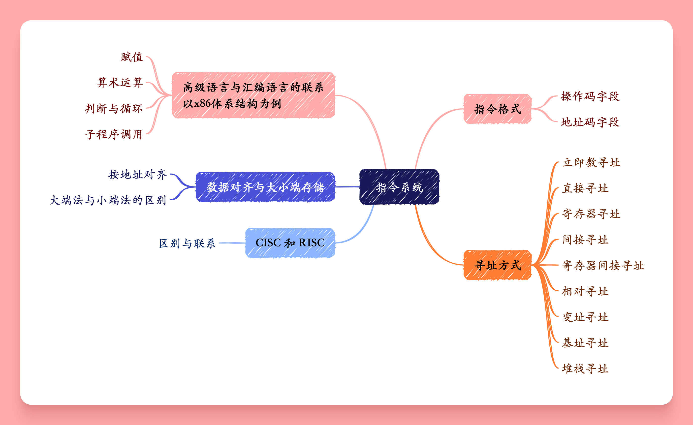

## 指令系统的基本概念

计算机内有许多中指令,其中{++高级语言指令++}和{++汇编语言指令++}是软件层指令,需要转换为{++机器语言指令++}才能被计算机硬件识别.除此之外还有{++微指令++}也是硬件指令.

{++机器指令++}是软硬件的界面,也是用户操作和使用计算机硬件的接口.

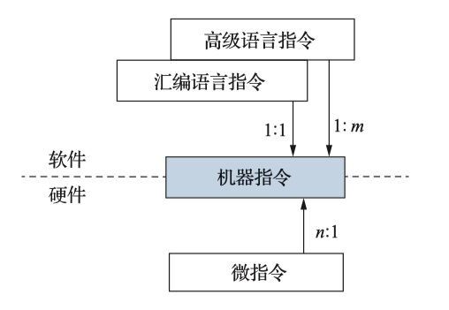

### 指令格式

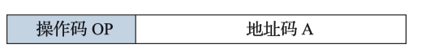

{++指令字长度++} 一条指令中所包含的二进制位数,也称为 {++指令字长++}

- 变长指令系统 指令长度可变,结构灵活,冗余少.
- 定长指令系统 指令长度固定,结构简单. 平均长度长,冗余状态较多,不容易拓展

指令最终要进入存储器,必须是{++字节++}的整数倍,且根据与机器字长的关系.指令字长可以为{++半字长++}, {++单字长++}和{++多字长++} 3类.

- 通常越常用的指令,指令字长越短;

{++指令地址码++} 根据一个指令其地址码部分有几个地址分为如下几类指令

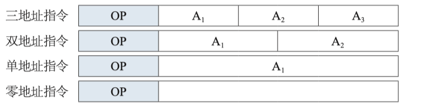

- 三地址指令 $(A_1)OP(A_2)\rightarrow A_3$
    - 通常来说三地址指令的三个地址均为 ^^寄存器^^ 地址
- 二地址指令 $(A_1)OP(A_2)\rightarrow A_1$
    - $A_1$ 即使第一个操作数的源地址也是目的地址
    - 通常有 $RR,RS,SS$ 三种(S-存储器,R-寄存器) 
- 单地址指令 
    - 单目运算,如取反操作 $OP(A_1)\rightarrow A_1$
    - 隐藏地址的双目运算,例如 $(AC)OP(A_1)\rightarrow AC$ (AC表示累加寄存器)
- 零地址指令
    - 指令本身不需要操作数,如空操作指令NOP(用于处理流水线冒险),等待指令,停机指令等
    - 指令隐藏了一个操作数地址,如累加寄存器等寄存器地址

{++指令操作码++} 表面指令的具体操作

- 定长操作码 指令码长度固定且位置固定,利于硬件设计.
- 变长操作码 指令吗长度可变且位置可变,利于指令拓展    


!!! warning
    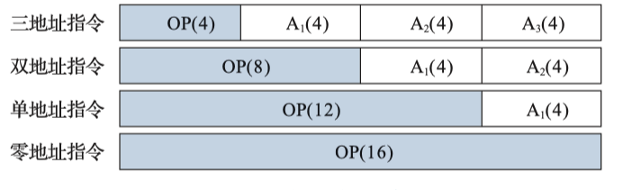 
    
    如图所示的变长操作码,需要满足前缀码的特性.即三地址的操作码不能是双地址地址码的前缀;双地址码的操作码不能是单地址操作码的前缀 

    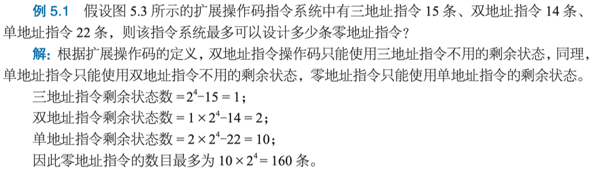

### 寻址方式

{++寻址方式++} 寻找指令或操作数有效地址的方法

{++指令寻址++}

- 顺序寻址 通过(PC+1)来实现
    - 1为指令字长
- 跳跃寻址 程序出现分支或者转移

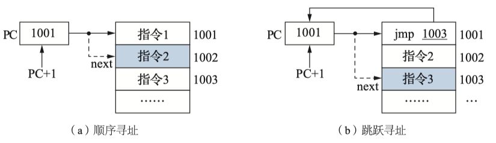

{++操作数寻址++} 操作数寻址方式有很多种,可以在地址码字段划分出一个寻址方式字段,用此字段指明具体的寻址方式.

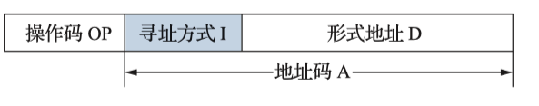

{++立即寻址++} 在地址字段使用{++立即数++}直接指明操作数. 即S=D

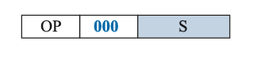

由于地址码字宽有限,一般只用于赋值操作.

```asm
MOV EAX, 2008H // 为寄存器EAX赋值2008H
```

{++直接寻址++} 操作存存储于主存中,在地址字段直接给出内存地址即(D=EA, S=(EA))

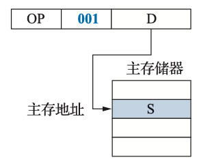

```asm
MOV EAX, [2008H] //将2008H主存单元的内容送入寄存器EAX
```

{++寄存器寻址++} 操作数存于寄存器中,在地址字段给出寄存器编号

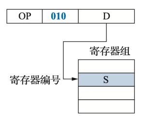

```asm
MOV EAX, ECX // 将寄存器ECX的内容送入寄存器EAX
```

{++间接寻址++} 操作数存在内存值,地址码字段给出的并不是操作数的有效地址,而是指向操作数的有效地址的某一内存单元.

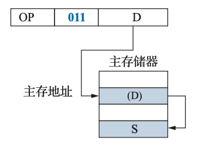

```asm
MOV EAX, @2008H \\ 将主存2008H对应的内容对应的内存中的内容送入EAX
```

{++寄存器间接寻址++} 操作数存在于主存,但使用寄存器拓展寻址空间.

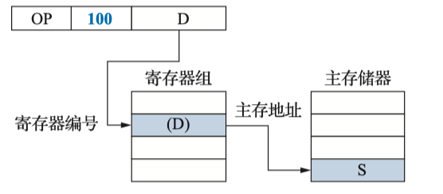

{++相对寻址++} 一般用于跳转/转移指令 通过PC(本质也是一种寄存器间接寻址)

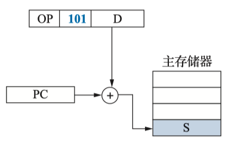

需要注意 $EA=PC+D+1$ 这是由于计算机操作数的有效地址在指令译码分析或者执行阶段.而计算PC+1在取指令阶段就会执行.

{++变址寻址\基址寻址++} 基本设计理念都是寄存器间接寻址.选定一个特殊的寄存器(变址寄存器\基址寄存器)在操作码字段指明一个形式地址段D 

- 变址寻址中, X中的内容可以修改,D的内容不可修改.EA = R[X] + D
    - 适合实现迭代过程
- 基址寻址中, B中的内容不可变,D的内容可以修改. EA = R[B] + D
    - 通常情况下基址寄存器是特设的,此时就不需要指明基址寄存器的寄存器编号
    - 面向系统,主要用于程序的重定位(多道程序环境)
    - 拓展寻址空间,通过拓展基址寄存器的字长从而拓展寻址空间

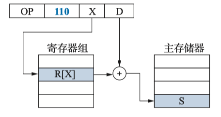

{++堆栈寻址++} 使用一个寄存器(堆栈寄存器SP)指明栈顶元素,一般用子程序调用.

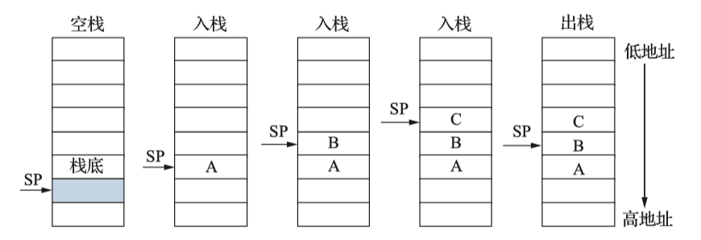

### 数据的对齐和大/小段存储

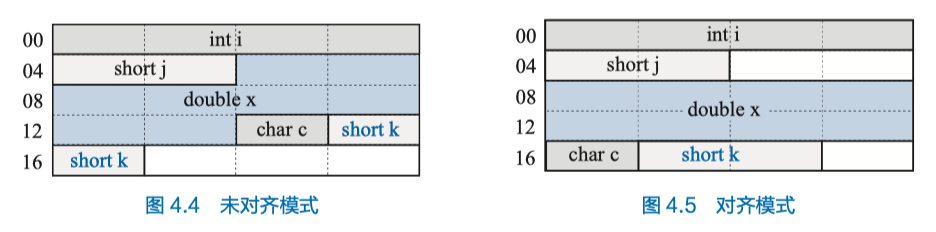

{++数据对齐++} 对基本类型的地址做出了一定的限制,某种类型的{++地址++}必须是某个值K的倍数.

考虑如下结构体
```c
struct S1 {
    int i;
    char c;
    int j;
};
```

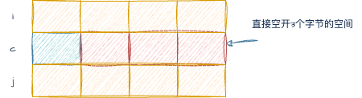

考虑如下结构体

```c
struct S@ {
    int i;
    char c;
    short j;
}
```

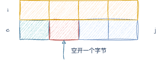

- 注意 `j`不是紧挨着`c`而是空开一个,是为了让j的地址满足2的倍数


{++大端存储与小端存储++} 

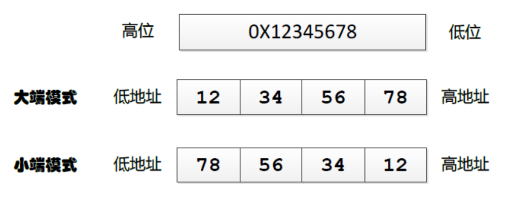

### CISC和RISC

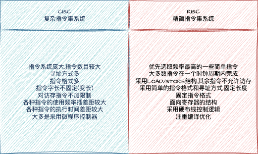

### x86-64 程序的机器表示

!!! tip
    主要参考 CSAPP-chapter 3 程序的机器级表示