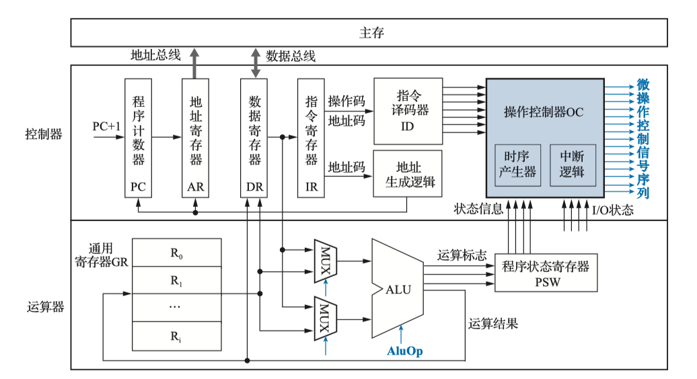
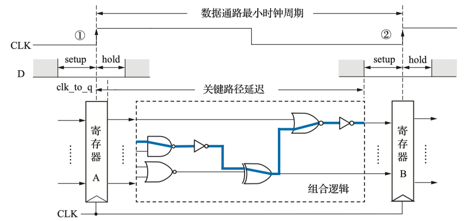
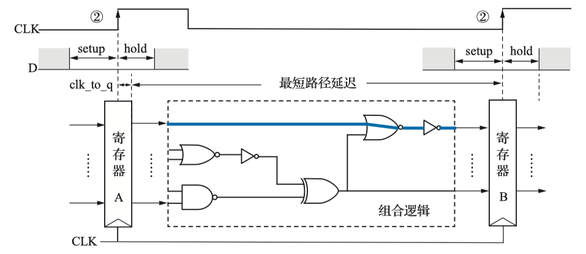
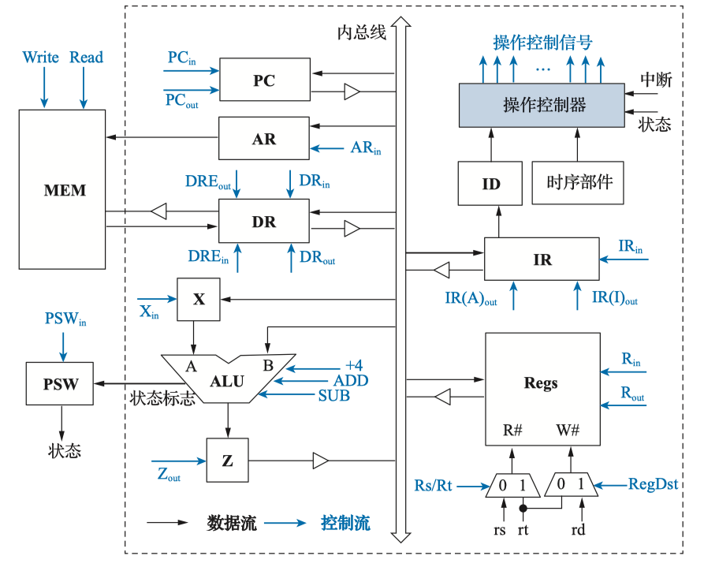
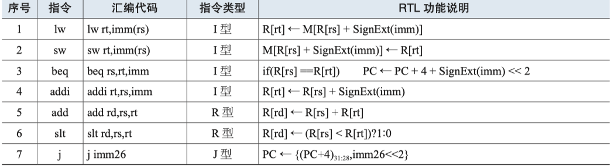
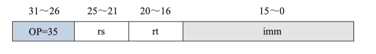
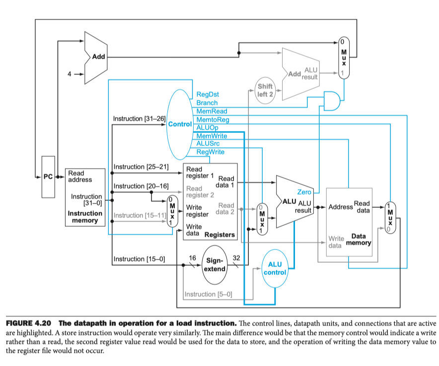
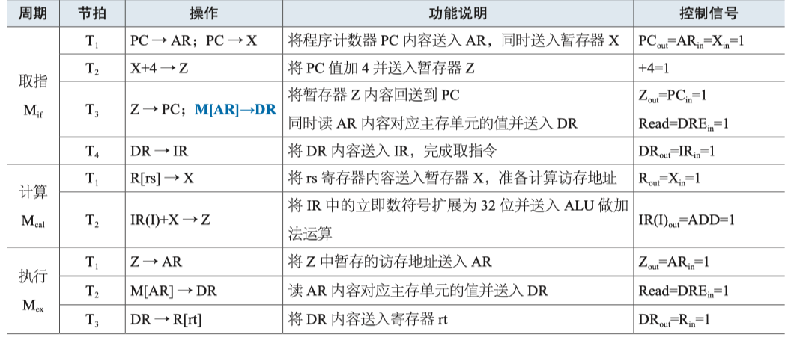
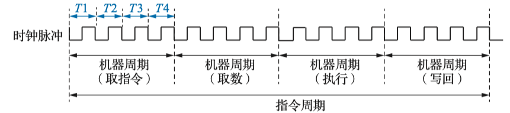
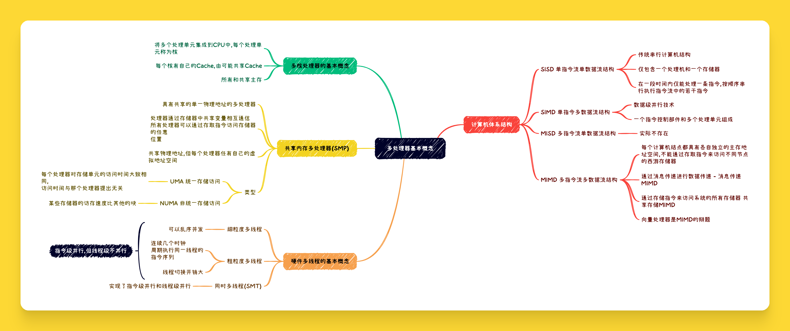

# 中央处理器

## CPU的基本组成

{++CPU中的主要寄存器++} 

- 程序计数器(PC) 保存{++将要++}执行指令的地址
    - PC与主存地址线位宽一致
    - 若是定长指令,则在{++取指阶段++}结束后进行 {++PC+1(指令字长)++}
    - 若是变长指令,则在{++译码阶段++}结束后才能确定指令字长,然后执行{++PC+1++}
    - 程序出现分支跳转的时候,用分支指令提供的分支地址修改PC的值
- 存储器地址寄存器(MAR) 保存CPU访问主存的单元地址
    - MAR与主存地址位宽一致
    - MAR不是必须的
- 存储器数据寄存器(MDR) 保存从主存中读出或者将要写入主存的数据
    - MDR与存储字长相同
    - MDR不是必须的
- 指令寄存器(IR) 用于保存当前正在执行的指令
    - IR与指令字长的位宽一致
- 通用寄存器组(GR) 
- 程序状态字寄存器(PSW) 用于保存由ALU生成的各种状态标记,还可以保存中断和系统工作的状态信息

{++用户(不)可见寄存器++} 注意这里的用户通常是指汇编程序员

- 不可见 MAR,MDR,IR
- 可见 PC(考研认为可以),GR,PSW

## 数据通路

{++寄存器传送语言++} 其基本规则如下

- M[addr]表示主存地址addr单元或内容
    - 作为目的操作数的时候表示主存单元
    - 作为源操作数的时候为addr中的内容
    - 但考研更可能使用 (M[addr]) 表示其中的内容,而用 M[addr] 表示主存单元
- R[i] 表示寄存器i中的内容或者寄存器i本身 
    - 和M[addr]一致
- 用 B<-A 和 A->B 表示数据传输,其中A为源操作数,B为目的操作数
- $X_{y:z}$ 表示寄存器X的第y位到第z为的数据字段
- $SignExt(X)$ 表示将X按符号拓展,拓展到32位
- {X,Y} 表示将X和Y中的内容拼接在一起

{++数据通路++} 指令执行过程中数据所经过的路径,包括路径上的部件

- 包括 ALU,GR,PSW,Cache,MMU,FPU等 
- 数据处理单元 由组合逻辑电路构成,其输出只和当前的输入有关,负责对数据进行加工
    - 如ALU,符号拓展单元,译码器等
- 状态存储单元 由时钟控制,具有存储数据的能力
    - 如寄存器和存储器

- 寄存器延迟 $T_{clk_to_q}$ 从时钟上跳沿到寄存器A输出稳定所需要的时间
- 关键路径延迟 $T_{max}$ 数据处理单元对寄存器A的输出数据进行处理加工所需要的时间
- 寄存器建立延迟 $T_{setup}$ 将A经过数据处理单元保持到下一个时钟上跳沿所需要的时间
- 寄存器保持时间 $T_{hold}$ 寄存器上跳沿到来后,仍需要将数据保持的一段稳定时间

- 数据通路的最小时间周期必须大于 $T_{clk_to_q}+T_{max}+T_{setup}$ 

{++寄存器保持时间违例++}

- 需要满足寄存器保持时间 < 寄存器延迟 + 组合逻辑最短路径延迟

### 单总线结构的数据通路

- 由于单总线同一时刻支持多个模块从总线上获取数据,但{++只能有一个模块++}往总线上输出数据
    - 三态门的作业就是为了进行输出控制
- ALU采用双寄存器缓冲的结构
    - X用于暂存一个输入,另一个输入直接从总线上获取
    - Z用于暂存ALU的输出
- 图中蓝色的均为控制信号

通常指令的取值周期所需要完成的操作大体是一样的

- M[PC] -> IR 以PC为地址取出内存中对应单元的内容并送入指令寄存器IR
- PC + 指令长度 -> PC 计算顺序指令的地址,修改PC值
- 指令译码

#### lw指令的执行流程

- lw指令的功能是 {++从主存读取一个32位的存储器字++} 

lw指令操作流程及控制信号如下

- 取值周期的两条数据通路如下
    - PC->MAR->MEM->MDR->iR 以PC内容为地址访存及取指令并送入IR
    - PC->X->ALU->Z->PC 修改PC的值,为取下一条指令做准备
- 计算周期的数据通路为
    - R[rs]->X->ALU; IR(I)->ALU->Z 计算访存地址R[rs]+imm并送入暂存寄存器Z,其中 IR(I)为指令字中的16位立即数符号拓展为32位的数字
- 执行周期的数据通路为
    - Z->AR->MEM->DR->R[rt] 从主存中区32为存储字并送入rt 

## 硬布线控制器

## 微程序控制器

## 异常和终端处理

## 指令周期与流水线

### 指令周期

{++指令周期++} 通常将一条指令从取出到执行所需要的时间

{++指令周期的划分++} 取指周期,译码/取操作数周期,执行周期,写回周期

- 取值周期 CPU以PC中的内容为地址从主存中取出对应的指令,并计算后续指令的地址(定长指令集)
- 译码/取操作数周期 对IR中的指令进行译码
    - 间址周期 对于间接寻址在次阶段需要访问一次主存才能取出操作数
- 执行周期 不同指令指令周期的操作并不相同
- 写回周期 将执行周期的产生的结果写回目的寄存器\主存

通常在指令周期{++末尾++}还有中断检测阶段,用于响应外部的各种中断

- 计算机中最小的时间单位为 {++时钟周期\节拍++}
- 一个机器周期由多个时钟周期组成
- 一个指令周期根据划分的不同可以由多个机器周期组成
    - 若所有指令所包含时钟周期相同,机器周期固定,则称为 {++定长指令周期++}
    - 否则未{++变长指令周期++}
### 流水线的数据通路

### 流水线冲突与处理

### 流水线的中断与异常, 指令级并行技术

## 多处理器的基本概念

