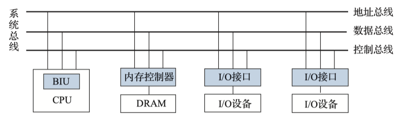

# 总线

## 总线功能与概述

{++总线++} 在连接的功能部件之间进行数据传输,同一时刻仅允许一个功能部件向总线发送数据(通过三态门控制),允许多个功能部件同时接收数据. 各功能部件{++分时++}共享总线.

{++双向总线与单向总线++} 通过三态门控制可以实现总线传输方向的控制

- (a)中 `EN=1`的时候A可向B发送数据,而B不可以向A发送数据
- (b)中 $EN_{AB}=1$ 的时候A可向B发送数据, $EN_{BA}=1$ 的时候B可以向A发送数据
    - 半双工传输

{++总线的分类++}

- 按传输方向 {++单向和双向++}传输总线
- 按时序控制方式 {++同步与异步++}总线
    - 同步总线采用公共时钟进行同步
    - 异步总线采用应答机制进行同步
- 按信息线的功能 {++数据总线,地址总线,控制总线++}
- 按信息的传输模式 {++串行总线与并行总线++}
- 按在计算机系统中的位置 {++片内总线,系统总线,I/O总线,外部总线++}

{++总线的性能指标++} 

- 总线宽度 数据总线的根数,用bit为单位,在并行总线中总线宽度直接决定了可以并行传输的数据位数
- 总线时钟频率 总线时钟周期的倒数. 同步传输总线,时钟频率越快,传输速率越快
- 总线传输周期 一次总线操作完成所需要的时间. 包含{++申请阶段,寻址阶段,传输阶段和结束阶段++}
    - 如果采用地址复用技术,会{++增加++}总线周期
    - 通常一个总线周期只能传输一个总线宽度的数据
- 单时钟传输次数 一个总线时钟周期内传输数据的次数,通常该值为1
    - DRR技术在时钟上升\下降沿分别传输一次,则该值为2
    - QDR技术该值为4,AGPx8该值为8
    - 总线工作的实际频率=总线时钟频率 x 单次时钟传输次数
- 总线带宽 总线上的{++最大++}数据传输速率 单位为($MBps,GBps$)
    - 同步总线带宽 = 总线宽度 x 总线时钟频率 x 单次时钟传输次数
- 总线负载能力 总线上能够同时连接的设备总数

## 总线的组成

- {++总线控制器++} 负载总线控制权的仲裁以及总线资源的分配与管理
- {++总线接口++} 总线与各个连接的功能部件之间的物理与逻辑界面,负责各项功能

{++总线复用技术++} 一组传输线具有多种作用,典型的案例为地址总线与数据总线共用\DRAM的行列复用技术. {++分时传输++}不同类型的信息.

{++总线设备分类++} 按照是否拥有总线控制权可以分为{++主设备++}与{++从设备++}

- 主设备 拥有总线控制权并主动进行总线传输控制的设备
    - 主设备是主动发起总线传输,而从设备只能被动响应
    - 主从设备间的数据传输是{++双向++}的
    - 同一时刻{++只允许一个++}主设备控制总线
- 从设备 被主设备寻址访问的设备

## 总线传输机制

^^总线传输过程^^  请求阶段,寻址阶段,传输阶段和结束阶段

{++总线事务++} 总线上一对主从设备之间的一次信息交换过程 典型的总线事务有 {++存储器读,存储器写,I/O读,I/O写,中断响应,DMA响应++}, 通常包含一个寻址阶段和一个传输阶段.

{++突发(猝发)传送事务++} 由一个寻址阶段与{++多个++}传输阶段组成,在数据传输阶段传输{++多个连续单元++}的数据. 每个总线周期{++仍然++}只能传输一个计算机字长的信息,但不释放总线,直到一组消息全部发送完毕后才释放总线.

## 总线定时

{++总线定时问题++} 规定具体总线事务的每一个步骤,总线上的每一个信息,何时开始何时结束.

{++同步定时++} 主从设备在{++统一的总线时钟控制下++}进行信息传输

- 主从设备的操作在时间点上是固定的,不同的总线事务在不同的节拍进行什么操作都是{++事先协商好的++}. 
    - 优点为 主从设备协调简单,传输速率高
    - 缺点 传输速率取决于最慢的设备;存在同步误差,总线不能太长;可靠性不高

{++异步定时++} 主从设备不需要统一的时钟信号,而是采用{++握手协议++}来进行异步通信. 

按照请求和应答信号的建立与撤销是否相互依赖分为三种

- 非互锁方式 请求信号与应答信号均自动撤销,只有一次握手.
    - 存在可靠性问题
- 半互锁方式 请求信号的撤销依赖于应答信号,应答信号则是自动撤销
    - 可靠性较高
- 全互锁方式 需要3次握手(类似于TCP)
    - 可靠性最高

{++半同步定时++} 在异步总线中引入时钟信号,规定握手信号{++总在时钟触发时采样++}

{++分离事务通信方式++} 利用从设备准备数据的时间处理其他总线事务

- 主设备从设备发出读请求信好,给出地址和请求命令
- 从设备进行应答,主设备{++立刻++}释放总线控制权
- 从设备准备数据,总线用于处处理其余总线事务
- 从设备准备好数据后, 作为{++主设备++}重新申请使用总线
- 源主设备从总线接受数据

