# 输入输出系统

## I/O接口

{++I/O接口的基本功能++} 设备寻址,数据交互,设备控制,状态检测,数据缓冲.格式转换,中断,时序控制和数据检错,纠错等功能(具体看课本)

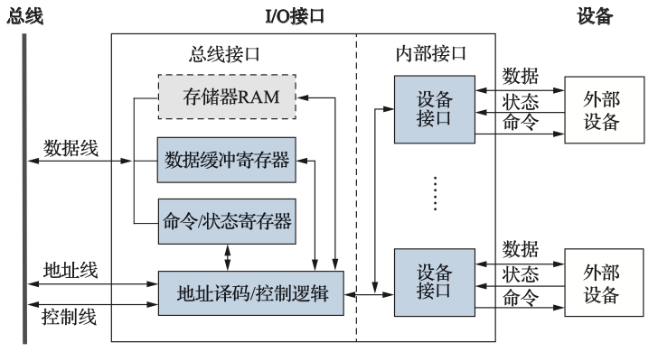

- 总线接口 按照总线标准进行设计
- 内部接口 因设备的不同而不同,是非标准的
- {++数据缓存寄存器(DBR)++} 用于缓冲数据,匹配CPU与外部设备之间的速度差异
- {++设备状态寄存器(DSR)++} 用于反馈设备状态 在{++程序查询方式中++},CPU通过读取状态寄存器来判断设备的状态
- {++设备命令寄存器(DCR)++} 用于接收CPU发送的设备控制命令
- {++设备存储器++} 常用于设备自身的运算和处理

{++I/O接口的编址++} I/O接口中的各种寄存器,存储器都由{++CPU++}进行统一分配设备地址,并通过对应的设备地址访问,通常可以分为统一编址和独立编址两类

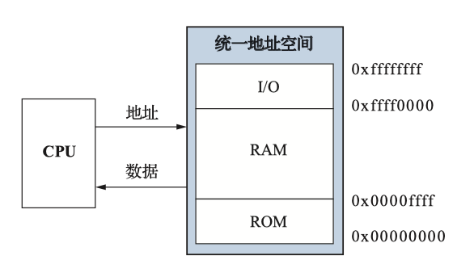

{++统一编址++} 内存映射编址(Memory-mapped) {++外部设备与内存地址统一编址++},二者在逻辑上属于同一地址空间,通过{++不同区域++}来区分访问内存还是访问外设. 

- 使用统一的访存指令访问内存与I/O设备
- 通常不能使用{++Cache++}进行缓存
- 系统I/O接口的地址是固定,而热插拔的I/O设备通常是在计算器启动过程中动态分配的

{++独立编址++} 端口映射编址(Port-mapped) I/O地址空间和主存地址空间相互独立, 此时I/O地址又称为{++I/O端口++}

- 必须使用特殊的I/O指令访问外部设备
- 系统I/O端口号通常是固定,热插拔I/O的端口号是启动过程中动态分配的

{++I\O控制方式++} 

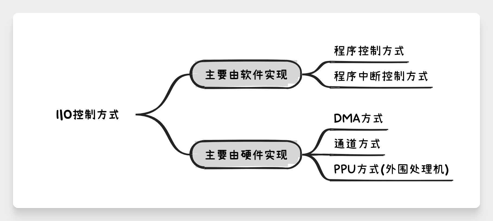

## 程序控制方式

{++程序控制方式(PIO)++}  CPU直接执行一段输入输出的{++程序++}来实现CPU与外部设备的数据交换.

- 分为程序查询(轮询方式) 每次传送前都要查询设备状态,只有设备准备就绪后才可进行后续操作(条件传送)
- 直接传送 无须查询设备状态,直接进行数据交互(无条件传送)

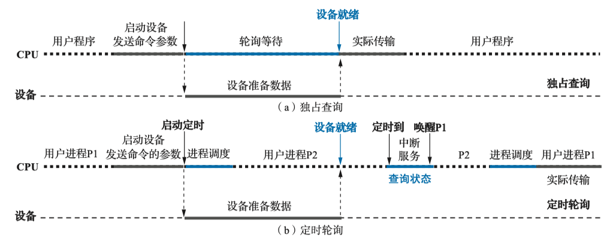

程序查询有两种策略{++忙等待(独占式查询)++}和{++定时轮询++}

- 独占式查询策略中CPU在等待设备准备数据的过程中会{++不断++}查询设备的状态寄存器
- 定时轮询策略中CPU会通过定时时钟中断,并调度其他进程上CPU执行

## 程序中断控制方式

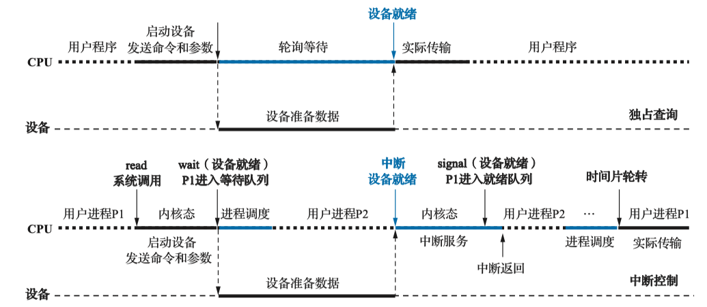

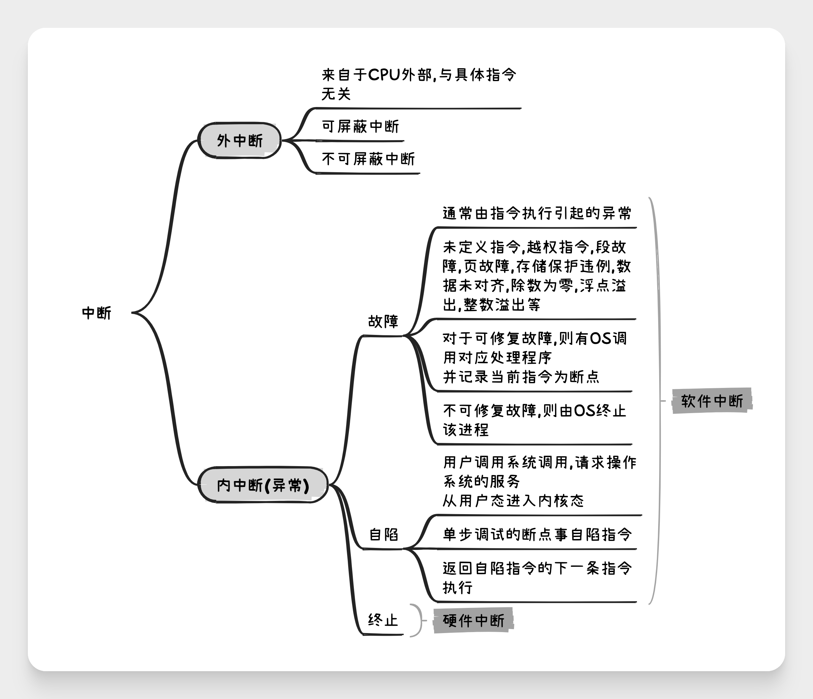

{++中断优先级和中断屏蔽字++}

- 中断优先级 CPU{++响应++}并{++处理++}中断请求的优先级
    - {++响应优先级++} CPU对各设备中断请求进行响应的先后次序,在硬件线路上是固定的,不便于改动
        - 不可屏蔽中断 > 内部异常 > 可屏蔽中断
        - 内部异常中硬件终止属于最高级,其次是指令异常或自陷等程序故障
        - DMA中断请求优于I/O设备传送的中断请求
        - 高速设备优于低速设备;输入设备优于输出设备;实时控制设备优于普通设备
    - {++处理优先级++} 中断嵌套的实际优先级处理次序,利用{++中断屏蔽技术++}动态调整
        - 若不采用中断屏蔽技术,则与响应优先级保持一致
{++中断屏蔽字++}

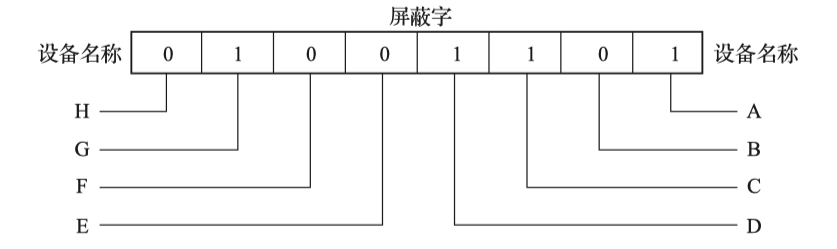

- 在终端控制器中设置一个中断屏蔽寄存器(IMR),其中的每一位对应一个设备的中断源
    - 为1的时候表示{++屏蔽++}对应设备的中断请求信号
    - 为0的时候表示{++允许++}对应设备的中断请求信号
        - 若允许多重中断则可以打断先去的中断处理程序
- CPU为每个设备分配{++不同++}的中断屏蔽字,CPU执行某设备的中断服务的时候回将该设备的中断屏蔽字载入IMR,所有中断请求回遇IMR中对应的位的值进行逻辑与

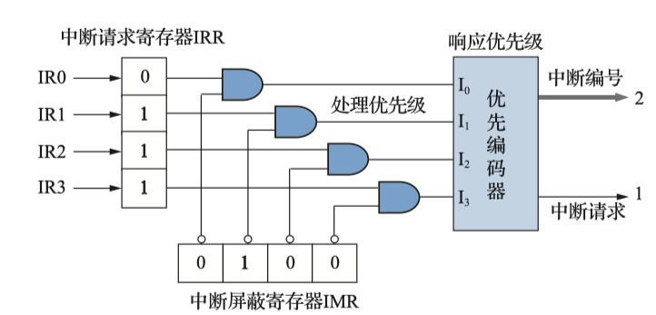

- 通过调整中断屏蔽字可以将高响应优先级的中断进行屏蔽,从而提高低响应优先级的处理优先级
- {++中断屏蔽字只对CPU运行中断服务程序时的中断嵌套有用,并不具备改变CPU运行主程序时的中断响应优先级++}
    - 同时到达的多个为屏蔽中断,只能按照{++响应优先级++}进行处理

{++单级中断与多重中断++} 

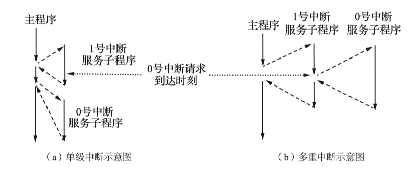

- 区分二者并不是{--单级中断没有优先级;多级中断有优先级--}
- 而是多级中断的高优先级中断{++可以打断++}低优先级的中断

!!! example "中断优先级的示例"

### 中断请求

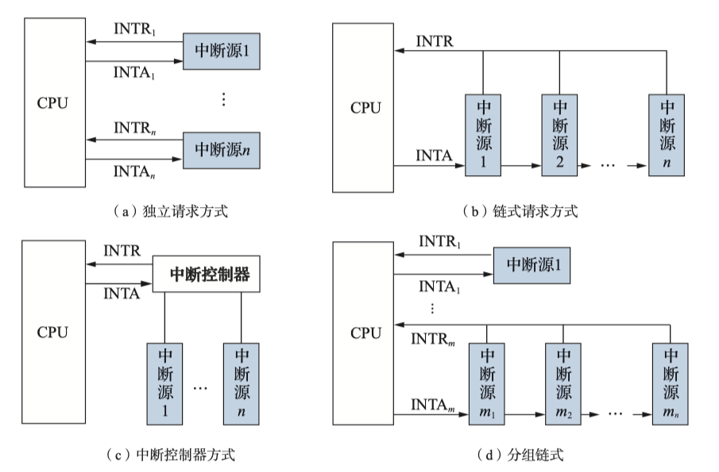

- ^^INTR 中断请求线缆^^ ^^INTA 中断响应线缆^^
- 独立请求方式 每个中断源独立请求独立响应,方便实现向量中断,可以快速找到中断入口地址;但系统拓展困难
- 链式请求方式 所有中断源共享一条请求线缆,系统拓展容易
    - 硬件查询法 CPU给出中断应答信号,通过串行电路{++从左往右++}顺序查询, {++离CPU越近中断响应优先级越高++}
    - 软件查询法 通过公共中断服务程序轮询每个中断源,优先级与轮询方式有关,{++越早轮询优先级越高++}
- 中断控制器方式 中断控制器负责实现{++外部++}中断的优先级仲裁逻辑与中断识别
    - 支持中断屏蔽字技术
- 分组链式 独立请求与链式请求的折中办法

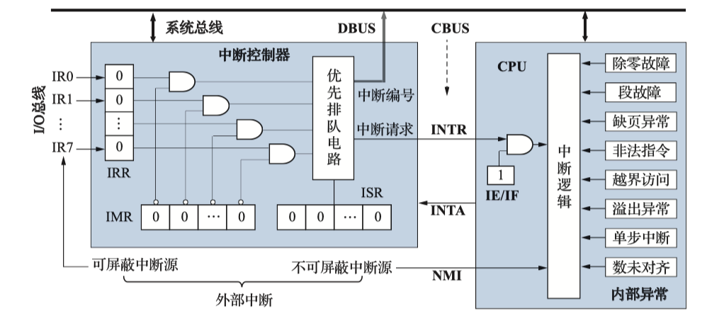

{++中断请求的硬件支持++}

- 中断请求寄存器(IRR) IRR中的内容即{++中断字++},通过中断字确定中断源,并转入对应中断服务
- 中断屏蔽寄存器(IMR) 用于动态改变中断处理优先级
    - 其内的每一位{++取反++}后与IRR中的位进行{++逻辑与++}
    - IMR中为{++1++}的中断源被屏蔽,为{++0++}的中断源不会被屏蔽
- 中断服务寄存器(ISR) 在多重中断中用于存放正在被服务的中断请求,包含以及得到中断响应但中断服务尚未结束的{++所有++}中断请求.
    - 普通屏蔽模式 当新的中断请求比ISR中最高优先级的中断源还高的时候才会中断当前服务.
    - 特殊屏蔽模式 不判断ISR中的优先级,这样未被屏蔽的中断都可以打断当前中断
- 中断优先级排队电路(PR) 
- 中断允许触发器(IE/IF) 也称{++中断使能位++},{++中断标志位++},用于开,关中断控制.
    - 仅能关闭可屏蔽中断的中断请求

### 中断响应

{++中断响应的条件++} 

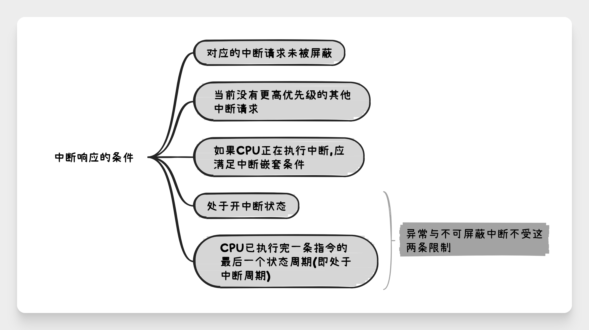

{++中断响应过程-CPU++}

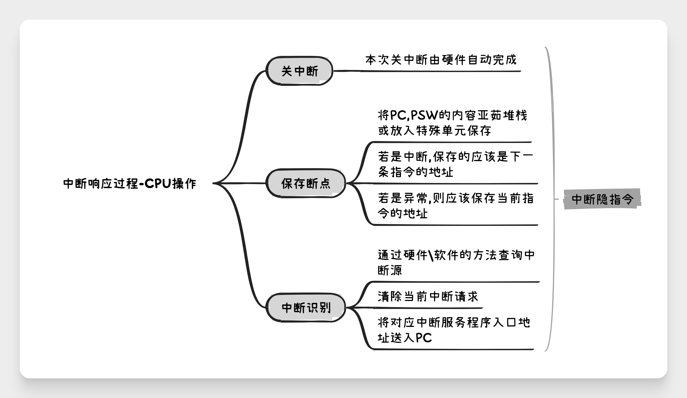

- CPU在进行中断响应过程{++不能执行其他任务++}
- {++中断隐指令++} 是CPU在执行中断响应过程中这一系列操作的总称,并非真的指令

### 中断识别

中断识别通常由两种{++非向量中断++}和{++向量中断++}, 其中非向量中断即链式请求的软件查询法,通过一个公共的中断服务程序{++轮询++}设备.

{++向量中断++} 

- 中断号 每个设备的中断源{++唯一++}的中断编号
    - 中断号由计算机系统统一分配,通常是固定不变的
    - 可屏蔽的外部中断,其中断号在中断响应周期内从中断控制器获得
    - 系统调用等自陷指令的中断号由{++指令直接给出++}
    - 不可屏蔽中断以及异常的中断号则有{++系统++}预先设置
- 中断向量 对应中断源的中断服务程序的{++入口地址++}(可能包括程序状态字)
- 中断向量表 中断向量的集合
    - 中断向量表通常常驻内存
    - 在{++计算机启动初期++},OS内核引导阶段由{++硬件++}初始化中断向量表
    - {++当OS内核启动后++},交给OS管理中断向量表
- 向量地址(中断指针) 用于访问中断向量表的某一表项的地址

### 中断的处理

{++中断VS子程序调用++}

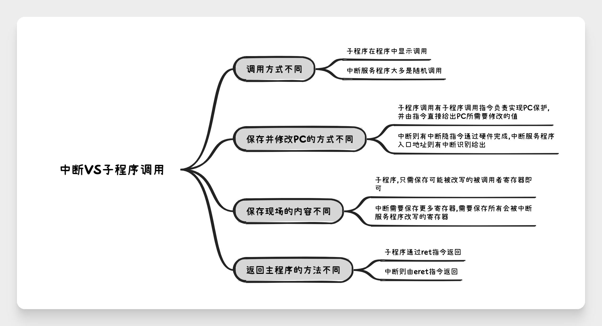

{++中断处理的流程++}

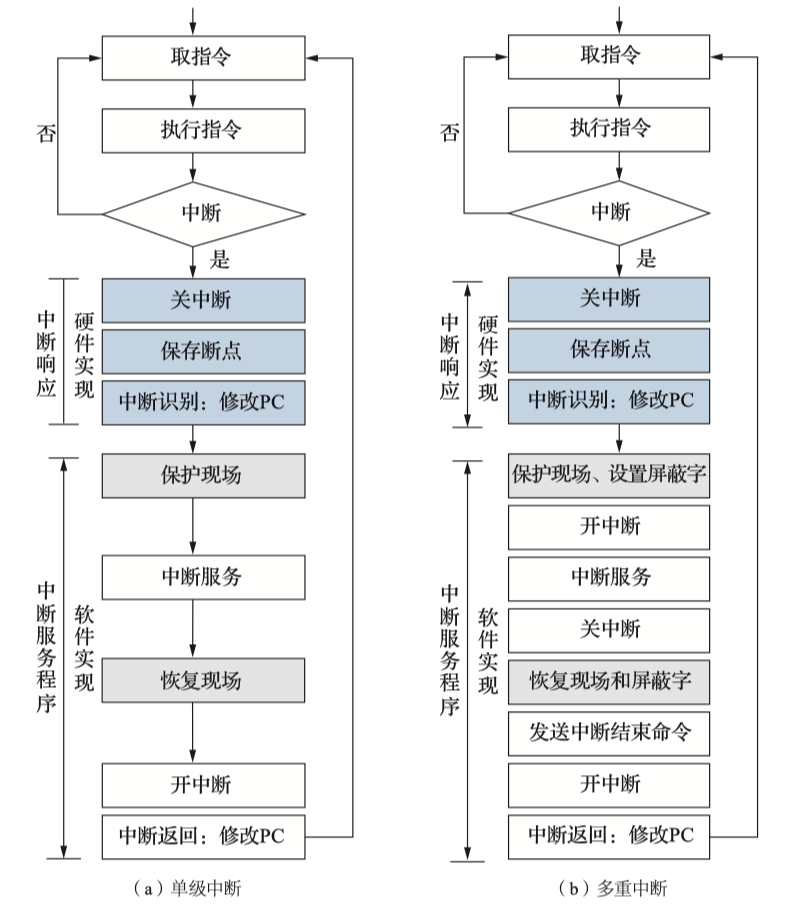

- {++顶半(Top half)和底半(Bottom Half)++} Linux中为了解决中断服务需要长期关中断的策略
    - Top half 由实际中断服务程序完成,关中断执行,只完成简单的寄存器交互
    - Bottom half 开中断运行,负责完成耗时较大的任务,如实际数据传输工作
- 关中断由{++硬件(中断隐指令)++}完成,而开中断则是由{++软件(指令)++}时间的

## 直接内存访问方式(DMA方式)

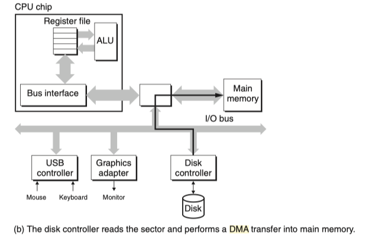

{++DMA方式++} 减少I/O过程中CPU用于实际传输的开销而引入的

- 由DMAC(DMA控制器)暂时接管总线控制{++外部设备与内存间的直接数据交换++},数据无须由CPU寄存器中转
- 传输过程中CPU可以继续执行其他程序
- 设备由DMAC向CPU申请总线控制权用于数据传输
- 数据块传输结束后,使用{++中断++}请求CPU进行后处理

{++DMA VS 中断++} 

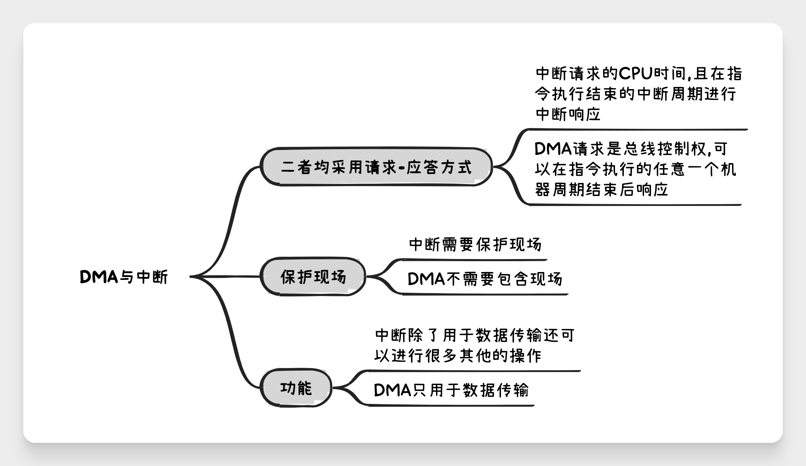

{++内存争用问题++} 虽然有Cache但CPU在DMA期间仍然可能要访问主存,此时就会产生冲突,通常由三种处理办法 {++停止CPU访问++}, {++DMAC与CPU交替访问++} {++周期挪用++}

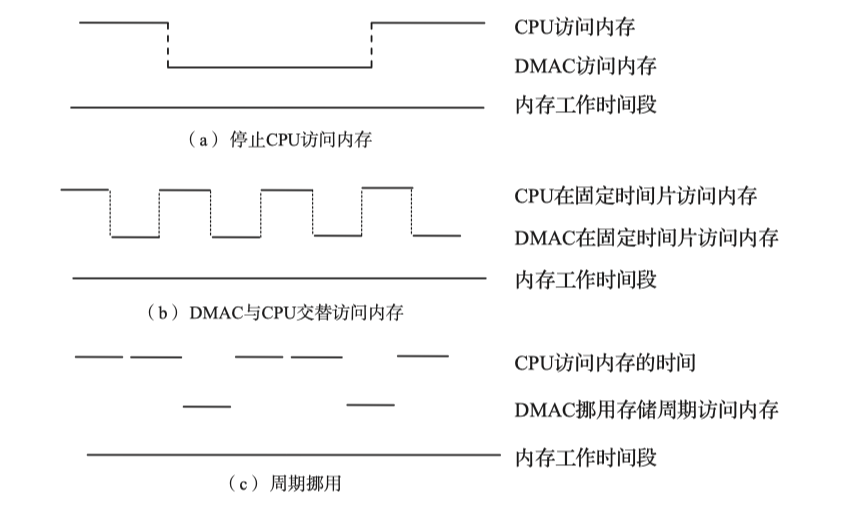 

- 停止CPU访问 在DMA期间由DMAC独占内存
    - 适合高速外设
    - 需要进行总线控制权的申请,建立与交换过程
- DMAC与CPU交替访问 
    - 将存储周期分为两部分,一部分专用于CPU,一部分专用于DMA
    - 总线控制权分时控制,不需要进行总线控制权的申请,建立与交换过程
- 周期挪用 只有当DMAC需要访问主存的时候才暂停{++一个++}存储周期工DMAC访问内存,访存结束后将控制权交还CPU;若挪用周期内CPU要访问主存,则{++DMA优先访问主存++}

{++DMA控制器++}

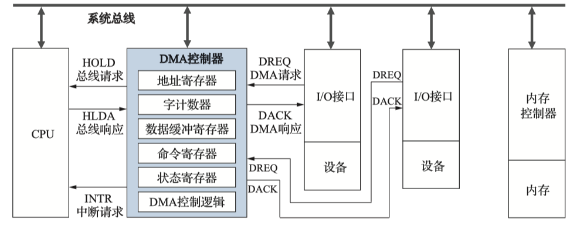

- 地址寄存器 DMA预处理阶段由{++CPU设置++},每次DMA传送后自增,指向下一个内存单元
- 字计数器 用于记录数据块的长度, 为0的时候DMA传输结束,发出DMA中断请求信号
- 上述DMAC被称为第三方DMA,若集成在I/O接口中,如CSAPP的那张图所示则被称为第一方DMA

{++DMA流程++} 以周期挪用方式的DMA为例

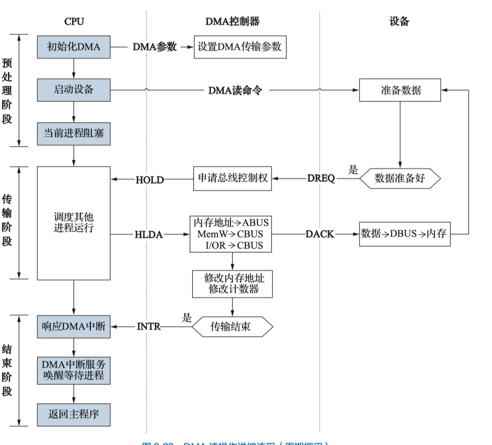