# 计算机组成原理

## 2009年统考真题
Q1:某计算机的 CPU 主频为 500MHz，CPI 为 5（即执行每条指令平均需 5 个时钟周期）。假定某外设的数据传输率为 0.5MB/s，采用中断方式与主机进行数据传送，以 32 位为传输单位，对应的中断服务程序包含 18 条指令，中断服务的其他开销相当于 2 条指令的执行时间。请回答下列问题，要求给出计算过程。

1. 在中断方式下，CPU 用于该外设 I/O 的时间占整个 CPU 时间的百分比是多少？
2. 当该外设的数据传输率达到 5MB/s 时，改用 DMA 方式传送数据。假定每次 DMA 传送块大小为 5000B，且 DMA 预处理和后处理的总开销为 500 个时钟周期，则 CPU 用于该外设 I/O 的时间占整个 CPU 时间的百分比是多少（假设 DMA 与 CPU 之间没有访存冲突）？


Q2:某计算机字长16位,采用16位定长指令字结构,部分数据通路结构如下图所示。图中所有控制信号为1时表示有效,为0时表示无效。例如,控制信号MDRinE为1表示允许数据从DB打入MDR,MDRin为1表示允许数据从总线打入MDR。假设MAR的输出一直处于使能状态。加法指令“ADD(R1),R0”的功能为(R0)+((R1))→(R1),即将R0中的数据与R1的内容所指主存单元的数据相加,并将结果送入R1的内容所指主存单元中保存。

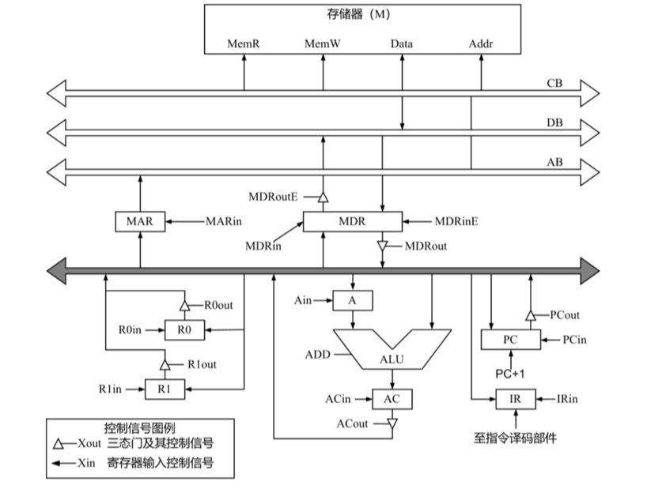

下表给出了上述指令取指和译码阶段每个节拍（时钟周期）的功能和有效控制信号，请按表中描述方式用表格列出指令执行阶段每个节拍的功能和有效控制信号。

| 时钟 | 功能 | 有效控制信号 |
| ---- | ---- | ---- |
| C1 | MAR←(PC) | PCout, MARin |
| C2 | MDR←M(MAR)<br>PC←(PC)+1 | MemR, MDRinE<br>PC+1 |
| C3 | IR←(MDR) | MDRout, IRin |
| C4 | 指令译码 | 无 |


## 2010年统考真题

Q1:某计算机字长为16位,主存地址空间大小为128KB,按字编址,采用单字长指令格式,指令各字段定义如下:

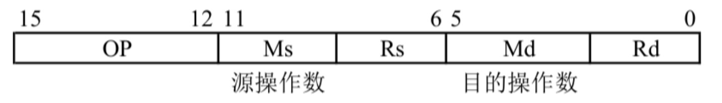

源操作数 目的操作数

转移指令采用相对寻址方式,相对偏移量用补码表示,寻址方式定义见下表。

| Ms/Md | 寻址方式 | 助记符 | 含义 |
|---|---|---|---|
| 000B | 寄存器直接 | Rn | 操作数=(Rn) |
| 001B | 寄存器间接 | (Rn) | 操作数=((Rn)) |
| 010B | 寄存器间接、自增 | (Rn)+ | 操作数=((Rn)),(Rn)+1→Rn |
| 011B | 相对 | D(Rn) | 转移目标地址=(PC)+(Rn) |

注:(X)表示存储器地址X或寄存器X的内容

回答下列问题:

1. 该指令系统最多可有多少条指令?该计算机最多有多少个通用寄存器?存储器地址寄存器(MAR)和存储器数据寄存器(MDR)至少各需要多少位?

2. 转移指令的目标地址范围是多少?

3. 若操作码0010B表示加法操作(助记符为add),寄存器R4和R5的编号分别为100B和101B,R4的内容为1234H,R5的内容为5678H,地址1234H中的内容为5678H,5678H中的内容为1234H,则汇编语句“add (R4),(R5)+”(逗号前为源操作数,逗号后为目的操作数)对应的机器码是什么(用十六进制表示)?该指令执行后,哪些寄存器和存储单元的内容会改变?改变后的内容是什么?

Q2:某计算机的主存地址空间大小为 256MB，按字节编址。指令 Cache 和数据 Cache 分离，均有 8 个 Cache 行，每个 Cache 行大小为 64B，数据 Cache 采用直接映射方式。现有两个功能相同的程序 A 和 B，其伪代码如下所示：

程序 A:
```c
int a[256][256];

int sum_array1() {
    int i, j, sum = 0;
    for(i = 0; i < 256; i++)
        for(j = 0; j < 256; j++)
            sum += a[i][j];
    return sum;
}
```

程序 B:
```c
int a[256][256];
...
int sum_array2() {
    int i, j, sum = 0;
    for(j = 0; j < 256; j++)
        for(i = 0; i < 256; i++)
            sum += a[i][j];
    return sum;
}
```

假定 int 型数据用 32 位补码表示，程序编译时，i、j 和 sum 均分配在寄存器中，数组 a 按行优先方式存放，其首地址为 320（十进制数）。回答下列问题，要说明理由或给出计算过程。

1. 不考虑用于 Cache 一致性维护和替换算法的控制位，数据 Cache 的总容量为多少？

2. 数组元素 a[0][31] 和 a[1][1] 各自所在的主存块对应的 Cache 行号是多少（Cache 行号从 0 开始）？

3. 程序 A 和 B 的数据访问命中率各是多少？哪个程序的执行时间更短？
## 2011年统考真题

Q1:假定在一个 8 位字长的计算机中运行如下 C 程序段：

```c
unsigned int x = 134;
unsigned int y = 246;
int m = x;
int n = y;
unsigned int z1 = x - y;
unsigned int z2 = x + y;
int k1 = m - n;
int k2 = m + n;
```

若编译器编译时将 8 个 8 位寄存器 R1～R8 分别分配给变量 x、y、m、n、z1、z2、k1 和 k2。请回答下列问题 (提示：有符号整数用补码表示)。

1. 执行上述程序段后，寄存器 R1、R5 和 R6 的内容分别是什么 (用十六进制表示)？
2. 执行上述程序段后，变量 m 和 k1 的值分别是多少 (用十进制表示)？
3. 上述程序段涉及有符号整数加减、无符号整数加减运算，这四种运算能否利用同一个加法器辅助电路实现？简述理由。
4. 计算机内部如何判断有符号整数加减运算的结果是否发生溢出？上述程序段中，哪些有符号整数运算语句的执行结果会发生溢出？

Q2:某计算机存储器按字节编址,虚拟(逻辑)地址空间大小为 16MB,主存(物理)地址空间大小为 1MB,页面大小为 4KB; Cache 采用直接映射方式,共 8 行;主存与 Cache 之间交换的块大小为 32B。系统运行到某一时刻时,页表的部分内容和 Cache 的部分内容分别如下的左图和右图所示,图中页框号及标记字段的内容为十六进制形式。回答下列问题:

1.虚拟地址共有几位,哪几位表示虚页号? 物理地址共有几位,哪几位表示页框号(物理页号)?

2.使用物理地址访问 Cache 时,物理地址应划分成哪几个字段? 要求说明每个字段的位数及在物理地址中的位置。


3.虚拟地址 001C60H 所在的页面是否在主存中? 若在主存中,则该虚拟地址对应的物理地址是什么? 访问该地址时是否 Cache 命中? 要求说明理由。

4.假定该机配置一个四路组相联的 TLB,共可存放 8 个页表项,若其当前内容(十六进制)如下图所示,则此时虚拟地址 024BACH 所在的页面是否存在主存中? 说明理由。

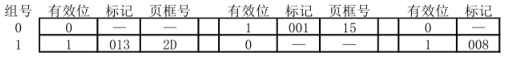

## 2012年统考真题
Q1 假定某计算机的CPU主频为80MHz，CPI为4，平均每条指令访存1.5次，主存与Cache之间交换的块大小为16B，Cache的命中率为99%，存储器总线宽度为32位。请回答下列问题。

1. 该计算机的MIPS数是多少?平均每秒Cache缺失的次数是多少?在不考虑DMA传送的情况下，主存带宽至少达到多少才能满足CPU的访存要求?
2. 假定在Cache缺失的情况下访问主存时，存在0.0005%的缺页率，则CPU平均每秒产生多少次缺页异常?若页面大小为4KB，每次缺页都需要访问磁盘，访问磁盘时DMA传送采用周期挪用方式，磁盘I/O接口的数据缓冲寄存器为32位，则磁盘I/O接口平均每秒发出的DMA请求次数至少是多少?
3. CPU和DMA控制器同时要求使用存储器总线时，哪个优先级更高?为什么?
4. 为了提高性能，主存采用四体低位交叉存储模式，工作时每1/4个存储周期启动一个体。若每个体的存储周期为50ns，则该主存能提供的最大带宽是多少?

Q2 某 16 位计算机中，有符号整数用补码表示，数据 Cache 和指令 Cache 分离。下表给出了指令系统中的部分指令格式，其中 Rs 和 Rd 表示寄存器，mem 表示存储单元地址，(x) 表示寄存器 x 或存储单元 x 的内容。

| 名称         | 指令的汇编格式 | 指令功能               |
|--------------|----------------|------------------------|
| 加法指令     | ADD Rs, Rd     | (Rs)+(Rd)→Rd           |
| 算术 / 逻辑左移 | SHL Rd         | $2^{\ast}$(Rd)→Rd      |
| 算术右移     | SHR Rd         | (Rd)/2→Rd              |
| 取数指令     | LOAD Rd, mem   | (mem)→Rd               |
| 存数指令     | STORE Rs, mem  | (Rs)→mem               |

该计算机采用 5 段流水方式执行指令，各流水段分别是取指 (IF)、译码 / 读寄存器 (ID)、执行 / 计算有效地址 (EX)、访问存储器 (M) 和结果写回寄存器 (WB)，流水线采用 “按序发射，按序完成” 方式，未采用转发技术处理数据相关，且同一寄存器的读和写操作不能在同一个时钟周期内进行。请回答下列问题：

1.若 int 型变量 x 的值为 - 513，存放在寄存器 R1 中，则执行 “SHR R1” 后，R1 中的内容是多少（用十六进制表示）？

2.若在某个时间段中，有连续的 4 条指令进入流水线，在其执行过程中未发生任何阻塞，则执行这 4 条指令所需的时钟周期数为多少？

3.若高级语言程序中某赋值语句为 x = a + b，x、a 和 b 均为 int 型变量，它们的存储单元地址分别表示为 [x]、[a] 和 [b]。该语句对应的指令序列及其在指令流中的执行过程如下所示。

I1 LOAD R1, [a]

I2 LOAD R2, [b]

I3 ADD R1, R2

I4 STORE R2, [x]

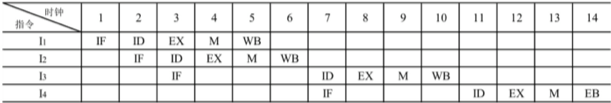

则这 4 条指令执行过程中 I3 的 ID 段和 I4 的 IF 段被阻塞的原因各是什么？

4.若高级语言程序中某赋值语句为 x = x * 2 + a，x 和 a 均为 unsigned int 类型的变量，它们的存储单元地址分别表示为 [x]、[a]，则执行这条语句至少需要多少个时钟周期？要求模仿上图画出这条语句对应的指令序列及其在流水线中的执行过程示意图。
## 2013年统考真题
Q1 某 32 位计算机,CPU 主频为 800MHz, Cache 命中时的 CPI 为 4, Cache 块大小为 32 字节;主存采用 8体交叉存储方式,每个体的存储字长为 32 位、存储周期为 40ns;存储器总线宽度为 32 位,总线时钟频率为 200MHz,支持突发传送总线事务。每次读突发传送总线事务的过程包括:送首地址和命令、存储器准备数据、传送数据。每次突发传送 32 字节,传送地址或 32 位数据均需要一个总线时钟周期。请回答下列问题,要求给出理由或计算过程。

1. CPU 和总线的时钟周期各为多少?总线的带宽(即最大数据传输率)为多少?
2. Cache 缺失时,需要用几个读突发传送总线事务来完成一个主存块的读取?
3. 存储器总线完成一次读突发传送总线事务所需的时间是多少?
4. 若程序 BP 执行过程中,共执行了 100 条指令,平均每条指令需进行 1.2 次访存, Cache 缺失率为 5%,不考虑替换等开销,则BP的 CPU 执行时间是多少?

Q2 某计算机采用 16 位定长指令字格式，其 CPU 中有一个标志寄存器，其中包含进位/借位标志 CF、零标志 ZF 和符号标志 NF。假定为该机设计了条件转移指令，其格式如下：

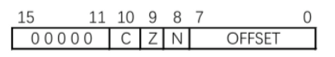

其中，00000 为操作码 OP；C、Z 和 N 分别为 CF、ZF 和 NF 的对应检测位，某检测位为 1 时则表示需检测对应标志，需检测的标志位中只要有一个为 1 就转移，否则不转移。例如，若 C=1，Z=0，N=1，则需检测 CF 和 NF 的值，当 CF=1 或 NF=1 时发生转移；OFFSET 是相对偏移量，用补码表示。转移执行时，转移目标地址为 (PC) + 2 + 2 × OFFSET；顺序执行时，下一条指令地址为 (PC) + 2。请回答下列问题：

1.该计算机存储器是按字节编址还是按字编址？该条件转移指令向后(反向)最多可跳转多少条指令？

2.某条件转移指令的地址为 200CH，指令内容如下图，若该指令执行时 CF=0，ZF=0，NF=1，则该指令执行后 PC 的值是多少？若该指令执行时 CF=1，ZF=0，NF=0，则该指令执行后 PC 的值又是多少？请给出计算过程。

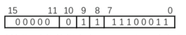

3.实现“无符号数比较小于或等于时转移”功能的指令中，C、Z 和 N 应各是什么？

4.以下是该指令对应的数据通路示意图，要求给出图中部件①~③的名称或功能说明。

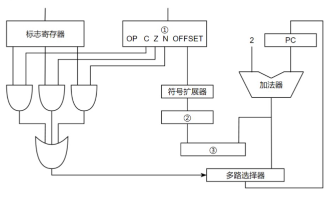

## 2014年统考真题
Q1 某程序中有循环代码段 P：“for(int i = 0; i < N; i++) sum += A[i];”。假设编译时变量 sum 和 i 分别分配在寄存器 R1 和 R2 中。常量 N 在寄存器 R6 中，数组 A 的首地址在寄存器 R3 中。程序段 P 的起始地址为 08048100H，对应的汇编代码和机器代码如下表所示。

| 编号 | 地址 | 机器代码 | 汇编代码 | 注释 |
|------|------|----------|----------|------|
| 1 | 08048100H | 00022080H | loop: sll R4, R2, 2 | (R2) << 2 → R4 |
| 2 | 08048104H | 00083020H | add R4, R4, R3 | (R4) + (R3) → R4 |
| 3 | 08048108H | 8C850000H | load R5, 0(R4) | ((R4) + 0) → R5 |
| 4 | 0804810CH | 00250820H | add R1, R1, R5 | (R1) + (R5) → R1 |
| 5 | 08048110H | 20420001H | add R2, R2, 1 | (R2) + 1 → R2 |
| 6 | 08048114H | 1446FFFAH | bne R2, R6, loop | if(R2) != (R6) goto loop |

执行上述代码的计算机 M 采用 32 位定长指令字，其中分支指令 bne 采用如下格式：

| 31 | 26 25 | 21 20 | 16 15 | 0 |
|----|-------|-------|-------|---|
| OP | Rs | Rd | OFFSET |   |

OP 为操作码；Rs 和 Rd 为寄存器编号；OFFSET 为偏移量，用补码表示。

请回答下列问题，并说明理由。

1. M 的存储器编址单位是什么？

2. 已知 sll 指令实现左移功能，数组 A 中每个元素占多少位？

3. 表中 bne 指令的 OFFSET 字段的值是多少？已知 bne 指令采用相对寻址方式，当前 PC 内容为 bne 指令地址，通过分析表中指令地址和 bne 指令内容，推断 bne 指令的转移目标地址计算公式。

4. 若 M 采用如下“按序发射、按序完成”的 5 级指令流水线：IF(取指)、ID(译码及取数)、EXE(执行)、MEM(访存)、WB(写回寄存器)，且硬件不采取任何转发措施，分支指令的执行均引起 3 个时钟周期的阻塞，则 P 中哪些指令的执行会由于数据相关而发生流水线阻塞？哪条指令的执行会发生控制冒险？为什么指令 1 的执行不会因为与指令 5 的数据相关而发生阻塞？

Q2 假设对于Q1中的计算机 M 和程序 P 的机器代码，M 采用页式虚拟存储管理；P 开始执行时，(R1) = (R2) = 0，(R6) = 1000，其机器代码已调入主存但不在 Cache 中；数组 A 未调入主存，且所有数组元素在同一页，并存储在磁盘的同一个扇区。请回答下列问题并说明理由。

1. P 执行结束时，R2 的内容是多少?

2. M 的指令 Cache 和数据 Cache 分离。若指令 Cache 共有 16 行，Cache 和主存交换的块大小为 32 字节，则其数据区的容量是多少?若仅考虑程序段 P 的执行，则指令 Cache 的命中率为多少?

3. P 在执行过程中，哪条指令的执行可能发生溢出异常?哪条指令的执行可能产生缺页异常?对于数组 A 的访问，需要读磁盘和 TLB 至少各多少次?
## 2015年统考真题
Q1 某 16 位计算机的主存按字节编码，存取单位为 16 位；采用 16 位定长指令字格式；CPU 采用单总线结构，主要部分如下图所示。图中 R0 ~ R3 为通用寄存器；T 为暂存器；SR 为移位寄存器，可实现直送(mov)、左移一位(left)和右移一位(right)三种操作，控制信号为 SRop，SR 的输出由信号 SRout 控制；ALU 可实现直送 A(mova)、A 加 B(add)、A 减 B(sub)、A 与 B(and)、A 或 B(or)、非 A(not)、A 加 1(inc)七种操作，控制信号为 ALUop。

回答下列问题：

1. 图中哪些寄存器是程序员可见的？为何要设置暂存器 T？

2. 控制信号 ALUop 和 SRop 的位数至少各是多少？

3. 控制信号 SRout 所控制部件的名称或作用是什么？

4. 端点① ~ ⑨中，哪些端点须连接到控制部件的输出端？

5. 为完善单总线数据通路，需要在端点① ~ ⑨中相应的端点之间添加必要的连线。写出连线的起点和终点，以正确表示数据的流动方向。

6. 为什么二路选择器 MUX 的一个输入端是 2？

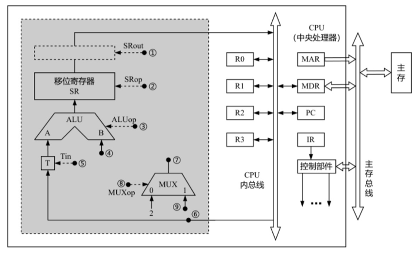

Q2 Q1中描述的计算机，其部分指令执行过程的控制信号如下图所示。

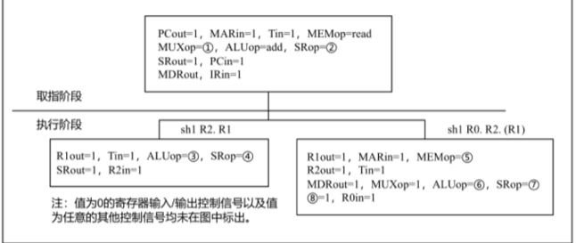

该机指令格式如下图所示，支持寄存器直接和寄存器间接两种寻址方式，寻址方式位分别为 0 和 1，通用寄存器 R0 ~ R3 的编号分别为 0、1、2 和 3。

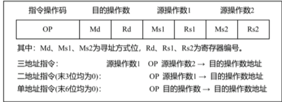

其中：Md、Ms1、Ms2 为寻址方式位，Rd、Rs1、Rs2 为寄存器编号。

三地址指令: 源操作数 1 OP 源操作数 2 → 目的操作数地址

二地址指令(末 3 位均为 0): OP 源操作数 1 → 目的操作数地址

单地址指令(末 6 位均为 0): OP 目的操作数 → 目的操作数地址

请回答下列问题。

1.该机的指令系统最多可定义多少条指令?

2.若 inc、shl 和 sub 指令的操作码分别为 01H、02H 和 03H，则以下指令对应的机器代码各是什么?

inc R1 ; R1 + 1 → R1

shl R2, R1 ; (R1) << 1 → R2

sub R3, (R1), R2 ; ((R1)) - (R2) → R3

3.假设寄存器 X 的输入和输出控制信号分别为 Xin 和 Xout，其值为 1 表示有效，为 0 表示无效(如 PCout = 1 表示 PC 内容送总线); 存储器控制信号为 MEMop，用于控制存储器的读和写(write)操作。写出第一幅图中标号① ~ ⑧处的控制信号或控制信号的取值。

4.指令 “sub R1, R3, (R2)” 和 “inc R1” 的执行阶段至少各需要多少个时钟周期? 请结合图片内容。

## 2016年统考真题

Q1 假定CPU主频为50MHz，CPI为4。设备D采用异步串行通信方式向主机传送7位ASCII字符，通信规程中有1位奇校验位和1位停止位，从D接收启动命令到字符送入I/O端口需要0.5ms。请回答下列问题，要求说明理由。

1. 每传送一个字符，在异步串行通信线上共需传输多少位？在设备D持续工作过程中，每秒钟最多可向I/O端口送入多少个字符？

2. 设备D采用中断方式进行输入/输出，示意图如下。

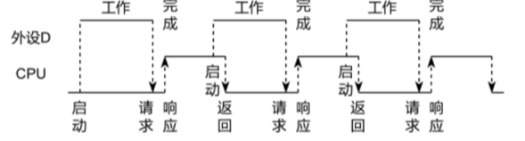

I/O端口每收到一个字符申请一次中断，中断响应需10个时钟周期，中断服务程序共有20条指令，其中第15条指令启动D工作。若CPU需从D读取1000个字符，则完成这一任务所需时间大约是多少个时钟周期？CPU用于完成这一任务的时间大约是多少个时钟周期？在中断响应阶段CPU进行了哪些操作？

Q2 某计算机采用页式虚拟存储管理方式，按字节编址，虚拟地址为32位，物理地址为24位，页大小为8KB；TLB采用全相联映射；Cache数据区大小为64KB，按2路组相联方式组织，主存块大小为64B。存储访问过程的示意图如下。

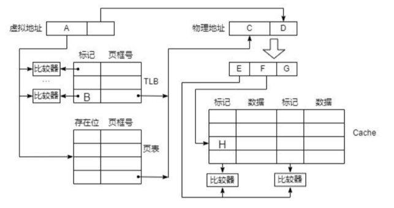

请回答下列问题。

1. 图中字段A~G的位数各是多少？TLB标记字段B中存放的是什么信息？

2. 将块号为4099的主存块装入到 Cache 中时，所映射的 Cache 组号是多少？对应的H字段内容是什么？

3. Cache 缺失处理的时间开销大还是缺页处理的时间开销大？为什么？

4. 为什么 Cache 可以采用直写(Write Through)策略，而修改页面内容时总是采用回写(Write Back)策略。

## 2017年统考真题
Q1 已知 $f(n)=\sum_{i=0}^{n}2^{i}=2^{n+1}-1=11\cdots\cdots1B$，计算 $f(n)$ 的 C 语言函数 $f1$ 如下:

```c
int fl(unsigned n) {
    int sum = 1, power = 1;
    for (unsigned i = 0; i <= n - 1; i++)
        power *= 2;
    sum += power;
    return sum;
}
```

将 $fl$ 中的 $int$ 都改为 $float$，可得到计算 $f(n)$ 的另一个函数 $f2$。假设 $unsigned$ 和 $int$ 型数据都占 32 位，$float$ 采用 IEEE 754 单精度标准。回答下列问题。

1) 当 $n = 0$ 时，$fl$ 会出现死循环，为什么? 若将 $fl$ 中的变量 $i$ 和 $n$ 都定义为 $int$ 型，则 $fl$ 是否还会出现死循环? 为什么?

2) $fl(23)$ 和 $f2(23)$ 的返回值是否相等? 机器数各是什么(用十六进制表示)?

3) $fl(24)$ 和 $f2(24)$ 的返回值分别为 33554431 和 33554432.0，为什么不相等?

4) $f(31)=2^{32}-1$ 而 $fl(31)$ 的返回值却为 -1，为什么? 若使 $fl(n)$ 的返回值与 $f(n)$ 相等，则最大的 $n$ 是多少?

5) $f2(127)$ 的机器数为 7F800000H，对应的值是什么? 若使 $f2(n)$ 的结果不溢出，则最大的 $n$ 是多少? 若使 $f2(n)$ 的结果精确(无舍入)，则最大的 $n$ 是多少?

Q2 在按字节编址的计算机 $M$ 上，题 43 中 $f1$ 的部分源程序(阴影部分)与对应的机器级代码(包括指令的虚拟地址)如下图所示。

其中，机器级代码行包括行号、虚拟地址、机器指令和汇编指令。请回答下列问题。

1) 计算机 $M$ 是 RISC 还是 CISC? 为什么?

2) $f1$ 的机器指令代码共占多少字节? 要求给出计算过程。

3) 第 20 条指令 $cmp$ 通过 $i$ 减 $n - 1$ 实现对 $i$ 和 $n - 1$ 的比较。执行 $f1(0)$ 过程中，当 $i = 0$ 时，$cmp$ 指令执行后，进/借位标志 $CF$ 的内容是什么? 要求给出计算过程。

4) 第 23 条指令 $shl$ 通过左移操作实现了 $power * 2$ 运算，在 $f2$ 中能否也用 $shl$ 指令实现 $power * 2$? 为什么?

## 2018年统考真题
Q1 假定计算机的主频为 500MHz，CPI 为 4。现有设备 A 和 B，其数据传输率分别为 2MB/s 和 40MB/S，对应 I/O 接口中各有一个 32 位数据缓冲寄存器。请回答下列问题，要求给出计算过程。

1) 若设备 A 采用定时查询 I/O 方式，每次输入/输出都至少执行 10 条指令。设备 A 最多间隔多长时间查询一次才能不丢失数据？CPU 用于设备 A 输入/输出的时间占 CPU 总时间的百分比至少是多少？

2) 在中断 I/O 方式下，若每次中断响应和中断处理的总时钟周期数至少为 400，则设备 B 能否采用中断 I/O 方式？为什么？

3) 若设备 B 采用 DMA 方式，每次 DMA 传送的数据块大小为 1000B，CPU 用于 DMA 预处理和后处理的总时钟周期数为 500，则 CPU 用于设备 B 输入/输出的时间占 CPU 总时间的百分比最多是多少？

Q2 某计算机采用页式虚拟存储管理方式，按字节编址。CPU 进行存储访问的过程如题 44 图所示。根据下图回答下列问题。

1) 主存物理地址占多少位?

2) TLB 采用什么映射方式?TLB 是用 SRAM 还是用 DRAM 实现

3) Cache 采用什么映射方式?若 Cache 采用 LRU 替换算法和回写(Write Back)策略，则 Cache 每行中除数据(Data)、Tag 和有效位外，还应有哪些附加位? Cache 的总容量是多少? Cache 中有效位的作用是什么?

4) 若 CPU 给出的虚拟地址为 0008C040H，则对应的物理地址是多少?是否在 Cache 中命中?说明理由。若 CPU 给出的虚拟地址为 0007C260H，则该地址所在主存块映射到的 Cache 组号是多少?请结合图片内容


## 2019年统考真题
Q1 已知 $f(n) = n!=n×(n - 1)×(n - 2)×…×2×1$，计算 $f(n)$ 的 C 语言函数 $f1$ 的源程序(阴影部分)及其在 32 位计算机 $M$ 上的部分机器级代码如下:

```asm
int f1(int n) {
1       00401000   55              push ebp
...
        if(n > 1)
11      00401018   83 7D 08 01     cmp dword ptr [ebp+8], 1
12      0040101C   7E 17           jle f1+35h (00401035)
        return n * f1(n - 1);
13      0040101E   8B 45 08        mov eax, dword ptr [ebp+8]
14      00401021   83 E8 01        sub eax, 1
15      00401024   50              push eax
16      00401025   EB D6 FF FF FF  call f1 (00401000)
...
19      00401030   0F AF C1        imul eax, ecx
20      00401033   EB 05           jmp f1+3Ah (0040103a)
        else return 1;
21      00401035   B8 01 00 00 00  mov eax, 1
}
...
26      00401040   3B EC           cmp ebp, esp
...
30      0040104A   C3              ret
```

其中，机器级代码行包括行号、虚拟地址、机器指令和汇编指令，计算机 $M$ 按字节编址，$int$ 型数据占 32 位。请回答下列问题:

1) 计算 $f(10)$ 需要调用函数 $f1$ 多少次? 执行哪条指令会递归调用 $f1$?

2) 上述代码中，哪条指令是条件转移指令? 哪几条指令一定会使程序跳转执行?

3) 根据第 16 行的 $call$ 指令，第 17 行指令的虚拟地址应是多少? 已知第 16 行的 $call$ 指令采用相对寻址方式，该指令中的偏移量应是多少(给出计算过程)? 已知第 16 行的 $call$ 指令的后 4 字节为偏移量，$M$ 是采用大端方式还是采用小端方式?

4) $f(13)=6227020800$，但 $f1(13)$ 的返回值为 1932053504，为什么两者不相等? 要使 $f1(13)$ 能返回正确的结果，应如何修改 $f1$ 的源程序?

5) 第 19 行的 $imul$ 指令(带符号整数乘)的功能是 $R[eax]←R[eax]×R[ecx]$，当乘法器输出的高、低 32 位乘积之间满足什么条件时，溢出标志 $OF = 1$? 要使 CPU 在发生溢出时转异常处理，编译器应在 $imul$ 指令后应加一条什么指令?

Q2 对于Q2中的的计算机，若计算机 $M$ 的主存地址为 32 位，采用分页存储管理方式，页大小为 4KB，则第 1 行的 $push$ 指令和第 30 行的 $ret$ 指令是否在同一页中(说明理由)? 若指令 $Cache$ 有 64 行，采用 4 路组相联映射方式，主存块大小为 64B，则 32 位主存地址中，哪几位表示块内地址? 哪几位表示 $Cache$ 组号? 哪几位表示标记(tag)信息? 读取第 16 行的 $call$ 指令时，只可能在指令 $Cache$ 的哪一组中命中(说明理由)?
## 2020年统考真题
Q1 有实现 x*y 的两个 C 语言函数如下：

```c
unsigned umul(unsigned x, unsigned y) { return x * y; }
int imul(int x, int y) { return x * y; }
```

假定某计算机 M 中 ALU 只能进行加减运算和逻辑运算。请回答下列问题。

1) 若 M 的指令系统中没有乘法指令，但有加法、减法和位移等指令，则在 M 上也能实现上述两个函数中的乘法运算，为什么?

2) 若 M 的指令系统中有乘法指令，则基于 ALU、位移器、寄存器以及相应控制逻辑实现乘法指令时，控制逻辑的作用是什么?

3) 针对以下三种情况：①没有乘法指令；②有使用 ALU 和位移器实现的乘法指令；③有使用阵列乘法器实现的乘法指令，函数 umul() 在哪种情况下执行时间最长?哪种情况下执行的时间最短?说明理由。

4) n 位整数乘法指令可保存 2n 位乘积，当仅取低 n 位作为乘积时，其结果可能会发生溢出。当 n = 32，x = $2^{31}-1$，y = 2 时，带符号整数乘法指令和无符号整数乘法指令得到的 x*y 的 2n 位乘积分别是什么(用十六进制表示)?此时函数 umul() 和 imul() 的返回结果是否溢出?对于无符号整数乘法运算，当仅取乘积的低 n 位作为乘法结果时，如何用 2n 位乘积进行溢出判断?

Q2 假定主存地址为 32 位，按字节编址，指令 Cache 和数据 Cache 与主存之间均采用 8 路组相联映射方式，直写(Write Through)写策略和 LRU 替换算法，主存块大小为 64B，数据区容量各为 32KB。开始时 Cache 均为空。请回答下列问题：

1) Cache 每一行中标记(Tag)、LRU 位各占几位?是否有修改位?

2) 有如下 C 语言程序段:

```c
for(k = 0; k < 1024; k++)
    s[k] = 2 * s[k];
```

若数组 s 及其变量 k 均为 int 型，int 型数据占 4B，变量 k 分配在寄存器中，数组 s 在主存中的起始地址为 0080 00C0H，则该程序段执行过程中，访问数组 s 的数据 Cache 缺失次数为多少?

3) 若 CPU 最先开始的访问操作是读取主存单元 0001 003H 中的指令，简要说明从 Cache 中访问该指令的过程，包括 Cache 缺失处理过程。
## 2021年统考真题
Q1 假定计算机M字长为16位，按字节编址，连接CPU和主存的系统总线中地址线为20位、数据线为8位，采用16位定长指令字，指令格式及其说明如下：

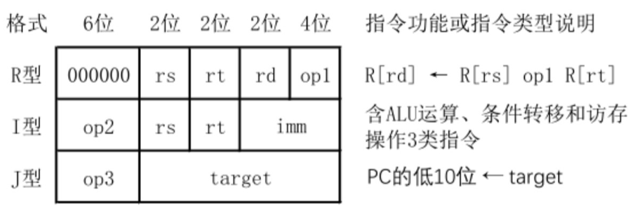

其中，op1~op3为操作码，rs，rt和rd为通用寄存器编号，R[r]表示寄存器r的内容，imm为立即数，target为转移目标的形式地址。请回答下列问题。

1. ALU的宽度是多少位？可寻址主存空间大小为多少字节？指令寄存器、主存地址寄存器(MAR)和主存数据寄存器(MDR)分别应有多少位？

2. R型格式最多可定义多少种操作？I型和J型格式总共最多可定义多少种操作？通用寄存器最多有多少个？

3. 假定op1为0010和0011时，分别表示带符号整数减法和带符号整数乘法指令，则指令01B2H的功能是什么(参考上述指令功能说明的格式进行描述)？若1，2，3号通用寄存器当前内容分别为B052H，0008H，0020H，则分别执行指令01B2H和01B3H后，3号通用寄存器内容各是什么？各自结果是否溢出？

4. 若采用I型格式的访存指令中imm(偏移量)为带符号整数，则地址计算时应对imm进行零扩展还是符号扩展？

5. 无条件转移指令可以采用上述哪种指令格式？

Q2 假设计算机M的主存地址为24位，按字节编址；采用分页存储管理方式，虚拟地址为30位，页大小为4KB；TLB采用2路组相联方式和LRU替换策略，共8组。请回答下列问题。

1. 虚拟地址中哪几位表示虚页号?哪几位表示页内地址?

2. 已知访问TLB时虚页号高位部分用作TLB标记，低位部分用作TLB组号，M的虚拟地址中哪几位是TLB标记?哪几位是TLB组号?

3. 假设TLB初始时为空，访问的虚页号依次为10，12，16，7，26，4，12和20，在此过程中，哪一个虚页号对应的TLB表项被替换?说明理由。

4. 若将M中的虚拟地址位数增加到32位，则TLB表项的位数增加几位?


## 2022年统考真题
Q1 某CPU中部分数据通路如题43图所示，其中，GPRs为通用寄存器组；FR为标志寄存器，用于存放ALU产生的标志信息；带箭头虚线表示控制信号，如控制信号Read、Write分别表示主存读、主存写，MDRin表示内部总线上数据写入MDR，MDRout表示MDR的内容送内部总线。

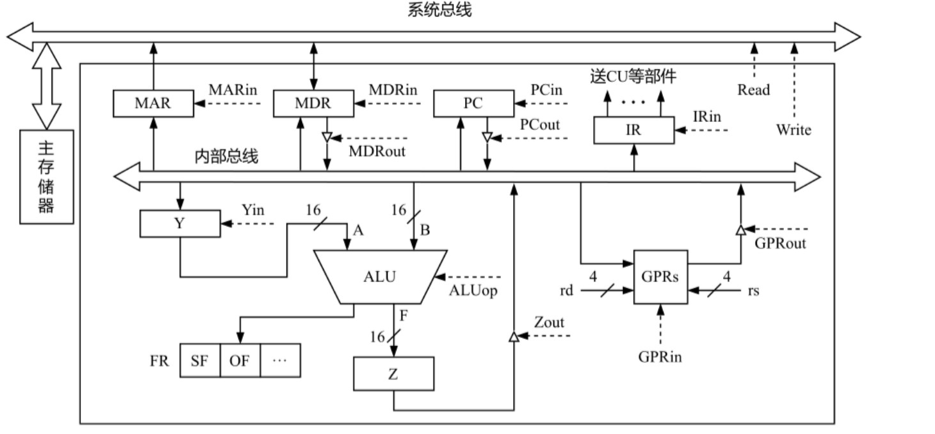

请回答下列问题。

1. 设ALU的输入端A、B及输出端F的最高位分别为A15、B15及F15，FR中的符号标志和溢出标志分别为SF和OF，则SF的逻辑表达式是什么？A加B、A减B时OF的逻辑表达式分别是什么？要求逻辑表达式的输入变量为A15、B15及F15

2. 为什么要设置暂存器Y和Z？

3. 若GPRs的输入端rs、rd分别为所读、写的通用寄存器的编号，则GPRs中最多有多少个通用寄存器？rs和rd来自图中的哪个寄存器？已知GPRs内部有一个地址译码器和一个多路选择器，rd应连接地址译码器还是多路选择器？

4. 取指令阶段(不考虑PC增量操作)的控制信号序列是什么？若从发出主存读命令到主存读出数据并传送到MDR共需5个时钟周期，则取指令阶段至少需要几个时钟周期？

5. 图中控制信号由什么部件产生？图中哪些寄存器的输出信号会连到该部件的输入端？

Q2 假设某磁盘驱动器中有4个双面盘片，每个盘面有20000个磁道，每个磁道有500个扇区，每个扇区可记录512字节的数据，盘片转速为7200RPM(转/分)，平均寻道时间为5ms。请回答下列问题。

1. 每个扇区包含数据及其地址信息，地址信息分为3个字段。这3个字段的名称各是什么?对于该磁盘，各字段至少占多少位?

2. 一个扇区的平均访问时间约为多少?

3. 若采用周期挪用DMA方式进行磁盘与主机之间的数据传送，磁盘控制器中的数据缓冲区大小为64位，则在一个扇区读写过程中，DMA控制器向CPU发送了多少次总线请求?若CPU检测到DMA控制器的总线请求信号时也需要访问主存，则DMA控制器是否可以获得总线使用权?为什么?

## 2023年统考真题
Q1 已知计算机M的字长为32位，按字节编址，采用请求调页策略的虚拟存储管理方式，虚拟地址为32位，页大小为4KB；数据 Cache 采用4路组相联映射方式，数据区大小为8KB，主存块大小为32B。现有C语言程序段如下：

```c
int a[24][64];

...

for(i=0;i<24;i++)
for(j=0;j<64;j++)    a[i][j]=10;
```

现已知二维数组a按行优先存放，在虚拟地址空间中分配的起始地址为00422000H，sizeof(int)=4，假定在M上执行上述程序段之前数组a不在主存，且在该程序段执行过程中不会发生页面置换。问：

1. 数组a分布在几个页面中?对于数组a的访问，会发生几次缺页异常?页故障地址各是什么?

2. 不考虑变量i和j，该程序段的数据访问是否具有时间局部性?为什么?

3. 该计算机M的虚拟地址(A31~A0)中哪几位用作块内地址?哪几位用作 Cache 组号?a[1][0]的虚拟地址是多少?其所在主存块对应的 Cache 组号是多少?

4. 数组a占用多少主存块?假设上述程序段执行过程中数组a的访问不会和其他数据发生 Cache 访问冲突，则数组a的 Cache 命中率是多少?将循环中i和j的次序按如下方式调换:

```c
for(j=0;j<64;j++)
    for(i=0;i<24;i++)    a[i][j]=10;
```

则数组a的 Cache 命中率又是多少?

Q2 假设Q1中C程序段在计算机M上的部分机器级代码如下，每个机器级代码行中依次包含指令序号、虚拟地址、机器指令和汇编指令。

```asm
            for(i = 0; i < 24; i++)
00401072 C7 45 F8 00 00 00 00         mov [ebp - 8], 0
00401079 EB 09                        jmp 00401084h
0040107B 8B 55 F8                     mov eax, [ebp - 8]
…
00401088 7D 32                        jge 004010bch
            for(j = 0; j < 64; j++)
0040108A C7 45 FC 00 00 00 00         mov [ebp - 4], 0
…
            a[i][j] = 10;
…
004010AE C7 84 82 00 20 42 00 0A 00 00 00 mov [ecx + edx * 4 + 00422000h], 0Ah
… …
```

请回答下列问题：

1. 第20条指令的虚拟地址是多少?

2. 已知第2条jmp和第7条jge都是跳转指令，其操作码分别是EBH和7DH，跳转目标地址分别为00401084H、004010BCH，这两条指令分别采用什么寻址方式？请给出第2条指令jmp的跳转目标地址的计算过程。

3. 已知第19条mov指令的功能是"a[i][j]$ \leftarrow $10"，其中ecx和edx为寄存器名，00422000H是数组a的首地址，指令中源操作数采用什么寻址方式？已知edx中存放的是变量j，ecx中存放的是什么？根据该指令的机器码判断计算机M采用的是大端还是小端方式？

4. 第一次执行第19条指令时，取指令过程中是否会发生缺页异常？为什么？
## 2024年统考真题
Q1 假定计算机M字长为32位，按字节编址，采用32位定长指令字，指令add、slli和lw的格式、编码和功能说明如下图所示。

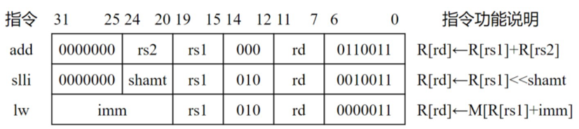

其中，R[x]表示通用寄存器x的内容，M[x]表示地址为x的存储单元内容，shamt为移位位数，imm为补码表示的偏移量。下图给出了计算机M的部分数据通路及其控制信号(用带箭头虚线表示)，其中，A和B分别表示从通用寄存器rs1和rs2中读出的内容；IR[31:20]表示指令寄存器中的高12位；控制信号Ext为0、1时扩展器分别实现零扩展、符号扩展，ALUctr为000、001、010时ALU分别实现加、减、逻辑左移运算。请回答下列问题。

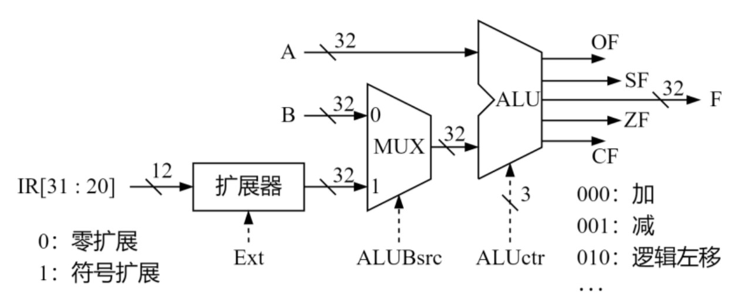

1) 计算机M最多有多少个通用寄存器?为什么shamt字段占5位?(2分)

2) 执行add指令时，控制信号ALUBsrc的取值应是什么?若rs1和rs2寄存器内容分别是87654321H和98765432H，则add指令执行后，ALU输出端F、OF和CF的结果分别是什么?若该add指令处理的是无符号整数，则应根据哪个标志判断是否溢出?(5分)

3) 执行slli指令时，控制信号Ext的取值可以是0也可以是1，为什么?(2分)

4) 执行lw指令时，控制信号Ext、ALUctr的取值分别是什么?(2分)

5) 若一条指令的机器码是A040A103H，则该指令一定是lw指令，为什么?若执行该指令时，R[01H]=FFFF A2D0H，则所读取数据的存储地址是什么?(2分)

Q2 对于题43中的计算机M，C语言程序P包含的语句“sum+=a[i]”在M中对应的指令序列S如下：

1   sllli   r4,r2,2   //R[r4]←R[r2]<<2

2   add   r4,r3,r4   //R[r4]←R[r3]+R[r4]

3   lw   r5,0(r4)   //R[r5]←MR[r4]+0

4   add   r1,r1,r5   //R[r1]←R[r1]+R[r5]

已知变量i、sum和数组a都为int型，通用寄存器r1~r5的编号为01H~05H。请回答下列问题。

1) 根据指令序列S中每条指令的功能，写出存放数组a的首地址、变量i和sum的通用寄存器编号。

2) 已知M为小端方式计算机采用页式存储管理方式，页大小为4KB。若执行到指令序列S中第1条指令时，i=5且r1和r3的内容分别为0000 1332H和0013 DFF0H，从地址0013 DFF0H开始的存储单元内容如下所示，则执行“sum+=a[i]”语句后，a[i]的地址、a[i]和sum的机器数分别是什么(用十六进制表示)?a[i]所在页的页号是多少?此次执行中，数组a至少存放在几页中?

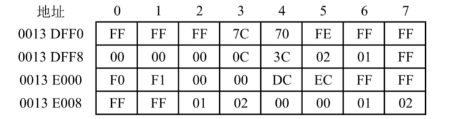

3) 指令“sllir4,r2,2”的机器码是什么(用十六进制表示)?若数组a改为short类型，则指令序列S中slli指令的汇编形式应是什么?
## 2025年统考真题
