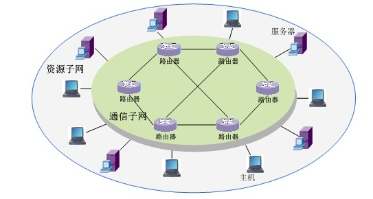
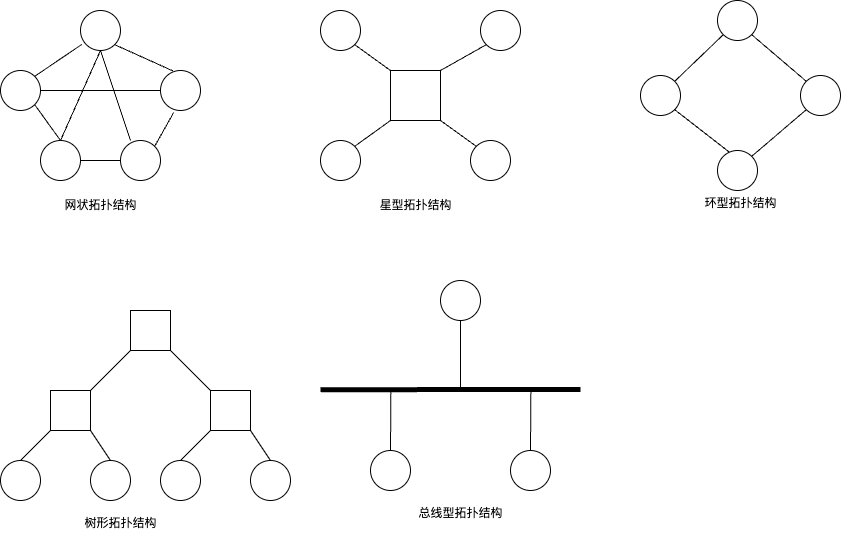
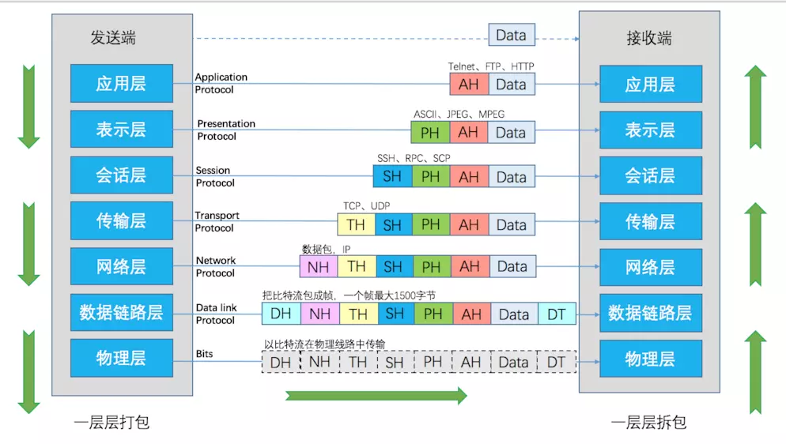
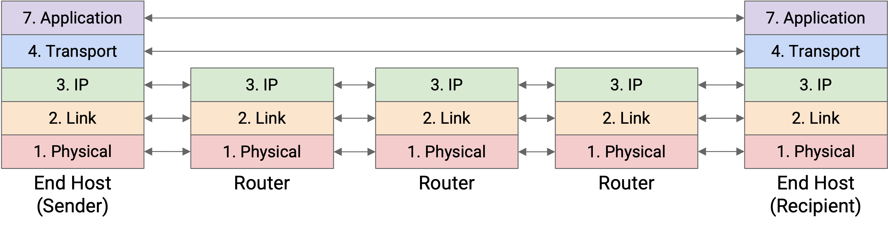
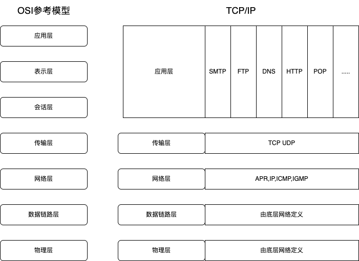
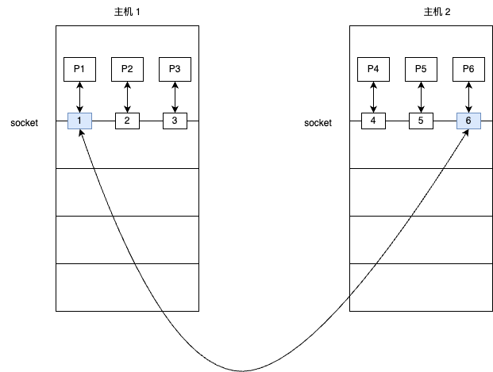
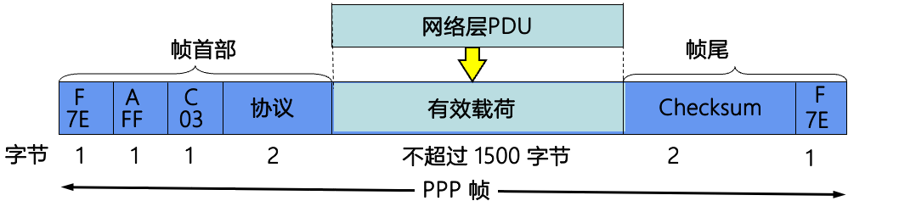
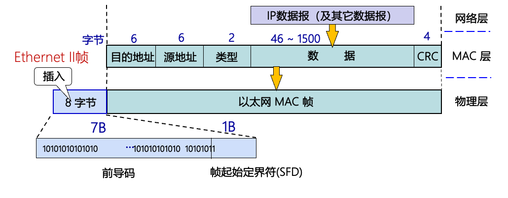
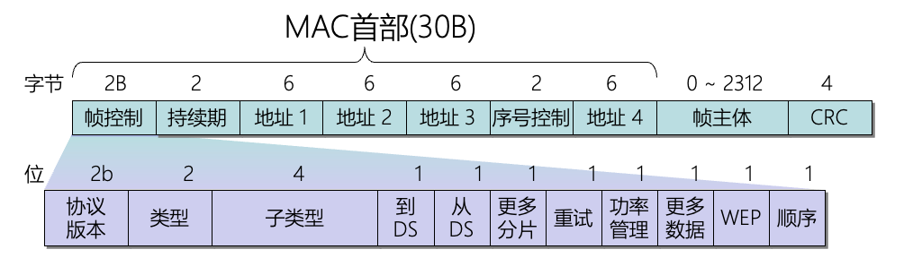
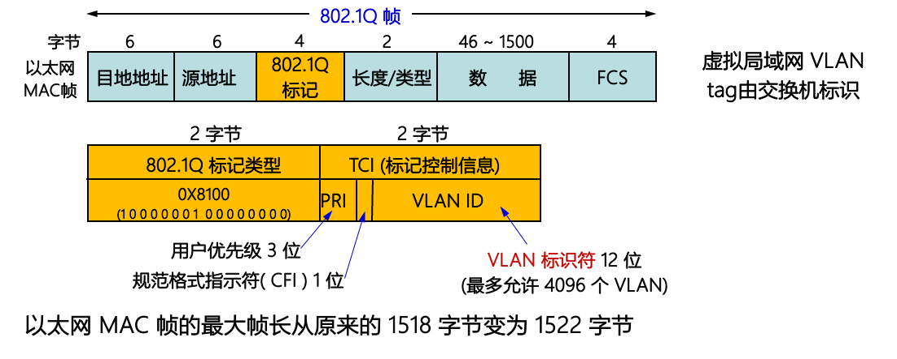

# 绪论
^^计算机网络^^ 由两台或两台以上独立的计算机通过通信线路和通信设备互连起来的系统,以实现彼此交换信息和共享资源的目的.

!!! tip
    计网是个比较需要有全局观的科目,所有其绪论比其他科目要长的多,建议先学小章节再到绪论中复习并建立体系.

## 计算机网络的功能,组成,拓扑结构及分类
计算网络的功能:{++数据通信++} {++资源共享++} {++并行和分布式处理++} {++可靠性++} {++可拓展性++}

^^按逻辑功能^^ 分为两类{++资源子网++}和{++通信子网++}

其中资源子网负责全网的数据处理业务,为用户提供各种网络资源与网络服务.通信子网负责完成数据的传输,转发等数据通信工作.

^^网络拓扑结构^^ 计算机中各结点的互连模式,常见的有六种 {++网状++} {++星状++} {++树状++} {++总线状++} {++环状++} {++混合型++}

^^网状拓扑结构^^ 每个设备通过一条 {++专用++} 线路与其他任意一个设备连接. --> 完全图 

^^星状拓扑结构^^ 每个设备与一个 {++中央控制器++} 相连接

^^树状拓扑结构^^ 可以看做星状拓扑结构的拓展,通过一级一级的中央控制器相连接 

^^混合型拓扑结构^^ 将其余五种拓扑结构融合在一起

$$
计算机网络分类
\begin{cases}
    接入方式\begin{cases}
        宽带接入网络 \\
        移动和无线接入网络
    \end{cases} \\
    网络拓扑结构 (六种) \\
    覆盖范围 \begin{cases}
        个人域网 \\
        局域网 \\
        城域网 \\
        广域网
    \end{cases}
\end{cases}
$$

## 计算机网络的体系结构

^^网络协议(protocol)^^ 在主机和主机之间,主机和通信子网或者各通信子网的各通信结点之间进行通信而使用的,通信双方必须遵守的,事先规定好的规则,标准或约定. 

$$
网络协议由三部分组成
\begin{cases}
语法: 数据域控制信息的结构或格式,如数据格式,信号电平等\\
语义: 需要发出何种控制信息,完成何种动作,以及做出何种应答,包括用于调整和进行差错处理的控制信息 \\
时序/同步: 关于事件实现顺序的详细说明,包括速度匹配和顺序
\end{cases}
$$

^^网络体系结构^^ 计算机网络各个层次及其相关协议的集合,{++网络体系是抽象的++}

{++网络中的每一层都建立在它的下一层之上,向它的上一层提供一定的服务,但将实现这一服务的细节对上一层屏蔽++}

### OSI参考模型

^^OSI参考模型^^ Open systems interconnection reference model (开放系统互连参考模型) 七层参考模型

- 物理层 规定了一个结点如何连接到传输介质上,并规定了 {++机械特性++} {++电气特性++} {++功能特性++} {++规程特性++} 在物理层中,数据传输的单位为比特(bit)
- 数据链路层 把相邻两个结点之间不可靠的物理链路转换为可靠无差错的逻辑链路,主要功能为 {++成帧++} {++差错控制++} {++流量控制++} {++访问控制(MAC)++}, 在数据链路层中的传送单位为帧(frame)
- 网络层 连接网络中的任意两个结点,从一个结点接受数据并将其正确的传送到另一个结点上. 主要功能为 {++路由转发++} 在网络层上传送的单位为包/分组(packet)

以上三层构成了 {++通信子网++}

- 传输层 真正实现"端到端"通信,可以把数据从一方的用户{++进程++}可靠的传输到另一方用户的{++进程++} 从传输层开始只有主机和主机完成,而中间结点将不提供传输层服务->传输层服务与通信子网无光. 数据传输层的传输单位为数据包(message) 
- 会话层 允许两台主机上的用户进程建立会话连接,双方确认身份,协商会话连接的细节, 还提供了{++同步点机制++},在数据流中加入同步点,每当网络发生错误的时候只需要从同步点后进行重传 

传输层和会话层为两条主机上的用户提供了正确传输数据的手段

- 表示层 解决用户信息的语法表示问题. 表示层对传送的数据进行翻译或解释,变换和交换. {++数据加密,解密和数据压缩++}也是表示层的基本功能
- 应用层 

^^网络互连设备^^ 中继器 网桥 路由器 网关

$$
\begin{cases}
中继器: 物理层网络互连设备,拓展网段的功能 \\
网桥: 物理层和数据链路层互连设备,拓展局域网范围 \\
路由器: 网络层互连设备 在多个互连设备之间中继或转发数据包 \\
网关: 可以工作在OSI参考模型的所有层上,通常是按照在路由器内部的软件
\end{cases}
$$

^^网关^^ 可以实现协议转换\数据转发的功能

### 层间通信与对等层通信 
^^层间通信^^ 同一网络结点相邻层实体间的通信

^^对等层^^ 两台主机进行通信的时候,其相应的层也会进行通信,把{++不同主机++}的相应层称为对等层 

^^对等实体^^ 在对等层中完成{++相同协议++}功能的两个通信实体称为对等实体 

^^对等层间通信^^ 不同网络结点对等实体间的通信

实际的网络中只有{++物理层++}间具有真实的物理连接(实通信),其与层之间并没有物理连接(虚通信)

数据在网络中逐层传送,没经过一层都要加上\移除对应层的头,下层将上层头+数据视为一个整体进行处理.

^^服务^^ 第n层是n+1层服务的提供方,n+1层是该服务的用户.

^^服务访问点(SAP)^^ 层间提供服务的地方,每个访问点都有唯一的地址表示,例如传输层访问服务点(T-SAP)地址可以表示为 

$$<网络号><主机号><端口号>$$

^^服务数据单元(SDU)^^ 相邻层在提供服务的过程中要传递的信息

^^协议数据单元(PDU)^^ 对等层间信息的传送单位 

n层PDU由n层SDU该层的协议控制信息(PCI,通常就是各层加上的头(header))组成 

### TCP/IP参考模型
{++TCP/IP 与 OSI参考模型的区别++}

\[
\begin{cases}
数据链路层:OSI体系提供差错检测,流量控制而TCP/IP体系不提供 \\
网络层:OSI提供有连接和无连接两种连接服务,而TCP只支持无连接的IP服务 \\
运输层:TCP/IP提供有连接(TCP)和无连接(UDP)两种连接服务,而OSI只支持无连接服务 \\
\end{cases}
\]

!!! warning 
    在TCP/IP中数据链路层被认为是不可靠的,网络层并不利用数据链路层提供的帧序号和确认机制来保证可靠通信 
    
    保证可靠通信是传输层TCP的任务,或者由应用层(采用UDP的情况)提供.

    注意如果问TCP/IP分为几个{++层次++}答案是四,此时物理层和数据链路层统称为网络接口层,其余不变.

^^套接字(socket)^^  在TCP/IP中,一个传输服务访问点TSAP

一个socket地址包括IP地址和端口号两部分. 

{++数据链路层通过MAC地址,网络层通过IP地址,传输层通过socket地址进行通信++}

## 协议总结

### PPP帧

### IEEE 802.3 以太网帧格式

### IEEE 802.11 无线局域网

### IEEE 802.1q 虚拟局域网格式

### IP报文格式

