# 数据通信基础

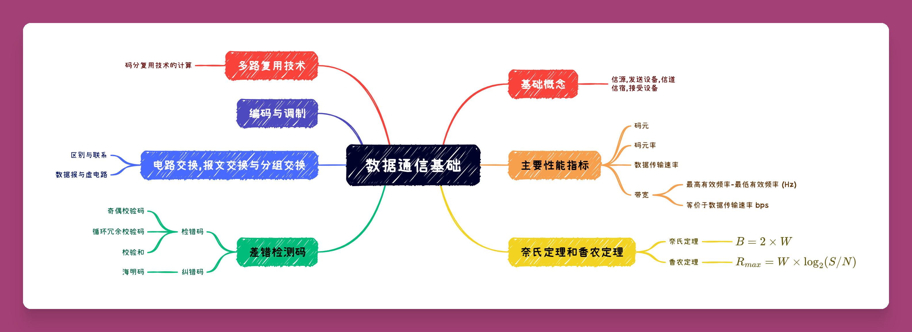

## 通信系统的组成

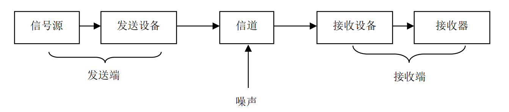

- `信源` 发送数据的设备,例如个人计算机
- `发送设备` 将数据转换为可以在传输系统中进行传输的设备(例如调制解调器)
- `传输系统` 
- `接受设备`` 将传输系统中进行传输的信号转换为可以被接受设备的理解的信号的设备(例如调制解调器)
- `信宿` 从接受设备中接受数据

## 数据通信系统的主要性能指标 
{++码元++}是指使用时域表示数字信号时,用固定时长的信号波形(数字脉冲)来代表不同离散值的基本波形.

^^码元速率(波特率)^^ 表示单位时间内信号波形的变化次数,即通过信道传输的码元个数. 若信号的码元宽度为 $T$, 单位为 $s$, 则其码元速率 $B=1/T$ ,单位为波特(baud) 

^^数据传输速率^^ 单位时间内信道上传送的信息量(比特数), 单位为比特每秒(bps).{++由于二进制信号中每个码元只包含一个比特,故码元速率在数值上与数据传输率相等.++}, 但对于 $n$ 进制信号,则数据传输率为

\[
R=B\times\log_{2}(n) > B
\]

^^误码率^^ 错误接受的码元数在传输的总码元数的占比 

^^误比特率^^ 错误接受的比特数在传输的总比特数的占比 

## 信号和数据编码 
^^模拟信号和数字信号^^ 模拟信号时随时间变化的电磁波形式,模拟信号时连续的;数字信号,方波信号.

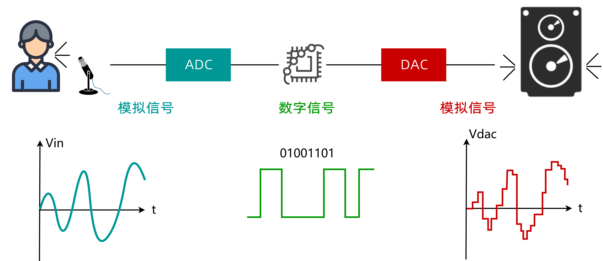

^^带宽^^ 由傅里叶原理,任意周期信号都可以转化为多个正弦波分量之和,其中最高频率与最低频率之差被称为带宽

!!! warning 
    实际上带宽有两个含义,一个是其本来的含义此时单位为Hz

    另一个表示网络中某通道传送数据的能力(最高数据率)此时单位是bps

^^比特率^^ 是指1s内比特间隔的个数(bps)

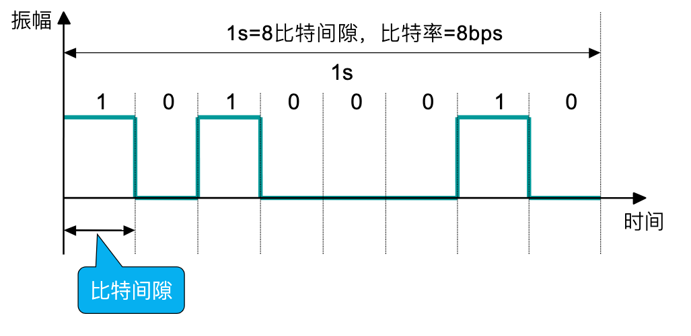

^^调制与编码^^ 调制:将其他信号转换模拟信号;编码:其他信号转换为数字信号  

{++数字-数字编码++} 单极性编码 极化编码 双极性编码 

{==单极性编码==} 最简单一种,只对二进制中的一种进行编码.比如用正电平表示1,用零电平或者电路闲置表示0 
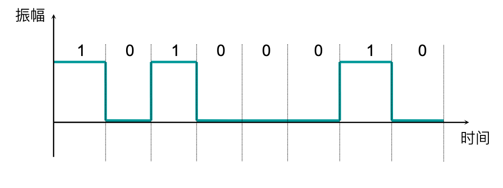

- 由于平均振幅不为零存在{==直流分量==}
- 无法同步,依赖于附加同步线

{==极化编码==} 使用两个电平:一个正电平,一个负电平. 常见办法有:不归零编码(NRZ) 归零编码(RZ) 双相位编码

NRZ-L(不归零电平)编码: 信号电平表示比特 

NRZ-I(不归零反相)编码: 电平反转代码1,否则代表0

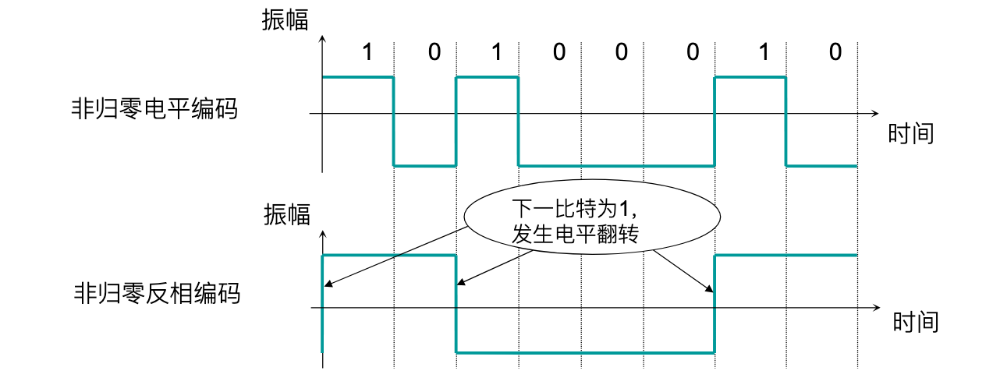

!!! note "4B/5B编码"
    解决NRZ-I编码在一长串零的情况下导致同步失效的情况. 简单来说就是将4位二进制数转换为5位二进制数,保证不存在连续三个或三个以上的0.同时将空闲的编码作为控制码(控制码允许有3个以上连续个0)

双相位编码 信号在每个比特减重发生跳变但不归零,而是转换相反的一极. 曼彻斯特编码(MPE)与差分曼彻斯特编码(DME)

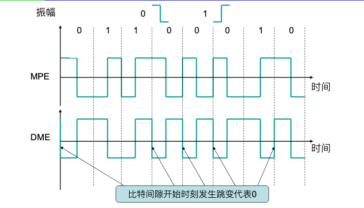

- 曼彻斯特编码 在比{++比特间隔中间++}的跳变来表示不同比特信息和用于同步
- 差分曼彻斯特编码 在{++比特间隔中间++}的跳变携带同步消息,而用{++比特间隔的开始++}发生的跳变表示比特0或者1

{==双极性编码==} 有三个电平:正电平,负电平和零电平. 其中零电平表示0,正负电平交替表示1

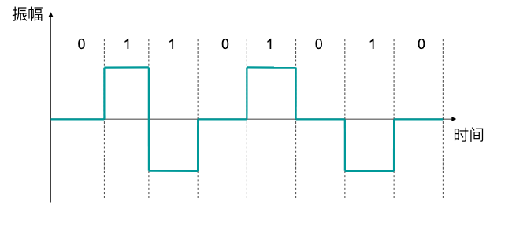

交替编码的意义
- 直流分量为 0
- 可以对一连串1进行同步处理

{++数字-模拟编码++} 简单来说就是调幅,调频,调相,以及同时调幅调相的正交调幅,对应的名词为 {++幅移键控ASK++} {++频移键控FSK++} {++相移键控PSK++} {++正交调幅QAM++}

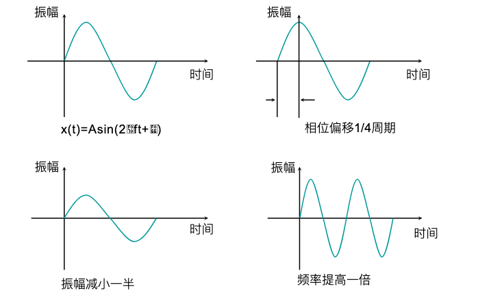

!!! note "PSK星座图"
    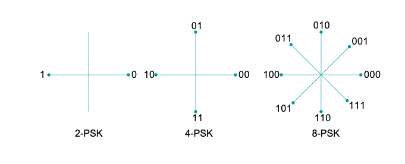
    一般不会考察这个星座图,但需要记住 2-PSK 编码(0,1) 4($2^2$)-PSK(编码00-11) 8($2^3$)-PSK(编码000-111)

QAM为ASK和PSK的结合,假设在相位上有 $m$ 种变化,在振幅上有 $n$ 种变换,则QAM就有 $m\times n$ 种变换来编码

## 奈氏定理和香农定理
^^奈氏定理^^  若信道带宽为 $W$ 则奈氏定理规定的最高码元速率 $B=2\times W$ (理想低通信道), 而直到波特率后就可以通过比数据传输速率的公式 

\[
R=B\times\log_{2}(n)
\]

^^香农定理^^ 在给定噪声环境(高斯白噪声)下的信道容量,信道带宽及信噪比之间的关系. 

\[
R_{max}=W\times\log_{2}(1+S/N)
\]

其中 $R_{max}$ 是{++信道容量,信道支持的最高数据传输速率++}(bps) $W$ 是信道带宽(Hz); $S$ 是信号的平均功率; $N$ 是噪声的平均功率;

其中 $S/N$ 由如下公式计算 

\[
信噪比=10\times\lg(S/N)
\]

## 多路复用技术 

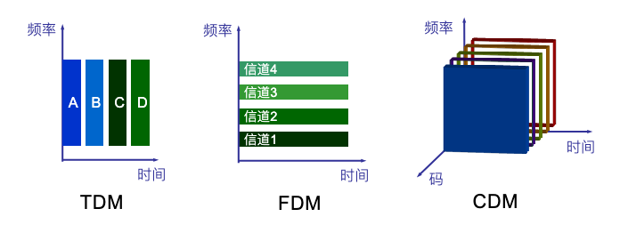
\[ 多路复用技术
\begin{cases}
频分多路复用技术(FDM) \\
时分多路复用技术(TDM)\begin{cases}
同步时分多路复用 \\
异步时分多路复用
\end{cases}\\
波分多路复用技术(WDM) \\
码分多路复用技术(CDM)
\end{cases}
\]

^^频分多路复用技术(FDM)^^ 通过分割线路的带宽来实现,一般适用于模拟信号

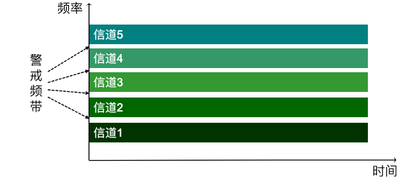

^^时分多路复用技术(TDM)^^ 通过分割时间片(时隙)来划分信道,适用于数字信号

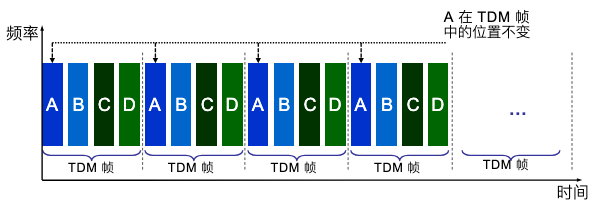

同步时分复用技术 在这种实现的复用器中,每个帧中分配给发送设备的位置是固定的,且帧的大小是固定的

异步(统计)时分复用技术(SDTM) 帧大小不固定,分配给设备的时间片也不是固定的,但需要携带地址信息

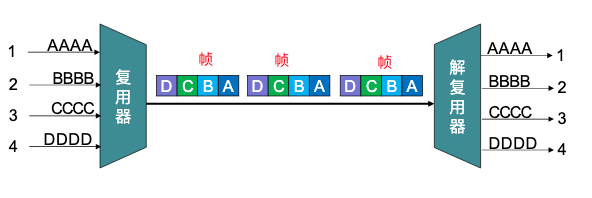
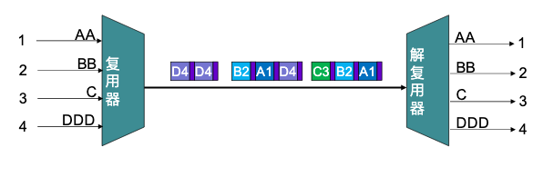
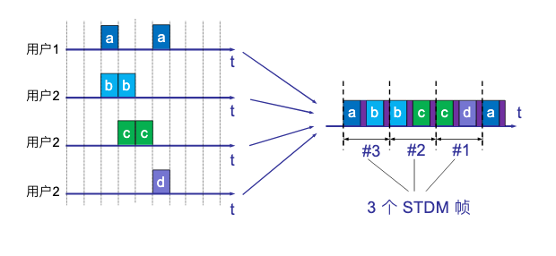

同步时分复用技术 实现简单但可能存在时间片的浪费

异步时分复用技术 需要付出额外的代价:需要携带地址信息;复用器必须具有一定的存储容量;结点具有队列管理能力

^^波分多路复用技术^^ 光纤传送技术,将输入的多路光信号调制到特定的频率上,然后在复用到同一条光纤上.

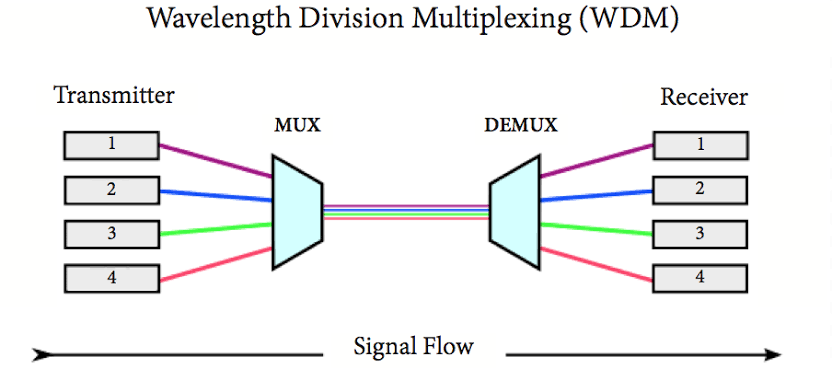

^^码分多路复用技术(码分多路访问技术(CDMA))^^ 

{++码片++} 将比特时间划分为m个短的时间段,通常有64或128个码片.

{++码片序列++} 每个CDMA站提前被分配的唯一代码序列(对于不同的站点要求码片序列正交 $S_1S_2=0$), 若要向其发送`1`则发送其的码片序列,若要发送`0`则发送该序列的反码

{++双极性表示法++} -1 -> 0, 1 -> 1, 0 -> 无信号

{++CDMA的关键技术++} 对于不同站点序列 $S$ 和 $T$ 有 $S\cdot T = 0, S\cdot\bar{T} = 0$, 而对于自身站点序列有 $S\cdot S = 1, S\cdot\bar{S} = -1$

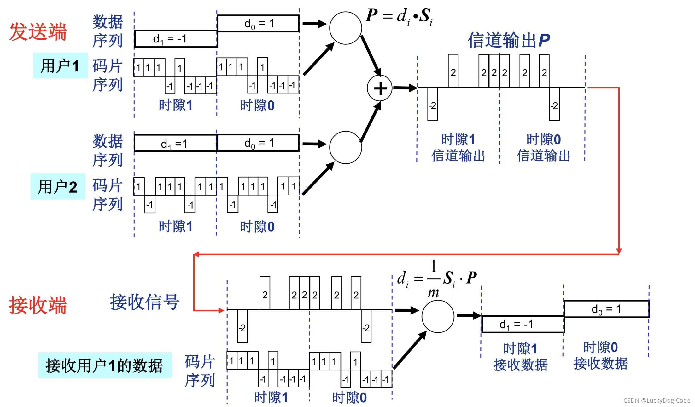

## 数据交换技术 

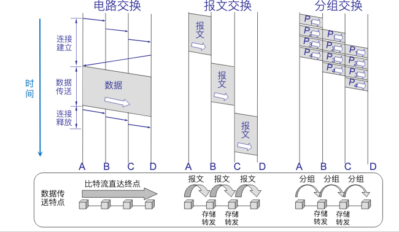

^^交换^^ 将多条物理链路连接起来,在两个设备之间形成一条{++临时++}通信路径,主要有三种 {++电路交换++} {--报文交换(已被淘汰)--} {++包交换++}

### 电路交换
电路交换会建立一条真实{++独占++}的临时物理连接

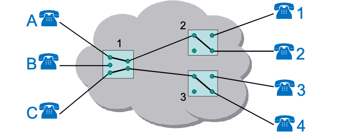

### 分组交换
将长的报文划分成一个个较小的数据单元,同时加上一些通信控制的内容,形成一个包(分组)再进行交换,常见的交换方式有 {++数据报++} {++虚电路++}

^^数据报^^ 每个数据报都独立于其他数据报进行处理,任何一条链路可以被共享,一次传输的数据报可能以不同次序达到目的地(路由选择),重新排序问题由 {++传输层++} 完成
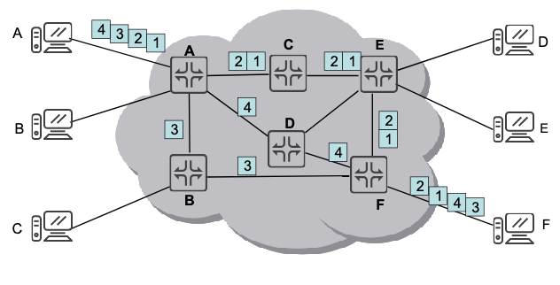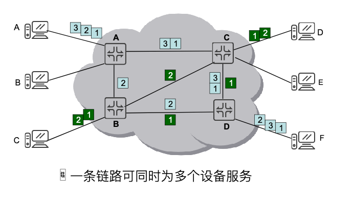

^^虚电路^^ 同一次通信的所有包之间的关系会被维持,路径在开始传输前被选定且不再更改(一次运输之间), {++与电路交换的不同点,虚电路使用的路线可以被其他设备共享但电路交换不可以++}

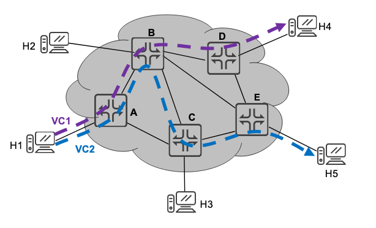

虚电路建立的过程 

- 假设主机 H1(某一进程)要和H4通信
- 发送一个特殊格式的报文(虚呼叫)给H4,要求进行通信;若H4同意通信,则发送一个答复报文给H1
- 假设找到的路径为 H1-A-B-D-H4,这条路线就是虚电路(VC1)
- 进行数据传输
- 假设之后 H1(另一进程)要和H5通信,则可以在进行虚呼叫给H5,并建立另一条虚电路(VC2)

在采用虚电路的情况下,仅建立连接的时候需要目标地址,而在传递数据时每个数据报则不需要携带完整的地址信息,只需要 {++一个虚电路标识符++} 即可.
## 差错检测编码
\[差错检测码
\begin{cases}
检测码(只能查错)\begin{cases}
奇偶检验码 \\
循环冗余码 \\
校验和 \\
\end{cases} \\
纠错码(可以检错+纠正错误)\ 海明码
\end{cases}
\]

数据传输过程中有三种错误类型:

- 单比特错误 只有一个比特发生改变
- 多比特错误 有两个或多个不连续的比特发生改变
- 突发错误 有两个或多个连续比特发生改变

^^编码效率^^ 数据信息在全部数据中所占的比率 

### 检测码
^^奇偶校验码^^ 计算数据码中`1`的个数,然后增加一个附加比特位,使得包含`1`的总个数变为偶数(奇数)则该附加比特位被称为偶(奇)校验码

{==垂直奇偶校验==} 将大的数据分成一个一个小的数据块,并为每一个数据块都增加一个奇偶校验码,使得每一个数据块中所含`1`个个数为偶(奇),以偶校验举例说明.

垂直奇偶检验可以检测出单比特错误,只有错误比特数是{++奇数++}是才能检测出多比特错误.

{++水平奇偶检验} 将大的数据块分为一个一个小的数据块,为每一个小数据块相同位单独设置一个奇偶检验位,并把最终的奇偶校验码加在数据码的后面传送.

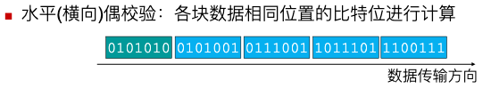

{++水平垂直奇偶校验++} 同时进行水平/垂直奇偶校验

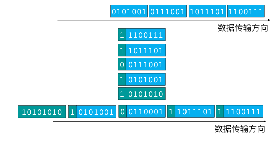

^^循环冗余校验码(CRC)^^

- 双方规定一个最高接为m的生成多项式,假设为 $G(x)=x^4+x^3+1\rightarrow 11001$, m = 4
- 假设待发送信息为 $1101011$
- 用 $x^mU(x)$ (在发生信息后添加m个零)除以(异或运算) $G(x)$得到的余数 $R(x)$ 放到 $U(x)$ 后面即使要发送的数据
- 接受方用收到的数据 $U(x)R(x)$ 除以 $G(x)$ 若余数为0则没有发生错误,否则发生错误

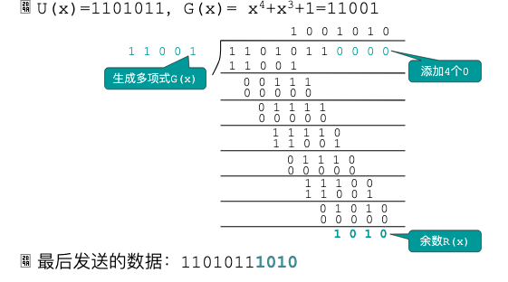

{++除了数据码以比特取值按照除数值的变化这种错误,CRC能检验出其他所有差错++}

^^校验和检验^^ 

- 将数据划分为若干比特段
- 将比特串按照 {++反码加法++}算法加到一起
  - 正常做加法,但最后多出的进位不进位而是加到结果上
- 最终结果取反作为校验码,加到数据的最后
- 接收方执行相同的 {++反码加法++} 若最终结果为全1则无误;否则发生错误

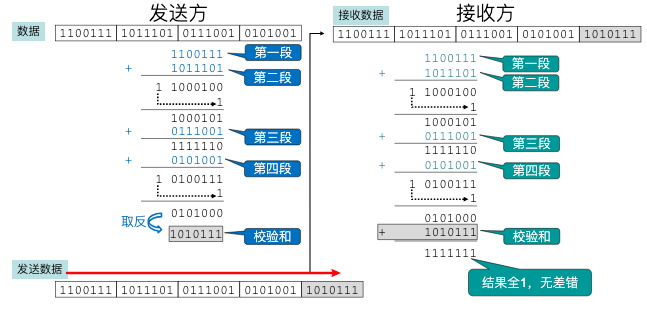

### 纠错码(海明码) 

^^海明距离^^ 两个码子中取值不同的对应位的个数,例如对于 $10101$ 和 $00110$ 其第一,四,五位不同,故其海明距离为3

- 计算方法为对两个码子进行异或(XOR)操作,计算其中等于1的个数

为了{++检测d位错误++} 需要一个海明距离为 $d+1$ 的编码方案

为了{++纠正d位错误++} 需要一个海明距离为 $2d+1$ 的编码方案(即使发生错误,还是原来正确的编码离错误编码更近,可以还原)

这里只考虑 {==单比特错误==} 海明码

所需要的冗余位数 $2^{r}>m+r+1$ 

??? note "证明"
    假设每个码子都有m个数据位,r个冗余位(纠错码)则有 $2^m$ 个合法数据码;
    
    每个合法数据码都对应着n个海明距离为1的非法码字 (n=m+r), 因此需要用 n+1 个位模式去标识它们. 
    
    由于总共有 $2^{n}$ 个位模式,所以必须有 $(n+1)2^{m} \leq 2^n$ 

凡是编号为 $2^n, n = 0, 1, 2, 3,\ldots$ 都是冗余为,记做 $r_1,r_2,r_4,\ldots$ 

计算冗余位的值 海明码中每一个数据为都有多个冗余码计算,其计算公式为 按2的次幂展开数据遍历,那么每一项对应的位就是纠错码; 例如 $d_7$ 其中 $7=1+2+4$ 故 $d_7$ 有 $r_1,r_2,r_4$ 共同进行检测, 至于冗余为的值可以采用奇偶校验确定. 

!!! example "海明码的冗余值的计算"
    例如对于数据码 $10011101$ 插入冗余码后 $1001r_8110r_41r_2r_1$

    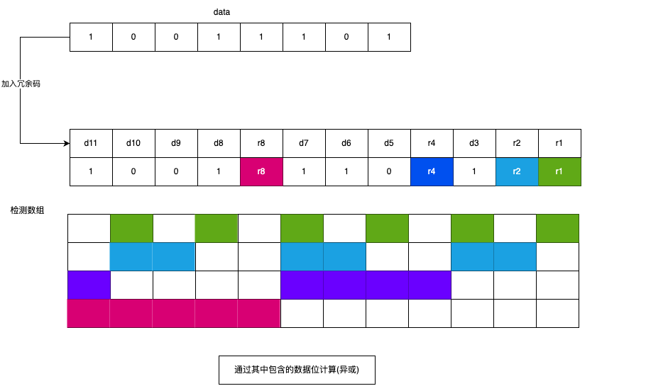

    简单来说 $r_i$ 从 第 $i$ 开始连续取 $i$ 位 在跳过 $i$ 位,依次循环

差错检测与纠错

对接受到的海明码子的每一个冗余及其所检测的数据位进行偶检验(这一步会对冗余码自检),将得到的结果按照 $(r_8, r_4, r_2 ,r_1)$ 方式排成一个二进制数,若结果为0则无错,否则就是这个二进制值对应的位数发生错误.