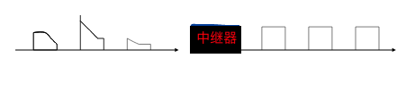

# 物理层
$$主要内容
\begin{cases}
    物理层定义的四大特性(机械,电气,功能,规程) \\
    物理层的传输介质 \\
    物理层互连设备: 中继器与集线器
\end{cases}
$$

{++物理层的功能++} 为设备之间的数据通信提供传输介质及互连设备

{++传输单位++} 为bit(比特流)

^^物理层定义的四大特性^^  

- 机械特性 说明接口部件的形状和尺寸,插针数目和排列顺序,位置,电缆长度,导线数目等
- 电气特性 指明在接口电缆各条导线上出现的电压范围,规定了导线的电气连接及有关电路的特性, 包括电路特征,{++信号的识别方式++}, 以及{++最高数据传输速率++}
- 功能特性 指明{++某条信号线上出现某一电平所表示的含义++} 
    - 信号线可以分为 数据信号线,控制信号线,定时信号线和接地线
- 规程特性: 规定了利用信号线进行比特流传输的一组操作过程,{++即各条信号线的动作规则和排列的先后顺序++}.

## 传输介质

\[传输介质
    \begin{cases}
    导向型 \begin{cases}
    双绞线 \\
    同轴电缆 \\
    光缆
    \end{cases} \\
    非导向型 \begin{cases} 
    短波\\
    地面微波 \\
    卫星微波 \\
    可见光
    \end{cases}
    \end{cases}
\]

按照是否`有形`可以划分为导向型和非导向型两大类. 

- 导向型 电磁波必须沿着某一介质的导向传播,断开介质则电磁波的传播也将终止
- 非导向型 电磁波可以在自由空间内传播 

讲道理考察这里一定是选择题,且要么考的很偏只能靠纯记,要么就是很简单的常识题. 

几个可能的考点 

- 非屏蔽双绞线电缆有8型(1-5,超5,6,超6) 数字类型越大带宽越大
- 形如`10Base-T` 的含义 
    - `10`表面带宽(最大数据传输速率)为 10M bps
    - `Base`表示基带信号 (注意Base有时可以省去)
    - `T` 表示使用双绞线,类似还有 `2`-细同轴电缆 `5`-粗同轴电缆 `F`-光纤
- 光缆的基本原理 "利用全反射使光线在信道内定向传输"
- 进行远距离数据传播,适合采用 {++单模光纤++},因为其不存在任何模间色散
- 光纤具有更大的带宽,能更好的屏蔽电磁干扰
- USB是串行通信的

## 物理层互连设备

### 中继器

^^中继器^^ 物理层的互连设备,仅仅作用与{++信号的电气部分++} 实现透明比特的复制,以补偿信号的衰减.

{++中继器仅仅拓展网络的物理层++} 不以任何方式改变网络的功能, 用中继器相连的两个网络实际上还是一个网络.

中继器本质上是一个再生器,而不是一个{--增幅器--} 

^^5-4-2原则^^ 一条线路上的中继器数量不能无限增加,一般规则为 最多允许串联{++4++}个中继器,连接{++5++}个网络,且其中只有{++3++}个网段可以接入主机.

### 集线器(hub)

集线器本质为 {++多端口中继器++}, 端口之间 {++共享,非独占++} 带宽(最大数据传输速率), 假设有 $n$ 个端口 同时要传输数据,每个端口只能获得总带宽的 $ 1/n $ 

物理层的两个网段互连需要{++最大数据传输速率相同++} {--数据链路层协议可以不同--}