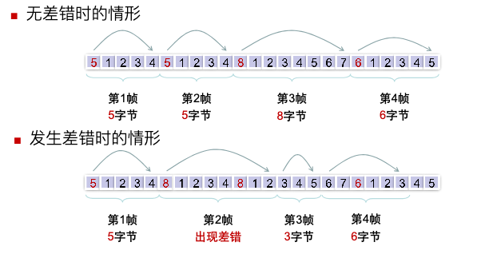
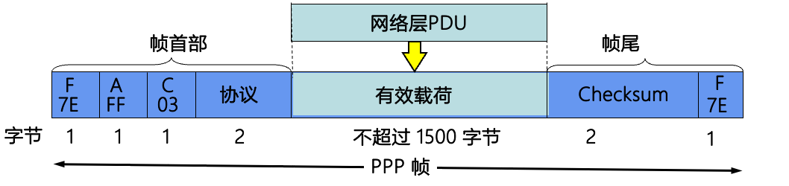
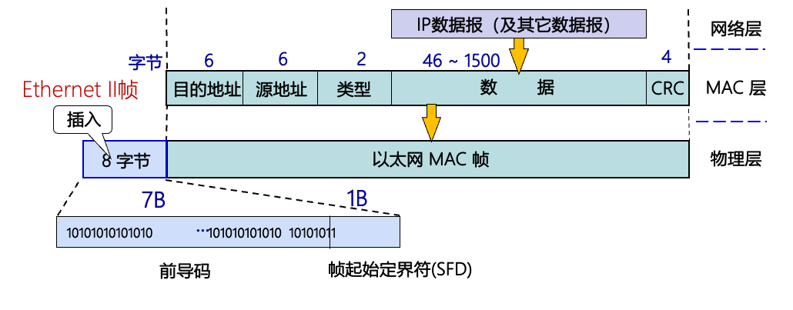
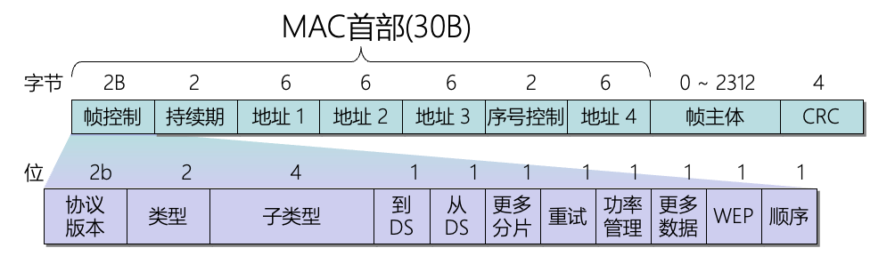
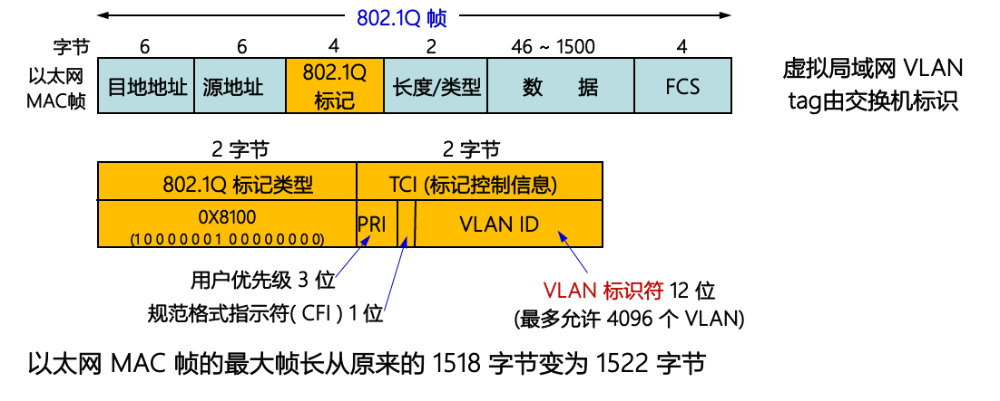

# 数据链路层

^^数据链路层(link)^^ 保证两个相邻的网络结点之间进行 {++可靠(OSI)/不可靠(TCP/IP)++}通信.

基本功能为

- 为网络层提供相关服务(无确定无连接的服务,有确定无连接的服务,有确定面向连接的服务)
- 链路管理(建立,管理和释放,介质访问控制)
- 成帧
- 流量控制 (OSI)
- 差错控制 (OSI)

{++传输单位++} (数据)帧

## 数据链路层的基本原理

- {++向下++} 使用物理层提供的服务
- {++向上++} 为网络层提供服务

### 成帧

^^帧(frame)^^ 数据链路层所使用协议数据单元(PDU),在发送方组帧,在接收方拆帧.

- 物理层传输的连续的bit的流
- 数据链路层将需要传输的原始比特流拆分成许多子串-->帧 
- 数据链路层会为每一个帧计算一个校验和,并附在帧尾部一起传输

^^成帧^^ 把一串比特流分割并插入标签的技术 

{++成帧的作用++} 分段传输,错误隔离,误差校验与数据恢复

由数据链路层协议(协程)定义不同的帧,例如 MAC帧,PPP帧等

^^帧定界(帧同步)^^ 接收方从一连串比特串中区分出帧的开始和结束, 三种办法 {--字节计数法(早期技术)--} {++字节填充的标志字节法++} {++比特填充的标志字节法++} {++编码违禁法++}

^^字节计数法^^ 顾名思义,通过在帧的开头加入一个字节标志声明这个帧的长度,但这种方法抗干扰能力较差,如今基本已经弃用了.

{++字节填充标志法++} 由事先规定的特殊字符(8bit)标记帧的开始与结束,若开始与结束标志相同称为{++标志字节++}, 若数据中出现了标志字符,则用转义字符(ESC)转义(ESC FlLAG);若出现转义字符则(ESC ESC);接收方移去这些多余的ESC

{++比特填充标记法++} 区别于字符填充标志法,比特填充标志法在比特级进行操作.通过插入特殊的比特串作为帧的开始和结束标志,{++这两个比特串必须相同++}

在HDLC(高级链路控制协议)中使用的就是比特填充标记法. 使用的是 $01111110(0x7E)$ 连续六个1作为标志.

发送方-若数据部分出现连续5个1不管其后是0还是1均插入一个1

接受方-若数据中出现连续5个1,检查其后一个比特若为0则删除该比特,若为1则认定这是一个标志比特串

{++编码违例法++} 在冗余编码如(4B/5B)编码中可以使用不被数据使用的编码方式标志帧开始或者结束

### 信道分配与介质访问控制(MAC)

^^介质访问控制子层MAC^^ 解决多点连接环境下如何使用信道

- 静态信道复用 (chapter 2 中的四种复用技术 (FDM, TDM, WDM, CDM))
- {++动态信道分配++}

!!! note "动态信道划分的五个假设"
    
    - 流量独立
    - 单信道
    - {++冲突可观察++}
        - 冲突 -- 如果两个帧同时传输,它们的传输时间会有重叠,由此产生的信号混乱
    - 时间连续或分操
    - {++载波监听++} 一个站点在试图使用信道之前就知道该信道是否正在被使用

$$
动态分配信道
\begin{cases}
竞争协议 \begin{cases}
Aloha \\
CSMA/CD \\
CSMA/CA
\end{cases} \\
无冲突协议 \begin{cases}
    基本位图协议 \\
    令牌传递协议 \\
    二进制倒计数
\end{cases} \\
有限竞争协议 
\end{cases}
$$

考纲内的重点为 {++CSMA/CD++} 和 {++CSMA/CA++} 冷门考点 {++令牌协议++} {++ALOHA协议++}其余都不太可能考

^^基本位图协议^^  按时槽分配帧

{++令牌传递协议++} 

令牌代表发送权限,如果某个站点有一个等待传输的帧队列,它在接受到令牌后将可以发送帧. 为了避免帧像令牌一样无限循环,应该设定某些站点能够将帧从网络中卸载.

### 数据链路的管理(建立,维持与释放)

{++数据链路 $\neq$ 链路++} 链路为一条点到点的数据通路,是物理线路;而数据链路是有一些规程(控制数据传输)设计的硬件和软件加到链路上所形成的逻辑链路.

$$数据链路的管理
\begin{cases}
    线路配置方式\begin{cases}
        点对点连接 \\
        多点连接(广播信道)
    \end{cases} \\
    传输方式\begin{cases}
        单工,双工,半双工 \\
        \begin{cases}
            并行 \\
            串行 \begin{cases}
                异步传输 \\
                同步传输
            \end{cases}
        \end{cases}
    \end{cases} \\
    线路规程\begin{cases}
        规定双方规定好的协议,规则 \begin{cases}
            询问/应答方式(ENQ/ACK) \\
            轮询/选择方式(Poll/Select)
        \end{cases}
    \end{cases} \\
    链路状态管理
\end{cases}
$$

^^传输方式^^ 定义了比特流从一个设备传输到令一个设备的方式

{++单工,半双工,全双工++}

- 单工 数据只能按{++一个方向++}运输
- 半双工 两个结点都可以传送或者接受,但{++不能同时++}传输或者接受
- 全双工 可以{++同时传输和接受数据++}
    - 真实两条物理链路
    - 将信道带宽一分为二(复用信道),用于同时传输两个方向的信号

{++串行传输与并行传输++}

- 串行 每个时钟脉冲只发送一个比特(使用一条信道,逐比特发送)
- 并行 每个时钟脉冲{++同时++}发送多个比特(每个比特使用{++单独++}线路)
    - 仅可用于{++近距离++}运输

串行传输还具有两种方法 {++同步传输++} {++异步传输++}

^^异步传输^^ 比特流被划分为{++独立++}的比特组独立传输,每个比特组之间的时间间隔是不固定的,需要一个起始位和停止位. 适合{++低速设备++}

^^同步传输^^ 将字符或比特流组成数据帧进行传输,数据帧的格式随协议而定

同步由 ^^比特同步^^ 和 ^^帧同步^^ 共同实现

^^比特同步^^ 在接收方和发送方之间单独设立一条线路传输时间脉冲;使用自同步编码,如曼彻斯特编码 

^^帧同步^^ 在帧前与帧后加上开始和接受标志

^^线路规程^^ 负责数据链路的建立,维持和释放,以及在给定时刻将数据分配给哪一方,由两种方式 {++循环/应答模式++} 和 {++轮询/选择模式++}

{++循环/应答模式++} 适用于点对点连接的系统(面向连接)

建立过程

- 启动方首先发送一个询问帧(ENQ)询问对方是否可以接受数据
- 接收方回答一个应答帧(ACK)来回答可以接受数据
- 发送一个否定帧(NAK)来拒绝接受
- 发送方以一个结束帧(EOT)来结束本次传输

{++轮询/选择模式++} 应用与多点连接的拓扑结构

^^主设备^^ 主站点控制链路,所有数据交换比较通过主站点进行,决定在某时刻那个从站点可以使用信道,是会话的发起者

### 流量控制和差错控制(重要)

$$
协议\begin{cases}
    自动重传(ARQ) \\
    停止等待协议 \\
    滑动窗口协议 \begin{cases}
        后退N帧协议 \\
        选择重传协议
    \end{cases}
\end{cases}
$$

^^自动重传(ARQ)^^ 接收方发现数据帧有差错返回一个否认帧,而发送方则需要重新传送该数据帧.

#### 停止等待协议

假设{++无错信道++},停止等待协议比较简单,发送方发送一个帧,等待接收方确认;接收方成功接受后返回一个确认帧,发送再发送下一个帧,并等待下一个确认帧.

.png)

{++有错信道++} 差错检测 --> 使用ARQ(自动重传)来实现

这里直接做总结了,一共有三种可能的错误 {++数据帧被破坏++} {++数据帧丢失++} {++应答帧丢失++}

这三种错误分别一个解决办法 

- 数据帧被破坏 发送方要留有已发送数据的备份,当收到不符合要求的应答帧的时候,重传副本
    - 重传次数是有上限的
- 数据帧丢失 设置一个超时重传计数器,当计数器超时的时候就立刻重发数据帧
- 应答帧丢失->会导致收集到重复帧 为每个帧与应答帧进行编号,由于停止等待协议是一个一个传的,只需要用`0`和`1`编码就好了

.png)

{++停止等待协议的性能评估(重要)++}

几个参数解释 

- $t_W$ 窗口时间 发生一个帧所需要的最短时间
- $t_I$ 传输时延 发送端发送数据帧的时间 (帧长/数据传输速率) 
- $t_s$ 接受端发送应答帧的时间 (应答帧的帧长/数据传输速率)
- $t_p$ 信号的传播时延 (线路距离/信号传播速率)
- $t_{Proc}$ 结点处理时间
- 信道利用率 在一个发送窗口内,发送一个数据帧所占的比率 $P=\frac{t_I}{t_W}$
- 有效数据传输速率 单位时间内可传输的有效数据比特数 $\frac{数据帧长度}{t_W}$

一个结论,若出错率为 $p$ ,则正确发送一阵的平均时间间隔$t_V=t_W/(1-p)$

- 系统的最大吞吐量 每秒成功发送的帧数 $\lambda_{max}=1/t_V=(1-p)/t_W$
- 极限吞吐量(理论吞吐量) $M=1/t_I$
- 系统传输效率 最大吞吐量/极限吞吐量 $\eta=\lambda_{max}/M$

#### 滑动窗口协议

流量控制的关键: 接收方和发送方分别维护一个接受窗口与发送窗口. 

{++发送方窗口++} 

{++接收方窗口++}

差错检测的关键: 

- 发送方在接受到发送的数据帧的应答帧之前需要保留滑动窗口内数据帧的备份
    - 确认帧: 接收方想要接受的下一个数据帧的编号,比如0表示想要接受编号为数据帧为0;比如1表示想要接受数据帧1,且确认数据帧0已被接受
- 接收方除了可以发送确认帧(ACK)也要能发送否认帧(NAK)
- 发送方使用超时计时器来处理帧丢失的情况

{++后退N帧自动重传协议-GBN++} 

^^核心思想^^: 接收方收到一个出错或者乱序的数据帧的时候, {++丢弃所有帧++},并且不为这些帧发送确认,发送方出现{++超时++}后,重传所有未确认的帧. 

^^关键参数^^: 假设用于编号的比特位数为n,则发送窗口的大小 $1<W_{T}\leq 2^n - 1$, 接收方窗口大小为 $W_{R}=1$

{++GBN帧破坏++}

^^基本步骤^^ 

- 发送方会连续不断的发送其发送窗口内的数据帧 (0~4)
- 中间收到了接收方的确认帧(ACK3),表明(0~2)帧被成功接受,且希望接受数据帧3
    - 这里假设采取了 ^^累积确认^^
- 接收方发现数据帧3发生错误,则发送一个(NAK3)给发送方表面3号帧出错,请求重传后续(3,4,5)号帧
    - 并且此时接收方会丢弃后续所收到的所有非3号帧
- 发送方接受到了(NAK3)立刻重传三号帧及其后续所有帧

{++GBN数据帧丢失++}

^^基本步骤^^ 

- 基本和数据帧缺失一致
- 就是发送NAK帧的时机不一样,这里是接收方接受了不正确序号的数据帧

{++GBN应答帧丢失++}

- 接收方发生接受了重复帧,说明应答帧丢失
- 接收方重传ACK3

^^发送方窗口大小的讨论^^ 

若窗口大小大于n, 则会产生{++多个++}为应答的帧有相同编号的问题(模n编码) 

若窗口等于n 应答帧丢失的时候协议失败

{++选择拒绝自动重传协议SR++} 

^^核心思想^^ 发送方发出若干帧后,收到对其中某一整的否认帧,或某一帧的定时器超时后,则只重传该出错帧或计时器超时的数据帧

^^关键参数^^ 假设用于窗口编号的比特位数为n,则窗口满足 $W_T+W_R\leq 2^n$,由于 $W_R \leq W_T$,从而 $W_R\leq 2^{n-1}$, 通常情况下$W_R = W_T$ 

!!! note "区别"
    
    - 接收方需要有排序功能. 接收方在发送否认帧后必须保存收到的所有数据帧,直到重新接受到被破坏的帧
    - 发送方需要有查找功能 重新发生和选择待重传的数据帧
    - 接收方需要有输入缓冲区
    - 确认帧的编号是{++被正确接受++}的数据帧的编号,而不是{--期望收到的--}的数据帧编号
    - 否认帧的编号是{++丢失或被损坏++}的数据帧编号

{++SR帧被破坏++}

{++SR数据帧丢失++}

{++SR应答帧丢失++}

当窗口满了或者没有数据帧要发送的时候,启动定时器,若超时发送方只需要重传窗口内所有{++未被应答++}的帧即可.

#### 相关计算 (窗口大小的确认)

假设一个帧的发送时间为 $t_I$，应答帧的发送时间是 $t_S$， 传播时间为 $t_P$，则窗口的大小n应该满足如下条件 

$$
nt_{I}\geq t_I+t_S+2t_P
$$

简单来说就是 保证选择足够大的窗口,以保证发送方在接受到第一个应答帧之前可以继续发送数据帧,使得线路中始终有数据帧在运输.

## 数据链路控制协议 

### 点到点协议(PPP协议)

- 链路采用 {++双全工++} 通信
- 串行线路,按照顺序传递帧
- {++面向字节而不是面向比特++}
    - 同步链路使用比特填充法发送方对数据部分5个连续1后插入一个0
    - 异步链路采用`0x7D`作为转义符号将 `0x7E` -> `0x7D 5E`
- 所有帧的长度都是{++字节的整数倍++}
- 对帧进行差错检测(FCS字段),错误帧不会被接受
- 不提供不丢帧保证
    - 不适用序号和确认机制

#### PPP帧格式

- PPP帧首`4`个字段,帧尾`2`个字段
- PPP帧采用字节填充法,使用`0x7E`作为标志字段,标志一个PPP帧的开始和结束
- 地址字段 一般总设置为`0XFF` 表示{++所有站点都应该接受该帧++}
- 控制字段 默认值`0x03` 表面该帧是一个无序号帧

{--地址字段和控制字段--} 通常是默认的,{++链路控制协议++}允许双方协商去掉这两个字段

- 协议字段 通报有效负载字段包含说明类型的数据包 {++默认2字节++} 
    -  `0x0021` IP 数据包
          -  通常`0`开头的都是和 IPv4, IPv6以及其他可能用到的网络层协议
    -  `1`开头的通常用于点对点协议
-  帧尾 由{++2字节++}的校验和(FCS字段/通常是CRC)和{++1字节++}的标志字段组成
-  有效载荷 若未进行协商则其默认值为{++<=1500字节++}

### 局域网

增加MAC子层的目的

- 局域网中个点是对称的,并支持广播,需要多点平衡配置
- 逻辑链路控制子层(LLC)针对不同的链路介质可定义统一的协议,屏蔽底层差异性

局域网相关的标准都是由IEEE确定的,且以802开头,如下所示

{++LLC子层是透明的,只有下层MAC子层++}才知道所连接的局域具体是啥样子的

考研内只需要掌握 

- IEEE802.3(以太网) 
- IEEE802.5(令牌环网) 
- IEEE802.11(无线局域网) 
- IEEE802.1q(虚拟局域网)

#### 逻辑链路控制子层 LLC

^^LLC层的目的^^

- 为{++网络层++} 提供统一接口(屏蔽不同局域网的不同)
- 实现在不同类型的局域网链路上传输网络层数据包

{++LLC帧的格式++}

前三个字段被称为LLC帧头

- DSAP 目的服务访问点
    - 第一位为 `1` 表示组播
    - 第一位为 `0` 表示单播
    - 全为`1` 表示广播
- SSAP 源服务访问点
    - 第一位 `1` 表示命令帧
    - 第一位为`0` 表示响应帧
- 控制字段

DSAP和SSAP是LLC使用的地址是{++逻辑地址++},一个站点可以有多个SAP,可以复用同一个MAC帧.

LLC帧有三种类型(有控制字段决定)

- I-帧 信息帧
- S-帧 监控帧
- U-帧 无序帧

{--LLC帧无校验和字段--},校验过程有MAC子层完成.

^^LLC子层向上提供三种服务^^ 无确认无连接(有线以太网),有确认无连接(IEEE802.11),有确认面向连接(蓝牙)

## 介质访问控制协议

### 以太网(IEEE 802.3)

- 使用基带传输(数字信号)
- 使用曼彻斯特编码
- 有 `10Base5` `10Base2` `10Base-T` `1Base-5` `100Base-T` 这些代号含义在第三种有详细介绍
- 使用MAC地址通信 (由网络接口卡NIC,{++6字节长++})
- 使用{++双绞线++}连接的星型拓扑

^^冲突^^ 共享广播信道多个用户不加控制的同时访问共享信道,会存在由于不同信号叠加而相互破坏的情况.

#### 介质访问控制模式 CSMA/CD 

^^多路访问(MA)^^ 多个站点连接在一个共享信道上，一个站点发送的数据，可同时被多个站点接收

^^载波监听多路访问(CSMA)^^ 每一个站点在发送数据之前检测电路上的电压值(载波监听)，判断信道是否忙碌;如果信道空闲，等待一个最短帧间间隔 ({++96比特时间++}, $9.6\mu s$) 可以开始传输;如果信道忙，则避让一段时间，然后再试图发送，以减少冲突的机会. 

{++载波监听多路访问/碰撞检测 CSMA/CD++} 

^^争用期^^ 端到端{++往返时延迟(RTT)的两倍++}称为争用期, 若经过争用期还未检测到冲突则不可能产生冲突.

^^基本步骤^^

- 如果链路空闲,则站点可以发送数据帧并{++同时检测++}冲突
- 如果链路忙,则继续监听,直到链路空闲 
- 如果在发送数据帧的时候检测到冲突,则停止发送并发送阻塞信号,执行二进制退避算法.结束后重新监听信道

{++二进制指数退避算法++} 

- 对于每一个数据帧,在第一次发生冲突的时候设置参数 $L=2$
- 后退时间随机取 $1...L$ 个时间片中的一个随机数. 一个时间片等于链路最大传播延迟的两倍(争用期)
- 若数据再次发生冲突, 将参数 $L$ 加倍. 最大值为 $1024$
- 数据帧的最大重传次数为 $16$, 若超过则站点丢弃该帧并往上层报告

$$
L=\{1,\ldots, 2^k\}, k = \min{(重传次数, 10)}
$$

{++最短帧长++} 争用期内传输的比特数 

$$
L_{min}=2t\times R\qquad\qquad
t = D/ V
$$

- R 数据传输速率 bps
- D 任意两点间的最大距离 m
- V 信息传播速率 m/s 

{++10Base-T以太网最短帧长++} 512bit, 即64字节. 

- 凡是小于64字节的以太网帧都是因冲突而被丢失的无用帧
- 由最短帧长的定义,可知端到端延迟需要小于($25.6\mu s$), 假设电缆传播速度为 $200m/\mu s$相当于以太网端到端的最大长度为 $5km$

#### 以太网MAC帧

常见MAC有两种 {++DIX Erhernet II标准++}和 {--IEEE 802.3标准(基本被弃用)--}.

区分这两个帧的关键在于 长度/类型字段 

- 长度/类型字段 > 0x0600 为 DIX V2 标准
- 长度/类型字段 $\leq$ 0x0600 为 IEEE802.3 标准

- {++7字节++} 前导码 0和1交替出现,用于MAC帧同步
- {++1字节++} 帧起始分界符 `10101011` {++提示接收方后面是数据并以地址开始++}
- {++6字节++} 目的地址/源地址(MAC地址,物理地址)
    - 单播地址 第一个字节的最低位为 0
    - 组播地址 第一个字节的最低位为 1
    - 广播地址 所有48位都为1 
    - 组播地址和广播地址 {++只能作为目的地址++}

- {++2字节++} 类型字段,指明上层协议
    - `0x0800` IPv4数据报
    - `0x0806` ARP报文
    - `0x8100` IEEE 802.1Q帧
    - `0x86DD` IPv6数据报
- {++46B-1500B++} 封装的上层PDU
    - 46B 来自于最小帧长 64B - 18B(不考虑前导码和帧起始定界符) = 46B
    - 当小于46B,且确实是数据帧的时候要进行填充
- {++4B++} 校验字段,通常采用CRC-32

^^无效帧的情况^^ 

- 数据字段的长度与长度字段值不一致
- 帧的长度不是字节的整数倍
- 校验和检测出错误
- 数据长度不在 46B ~ 1500 B 之间 

{++以太网对于无效帧是直接丢弃的,而不会要求重传++}

### 无线局域网 (IEEE802.11)
IEEE802.11 是一些协议的总称,但考研不要求这么多.

{++802.11协议数据帧结构++} 

- 传输持续时间/ID字段 {++2字节++} 
    - {++计算网络分配向量(NAV)++}
    - 用于无竞争期传送的帧
    - 用于省点-轮询的信息帧
- 地址(1~4)字段 各占{++6字节++} 
    - 包括4个地址 (源地址,目的地址,发送方地址和接收方地址)
    - 由帧控制字段的ToDS和FromDS位的值来决定(如图所示)
        - 分布式系统(DS,distributed system)

^^隐蔽站问题^^  B同时接受 A,C的信号 (此时A,C互为隐蔽站),导致冲突的情况

^^暴露站问题^^ B向A发送数据,导致C不敢向D发送数据

#### CSMA/CA 载波监听多路访问/碰撞避免

- CSMA/CA {++不能++}完全避免碰撞,只是极可能将碰撞的可能性减少
- 使用停止等待协议来实现{++可靠传输++}
    - 原因: 由于无须信道的误码率较高

{++帧间间隔IFS++} 在CSMA/CA中所有站点完成发送后,必须再等待一段很短的时间才能发送下一帧. 这个时间为帧间间隔. 常见的三种帧间间隔有 SIFS PIFS DIFS 

- SIFS 短帧间间隔 -- 最短的帧间间隔
    - ACK帧, CTS帧 ....
- PIFS 点协调功能帧间间隔,比SIFS长. SIFS+时隙长度
- DIFS 分布协调功能帧间间隔(最长IFS) PIFS+时隙长度

{++虚拟载波监听(NAV的功能)++}

- 通过检测正在使用信道的帧中的 {++持续时间++}字段来调整自身的网络分配向量(NAV)
- NAV指出 {++必须经过多长时间才能完成帧的这次传输,才能使信道转入空闲状态++}
    - 信道忙的两种可能性 物理层的载波监听检测到了信道忙(确实有数据帧传输) / MAC层的虚拟载波监听通过NAV指出了信道忙 
 
^^基本步骤^^

1. 站点若想要发送数据必须先监听信道.若信道在时间间隔DIFS内均空闲,则发生整个帧.否则进行 (2)
2. 站点随机选择一个随机数,设置退避计时器. 
   1. 若信道忙,则{++冻结++}计时器,进行等待
   2. 若信道空闲,并在DIFS内仍然空闲.进入争用信道,进行倒计时
   3. 倒计时{++先进行完++}的站点发送数据,其他站点接着冻结计时器
3. 若站点收到接收方发来的确认帧,且后续仍然后帧要发送,则转到(2) 若在设定时间内为收到确认,则准备重传,并进入(2), {++选择一个更大的++}范围内的随机数.

冲突避免的实现

- 预约信道 (RTS/CTS)
    - 其他站监听到来 RTC/CTS后,根据帧中表明的持续时间推迟接入
- 正向确认

- 其他站的NAV通过CTS帧的持续时间字段来确定
    - CTS的持续时间来源于RTS帧,二者值完全一样
    - 此时NAV的计算方式为 (SIFS+数据帧延迟+SIFS+ACK帧延迟)
    - 这说明前面的DIFS+SIFS期间信道都可以被占用,此时就需要源站执行退避算法重新等待信道空闲
- RTS/CTS机制也是虚拟载波监听的一种,可以有效解决隐蔽站问题

!!! question "相关习题"
    
    1. 下列选项中的IEEE 802.11无线局域网的MAC帧,包含用于其他站点调整自身NAV的字段的是()

    I 数据帧 II ACK帧 III RTS帧 IV CTS帧

### 虚拟局域网(VLAN, IEEE802.1q)

^^虚拟局域网^^ 使用一个物理局域网的基本设施定义多个虚拟局域网.同一个虚拟局域网之间逻辑互连,不同虚拟局域网之间逻辑隔离. 具有这种功能的交换机被称为VLAN交换机.

- 隔离广播域与冲突域
- 扩大网络访问

^^划分VLAN的方法^^

- 交换机端口(静态划分)

- 基于MAC地址动态划分(由映射表决定)

- 基于协议动态划分
- {++基于IP子网++}的动态划分

{++IEEE802.1q帧格式++}

在普通的MAC帧中插入一个{++4字节++}的802.1Q标记字段.

在设计虚拟局域网和非虚拟局域网连接的线路中,第一个VLAN感知的交换机会在帧中{++添加++}VLAN帧标记,最后一个VLAN感知器将帧中VLAN标志{--删除--}

## 数据链路层网络互连

### 以太网(二层)交换机

- 本质是一个多端口网桥
    - 每个端口可以加入一台主机或另一个以太网交换机 {++全双工++}模式
    - 交换机内部维护一个(端口号-MAC地址)的映射表
    - 每个端口有自己{++独立的带宽++},各端口之间并行工作
- 隔离冲突域,但不隔离广播域

