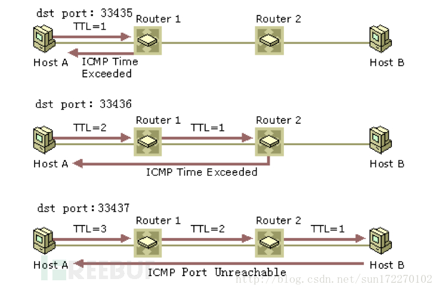
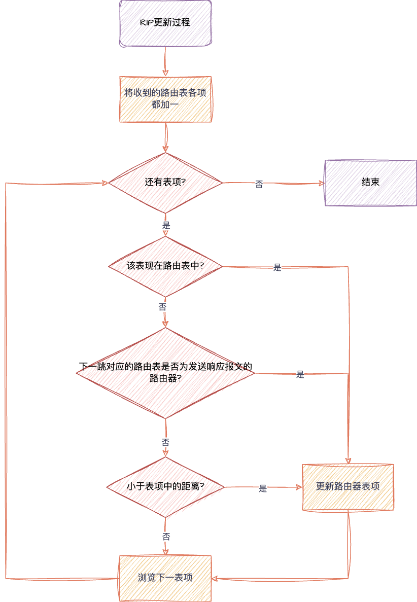

# 网络层

{++网络层的功能++}

- 实现端到端的传递
- 交换与路由选择
    - 交换: 两个端点之间建立可用的临时连接
    - 路由选择: 在诸多可用的链路中确定一条最佳路线

网络层的运输单元(PDU): {++IP数据包++}

## 网络层的基本原理

^^面向连接的服务与无连接服务^^ TCP/IP 协议的网络层协议 IP采用的是 {++无连接服务++}

### 路由器 - 网络层互连设备

^^路由器 VS (二层)交换机^^ 作用层次不同/连接网络不同

{++路由器是多个网络中的成员++}

#### 路由选择原理

!!! note 
    若使用数据报,则每一个包的到来都需要进行一次路由选择

    若使用虚电路,只需要在虚电路建立的时候进行一次路由选择即可

主要有两种 {++距离向量路由选择(RIP协议)++} 和 {++链路状态路由选择(OSPF协议)++}

{++距离向量路由选择++} 每个路由器{++周期性++}的将自己关于整个网络的信息发送给它的邻居. 

- 每个路由器保存关于{++整个网络++}的信息
- {++仅仅和邻居++}交换网络信息
- 信息的交换是通过有规律的时间间隔进行(例如每隔30s),无论网络状态是否发生了改变

- {++路由器不知道网络的拓扑结构++}
- 动态自学习路由表

{++链路状态路由算法++} 每个路由器与互连网络中所有其他路由器{++共享++}关于它邻居的信息

- 每个链路状态描述路由器本身能直达的路由器/路由
- {++共享关于邻居的信息++}
- 共享邻居发送给所有的路由器(泛洪更新)
- 共享信息按由规律的时间间隔更新
- {++所有链路状态组成链路状态数据库++}

## IPv4 协议

IP为高层提供 {++不可靠,无连接++}的通信, 提供尽力而为服务. 采用最简单差错控制, {++直接丢弃数据包++}并发回主机一个ICMP报文.

### IP地址
{++IP地址++} TCP/IP网络中设备接口(区别与MAC地址,每个路由器只有唯一的MAC地址,但每个接口都有唯一的IP地址)的唯一标识符号 (IPv4为32位,IPv6为128位)

在IPv4中一般用{++点分十进制表示++} 形如 xxx.xxx.xxx.xxx (每一个xxx的范围都是 0~255(2^8-1))

{++IP地址的划分方式++}

- 网络号 标识主机(路由器)连接的网络
- 主机号 在所连接到的网络中唯一标识主机(路由器)

区分各类地址的最简单办法就是{++检查地址的第一个十进制数字++}.各类IP地址的范围如下

{++特殊的几个IP地址++}

- 网络地址 主机号全为0的地址
    - 网络IP地址不分配给任何主机,而是作为{++网络本身的表示++},提供给路由器查找路由表使用
    - 例如 主机 `202.198.151.136`(C类地址) 对应的网络地址为  `202.198.151.0`
- 32位全0的地址 `0.0.0.0`
    - 表示所有不清楚的网络和目的主机(默认路由)
- 广播地址
    - 直接广播地址 主机号全`1`的IP地址 {++不分配给任何主机++}
    - 受限广播地址 32位全`1`的IP地址 
    - 受限广播只能用于本网广播,直接广播可以跨网广播
- 本地环回地址 形如`127.xxx.xxx.xxx`的网络
    - 通常将 `127.0.0.1`分给给坏回接口,常用于本机上软件测试和本地上网络应用之间的通信地址
- 私有地址
    - `10.0.0.0 ---- 10.255.255.255 `
    - `172.16.0.0 ---- 172.31.255.255 `
    - `192.168.0.0 ---- 192.168.255.255 `

#### 子网编码和子网掩码

- 将主机号进一步划分为两部分,一部分为主机号另一部为子网号
- 从一个IP数据报的首部 {--无法--}判断主机或目的主机是否使用了子网划分
    - 使用子网掩码可以找出IP地址中的子网部分
    - 32比特的数值,将网络号和子网号字段设置为1,主机号字段为0

!!! example "子网编码与相关计算"
    假设IP地址为 `192.168.100.5`,子网掩码为 `255.255.255.0`. 算出网络地址,广播地址,地址访问和主机数.

    `192.168.100.5` --- 11000000 10101000 01100100 00000101

    `255.255.255.0` --- 11111111 11111111 11111111 00000000 

    子网地址 11000000 10101000 01100100 00000000 ---- `192.168.100.0`
    
    广播地址 11000000 10101000 01100100 11111111 ---- `192.168.100.255`
    
    地址访问 网络地址+1到广播地址-1: `192.168.100.1` ~ `192.168.100.254`
    
    主机数量 $2^8-2=254$

{++两个直连的路由器之间通常采用30位掩码的网络地址++}

- 减少网络地址的浪费
  - 30位掩码对应4位IP地址,其中1个广播地址,1个网络地址,刚好剩下两个IP地址可以分配给路由器
  - 只浪费了两个地址
#### 无类别域间路由选择(CIDR)

将多个地址块组合到一个路由表现 --- 形成一个CIDR地址块, {++减少++}路由表的表项数量.

{++斜线记法(CIDR记法)++} 

- 在IP地址后面加上一条 `/`, 然后写上网络前缀所占的位数
    - 形如 `IP地址/掩码长度`
    - 例如 `88.166.0.1/19` 掩码就是`11111111 11111111 11100000 00000000` 即连续19位1,13位0
- 把网络前缀相同的连续IP地址组成一个CIDR地址块

#### DHCP 动态主机配置协议

动态指定IP地址和子网掩码,默认网关以及本地DNS服务器地址等配置参数的机制,用于简化主机IP地址配置管理

- 使用{++客户端/服务器++}通信模式
- 采用UDP作为传输协议
    - 客户端发生请求到服务端的 `67`号端口
    - 服务器发送回答道客户端的 `68`号端口
- DHCP分配只是 {++临时++} IP地址
- 可以设置DHCP中继来避免设置多个DHCP服务器

^^DHCP报文格式^^

{++DHCP请求IP地址阶段++}

- DHCP客户端以{++广播++}的发送 `DHCP DISCOVER`报文 目的地址为 255.255.255.255 
    - 报文中携带了客户端的 {++MAC地址++}
    - 需要请求的参数列表
    - 广播标志为等
- DHCP服务器根据DISCOVER接口的IP地址处于同一网段的地址池中选择一个可用的IP地址;然后发送 `DHCP OFFER`报文发送给DHCP客户端
    - DHCP服务器用{++ARP协议++}判断给出的IP地址是否可行
    - DHCP客户端用{++ARP协议++}判断收到的IP地址是否可行
- DHCP客户端通常只会接受第一个收到的DHCP OFFER报文,然后以 {++广播++}的方式发送 DHCP REQUEST报文
    - REQUEST报文携带客户端想要选择的服务器标识符和客户端IP地址
    - 正确的DHCP服务器发送 DHCP ACK报文表示确认分配
    - 所有其他DHCP服务器将准备分配给客户端的IP地址重新分配给其他客户端

{++DHCP更新IP租期++}

当租期达到{++百分之50++}的时候

- 客户端以 {++单播++} 的方式项服务器发送 `DHCP REQUEST`报文请求更新租期
- 服务器发送 `DHCP ACK`报文表示允许重新续约
- 服务器发送 `DHCP NACK`报文则需要客户端重新发送`DHCP DISCOVER`报文重新申请新的IP 

当租期达到{++百分之87.5++}的时候

- 客户端以 {++广播++} 的方式项服务器发送 `DHCP REQUEST`报文请求更新租期
- 服务器发送 `DHCP ACK`报文表示允许重新续约
- 服务器发送 `DHCP NACK`报文则需要客户端重新发送`DHCP DISCOVER`报文重新申请新的IP 

{++DHCP释放过程++}

- 在使用时间未结束前,客服端向服务器发送 `DHCP RELEASE`报文通知服务器释放这个IP地址的租期
- DHCP服务器会保留这个DHCP客户端的配置信息,将IP地址列为曾经分配过的IP地址中,以便后续重新分配给改客户端或者其他客户端

$$DHCP报文类型
\begin{cases}
    DISCOVER \\
    OFFER \\
    REQUEST \\
    ACK \\
    NACK \\
    RELEASE 
\end{cases}
$$

#### NAT 网络地址转换

将IP数据报文头中的IP地址转换为另一个IP地址,并通过转换端口号达到地址复用的目的. 主要用于实现 {++内部网络(私有IP地址)访问外部网络(公有IP地址)++}的功能

^^NAT路由器^^ 安装了NAT软件的路由器,要求{++至少++}有一个公网IP.维护一个NAT转换表,将私有IP地址和公网IP地址进行相互映射.

### IP报文(重点)

- 固定长度{++20++}个字节
- 版本字段 IPv4的版本号为4
- 首部长度字段{++占4位单位为4字节++}. 故该字段的最大值为 $2^4-1=15$,对应最长60B,最小值为固定20个字节,即 $5$ 
    - 这里也表明报头的长度只能是{++4字节的整数倍++}
- 区分服务端 不重要
- 总长度 指明整个IP数据报的长度(IP首部加数据部分) {++单位为字节++}
    - 故IP数据包的范围为 {++20B~65536B++}
    - 若进行分段处理,此字段指明的是 {++各分段的长度++} {--而非分段前的数据报长度--}
- 标识字段 唯一的表示主机发送的每一个数据包 
    - 范围为 0 ~ 65535 
    - 如果数据报分段,{++同属于同一数据报的分段具有相同的标识号++}
- 标志字段 2位
    - 第一位不使用
    - 第二位为DF(Don't Fragment)位 `1`:表示不能分段 `0`:表示可以分段
    - 第三位为MF(More Fragment)为 `1`:表示后面还有分片, `0`:表示这是最后一个分片
- 分段偏移 该分段在当前数据报的相对位置
    - 以{++8字节++}为单位
    - 表明分段必须能够被8除尽

- 生存时间 设置数据报可以经过的{++最多路由器数量++}
    - 该值为0的时候,该数据报应该被丢弃
- 协议字段 上层所使用的协议

- 首部校验和 对首部进行校验,不对数据进行校验
    - 校验和通常采用16位反码求和的算法
- 源IP地址和目标地址 各32比特
- 可选字段 最大为40字节

{++IP转发++}

{++最长前缀匹配++} 在采用CIDR的情况下,可能会有多个路由表项满足要求,此时选择前缀最长的表项路由.

- 前缀越长路由越具体
- 一般前缀越长的表项在路由器表中越靠前
    - 提高查询速度

### 地址解析协议(ARP协议)

ARP协议 {++将IP地址转换为MAC地址++}的协议

{++ARP协议的工作原理++}

- ARP协议以{++广播++}的方式发生请求包
- 如果一个主机的IP地址和ARP请求中的IP地址一致,则发送ARP应答,将其MAC地址发送
- 主机和三层网络设备(三层交换机,路由器)会维持一张 MAC-IP地址的表
- ARP{++直接封装在数据链路层的帧++}中

### 互联网控制报文协议 (ICMP协议)

ICMP协议传送差错报告以及一些其他控制信息

- ICMP数据报封装在{++IP数据报++}中
- ICMP协议有两种报文
  - 查询报文
      - 回送请求和回送应答 用来检测目标站点是否可达以及了解其相关状态
      - 时间戳请求和时间戳应答 ICMP时间戳请求报文用于请某个主机或路由器应答当前的日期和时间
          - 从1900年1月1日开始到当前时刻多少秒 {++32位++}
  - 差错报文
      - 目标不可达 目标主机/路由器因为各种原因导致IP数据报无法正常交付而丢弃的时候
      - 重定向 路由器在转发IP数据报的时候,如果发现有更好的路由路线此时发送重定向报文,让主机知道下次应该发送给另外的路由器
      - 超时 TTL超时或分片重装超时
      - 参数问题 数据报首部中的某些字段的值不正确的时候
          - {==首部校验出错不会返回ICMP报文,而是会直接静默丢弃==}
          - 原因: 首部校验出错说明首部至少20B内容不可信,{++无法确认是哪部分出错++}.若源IP地址出错,ICMP差错报文回发给非法地址.
      - 源点抑制 当路由器/主机 因为拥塞而丢弃数据报的时候

{++不应该产生ICMP报文的情况++}

- 对ICMP差错报文不应该再产生ICMP差错报文
- 除第一个分片以外的其他分片不应该查收ICMP差错报文
- 对具有多播地址的数据报都不发送ICMP差错报文
- 对具有特殊地址例如(127.0.0.0或0.0.0.0)的数据报不发送ICMP差错报文

{++ICMP典型应用-Ping++}

- 功能: 用于测试主机和目的主机\路由器间的连通性
- 应用层直接使用ICMP协议
- 通过使用{++查询报文++}实现

{++ICMP典型应用-traceroute++}

- 功能: 用于探测主机到目的主机间需要经过那些路由器
- 类Unix系统的视线(traceroute指令)
    - 在运输层使用UDP协议,网络层使用ICMP的差错报告报文

- 在Windows系统(tracert)
    - 直接使用ICMP协议,同时使用ICMP查询报文和差错报告报文

- 两种实现的相同点
    - 都通过设置TTL找到中间路由器
    - 中途路由器均返回超时差错报文
- 不同点
    - Unix实现基于UDP,最中主机会返回{++终点不可达++}的差错报文
    - 而Windows实现目的主机发回的是{++ICMP回送请求报文++}(查询报文)

### IP多播

IP地址有三种类型 {++单播地址++} {++广播地址++} {++多播地址++}, 只有UDP支持后两种.

指在IP网中将IP报文以尽力传送的形式发送到网络中的某个确定节点子集。这个子集称为多播组.

{++源主机只发送一份IP报文，其目的IP地址为IP多播地址，加入到该多播组的主机都可以接收到这个IP报文的拷贝++}

- 多播组用 `D`类IP地址来标识
    - 多播地址只能作为{++目的地址++},不能作为{--源地址--}
- IP首部协议字段为2(IGMP)

{++IP组播与MAC组播的映射过程++} 将01:00:5E:00:00:00~01:00:5E:7F:FF:FF用于IP组播地址到以太网组播地址的映射, {++IP-MAC的映射不是唯一的++}

## IPv6协议

IPv6的主要改进有

- {++更大的地址空间,采用128位++}
- 拓展的地址层次结构
- 灵活的头格式
- 改进的选项
- 运行协议继续拓充
- 支持即插即用
- 支持资源的预分配

{++IPv4对比IPv6头文件的改变++}

- {--没有校验和字段--}
- {--不支持中间路由器进行分片--}
    - 若超长,则直接丢弃.并返回ICMPv6报文
- {--首部长度不可变--}

### IPv6地址

将128位按16位写成一个十六进制数划分,中间用冒号分割.例如 `21DA:00D3:0000:2F3B:02AA:00FF:FE28:9C5A`

- 可以将所有位上的前导零取出 `21DA:D3:0:2F3B:2AA:FF:FE28:9C5A`
    - 但每一位上至少有一个数字
- 对于多个位上的连续零可以用`::`代替,一个IPv6地址只允许使用一次`::`
    - 例如 `0:0:0:0:0:0:0:1` -> `::1`
    - 例如 `0:0:0:0:0:0:0:0` -> `::`
- 在IPv4和IPv6混用的网络中,通过按照`x:x:x:x:x:x:d.d.d.d`
    - 例如 `::13.1.68.3` ->  `0:0:0:0:0:0:13.1.68.3`

IPv6支持 {++单播++} {++多播++} {++任播++}, 其中任播适用于一对多,接收方是这{++一组网络接口中的一个++};区别多播的接收方是所有网络接口.

### IPv4和IPv6互通

## 互联网路由问题

^^自治系统(AS)^^ 处于一个管理机构控制下的路由器和网络群组

^^内部网关协议IGP^^ 作用于AS内部的路由协议 例如 OSPF和RIP

^^网布网关协议EGP^^ 作用于AS之间的路由协议 例如 BGPv4

图中 R1,R3,R2 同时要能运行IGP和EGP, 而其余路由器只需要能运行IGP即可

### 内部网关协议-RIP

{++路由信息协议(RIP)++}

- 基于 {++基于距离向量++}
- 使用 {++UDP++}作为运输层协议, 端口号为520
- RIP将某个网络的路径距离(跳数)定义为 {++该路径所经历的路由器数目加一++}
    - 到直连路由器的距离为1
    - RIP允许一条路径{++最多包含15个路由器++},大于16的距离被认为不可达.
- 每个路由器{++仅和相邻路由器++}交换路由信息,并且周期性通报.
    - 交换的信息即自己的路由表
    - RIP规定每隔约`30s`进行一次更新

{++RIP算法更新路由表的规则++}

1. 将收到的通知报文所携带的每一个路由表项中的距离都加1
2. 对于每个被通过的目的网络,重复下列操作
      1. 若该目的网络不在自己的路由表中,则直接加入
      2. 否则
         1. 若下一跳1路由器是发送响应报文的路由器,则用通告的路由信息替换路由表中的对应表项
         2. 否则,若通告的距离小于路由表项中的距离,则更新路由表项
3. 结束

{++坏消息传的慢++} 当网络出现问题的时候,两个路由器可能会形成路由环路导致不可达信息该错误信息要较慢才能被网络中其他路由器知道

解决办法

- {++触发更新++} 当路由器发生变化的时候立刻发生更新报文,而不仅仅是周期性发送
- {++水平分割++} 让路由器记录由某特定的路由信息结构,不让同一路由在通过此接口向反方向传输(避免产生环路)

{++RIP实现简答,但只适合小范围网络++}

- RIPv1的更新报文以{++广播++}方式进行的
    - 目的地址为{++255.255.255.255++}
- RIPv1不支持变长子网与CIDR
    - RIPv2支持

### 内部网关协议-OSPF
{++开放最短路径优先(OSPF)++}

- 链路状态路由协议
- 直接使用{++IP++}数据报(协议字段为89),而不使用{--UDP--}
- 所有OSPF路由器共同维护一个描述这个AS的数据库
- OSPF协议将链路状态通过传送给某一区域内的{++所有路由器++},区分与RIP的相邻路由器
    - 只有当链路状态发生变化时,路由器采用泛洪法向所有路由器发送此信息
    - OSPF还规定了每隔一段时间如(30分钟)要刷新一次链路状态
- OSPF由负载均衡的能力
    - 运行同时使用到同一目标的多条代价相同的路径,将流量均分给这几条路径
- OSPF路由器之间交换的分组都具有{++鉴别++}功能

OSPF协议将一个AS划分为多个子区域,主干区域用(0.0.0.0)表示,仅有路由器.其余区域内有一到多个网络.与在主干区域内的路由器叫做 {++主干路由++}, 某些主干路由也是 {++区域边界路由器++} 如 R3,R4,R7

{++OSPF分组++}

- 问候(hello)分组
    - 路由器向其{++相邻++}路由器每10s发生一次,判断相邻路由器是否可达
    - 若40s仍未收到邻居路由器的hello分组则认为该路由器不可达

下面四个分组主要用于数据链路状态同步的操作

- 数据库描述分组(DBD)
    - 用于描述整个数据库
    - 仅在OSPF协议初始时发送
- 链路状态请求分组(LSR)
    - 用于向相邻的OSPF路由器请求部分或全部数据
    - 仅在路由器发现其数据过期后发送
- 链路状态更新分组(LSU)
    - 对链路状态请求的回应,也可称为(LSA报文)
    - 需要泛洪发送
- 链路状态确认分组(LSAck)
    - 对于LSU(LSA)报文的确认报文

### 外部网关协议-BGPv4

BGPv4

- 是一种 {++路径向量协议++}
- 使用TCP作为传输协议,端口号179
- 使用{++增量,触发性++}的路由更新
- 仅仅只是寻找一条{++能够达到++}目的网络的比较好的路由{++不存在环路++},{--而非寻找一条最佳路由--}

{++BGP发言人++} 每个AS都要选择一个路由器作为该AS的BGP发言人,一般来说就是BGP边界路由器

{++BGPv4的四种报文++}

- 打开(OPEN)报文 用来与相邻的另一个BGP发言人建立关系
- 更新(UPDATE)报文 用来发送某一路由的信息,以及列出要撤销的多条路由
- 保活(KEEPALIVE)报文 用来确认打开报文和周期性的证实邻站的关系
- 通知(NOTIFICATION)报文 用来发送检测到的差错
- {++RFC 2918++}新增了ROUTE-REFRESH报文 用于请求对等端重新通告

{++BGPv4报文选择规则++}

^^BGP属性^^ 

- AS-PATH 包含通告中已经通过的AS的列表
    - 通过该属性可以避免路由环路(只要出现本身AS就拒绝该通告)
- NEXT-HOP 是AS-PATH的其实路由器接口的{++IP地址++}

{++路由选择算法(优先级排序)++}

- 本地偏好(BGP属性之一) 具有较高本地偏好的路由会被有限选择
    - 该属性由本地AS的管理员

- 选择最短S-PATH的路由

- 热土豆算法(即选择具有最近NEXT-HOP属性的路由器的路由)

- 仍无法路由则依靠BGP标识符来选择路由
    - BGP ID是表示路由器的32位标识符,通常以{++IPv4地址++}的形式表示
    - 在BGP会话建立过程中通过{++OPEN报文++}在对等实体中传递
    - 路由器有多个IP地址,选取{++地址中数值++}最大的那个
### 路由器体系结构

## 软件定义网络 SDN

SDN的{++本质特点++}是数据平面和控制平面的分离以及网络的可编程性，从而实现了网络流量的灵活控制，方便用户管理和配置网络以及部署新协议，为网络及应用的创新提供了良好的平台

{++典型SDN架构++}

- {++南向接口++} 负责与数据平面进行通信
- {++北向接口++} 负责与网络控制应用程序进行交互

{++SDN的三个特征++}

- 控制平面和数据平面分离
- 网络开放编程
- 逻辑上集中控制

### OpenFlow协议

{++OpenFlow++} 看作在SDN体系结构中控制层面与数据层面之间的 ^^通信接口^^ . 

- 逻辑上是集中式,基于流的控制.

{++OpenFlow流表++} 路由器 --- OpenFlow交换机 , 路由表 --- OpenFlow流表

- 首部字段值(匹配字段) 
- 计数器 一组计数器,包括已经与该流表项匹配的分组数量,从该流表上次更新到现在的时间等
- 动作字段 一组动作
## 移动IP

{++移动IP++} 移动主机在各网络之间漫游时,仍然能 ^^保持其原本的IP地址不变^^ .

- {++同地址转交地址++} 外地代理运行在移动主机之上,此时转交地址即使外地代理的地址也是移动主机的地址.
    - 外地网络通常需要使用DHCP,使移动主机能够自动回去一个外地网络中的地址作为自己的IP地址

{++三角形路由问题++} 如上图所示,移动主机和固定主机B之间有比通过IP隧道更有效的路径.

- 解决办法,为固定主机也配置一个通信代理.
- 增加了复杂性,且该过程对固定主机将不再透明

