# 传输层

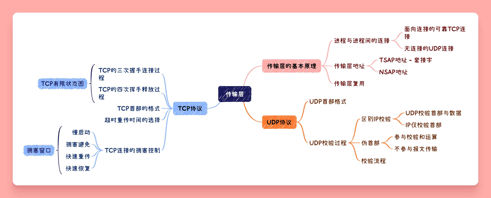

{++传输层的功能++} 

- 在优化网络层的服务的基础上,为源主机上的{++进程++}和目的主机的{++进程++}提供可靠的,透明的数据传输
- 使高层用户可以在相互通信的时候不必关系通信子网的实现细节.

传输层的运输单元(PDU): {++TCP/UDP段(segment)++}
## 传输层基本原理  
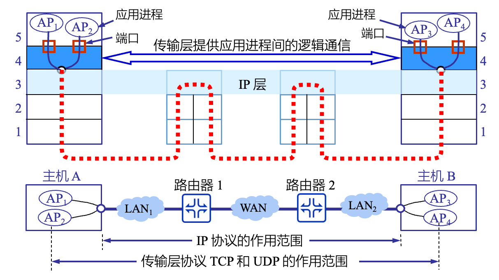

### 传输层地址

一个应用程序和另一个应用程序进行通信的时候,必须知道两个地址

- TSAP地址(传输访问服务点,即{++端口号++})
- NSAP地址(网络服务访问点, IP地址)

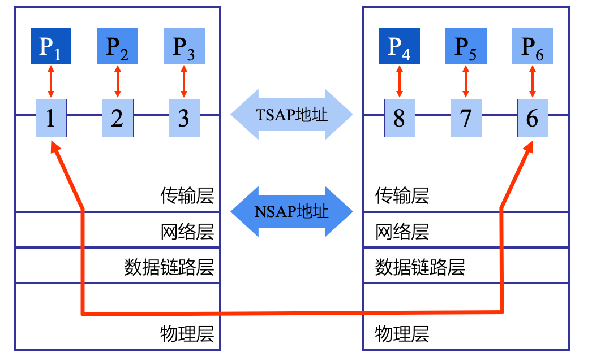

{++熟知端口号++} 0 ~ 1023 分配给特定的服务或者协议

{++注册端口号++} 1024 ~ 49151 可有用户或组织申请使用

{++动态/私有端口号++} 49152 ~ 65535 由用户随机分配

### 传输层复用

- {++向上复用++} 多个传输层共同使用同一个网络层连接
- {++向下复用++} 一个传输层连接使用多个网络层连接

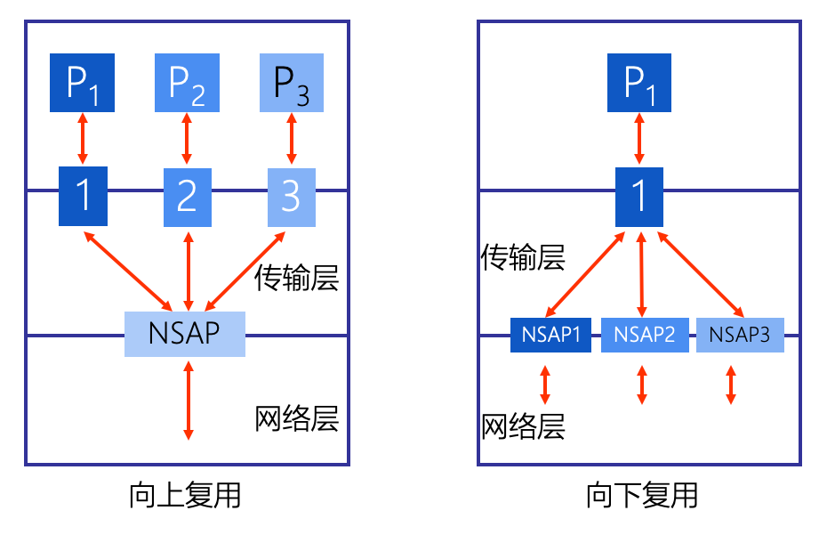

### 可靠传输

传输提供四方面的服务来保证可靠传输: {++差错控制++} {++顺序控制++} {++丢失控制(序号)++} {++丢失控制++}

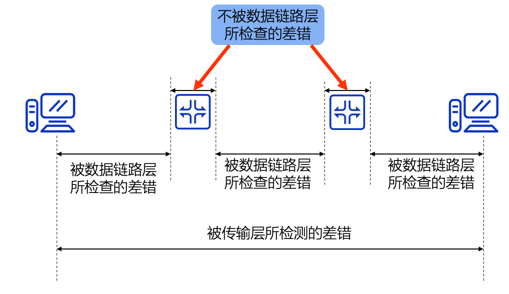

数据链路层的差错检测{++仅仅检查链路开始到链路结束++},而端点内(路由器内)的产生的错误无法控制;运输层提供{++端到端++}全过程的错误检测.

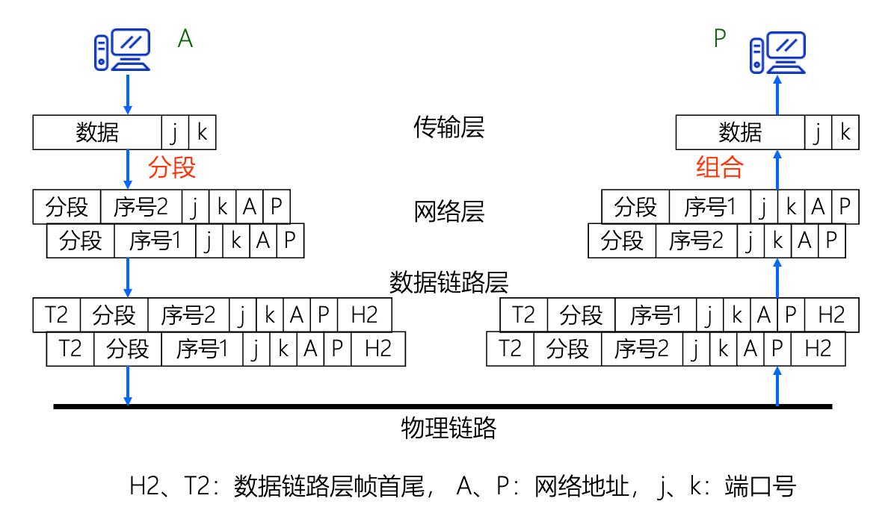

### 流量控制

大题和数据链路层的流量控制一样,采用滑动窗口协议.但在通信过程中窗口的大小{++由双方协商++}确定.一般由接收方通知发送方,窗口可以开多大.

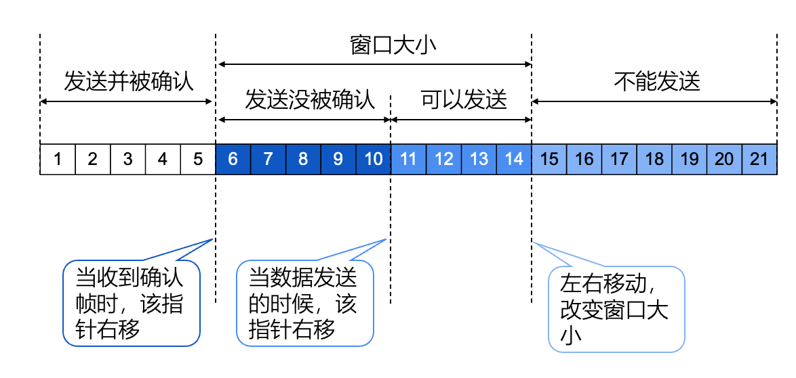

## 用户数据报协议(UDP)

- 简单的{++无连接++}传输层协议
    - 可靠性由应用层提供
- 不提供数据报分段,组装的功能
    - 若超出网络的最大传输单元(MTU,例如以太网的1500B),则会在{++网络层++}进行分片和在{++网络层++}进行组装
- 不能对数据报进行排序
- 延迟小,传输效率高
- 网络层协议只能是IP
- 支持一对一和{++一对多++}两种通信模式

### UDP数据报的格式

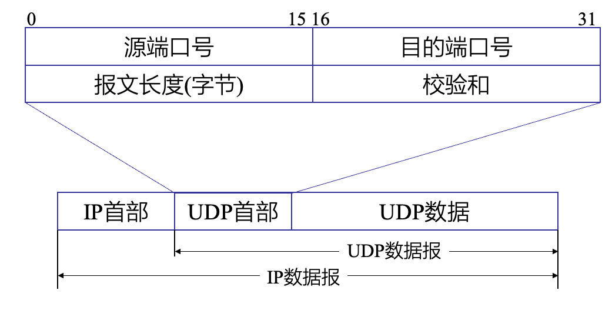

- 必须封装在{++IP数据报++}中
- 总共为{++8字节++}
- 16位的UDP源端口号 作为接受数据返回时候的端口号
    - 可选字段,若不选则为0
- 16位的UDP目标端口号
- UDP数据报长度 UDP首部和UDP数据的字节(IP数据报减去IP首部的长度)长度和. {++最小为8字节++}
- UDP校验和 UDP校验和覆盖{++伪首部++},UDP首部和{++UDP数据++}.

为了计算UDP校验和,会包含一个{++12字节++}的伪首部计算.具体如下

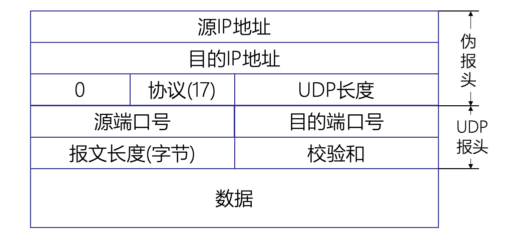

- 32位的源IP地址,32位的目的IP地址
- 8位全0的填充字段
- 8位值为17的协议字段 
    - 表明是UDP
- 16位的UDP数据报的长度

{++只用于计算校验和++}, {--传输时不应该封装在IP数据报中--}

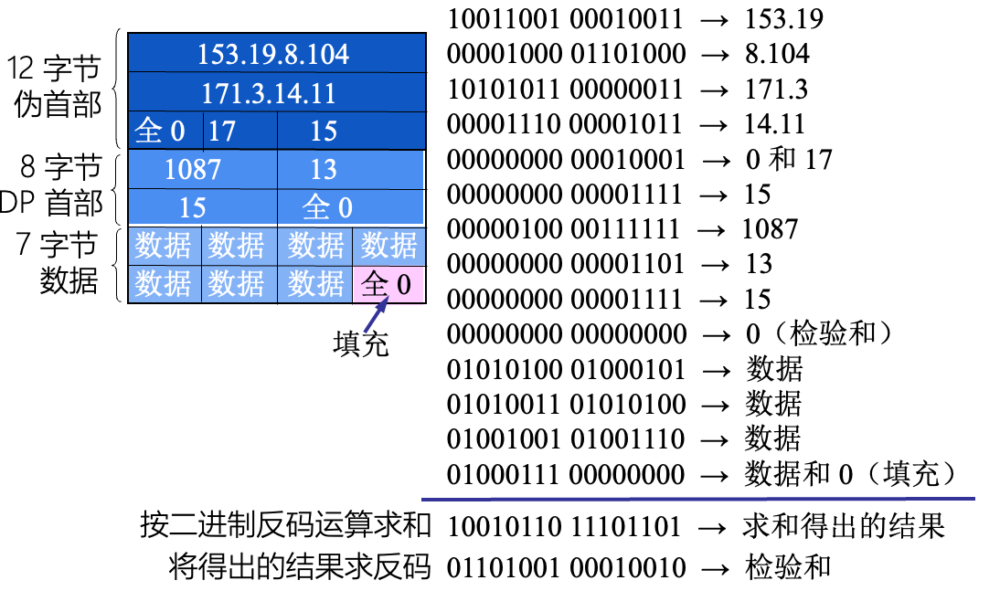

- 若启用校验和但校验和计算出来为全0,应该在校验和字段{++写入全1++}
- 若不启用校验和,则只需要在校验和字段写入全0即可

## 传输控制协议 TCP

- 提供{++可靠的面向连接的++} {++字节六++}传输服务
- 提供端到端的流量控制,并计算和验证一个强制性的端到端校验和
- {++全双工++}通信
- 字节流控制
    - TCP本身不对字节流做出任何解释
    - TCP若采用{++字节流服务++}则不区分字节的发送间隔
        - 例如发送方按 10B, 30B, 40B发送,接受方可以分多次接受这总的80B,例如四次,每次20B
- 可靠的连接建立(三次握手建立)
- 友好的连接关闭(四次挥手关闭)
- {++只支持++}一对一连接
- 网络层使用IP协议
- TCP协议没有{++选择确认++}和{++否定++}机制

### TCP报文格式

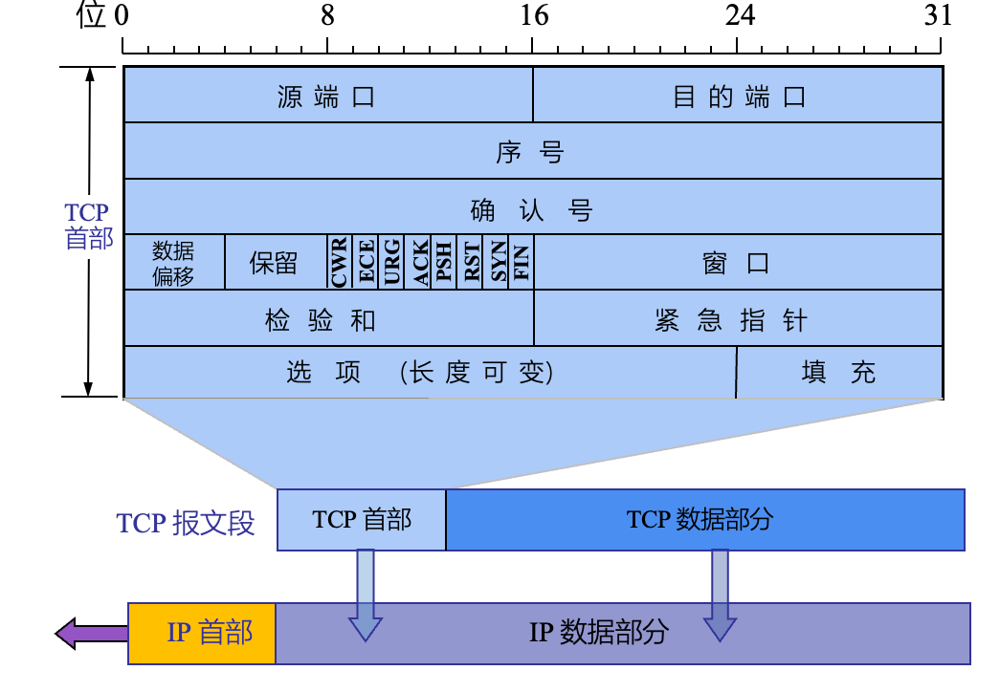

- {++20字节++}的TCP报文头, 不记选择字段
- 16位的源端口号和16位的目的端口号
    - 常用协议的端口号(知名端口号) HTTP(80),FTP(21/20), telnet(23) SMTP(25)
- {++4字节++}的序号字段 序号字段的值则指的是本报文段所发送的数据的{++第一个字节的序号++}
    - 按字节编号,循环编号
- {++4字节++}确认号 期望收到的对方下一个报文端的{++第一个字节的序号++}
- 数据偏移字段(首部长度) 4位 单位为{++4字节++} 指明TCP首部的长度从(20B到60B)
- 标志位 8个标志位
    - CWR 拥塞窗口减少
    - ECE 拥塞发生回应
    - URG 紧急指针有效
    - ACK 确认序号有效
    - PSH 接收方应该尽快把这个报文端交给应用层
    - RST 重建TCP连接
    - SYN 同步序号,用来发起一个连接
    - FIN 发送方完成任务
- 窗口 {++2字节++} 用来让对方设置发送窗口的依据,单位为{++字节++}
- 校验和 {++2字节++} 校验{++首部和数据++}两部分
    - 计算机校验和的时候要加上12字节的伪首部
- 紧急指针 要与URG同时使用,用于指明紧急数据有多少个字节
- 选项字段
    - 常见的有 MSS-最大报文短长度

### TCP超时重传时间的选择

保留一个RTT的加权平均往返时间 $RTT_S$, 按如下公式计算新的RTT

\[
新的RTT_S=(1-\alpha)\times(旧的RTT_S) + \alpha\times(新的RTT样本)
\]

其中 $\alpha$ 的推荐值0.125

超时重传时间应该大于上述的 $RTT_s$, 通常采用 $RTO=RTT_s + 4\times RTT_D$

其中 

$$
新的RTT_D=(1-\beta)\times(旧的RTT_D)+\beta\times\left|RTT_S-新的RTT样本\right|
$$

其中 $\beta$ 的推荐值为0.25

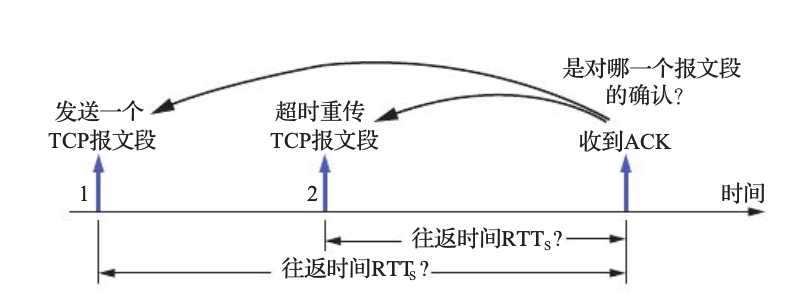

^^Karn算法^^ 在计算 $RTT_s$ 时候,不采用重传报文段的往返时间样本.

^^Karn算法的修正^^ 报文段每重传依次,就将RTO增大一些.典型的做法是将RTO增大一倍.当不发送重传的时候,才按照上面的公式计算重传时间.

### TCP连接的建立与释放

{++三次握手的建立过程++}

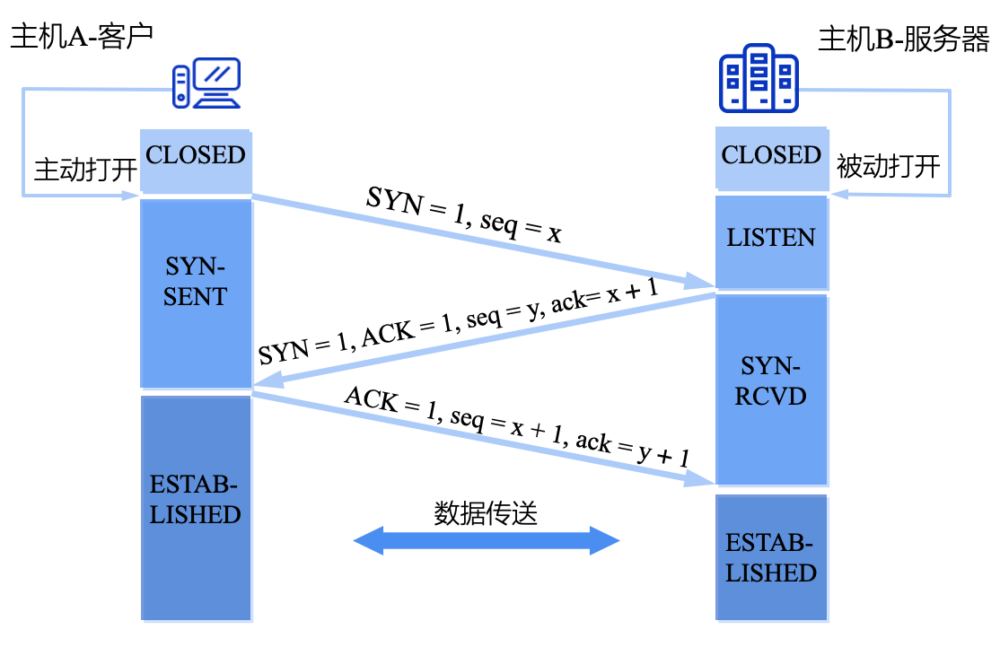

- 用户发送一个 {++SYN++}报文端指明想要连接的端口号,以及初始序号(seq=x).
    - 这个报文不携带数据
    - 这个报文会消耗一个序号
- 服务器返回包含服务器的初始序号的SYN+ACK报文段(报文段2)作为答应,并期待下一个报文序号为(x+1)
    - 这个报文不携带数据
    - 这个SYN-ACK报文回消耗一个序号(seq=y)
- 客服返回一个ACK报文端,对服务发送的SYN-ACK报文进行确定
    - 若这个报文不携带数据,则不消耗序号

{++四次挥手释放连接的过程++}

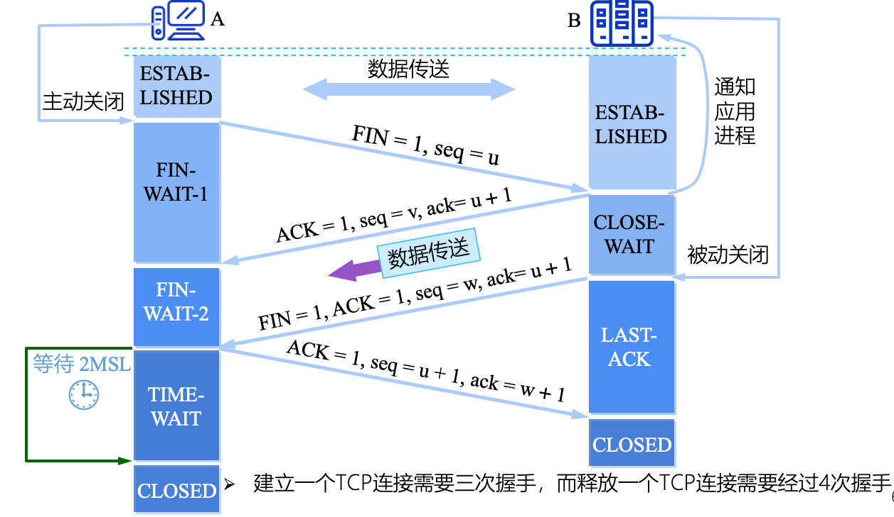

- 主动终止连接的主机(一般为客户)发送一个 {++FIN++}报文,并进入 {++FIN-WAIT-I++}
    - 该报文不携带数据
    - 消耗一个序号
- 服务器通知应用层客户想要结束本次TCP连接,发送一个确认报文
    - 此时 A->B方向的连接已经关闭
    - 但 B->A方向仍然可以发送数据,A还要接受B的数据
- 一段时间后,B向A发送 {++FIN++}报文,进入 {++LAST-ACK++}阶段
- A接受到B的FIN报文后,发送确认报文,并等待2MSL后才能释放TCP连接.B只要接受到确认报文就可以立即释放.
    - MSL 最长报文段寿命, 保证网络中的所有有关的报文段都从网络中消失;保证B能接受到最后一个ACK报文

{++TCP连接与释放的有限状态机模型++}

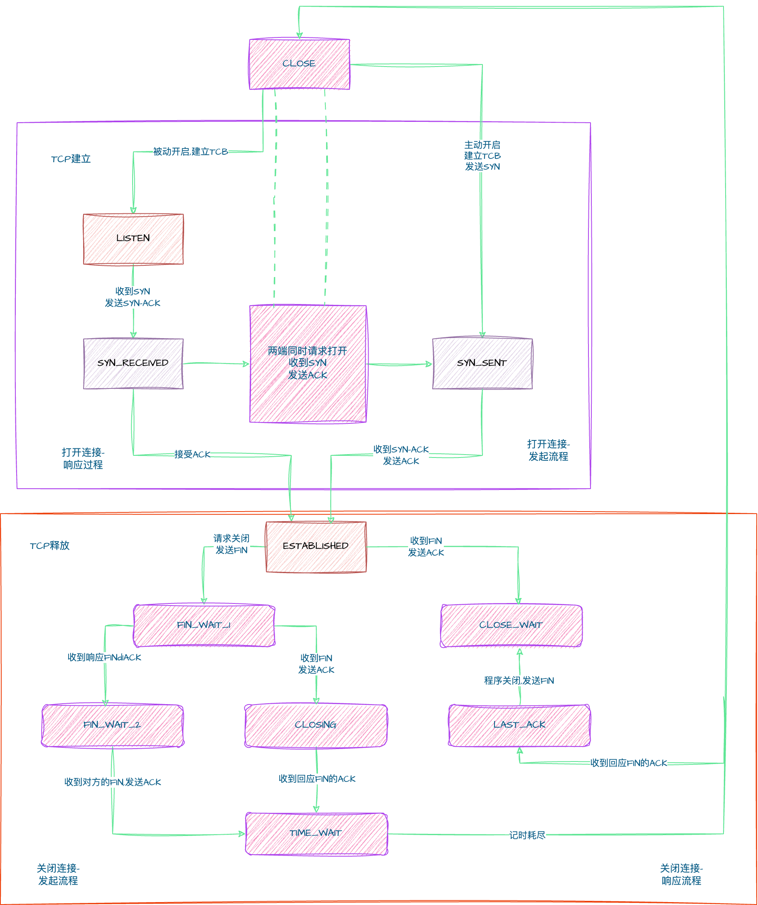

^^TCP计时器管理^^

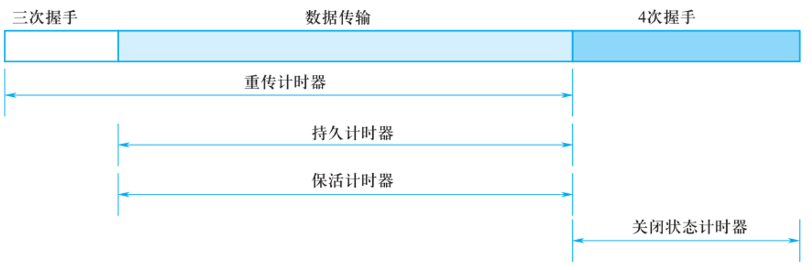

- 重传计时器 数据包超时未被确认的时候,到时重传数据包
- 持久计时器 防止死锁问题发生
- 保活计时器 长连接场景
- 关闭状态计时器 关闭连接时使用

### TCP连接的拥塞控制
{++拥塞++} 网络的吞吐量随着输入复杂的增长反而减少的过程.

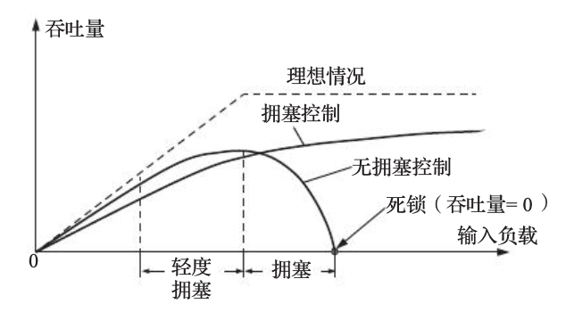

{++慢启动++}

- 将发送方初始的`cwnd(拥塞窗口)`设置为一个`SMSS(发送端最大数据尺寸)`字节
- 在第一个超时周期没有丢失报文的情况下,将`cwnd`设置为2个`SMSS`字节
- 在第二个超时周期没有报文丢失的情况下,将`cwnd`设置为4个`SMSS`字节
- 依次方法,指数增长,直到`cwnd`超过`ssthresh(慢启动阈值)`

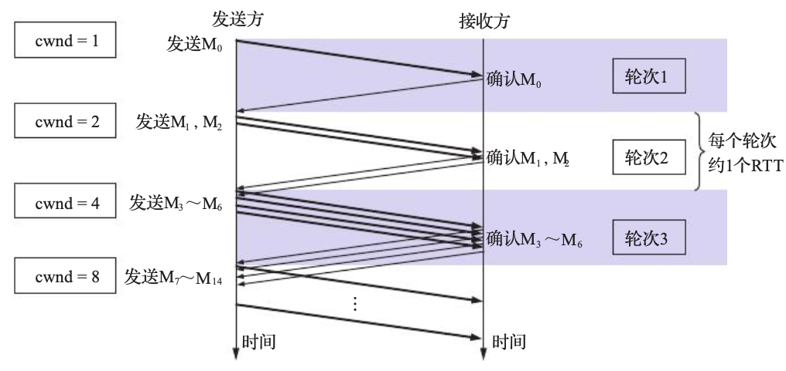

{++拥塞避免++}

- 当`cwnd`超过或者达到`ssthresh`的时候进入拥塞避免阶段
- 在没有丢失报文的情况下,`cwnd`以线性的方式增长,每收到一个ACK,cwnd的大小增加一个SMSS字节
- 检测到报文丢失的时候,设置`ssthresh`为当前`cwnd`的一半 {++重新启动慢启动算法++}
    - 乘法减少 只要出现报文丢失,就把慢开始门限值设置为当前拥塞窗口的一半
    - 当频分丢失报文的时候,ssthresh下降的很快,此时往网络中注入的分组数也将很快减少

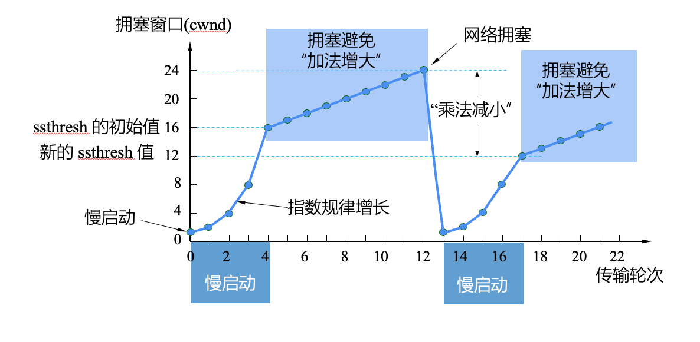

{++快速重传++}

- 要求接收方每收到一个失序的报文后{++立刻++}发出重复确认
- 发送方只要一收到{++三个重复++}的确认就{++立即++}重传对方尚未收到的报文段

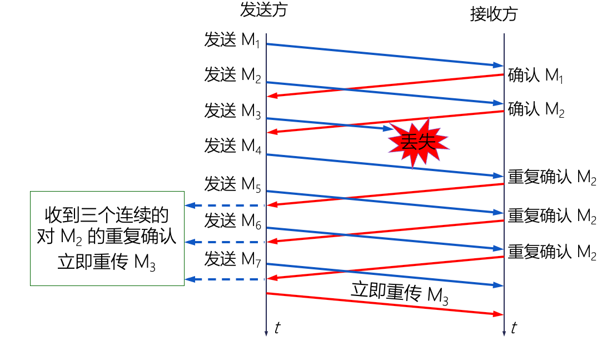

{++快速恢复++}

- 发生快速重传后,将当前门限值设置为窗口数的一半
- 将当前窗口设置为门限值
    - 有时候也设置为 ssthresh+3xMSS
    - 因为此时接收方至少接受了3个其他报文段
- 并且执行拥塞避免算法,线性增加窗口大小

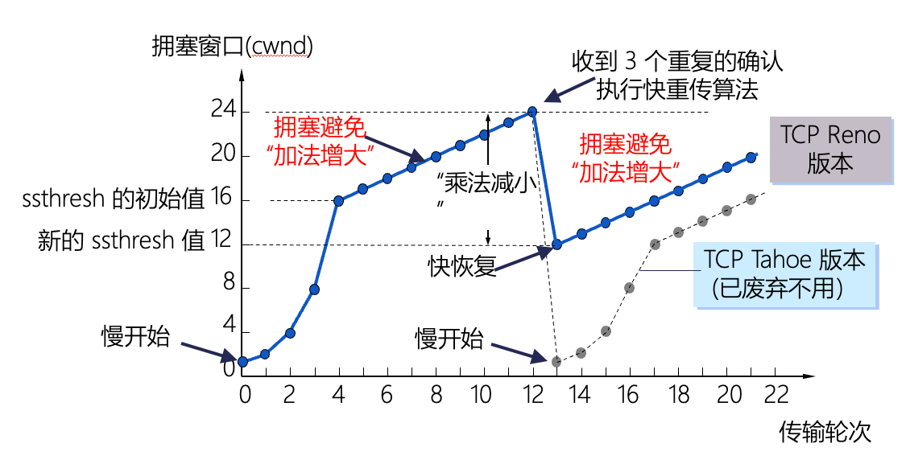

