# 应用层

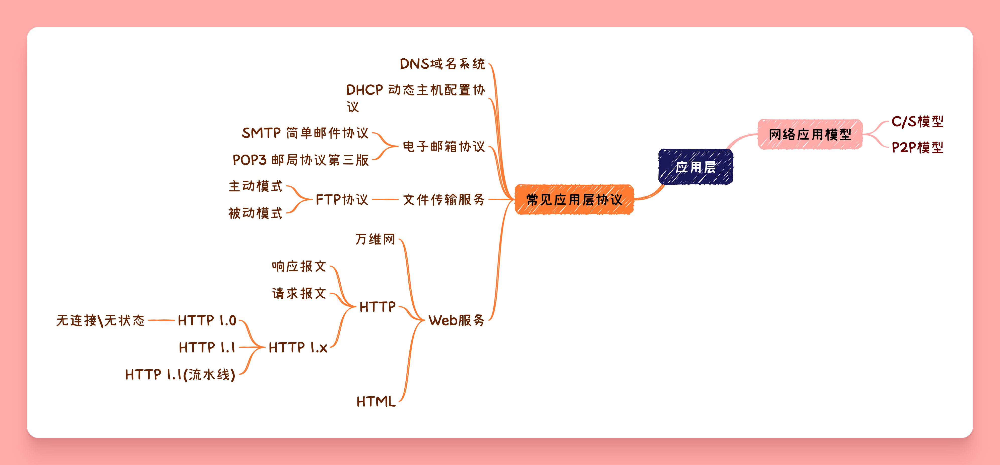

## 网络应用模型

### 客户-服务器模型(C/S)

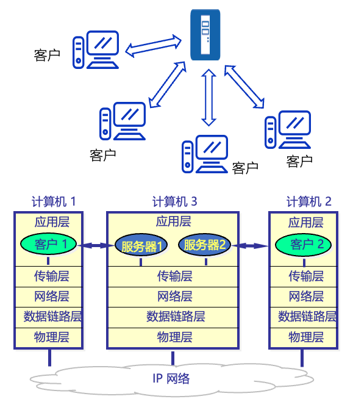

- C/S模型可以是面向连接的,也可以是无连接的
    - 面向连接的C/S通信关系一旦确认,通信就是{++双向的++},双方地位相等,都可以发送和接受报文
- 网络管理非常集中和简单
- 网络中各计算机的地位不均等,整个网络的工作主要有少量的服务器承担
- 客户之间不能直接进行通信

### 点对点模型(P2P)

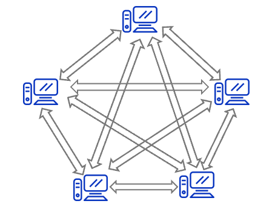

- 不存在永远在线的服务器
- 每台主机既可以提供服务,与可以请求服务
- 任意端系统/结点之间可以直接通信
- 结点间间歇性接入网络
- 结点可能改变IP地址

## DNS域名系统

- 计算机直接通过IP地址通信,但IP地址对于人来说是不可读的
- DNS的功能就是给IP地址映射一个人类可以读/记忆的域名

域名系统采取{++层次化的树状++}结构,按级划分.

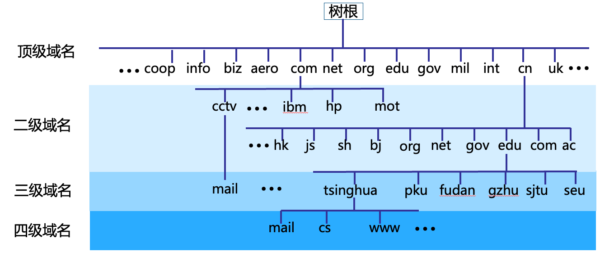

{++域名服务器++}对域名进行正/反两方面解析,也按照层次化树状结构部署

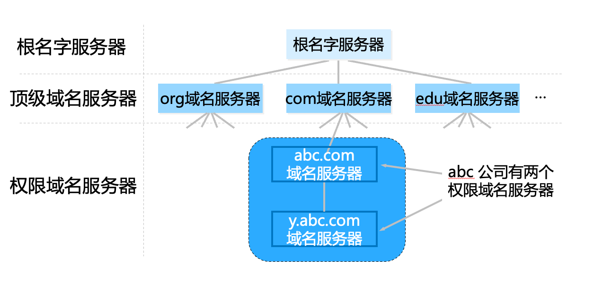

{++域名解析过程++} 有 ^^递归查询^^ 和 ^^迭代查询^^ 两种方式

- 主机向本地域名服务器查询一般采用递归查询
- 本地域名服务器项根服务器可以采用递归查询,但一般{++优先++}采用迭代查询

^^递归查询过程^^ 

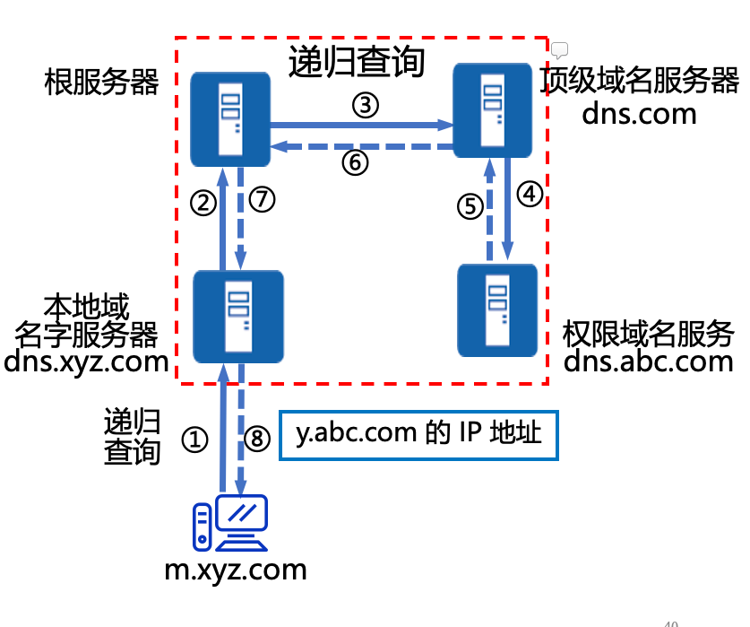

- 一次查询,返回结果给上级服务器

{++迭代查询过程++}

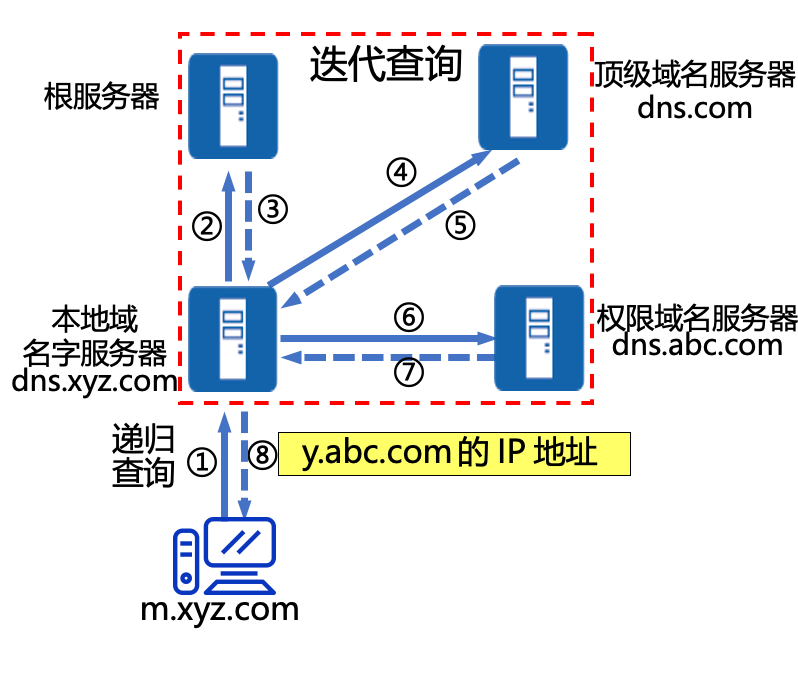

- 一次查询,返回一个结果给本地域名服务

## 电子邮箱 

{++简单邮件传送协议(SMTP)++}

- 采用 {++用户-服务器模式++}
- 主要有 用户代理,邮件服务器,电子邮件传输协议三个主要构建组成
    - SMTP邮件发送协议
    - PoP3邮件读取协议
- 采用TCP连接

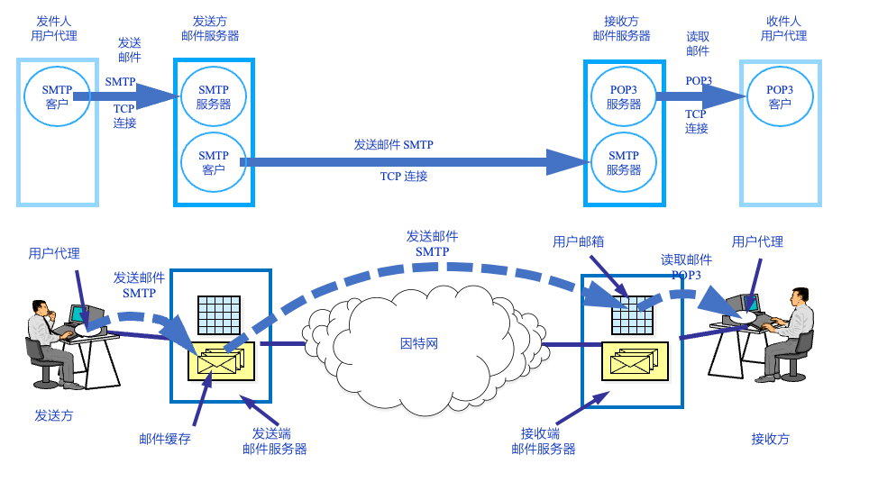

### 邮件格式与 MIME

电子邮件由 ^^信封+内容^^ 组成,信封上面有收件人地址.

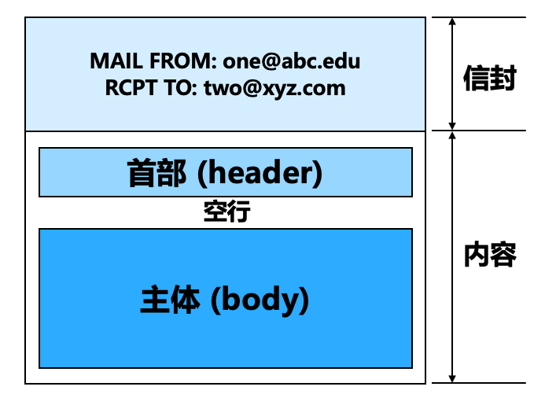

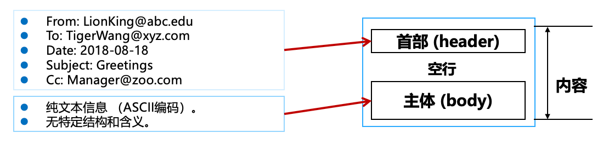

- 由ASCII码组成
- 必须包含一个From:首部和一个To:首部.其余都为可选首部
- Cc: 表示给某个收件人发送一份副本
- Bcc: 发件人可以将邮件副本发送给某一个收件人,但收件人不知道发件人是谁
- Repl-To: 表示对方恢复邮件所用的地址.

{++电子邮件的地址++} yyyy@ xxx.xxx.xxx 

- yyyy 接收人邮箱名
    - 用户名在该域名范围内是唯一的
- xxxx.xxx.xxx 邮箱所在的域名
    - 主机域名在全世界是唯一的

^^MIME^^ 多用途INternet邮件拓展,基本格式的多媒体拓展,可传输

- 多媒体消息
- 二进制文件

### SMTP和PoP3协议

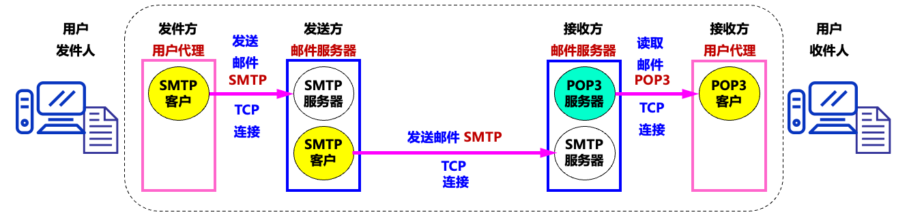

{++SMTP++} 简单邮件传送协议 

- {++发送++}邮件时候的协议
- 使用 ^^客户-服务器^^方式,规定了两个相互通信的SMTP进程之间交换信息的方法
    - 一个邮件服务器既可以作为客户页可以作为服务器
- 基于{++文本(ASCII)++}的协议, 邮件必须为 ^^7位^^ ASCII码
- 基于 {++TCP++} 连接,端口号为 25

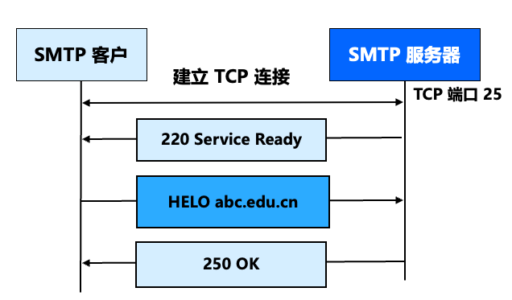

- 首先建立TPC连接
- 服务器发送 220 Service Ready
- 客服号发送 HELO 并加上自身的主机名
- 若服务器有能力接受邮件则发送 220 OK

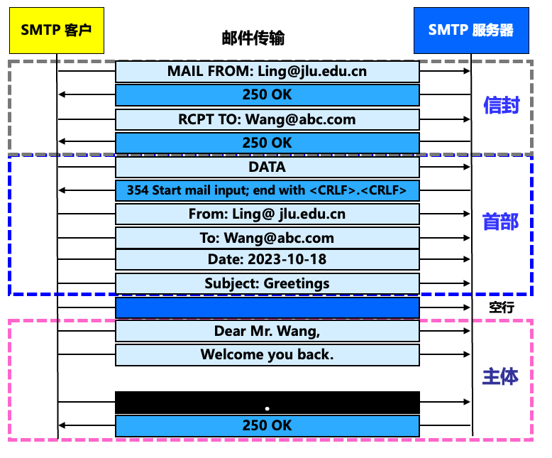

- 邮件发送首先从 ^^MAIL^^ 命令开始
- 发送完信封,使用 ^^DATA^^ 命令表面开始发送邮件内容

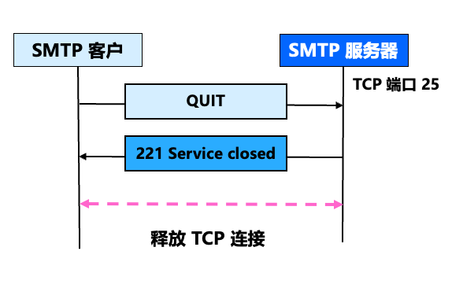

- 由客户端发送 QUIT 命令表面释放SMTP服务
- 服务器发送 221 Service close 命令表示同意释放
- 执行TCP释放连接的过程(四次挥手)

{++POP3++} 邮局协议第3个版本 

- 邮件读取协议
- 使用客户-服务器工作方式
- 基于TCP连接,端口号为110
- POP由三个阶段组成
    - 认证 处理用户的登录过程
    - 事务处理 用户收取电子邮件,并将邮件标记为删除
    - 将标记为删除的电子邮件删除

## 文件传送服务

{++FTP++} 文件传输协议 

### FTP协议的工作原理

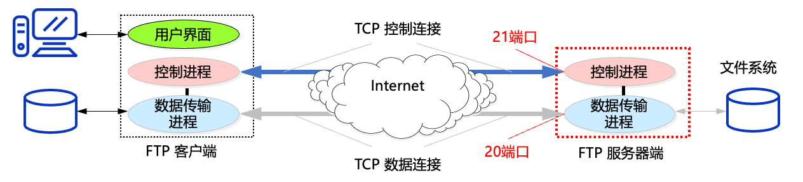

- 使用TCP连接, 使用两个端口 20/21 
- 服务器进程{++主动++}打开TCP21端口,等待客户进程发出的连接请求
- 客服分配{++任意++}一个本地端口号,与服务器的21号端口建立TCP连接
- 客户端请求到来的时候,服务器启动{++从属进程++}来处理客户端发起的请求
    - 服务器有一个主进程和若干从属进程
    - 主进程负责接受新的请求
    - 从属进程处理单个请求

{++主动模式(PORT模式)++} 

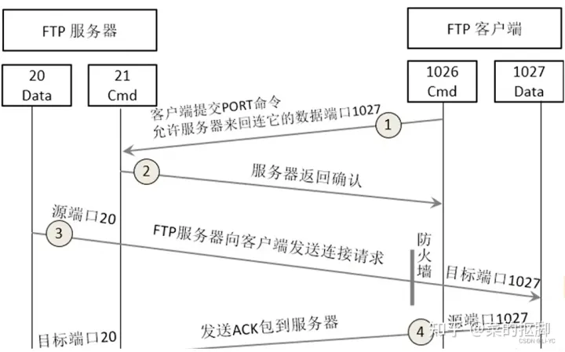

- 数据通道连接发起方为服务器端
- 服务器使用20号端口连接客户端的Y端口建立数据连接

{++被动模式(PASV模式)++}

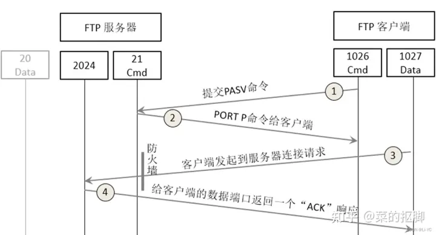

- 数据通道连接发起方为客户端
- 客户端使用端口号Y取连接服务器的数据端口Z

## Web服务

{++URL++} 统一资源定位符 负责标识万维网上的各种文档,并使每个文档在整个万维网的范围内具有唯一的标识符即URL.

 基本形式 <协议>://<主机:<端口>/<路径>

- 协议 指明用说明协议来获取文档,常用协议有 http,ftp等
- 主机 存放资源的主机的IP地址
- 在URL中不区分大小写

### 万维网的概念与组成结构

{++万维网++} 无数个网络站点与网页的集合

- 使用客户/服务器模式工作
- 浏览器是客户程序
- 基本流程
    - Web用户使用浏览器(指定URL)与Web浏览量建立连接,并发送请求
    - Web服务器把URL转换为文件路径,并返回给Web浏览器
    - 关闭连接

### HTTP协议

{++HTTP++} 超文本传输协议,定义了浏览器如何向万维网服务器请求万维网文档,以及服务器如何将文档传输给浏览器.

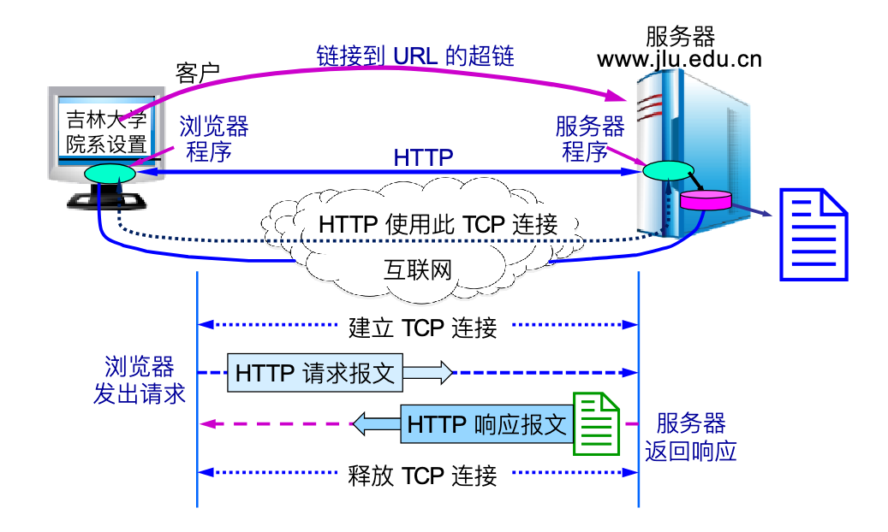

- 使用TCP连接,默认端口号为80
- HTTP协议本身是 {++无连接的++}
    - 交换HTTP报文之前不需要建立HTTP连接
- HTTP是{++无状态的++}
    - 通常使用 {++Cookie++}加数据库的方式来跟踪用户活动
    - Cookie基本原理 当用户访问具有Cookie功能的网站的时候,服务器为该用户产生一个{++唯一++}的Cookie识别码,并以此为索引在后端数据库中创建一个项目,记录用户访问该网站的各种信息.并返回一个带有 {++Set cookie:xxxx++}的首部行的响应报文,客户端接受次报文后,在本地Cookie管理文件中添加该服务器的主机名和Cookie识别码. 
    - 当用户再次浏览该网页的时候,在请求报文中添加 {++Cookie xxxx++},服务器识别该Cookie标识符,从数据库中提取相应用户数据\设置等内容
- HTTP/1.0 无持久连接, HTTP/1.1 持久连接(流水线\非流水线模式)

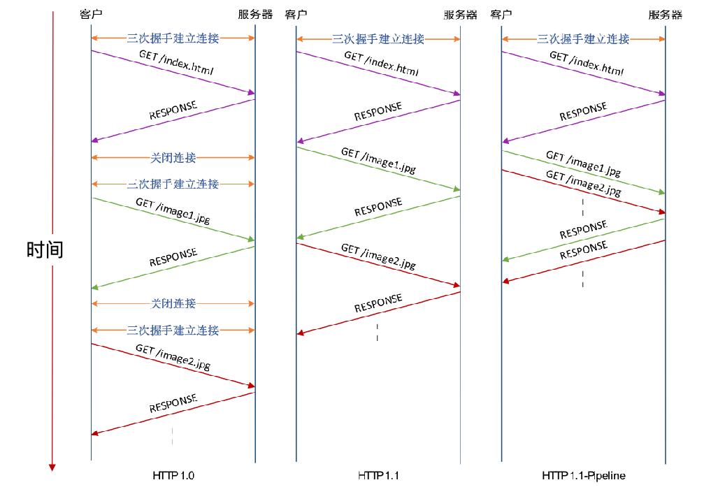

{++HTTP报文++} 

- 面向文本(ASCII码),每个字段的长度是不确定的
- 请求报文\响应报文

{++请求报文++} 

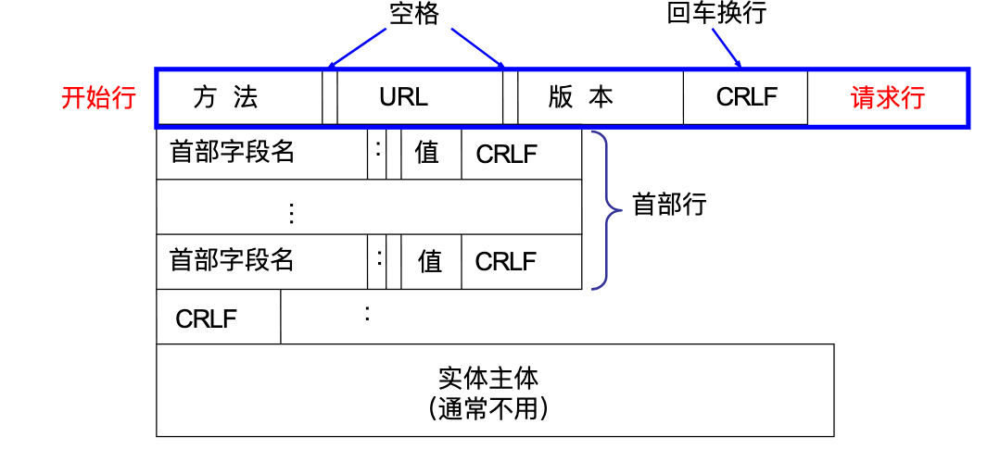

- 方法 对所请求的对象进行的操作,决定请求报文的类型
    - OPTION 请求一些选项信息
    - GET 请求读取由URL所标志的信息
    - HEAD 请求读取由URL所标志的信息的首部
    - POST 给添加信息
    - PUT 在指明的URL下存储一个文档
    - DELETE 删除指明的URL所标志的资源
    - TRACE 环回测试
    - CONNECT 用于代理服务器
- URL 请求资源的URL

{++响应报文++}

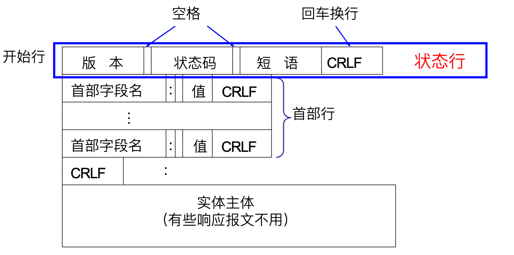

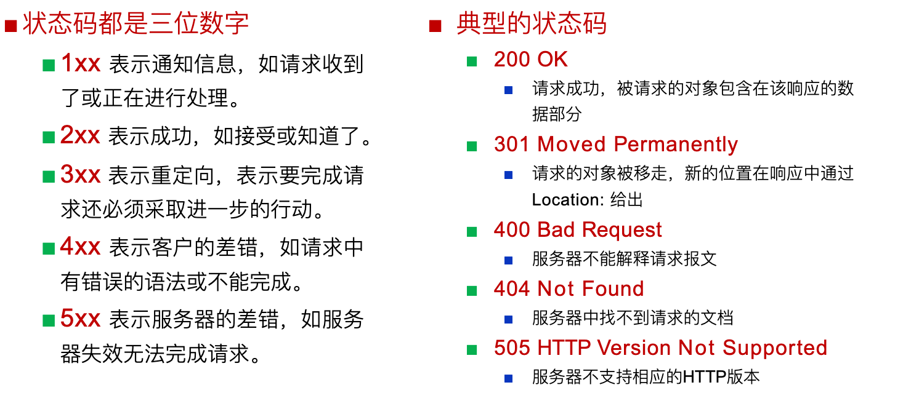

{++HTTP协议工作流程++}

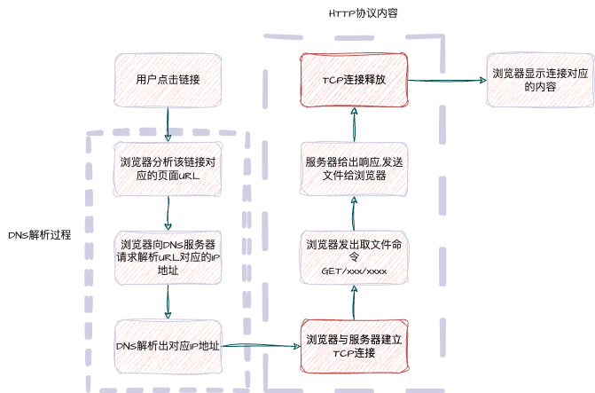

## 应用层协议小结

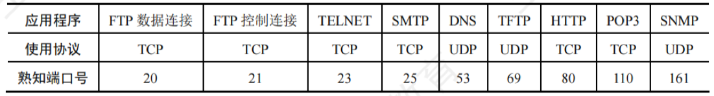